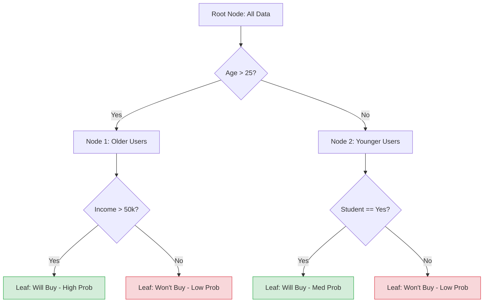

# Decision Trees

**Decision trees are versatile machine learning algorithms that learn simple decision rules inferred from data features to classify or regress target variables through a tree-like model of decisions.**

## Why It Matters

Decision trees are incredibly popular because they closely mirror human decision-making processes. They are intuitive, highly visual, and uniquely capable of handling both categorical and continuous data without requiring extensive preprocessing like feature scaling or one-hot encoding. In many regulated industries, such as banking or healthcare, "black box" models are prohibited because decisions must be explainable. A decision tree provides clear, step-by-step logic (e.g., "If Age < 30 and Income > 50K, then Approve"). While a single decision tree might be prone to overfitting, understanding how it splits data and calculates information gain is essential because it forms the building block for the most powerful ensemble methods in machine learning, such as Random Forests and Gradient Boosted Trees.

## How It Works

A decision tree is built using a process called **recursive partitioning**. The algorithm starts at the root node containing all the training data. It evaluates all possible splits across all features to find the one that best separates the data into homogeneous groups regarding the target variable. For example, if predicting whether someone will buy a product, it might find that splitting by "Age > 25" creates the purest sub-groups.

The quality of a split is measured using an impurity metric. For classification tasks, Spark supports **Gini impurity** and **Entropy**. Both metrics measure how mixed the classes are in a node. A pure node (containing only one class) has an impurity of 0. The algorithm calculates the **Information Gain**—the reduction in impurity achieved by a split—and chooses the split that maximizes this gain. This process is repeated recursively on each child node until a stopping criterion is met, such as reaching a maximum depth (`maxDepth`), a minimum number of instances per node, or if the node becomes completely pure.

Implementing decision trees on massive datasets in a distributed environment like Spark presents a unique challenge: finding the optimal split point requires sorting the data, which is highly expensive across a cluster. Spark solves this using **histograms**. Instead of evaluating every single data point as a potential split, Spark's algorithm groups continuous features into discrete "bins" (configured via `maxBins`). It computes aggregate statistics (histograms) for these bins and evaluates splits only at the bin boundaries. This approximation drastically reduces network communication and computation time, allowing decision trees to train on billions of rows efficiently.

## Flow Diagram



## Data Visualization

**Step-by-Step Recursive Partitioning (Information Gain)**

| Node | Condition | Total Samples | Class 0 (No) | Class 1 (Yes) | Gini Impurity | Decision / Next Step |
| :--- | :--- | :--- | :--- | :--- | :--- | :--- |
| **Root** | N/A | 1000 | 500 | 500 | 0.50 | Split on `Age` |
| **Child L** | `Age <= 25` | 400 | 350 | 50 | 0.21 | Split on `Student` |
| **Child R** | `Age > 25` | 600 | 150 | 450 | 0.37 | Split on `Income` |
| **Leaf 1** | `Age <= 25, Student=No` | 250 | 240 | 10 | **0.07** | **Predict: Class 0** |
| **Leaf 2** | `Age > 25, Income>50k` | 400 | 20 | 380 | **0.09** | **Predict: Class 1** |

## Code Example

```python
# Python example: Training a Decision Tree Classifier in Spark
from pyspark.sql import SparkSession
from pyspark.ml.classification import DecisionTreeClassifier
from pyspark.ml.feature import VectorAssembler, StringIndexer
from pyspark.ml.evaluation import MulticlassClassificationEvaluator

# 1. Initialize SparkSession
spark = SparkSession.builder.appName("DecisionTreeExample").getOrCreate()

# 2. Create sample data (e.g., Iris-style dataset)
data = spark.createDataFrame([
    (5.1, 3.5, 1.4, 0.2, "setosa"),
    (4.9, 3.0, 1.4, 0.2, "setosa"),
    (7.0, 3.2, 4.7, 1.4, "versicolor"),
    (6.4, 3.2, 4.5, 1.5, "versicolor"),
    (6.3, 3.3, 6.0, 2.5, "virginica"),
    (5.8, 2.7, 5.1, 1.9, "virginica")
], ["sepal_length", "sepal_width", "petal_length", "petal_width", "species"])

# 3. Preprocess Data: Index string labels into numerical labels
label_indexer = StringIndexer(inputCol="species", outputCol="label").fit(data)
data_indexed = label_indexer.transform(data)

# Assemble features
assembler = VectorAssembler(
    inputCols=["sepal_length", "sepal_width", "petal_length", "petal_width"], 
    outputCol="features"
)
final_data = assembler.transform(data_indexed)

# 4. Split the data
train_data, test_data = final_data.randomSplit([0.7, 0.3], seed=42)

# 5. Configure and Train the Decision Tree
dt = DecisionTreeClassifier(
    labelCol="label", 
    featuresCol="features", 
    maxDepth=5,         # Prevents overfitting by limiting tree depth
    maxBins=32,         # Number of bins used for discretizing continuous features
    impurity="gini"     # Criterion used for information gain calculation
)

dt_model = dt.fit(train_data)

# 6. Make Predictions
predictions = dt_model.transform(test_data)

# 7. Evaluate Model
evaluator = MulticlassClassificationEvaluator(
    labelCol="label", 
    predictionCol="prediction", 
    metricName="accuracy"
)
accuracy = evaluator.evaluate(predictions)
print(f"Test Accuracy = {accuracy}")

# 8. Extract feature importance
print(f"Feature Importances: {dt_model.featureImportances}")

# Print the if-then-else rules of the tree!
print(dt_model.toDebugString)
```

## Common Pitfalls

*   **Overfitting:** Trees that are allowed to grow to infinite depth will eventually create a leaf node for every single data point, perfectly memorizing the training data but failing entirely on new data. Always tune `maxDepth`.
*   **Ignoring maxBins:** If a categorical feature has 100 distinct categories, but `maxBins` is left at the default 32, Spark will throw an error. `maxBins` must be greater than or equal to the number of categories in your largest categorical feature.
*   **Class Imbalance Vulnerability:** Decision trees can become biased toward the majority class if the dataset is highly imbalanced. Adjusting the splitting criteria or balancing the dataset is required.
*   **Instability:** A tiny change in the training data can cause a completely different root split, resulting in an entirely different tree structure. This is why ensembles like Random Forests are usually preferred in production.

## Key Takeaway

Decision trees provide a highly interpretable, rule-based approach to machine learning by recursively partitioning data using information gain, though they require careful depth management to prevent overfitting.

<br><br><br><br><br><br><br><br><br><br><br><br><br><br><br><br><br><br><br><br><br><br><br><br><br><br><br><br><br><br><br><br><br><br><br><br><br><br><br><br><br><br><br><br><br><br><br><br><br><br><br><br><br><br><br><br><br><br><br><br><br><br><br><br><br><br><br><br><br><br><br><br><br><br><br><br><br><br><br><br>
