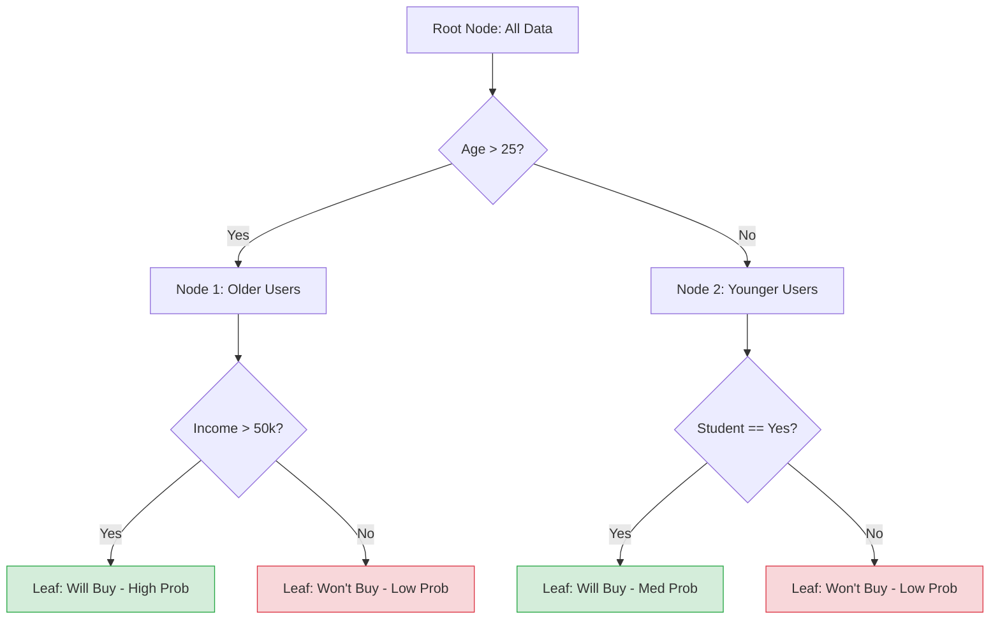

# Decision Trees

**Decision trees are versatile machine learning algorithms that learn simple decision rules inferred from data features to classify or regress target variables through a tree-like model of decisions.**

## Why It Matters

Decision trees are incredibly popular because they closely mirror human decision-making processes. They are intuitive, highly visual, and uniquely capable of handling both categorical and continuous data without requiring extensive preprocessing like feature scaling or one-hot encoding. In many regulated industries, such as banking or healthcare, "black box" models are prohibited because decisions must be explainable. A decision tree provides clear, step-by-step logic (e.g., "If Age < 30 and Income > 50K, then Approve"). While a single decision tree might be prone to overfitting, understanding how it splits data and calculates information gain is essential because it forms the building block for the most powerful ensemble methods in machine learning, such as Random Forests and Gradient Boosted Trees.

## How It Works

A decision tree is built using a process called **recursive partitioning**. The algorithm starts at the root node containing all the training data. It evaluates all possible splits across all features to find the one that best separates the data into homogeneous groups regarding the target variable. For example, if predicting whether someone will buy a product, it might find that splitting by "Age > 25" creates the purest sub-groups.

The quality of a split is measured using an impurity metric. For classification tasks, Spark supports **Gini impurity** and **Entropy**. Both metrics measure how mixed the classes are in a node. A pure node (containing only one class) has an impurity of 0. The algorithm calculates the **Information Gain**—the reduction in impurity achieved by a split—and chooses the split that maximizes this gain. This process is repeated recursively on each child node until a stopping criterion is met, such as reaching a maximum depth (`maxDepth`), a minimum number of instances per node, or if the node becomes completely pure.

Implementing decision trees on massive datasets in a distributed environment like Spark presents a unique challenge: finding the optimal split point requires sorting the data, which is highly expensive across a cluster. Spark solves this using **histograms**. Instead of evaluating every single data point as a potential split, Spark's algorithm groups continuous features into discrete "bins" (configured via `maxBins`). It computes aggregate statistics (histograms) for these bins and evaluates splits only at the bin boundaries. This approximation drastically reduces network communication and computation time, allowing decision trees to train on billions of rows efficiently.

## Flow Diagram



## Data Visualization

**Step-by-Step Recursive Partitioning (Information Gain)**

| Node | Condition | Total Samples | Class 0 (No) | Class 1 (Yes) | Gini Impurity | Decision / Next Step |
| :--- | :--- | :--- | :--- | :--- | :--- | :--- |
| **Root** | N/A | 1000 | 500 | 500 | 0.50 | Split on `Age` |
| **Child L** | `Age <= 25` | 400 | 350 | 50 | 0.21 | Split on `Student` |
| **Child R** | `Age > 25` | 600 | 150 | 450 | 0.37 | Split on `Income` |
| **Leaf 1** | `Age <= 25, Student=No` | 250 | 240 | 10 | **0.07** | **Predict: Class 0** |
| **Leaf 2** | `Age > 25, Income>50k` | 400 | 20 | 380 | **0.09** | **Predict: Class 1** |

## Code Example

```python
# Python example: Training a Decision Tree Classifier in Spark
from pyspark.sql import SparkSession
from pyspark.ml.classification import DecisionTreeClassifier
from pyspark.ml.feature import VectorAssembler, StringIndexer
from pyspark.ml.evaluation import MulticlassClassificationEvaluator

# 1. Initialize SparkSession
spark = SparkSession.builder.appName("DecisionTreeExample").getOrCreate()

# 2. Create sample data (e.g., Iris-style dataset)
data = spark.createDataFrame([
    (5.1, 3.5, 1.4, 0.2, "setosa"),
    (4.9, 3.0, 1.4, 0.2, "setosa"),
    (7.0, 3.2, 4.7, 1.4, "versicolor"),
    (6.4, 3.2, 4.5, 1.5, "versicolor"),
    (6.3, 3.3, 6.0, 2.5, "virginica"),
    (5.8, 2.7, 5.1, 1.9, "virginica")
], ["sepal_length", "sepal_width", "petal_length", "petal_width", "species"])

# 3. Preprocess Data: Index string labels into numerical labels
label_indexer = StringIndexer(inputCol="species", outputCol="label").fit(data)
data_indexed = label_indexer.transform(data)

# Assemble features
assembler = VectorAssembler(
    inputCols=["sepal_length", "sepal_width", "petal_length", "petal_width"], 
    outputCol="features"
)
final_data = assembler.transform(data_indexed)

# 4. Split the data
train_data, test_data = final_data.randomSplit([0.7, 0.3], seed=42)

# 5. Configure and Train the Decision Tree
dt = DecisionTreeClassifier(
    labelCol="label", 
    featuresCol="features", 
    maxDepth=5,         # Prevents overfitting by limiting tree depth
    maxBins=32,         # Number of bins used for discretizing continuous features
    impurity="gini"     # Criterion used for information gain calculation
)

dt_model = dt.fit(train_data)

# 6. Make Predictions
predictions = dt_model.transform(test_data)

# 7. Evaluate Model
evaluator = MulticlassClassificationEvaluator(
    labelCol="label", 
    predictionCol="prediction", 
    metricName="accuracy"
)
accuracy = evaluator.evaluate(predictions)
print(f"Test Accuracy = {accuracy}")

# 8. Extract feature importance
print(f"Feature Importances: {dt_model.featureImportances}")

# Print the if-then-else rules of the tree!
print(dt_model.toDebugString)
```

## Common Pitfalls

*   **Overfitting:** Trees that are allowed to grow to infinite depth will eventually create a leaf node for every single data point, perfectly memorizing the training data but failing entirely on new data. Always tune `maxDepth`.
*   **Ignoring maxBins:** If a categorical feature has 100 distinct categories, but `maxBins` is left at the default 32, Spark will throw an error. `maxBins` must be greater than or equal to the number of categories in your largest categorical feature.
*   **Class Imbalance Vulnerability:** Decision trees can become biased toward the majority class if the dataset is highly imbalanced. Adjusting the splitting criteria or balancing the dataset is required.
*   **Instability:** A tiny change in the training data can cause a completely different root split, resulting in an entirely different tree structure. This is why ensembles like Random Forests are usually preferred in production.

## Key Takeaway

Decision trees provide a highly interpretable, rule-based approach to machine learning by recursively partitioning data using information gain, though they require careful depth management to prevent overfitting.

<br><br><br><br><br><br><br><br><br><br><br><br><br><br><br><br><br><br><br><br><br><br><br><br><br><br><br><br><br><br><br><br><br><br><br><br><br><br><br><br><br><br><br><br><br><br><br><br><br><br><br><br><br><br><br><br><br><br><br><br><br><br><br><br><br><br><br><br><br><br><br><br><br><br><br><br><br><br><br><br>


---

## 🎓 Deep Learning Questions

### Q1: Why Was This Concept Introduced?
Before decision trees, machine learning heavily relied on linear models like Logistic Regression and linear support vector machines. These models were fast and effective but had a critical limitation: they assumed a linear relationship between features and the target variable. Furthermore, linear models required extensive data preprocessing—continuous features needed scaling or normalization, and categorical features required one-hot encoding.
Decision Trees were introduced to address these limitations. They natively handle non-linear relationships by applying sequential, hierarchical splits. More importantly, they do not require feature scaling, and they can naturally handle categorical data without complex dummy encoding. In the context of Apache Spark, decision trees were introduced into Spark MLlib to provide a scalable, distributed algorithm that can approximate optimal splits across thousands of nodes using histograms, overcoming the traditional memory constraints of building trees on massive datasets.

### Q2: What Exactly Is This Concept and How Does It Work?
A Decision Tree is a supervised machine learning algorithm that predicts the value of a target variable by learning simple decision rules inferred from the data features.
**How it works internally in Spark:**
1. **Initialization:** The algorithm starts at the root node with the entire dataset.
2. **Finding the Best Split:** Spark evaluates all features to find the best way to split the data. To do this efficiently across a cluster, Spark uses the `maxBins` parameter to group continuous features into discrete bins (histograms). 
3. **Impurity Calculation:** For each potential split, Spark calculates the impurity (e.g., Gini impurity or Entropy for classification, Variance for regression). It chooses the split that yields the highest **Information Gain** (the biggest drop in impurity).
4. **Recursive Partitioning:** The data is partitioned into two child nodes based on the best split. This process repeats recursively for each child.
5. **Stopping Criteria:** The recursion stops when a node is purely one class, when `maxDepth` is reached, or when a node has fewer instances than `minInstancesPerNode`.

### Q3: Where Should This Concept Be Used?
Decision Trees shine in scenarios where **interpretability and explainability** are paramount. 
- **Banking and Finance:** For loan approval or credit risk assessment. Regulators often require financial institutions to explain exactly why a loan was denied. A decision tree provides a clear rule path (e.g., "Credit Score < 600 and Income < $40,000").
- **Healthcare:** Diagnosing medical conditions based on patient symptoms. Doctors prefer to see the logical flow of the diagnosis rather than trusting a black-box model.
- **Retail and Marketing:** Customer segmentation and targeted marketing. A tree can easily reveal segments, such as "Age > 30 and bought electronics previously."
- **Data Exploration:** Decision trees are excellent tools for initial data exploration. Their feature importance scores can help identify which variables are most predictive before building more complex models.

### Q4: Where Should This Concept NOT Be Used?
- **Highly Complex, Non-linear Data with Weak Features:** A single decision tree will easily overfit if the dataset has a huge number of weak features (like image pixels or text embeddings). Deep learning or SVMs are better here.
- **Extrapolation:** Decision trees cannot extrapolate beyond the range of the training data. If predicting house prices, a tree cannot predict a price higher than the maximum price in the training set.
- **When High Accuracy is the Only Goal:** A single decision tree is notoriously unstable (high variance) and rarely achieves state-of-the-art accuracy. In these cases, ensemble methods like Random Forests or Gradient Boosted Trees (XGBoost) should be used instead.
- **Imbalanced Datasets:** Without careful tuning or class weighting, trees will favor the majority class and ignore the minority class.

### Q5: How Is This Concept Different from Hadoop?

| Aspect | Hadoop MapReduce | Apache Spark (Decision Trees) |
| :--- | :--- | :--- |
| **Architecture** | Disk-based execution model. | In-memory processing via RDDs/DataFrames. |
| **Performance** | Slow due to heavy disk I/O between Map and Reduce phases. | Extremely fast iterative processing (crucial for tree building). |
| **Processing Model** | Custom Map and Reduce functions; not inherently designed for ML. | Rich MLlib API designed specifically for distributed ML algorithms. |
| **Memory Usage** | Minimal RAM requirement, heavily relies on disk. | High memory utilization to cache data and histograms during training. |
| **Scalability** | Excellent, but computationally slow for ML tasks. | Excellent, uses histogram-based approximations to scale split calculations. |
| **Ease of Development** | Verbose Java code; building a Decision Tree from scratch is very complex. | High-level APIs in Python/Scala; `DecisionTreeClassifier().fit(data)`. |
| **Advantages** | Robust for batch ETL on huge datasets. | Much faster, iterative, built-in ML libraries. |
| **Disadvantages** | Unsuitable for ML algorithms requiring iterations. | Requires significant RAM to run efficiently. |
| **Typical Use Cases** | Log parsing, massive batch ETL. | Machine learning pipelines, predictive modeling, graph processing. |
| **Fault Tolerance** | Replicates data across disk. | RDD lineage graph enables recomputation of lost partitions. |

### Q6: How Can This Concept Be Related to a Traditional RDBMS?

| RDBMS Concept | Spark Decision Tree Equivalent | Explanation |
| :--- | :--- | :--- |
| **CASE WHEN / IF-ELSE Statements** | **Tree Nodes / Rules** | A decision tree is fundamentally a massive, nested `CASE WHEN` statement learned automatically from data. |
| **GROUP BY / Aggregation** | **Histogram Bins** | Spark groups feature values into bins (`maxBins`) and aggregates statistics to find the best split point. |
| **Table** | **DataFrame** | The input data used to train the tree. |
| **Column** | **Feature / Label** | The independent variables (features) and the dependent variable (label) used for modeling. |
| **Execution Plan** | **toDebugString** | Just as an RDBMS explains its query plan, `toDebugString` prints the exact if-then rules the tree learned. |

### Q7: What Happens Behind the Scenes?
Building a decision tree in Spark is an iterative, distributed process:

1. **Driver:** Reads the data and initializes the DecisionTree estimator.
2. **Stages & Tasks:** Spark triggers an action to compute histograms for all features.
3. **Executors (Workers):** Each executor takes a partition of the data, discretizes continuous features into bins (up to `maxBins`), and computes local count aggregates (histograms) for each bin.
4. **Shuffle/Aggregation:** The local histograms from all executors are reduced and sent back to the Driver.
5. **Driver Decision:** The Driver uses the global histograms to calculate Information Gain for all possible splits and chooses the best one.
6. **Iteration:** The Driver updates the tree structure, assigns data to the new left and right child nodes, and triggers the next iteration until `maxDepth` is reached.

```text
Driver                      Executors (Partitions)
  |                              |
  |--- Request Histograms ------>| (Reads Data, creates Bins)
  |                              | 
  |<-- Return Local Aggregates --| (Map Partitions)
  |                              |
  | (Calculates Global Gini)     |
  | (Finds Best Split: Age > 30) |
  |                              |
  |--- Send New Node Split ----->| (Update Data routing)
  |                              |
  | (Repeat recursively...)      |
```

### Q8: Performance Considerations, Best Practices, and Common Mistakes

| Category | Recommendation | Why It Matters |
| :--- | :--- | :--- |
| **Performance** | Tune `maxBins` carefully. | Higher `maxBins` means finer splits but requires more memory and network communication. Must be >= max categories in categorical features. |
| **Optimization** | Cache the dataset in memory (`df.cache()`) before calling `.fit()`. | Tree building is highly iterative. If the data isn't cached, Spark will re-read it from disk for every depth level. |
| **Best Practice** | Always set a `maxDepth`. | Default is 5. Unbounded depth (`maxDepth=None`) will cause OutOfMemory errors and massive overfitting. |
| **Common Mistake** | Forgetting `StringIndexer` and `VectorAssembler`. | Spark ML algorithms require all features to be in a single vector column, and labels must be numerical indices. |
| **Debugging** | Print `model.toDebugString`. | Allows you to inspect the exact rules learned by the model to ensure they make logical sense. |
| **Production Tip** | Balance imbalanced datasets. | Decision trees are prone to favoring the majority class; consider undersampling or oversampling. |

### Q9: Interview Questions

**Beginner:**
1. **What is Gini Impurity?**
   *Answer:* It's a metric used to measure the probability of a random sample being incorrectly classified if it was randomly labeled according to the distribution of classes in the node. Lower Gini means a "purer" node.
2. **Why don't decision trees require feature scaling (like StandardScaler)?**
   *Answer:* Because splits are made based on ordering and thresholds (e.g., `x > 10`), not on absolute distances or gradients.
3. **What is `maxDepth`?**
   *Answer:* It limits how deep the tree can grow. It is the primary hyperparameter used to control overfitting.

**Intermediate:**
4. **How does Spark handle continuous features in decision trees over a distributed cluster?**
   *Answer:* It uses a histogram-based approach. It divides continuous data into discrete bins (controlled by `maxBins`), aggregates statistics per bin across workers, and evaluates splits only at the bin boundaries.
5. **What happens if `maxBins` is smaller than the number of unique categories in a categorical feature?**
   *Answer:* Spark will throw an `IllegalArgumentException` during training, as it cannot allocate a unique bin for each category.
6. **How do you calculate feature importance in a decision tree?**
   *Answer:* Feature importance is calculated by summing the total reduction in impurity (Information Gain) contributed by all splits that use that specific feature, normalized across all features.

**Advanced:**
7. **Explain the trade-off between `maxBins` and performance.**
   *Answer:* Increasing `maxBins` allows the algorithm to evaluate more potential split points, potentially finding a better split (higher accuracy). However, it exponentially increases the size of the histograms that must be computed and shuffled across the network, leading to slower training and higher memory pressure.
8. **Why are single decision trees considered "high variance" models?**
   *Answer:* A small change in the training dataset can cause a completely different feature to be chosen for the root split, which propagates down, resulting in an entirely different tree structure.
9. **How would you handle highly imbalanced classification data when using Spark ML Decision Trees?**
   *Answer:* Since Spark's DecisionTreeClassifier doesn't have a built-in `classWeight` parameter like scikit-learn, you must either under-sample the majority class, over-sample the minority class (e.g., SMOTE), or tune thresholds post-prediction using the probability column.

**Scenario-Based:**
10. **You trained a decision tree with `maxDepth=20` on a dataset with 5 million rows. The training accuracy is 99%, but the test accuracy is 60%. What is happening and how do you fix it?**
    *Answer:* The model is severely overfitting; it has memorized the training data. To fix it, you should reduce `maxDepth` (e.g., to 5 or 10), increase `minInstancesPerNode`, and consider moving to a Random Forest.
11. **You want to build a real-time model with sub-millisecond latency. Should you use a 1000-node decision tree?**
    *Answer:* Probably not. Very deep trees take longer to traverse. Also, a single large tree is likely overfit. A shallower tree or linear model might be faster. For complex logic, you might pre-compile the tree rules into native code.

### Q10: Complete Real-World Example

**Business Problem:** A telecom company (like AT&T) wants to predict which customers are likely to cancel their subscriptions (Churn). They need an interpretable model so customer service reps can understand *why* a customer is high-risk.

**Dataset:** Contains customer tenure (months), monthly charges, whether they have tech support, and whether they churned (0=No, 1=Yes).

```python
from pyspark.sql import SparkSession
from pyspark.ml.classification import DecisionTreeClassifier
from pyspark.ml.feature import VectorAssembler
from pyspark.ml.evaluation import BinaryClassificationEvaluator

# 1. Initialize Spark
spark = SparkSession.builder.appName("TelecomChurn").getOrCreate()

# 2. Sample Data (Tenure, MonthlyCharges, TechSupport_Index, Churn)
data = [
    (1, 70.0, 0, 1),   # Short tenure, no tech support -> Churned
    (2, 75.0, 0, 1),
    (15, 80.0, 1, 0),  # Medium tenure, has tech support -> Stayed
    (40, 45.0, 1, 0),
    (5, 95.0, 0, 1),
    (60, 105.0, 1, 0)  # Long tenure -> Stayed
]
columns = ["tenure", "monthly_charges", "tech_support", "label"]
df = spark.createDataFrame(data, columns)

# 3. Assemble features into a vector
assembler = VectorAssembler(
    inputCols=["tenure", "monthly_charges", "tech_support"],
    outputCol="features"
)
df_assembled = assembler.transform(df)

# Cache the dataset for performance!
df_assembled.cache()

# 4. Train/Test Split
train_df, test_df = df_assembled.randomSplit([0.8, 0.2], seed=42)

# 5. Define and Train the Decision Tree
# Using maxDepth=3 for high interpretability
dt = DecisionTreeClassifier(
    labelCol="label", 
    featuresCol="features", 
    maxDepth=3, 
    impurity="gini"
)
model = dt.fit(train_df)

# 6. Evaluate Model
predictions = model.transform(test_df)
evaluator = BinaryClassificationEvaluator(labelCol="label", metricName="areaUnderROC")
auc = evaluator.evaluate(predictions)
print(f"Model AUC: {auc}")

# 7. Business Interpretability: Print the Rules
print("\n--- Decision Tree Rules ---")
print(model.toDebugString)

# 8. Feature Importance
importances = model.featureImportances
print(f"\nFeature Importances: {importances}")
# Output might show that 'tenure' (feature 0) is the most critical factor.
```

**Execution Walkthrough:**
- Data is prepared and cached in memory.
- `VectorAssembler` merges the three input columns into a single `features` vector.
- The `DecisionTreeClassifier` is initialized with a strict `maxDepth=3` to ensure the resulting tree is shallow and readable.
- The model calculates Gini impurity for histograms of tenure, charges, and tech support. It determines that `tenure` is the best predictor and splits the root node based on a tenure threshold.
- The `toDebugString` outputs the exact logic, which the business team can hand off to customer service (e.g., "If tenure < 5 months and no tech support, target for retention").
- The feature importances show the relative weight of each column.
- This model is best when decisions need manual review by agents.

### 💡 Key Takeaways
- Decision Trees partition data recursively using Information Gain (Entropy) or Gini Impurity.
- They are highly interpretable, making them ideal for regulated industries and business-facing reports.
- Spark distributes tree training by utilizing histograms to approximate optimal split points across workers.
- Trees do not require data scaling or normalization.
- `maxDepth` and `maxBins` are the most critical hyperparameters to tune to prevent overfitting and ensure successful execution.

### ⚠️ Common Misconceptions
- **"Decision Trees always find the global optimal tree."** False. They use a greedy approach, making the best local split at each node, which does not guarantee a globally optimal tree structure.
- **"Decision Trees are highly accurate."** False. A single decision tree is prone to overfitting and high variance. They are usually combined into ensembles (Random Forests) for high accuracy.
- **"Spark's Decision Tree evaluates every single data point for splits."** False. It uses `maxBins` to group continuous data, meaning splits occur at bin boundaries, not necessarily exactly at specific data points.

### 🔗 Related Spark Concepts
- Random Forests (Ensemble of Decision Trees)
- Gradient Boosted Trees (GBTs)
- StringIndexer & VectorAssembler (Feature Engineering)
- Spark ML Pipelines

### 📚 References for Further Reading
- Apache Spark Official Documentation
- Learning Spark (O'Reilly)
- Spark: The Definitive Guide (O'Reilly)
