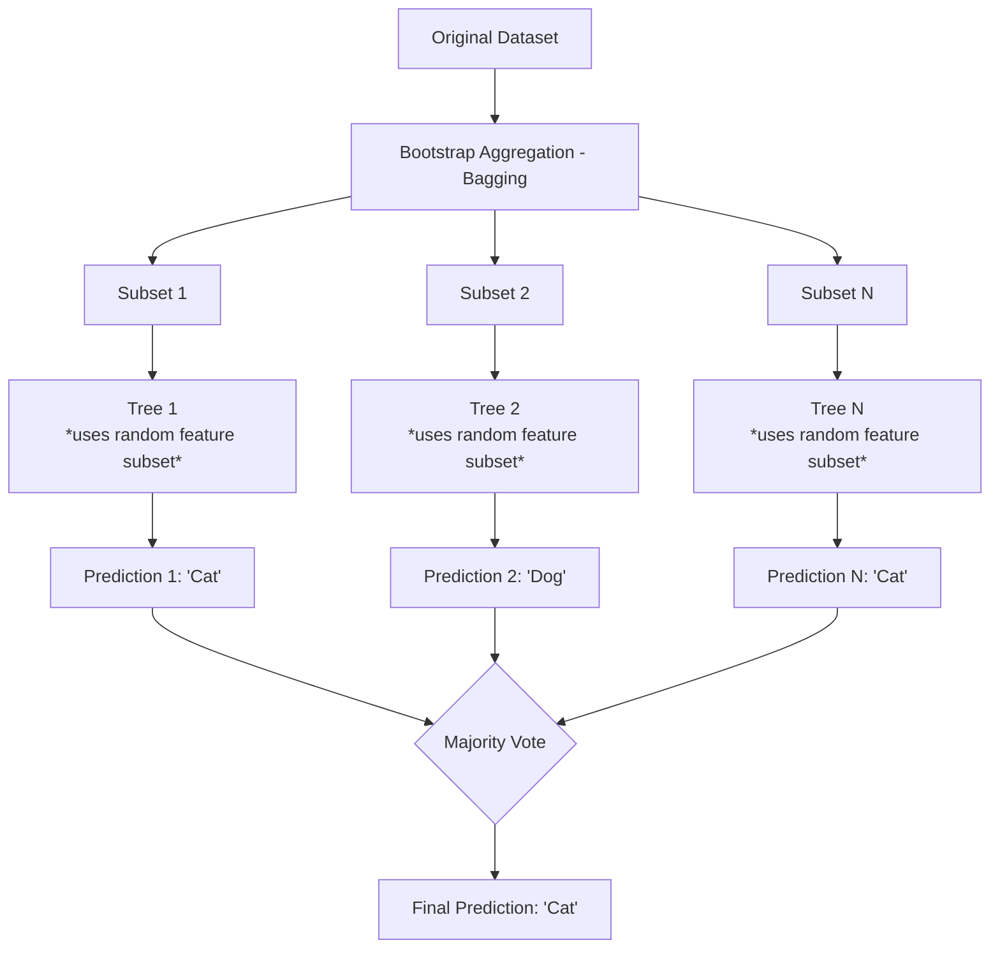

# Random Forests

**Random Forests are an ensemble learning method that constructs a multitude of decision trees at training time and outputs the mode of the classes for classification, significantly reducing the risk of overfitting compared to individual decision trees.**

## Why It Matters

While a single decision tree is highly interpretable, it is notoriously unstable; small variations in the training data can result in a completely different tree. Furthermore, deep decision trees easily overfit the training data. Random Forests solve these fundamental flaws by embracing the "wisdom of the crowd." By training many individual, slightly different trees and averaging their predictions, Random Forests provide incredibly robust, high-performance models that generalize well to unseen data. In industry, Random Forests are widely considered one of the best "out-of-the-box" algorithms. They require very little hyperparameter tuning to get a decent result, they handle both categorical and numerical data naturally, they aren't sensitive to outliers, and they provide excellent feature importance scores, making them an indispensable tool in any Spark data scientist's toolkit.

## How It Works

Random Forests rely on a concept called **Ensemble Learning**, specifically a technique known as **Bagging** (Bootstrap Aggregating). Bagging involves taking the original training dataset and creating multiple random subsamples of it, with replacement. This means each subset might contain duplicate rows while omitting other rows entirely. 

The algorithm then trains a separate Decision Tree on each of these subsets. However, Random Forests introduce a second layer of randomness: **Feature Subsampling**. When a tree is trying to find the best feature to split a node, it doesn't look at all available features. Instead, it looks at a random subset of features (often the square root of the total number of features). This is crucial because if there is one incredibly dominant feature in the dataset, every single tree would choose to split on it at the root node, resulting in highly correlated trees. By forcing trees to evaluate different subsets of features, the forest is forced to explore diverse patterns in the data, ensuring the individual trees are de-correlated.

During inference, when a new data point is passed into the Random Forest, it is evaluated by every single tree in the forest. Each tree outputs its own prediction. For classification tasks, the forest applies majority voting (the class predicted by the most trees wins). For regression tasks, the forest averages the numeric predictions of all trees. Spark's implementation allows you to configure hyperparameters such as `numTrees` (the size of the forest), `maxDepth` (how deep each tree can go), and `featureSubsetStrategy` (how many features to consider at each split), providing a scalable way to build massive ensembles.

## Flow Diagram



## Data Visualization

**Why Ensembles Reduce Error (Variance Reduction)**

| Model | Subsample Data Used | Features Considered at Split | Individual Prediction | Accuracy |
| :--- | :--- | :--- | :--- | :--- |
| **Tree 1** | Row 1, 1, 3, 5 | Age, Income | Churn | 72% |
| **Tree 2** | Row 2, 4, 5, 5 | Location, Tenure | Retain | 68% |
| **Tree 3** | Row 1, 2, 3, 4 | Age, Tenure | Churn | 75% |
| **Random Forest** | **All Trees Aggregated** | **Varies by tree** | **Majority: Churn** | **85%** |

*By aggregating weak, uncorrelated learners, the forest cancels out the noise and errors of individual trees, resulting in higher overall accuracy.*

## Code Example

```scala
// Scala example: Training a Random Forest Classifier in Spark ML
import org.apache.spark.sql.SparkSession
import org.apache.spark.ml.classification.RandomForestClassifier
import org.apache.spark.ml.feature.{VectorAssembler, StringIndexer, IndexToString}
import org.apache.spark.ml.evaluation.MulticlassClassificationEvaluator
import org.apache.spark.ml.Pipeline

// 1. Initialize SparkSession
val spark = SparkSession.builder()
  .appName("RandomForestExample")
  .master("local[*]")
  .getOrCreate()

// 2. Load and Prepare Data
// Assuming a CSV dataset predicting Customer Churn
val df = spark.read.option("header", "true").option("inferSchema", "true")
  .csv("data/customer_churn.csv")

// 3. Feature Engineering Stages
// Convert categorical labels to indices
val labelIndexer = new StringIndexer()
  .setInputCol("Churn")
  .setOutputCol("indexedLabel")
  .fit(df)

// Assemble features
val assembler = new VectorAssembler()
  .setInputCols(Array("Tenure", "MonthlyCharges", "TotalCharges"))
  .setOutputCol("features")
  .setHandleInvalid("skip")

// 4. Configure Random Forest
val rf = new RandomForestClassifier()
  .setLabelCol("indexedLabel")
  .setFeaturesCol("features")
  .setNumTrees(100)            // Number of trees in the forest
  .setMaxDepth(10)             // Max depth of each tree
  .setFeatureSubsetStrategy("auto") // Let algorithm choose (usually sqrt)
  .setSeed(12345L)

// Convert indexed labels back to original strings for readability
val labelConverter = new IndexToString()
  .setInputCol("prediction")
  .setOutputCol("predictedLabel")
  .setLabels(labelIndexer.labelsArray(0))

// 5. Build Pipeline
val pipeline = new Pipeline()
  .setStages(Array(labelIndexer, assembler, rf, labelConverter))

// 6. Split Data & Train
val Array(trainingData, testData) = df.randomSplit(Array(0.8, 0.2), seed = 42L)
val model = pipeline.fit(trainingData)

// 7. Predict & Evaluate
val predictions = model.transform(testData)

val evaluator = new MulticlassClassificationEvaluator()
  .setLabelCol("indexedLabel")
  .setPredictionCol("prediction")
  .setMetricName("accuracy")

val accuracy = evaluator.evaluate(predictions)
println(s"Test Accuracy = ${(accuracy * 100).formatted("%.2f")}%")

// Extract Random Forest model from pipeline to view feature importance
val rfModel = model.stages(2).asInstanceOf[org.apache.spark.ml.classification.RandomForestClassificationModel]
println(s"Feature Importances: ${rfModel.featureImportances}")
```

## Common Pitfalls

*   **Memory Exhaustion:** Setting `numTrees` and `maxDepth` too high can cause OutOfMemory errors on Spark executors, as the cluster must hold the structure of hundreds of deep trees in memory simultaneously.
*   **Diminishing Returns:** Increasing `numTrees` from 10 to 100 yields massive improvements. Increasing it from 1000 to 2000 usually yields zero improvement but doubles the training time. Find the plateau.
*   **Ignoring Feature Importance:** Random forests compute excellent feature importance scores out of the box. Failing to analyze these means missing out on valuable business insights (e.g., realizing "Tenure" drives 80% of churn predictions).
*   **Over-tuning:** Random forests are robust. Spending days tuning a Random Forest often yields minimal gains compared to simply acquiring more or better data features.

## Key Takeaway

Random Forests leverage bagging and random feature selection to combine hundreds of error-prone decision trees into a single, highly accurate, and stable predictive model that resists overfitting.

<br><br><br><br><br><br><br><br><br><br><br><br><br><br><br><br><br><br><br><br><br><br><br><br><br><br><br><br><br><br><br><br><br><br><br><br><br><br><br><br><br><br><br><br><br><br><br><br><br><br><br><br><br><br><br><br><br><br><br><br><br><br><br><br><br><br><br><br><br><br><br><br><br><br><br><br><br><br><br><br>
