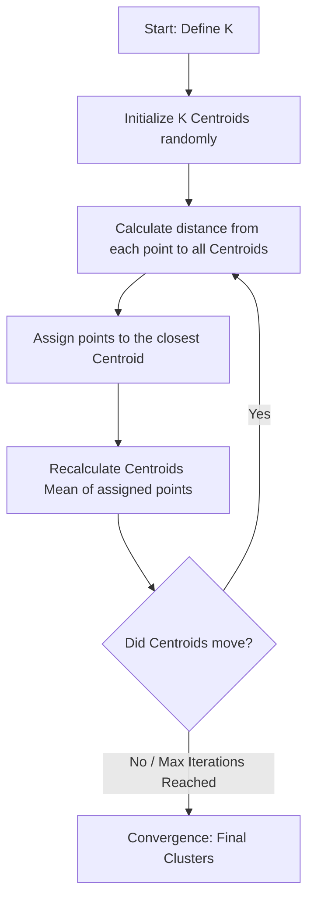

# K-Means Clustering

**K-Means Clustering is an unsupervised machine learning algorithm that partitions a dataset into K distinct, non-overlapping subgroups (clusters) by minimizing the variance within each cluster.**

## Why It Matters

In many real-world scenarios, data comes without labels. You don't know the "right answer," but you suspect there are underlying patterns, groupings, or segments within the data. This is where unsupervised learning and clustering shine. K-Means is the most famous and widely used clustering algorithm because it is intuitive, mathematically elegant, and highly scalable. It matters because it is the foundational tool for customer segmentation (grouping users with similar purchasing habits), anomaly detection (finding data points far from any cluster), and document categorization. In a distributed environment like Spark, K-Means is implemented to handle massive datasets by efficiently updating cluster centroids across a cluster of machines, making it possible to segment billions of events in minutes.

## How It Works

K-Means relies on the concept of geometric distance, typically Euclidean distance. The algorithm requires you to define "K", the number of clusters you want to discover. 

The algorithm operates in an iterative loop:
1. **Initialization:** The algorithm randomly selects K data points from the dataset to act as the initial cluster centers (centroids). Spark ML provides an optimized initialization method called `k-means||` (a parallel variant of k-means++) which intelligently spaces out the initial centroids to speed up convergence.
2. **Assignment Step:** The algorithm calculates the distance between every single data point and all K centroids. Each data point is assigned to the cluster of the centroid it is closest to.
3. **Update Step:** Once all points are assigned, the algorithm recalculates the position of the centroids. The new centroid becomes the mathematical mean (average) of all the data points currently assigned to that cluster.
4. **Repeat:** The assignment and update steps repeat. The centroids move towards the center of their respective clusters. The algorithm stops when the centroids no longer move significantly (convergence) or a maximum number of iterations is reached.

Choosing the right value for K is critical. If K is too small, distinct groups are forced together. If K is too large, natural groups are artificially split. The two most common techniques for evaluating clustering quality are the **Elbow Method** (plotting the within-cluster sum of squared errors and looking for a "kink") and the **Silhouette Score** (measuring how similar an object is to its own cluster compared to other clusters, ranging from -1 to 1). Spark ML provides the `ClusteringEvaluator` which calculates the Silhouette Score automatically.

## Flow Diagram



## Data Visualization

**K-Means Iteration Process (2D Features)**

| Point | Feature X | Feature Y | Iter 1: Assign | Iter 2: New Centroids | Iter 2: Re-assign |
| :--- | :--- | :--- | :--- | :--- | :--- |
| P1 | 1.0 | 1.0 | Cluster A | Centroid A moves to (1.2, 1.2) | Cluster A |
| P2 | 1.5 | 1.5 | Cluster A | - | Cluster A |
| P3 | 8.0 | 8.0 | Cluster B | Centroid B moves to (8.5, 8.5) | Cluster B |
| P4 | 9.0 | 9.0 | Cluster A (Wrong) | - | Cluster B (Corrected)|

*Notice how P4 was initially closer to the random starting point of A, but after Centroid B shifted towards P3, P4 is correctly re-assigned to B.*

## Code Example

```python
# Python example: Customer Segmentation using K-Means Clustering
from pyspark.sql import SparkSession
from pyspark.ml.clustering import KMeans
from pyspark.ml.feature import VectorAssembler, StandardScaler
from pyspark.ml.evaluation import ClusteringEvaluator

# 1. Initialize SparkSession
spark = SparkSession.builder.appName("KMeansClustering").getOrCreate()

# 2. Create sample un-labeled data
# Columns: Annual Income (k$), Spending Score (1-100)
data = spark.createDataFrame([
    (15, 39), (15, 81), (16, 6), (16, 77), (17, 40),
    (80, 80), (82, 85), (85, 90), (90, 95), (95, 99),
    (85, 10), (90, 15), (92, 20), (100, 15), (105, 20)
], ["income", "spending_score"])

# 3. Assemble features
assembler = VectorAssembler(
    inputCols=["income", "spending_score"],
    outputCol="unscaled_features"
)
assembled_data = assembler.transform(data)

# 4. CRITICAL: Scale features for distance-based algorithms
scaler = StandardScaler(
    inputCol="unscaled_features",
    outputCol="features",
    withStd=True,
    withMean=True
)
scaler_model = scaler.fit(assembled_data)
scaled_data = scaler_model.transform(assembled_data)

# 5. Configure and Train K-Means
# We suspect 3 clusters: Low/Low, High/High, High Income/Low Spending
kmeans = KMeans(
    k=3, 
    seed=1, 
    featuresCol="features", 
    predictionCol="cluster_id"
)
model = kmeans.fit(scaled_data)

# 6. Make Predictions (Assign clusters)
predictions = model.transform(scaled_data)
predictions.select("income", "spending_score", "cluster_id").show()

# 7. Evaluate Clustering using Silhouette Score
evaluator = ClusteringEvaluator(
    predictionCol="cluster_id",
    featuresCol="features",
    metricName="silhouette",
    distanceMeasure="squaredEuclidean"
)

silhouette = evaluator.evaluate(predictions)
print(f"Silhouette with squared euclidean distance = {silhouette}")

# 8. View Cluster Centers
print("Cluster Centers: ")
centers = model.clusterCenters()
for center in centers:
    print(center)
```

## Common Pitfalls

*   **Forgetting to Scale Data:** K-Means is a distance-based algorithm. If Feature A ranges from 0-1 and Feature B ranges from 0-1,000,000, Feature B will completely dominate the distance calculation. Always use `StandardScaler` or `MinMaxScaler`.
*   **Choosing K Arbitrarily:** Guessing K without evaluation leads to poor segments. Always run a loop testing K=2 through K=10, evaluate the Silhouette Score for each, and choose the most mathematically sound grouping.
*   **Sensitivity to Outliers:** K-Means calculates means. A single massive outlier can drag a centroid far away from the actual cluster. Consider removing extreme outliers before clustering.
*   **Curse of Dimensionality:** In extremely high-dimensional spaces (e.g., text data with 10,000 TF-IDF features), distance metrics lose their meaning because all points become roughly equidistant. Dimensionality reduction (like PCA) is often required before K-Means.

## Key Takeaway

K-Means is a powerful, distance-based algorithm for discovering hidden groupings in unlabeled data, but it requires careful feature scaling and mathematical evaluation to determine the optimal number of clusters.

<br><br><br><br><br><br><br><br><br><br><br><br><br><br><br><br><br><br><br><br><br><br><br><br><br><br><br><br><br><br><br><br><br><br><br><br><br><br><br><br><br><br><br><br><br><br><br><br><br><br><br><br><br><br><br><br><br><br><br><br><br><br><br><br><br><br><br><br><br><br><br><br><br><br><br><br><br><br><br><br>


---

## 🎓 Deep Learning Questions

### Q1: Why Was This Concept Introduced?
K-Means clustering was introduced to solve the problem of finding hidden structures in unlabelled datasets. Before unsupervised algorithms existed, models heavily relied on pre-labeled data (supervised learning), which is often expensive and time-consuming to obtain. As businesses began accumulating massive volumes of raw data—such as user logs, transactions, and sensor readings—they needed an automated way to group similar items and uncover underlying patterns without manual human tagging. Spark introduced distributed K-Means specifically to overcome the limitations of single-node processing, allowing iterative algorithms to scale across huge clusters by keeping intermediate data in memory, avoiding the expensive disk I/O of legacy MapReduce jobs.

### Q2: What Exactly Is This Concept and How Does It Work?
K-Means is an iterative, unsupervised machine learning algorithm that partitions a dataset into $K$ distinct, non-overlapping clusters based on feature similarity. 

The process operates in four major steps:
1. **Initialization**: $K$ initial centroids (cluster centers) are chosen. Spark uses `k-means||` (an optimized, parallel version of k-means++) to spread out the initial centroids, accelerating convergence.
2. **Assignment**: Every data point calculates its distance (usually Euclidean) to each centroid. Points are assigned to the cluster of their closest centroid.
3. **Update**: Once all points are assigned, the algorithm calculates the mean of all points within each cluster and moves the centroid to this new center.
4. **Convergence**: Steps 2 and 3 repeat until the centroids stop shifting significantly or a maximum number of iterations is hit.

### Q3: Where Should This Concept Be Used?
K-Means is a foundational algorithm used across various industries where data naturally forms distinct groups.
- **Retail & E-commerce (Amazon, Walmart)**: Customer segmentation based on purchase history, browsing behavior, and spending habits to drive targeted marketing.
- **Banking (JPMorgan, Capital One)**: Fraud and anomaly detection. A transaction that falls extremely far from a user's standard cluster might be flagged.
- **Streaming (Netflix, Spotify)**: Grouping users with similar viewing or listening patterns to generate broad recommendation tiers.
- **Healthcare**: Segmenting patient groups based on health metrics, biometrics, or treatment responses to identify high-risk categories.

### Q4: Where Should This Concept NOT Be Used?
K-Means is powerful but has strict geometric assumptions. It should **not** be used when:
- **Clusters are non-spherical**: K-Means expects roughly circular/spherical clusters of similar sizes. For elongated or nested clusters (like moons or concentric circles), algorithms like DBSCAN perform better.
- **Data contains extreme outliers**: Because the algorithm relies on the mean (average), a single huge outlier can drastically shift a centroid, corrupting the cluster.
- **Categorical Data**: Standard K-Means relies on Euclidean distance, which makes no sense for purely categorical features. You would need K-Modes instead.
- **Density varies significantly**: If one cluster is highly dense and another is sparse, K-Means struggles to draw accurate boundaries.

### Q5: How Is This Concept Different from Hadoop?
| Aspect | Hadoop MapReduce | Apache Spark |
| :--- | :--- | :--- |
| **Architecture** | Disk-based execution | In-memory execution engine |
| **Performance** | Very slow for iterative algorithms like K-Means | 10x-100x faster due to keeping data cached in RAM between iterations |
| **Processing Model** | Strict Map -> Shuffle -> Reduce phases | Flexible DAG (Directed Acyclic Graph) of operations |
| **Memory Usage** | Writes intermediate state to disk after each step | Retains RDDs/DataFrames in memory across centroid updates |
| **Fault Tolerance** | Replicates data to HDFS at every step | Recomputes lost partitions dynamically using lineage graphs |
| **Ease of Development** | Hard, requires custom Java map/reduce classes | Simple, unified MLlib / Spark ML APIs in Python, Scala, SQL |
| **Typical Use Cases** | Batch ETL, huge log processing | Iterative Machine Learning, Streaming, Interactive Data Science |
| **Advantages** | Highly reliable for massive batch pipelines | Extremely fast, supports end-to-end data pipelines + ML in one script |
| **Disadvantages** | Terrible for Machine Learning (iteration kills speed) | High memory requirements, requires tuning for out-of-memory errors |

### Q6: How Can This Concept Be Related to a Traditional RDBMS?
While SQL is fundamentally deterministic, we can conceptualize clustering by comparing it to the `GROUP BY` clause, with one major twist: the groups are dynamically discovered by math.

| Concept | Traditional RDBMS (SQL) | Spark ML K-Means |
| :--- | :--- | :--- |
| **Grouping** | `GROUP BY category` (Explicitly defined by a known column) | Clusters dynamically discovered based on multidimensional distance |
| **Center Point** | `AVG(col1), AVG(col2)` per group | The Cluster Centroid (multi-dimensional mean of features) |
| **Categorization** | `CASE WHEN income > 50k THEN 'High'` (Rules-based) | Points are dynamically assigned via Euclidean distance |
| **Updating Groups** | Static; records stay in defined categories | Iterative; records jump between clusters as centroids shift over time |

### Q7: What Happens Behind the Scenes?
1. **Driver**: The Spark Driver initializes the $K$ centroids using the `k-means||` algorithm and broadcasts these coordinates to all Executors.
2. **Tasks & Partitions**: The dataset is divided into partitions across worker nodes. Executors run map tasks on their specific partitions.
3. **Distance Calculation (Map Phase)**: Each Executor calculates the distance from its partition's data points to all broadcasted centroids and assigns points to the nearest one.
4. **Local Aggregation**: Executors pre-calculate the local sum and count of points for each cluster within their partition.
5. **Shuffle & Update (Reduce Phase)**: The local sums and counts are sent back to the Driver (or aggregated via treeReduce). The Driver divides the total sum by the total count to find the new global centroids.
6. **Iteration**: The Driver broadcasts the new centroids back to the Executors, and the loop continues until convergence.

```text
[Driver] Initializes & Broadcasts Centroids {C1, C2, C3}
       |
       v
[Executors] Map over Partitions (Point -> Nearest Centroid)
       |--> Partition 1 computes distances & assigns points
       |--> Partition 2 computes distances & assigns points
       |
       v
[Local Combine] Calculate Sum & Count per cluster locally
       |
       v
[Driver/Reduce] Aggregates global sums & counts -> Computes New Centroids
       |
       v
[Loop] Broadcast new centroids until convergence
```

### Q8: Performance Considerations, Best Practices, and Common Mistakes

| Category | Recommendation | Why It Matters |
| :--- | :--- | :--- |
| **Performance** | **Cache the Training DataFrame** (`df.cache()`) | K-Means is iterative. Without caching, Spark will re-read the data from disk for every single iteration. |
| **Best Practice** | **Always scale features** (`StandardScaler`) | Distance metrics are scale-sensitive. A feature with values 0-1000 will overwhelm a feature with values 0-1. |
| **Initialization** | **Use `k-means\|\|` initialization** | Random starting points can lead to poor, slow convergence. `k-means\|\|` spreads initial centers out intelligently. |
| **Common Mistake** | **Ignoring categorical features** | Passing raw integers for categories (like zip codes) creates false mathematical relationships. K-Means assumes continuous spaces. |
| **Performance** | **Reduce dimensionality** (`PCA`) | The "curse of dimensionality" makes distance metrics meaningless if you have thousands of features (e.g., text TF-IDF). |

### Q9: Interview Questions

**Beginner**
1. **What is the difference between supervised and unsupervised learning?** Supervised learning relies on labeled data (e.g., predicting house prices), whereas unsupervised learning (like K-Means) groups unlabelled data based on hidden patterns.
2. **What does the 'K' stand for in K-Means?** 'K' represents the exact number of clusters or groupings you want the algorithm to identify in your dataset.
3. **Why do we need to scale data before running K-Means?** K-Means calculates distance (Euclidean). If features are on completely different scales, the feature with the largest numbers will mathematically dominate the distance.

**Intermediate**
1. **How do you determine the optimal number of clusters?** By using the Elbow Method (plotting Within-Cluster Sum of Squares) or the Silhouette Score (evaluating cluster cohesion and separation).
2. **What is the `k-means||` algorithm in Spark?** It's a scalable, parallel variant of the k-means++ initialization technique that spreads initial centroids to ensure faster and more accurate convergence.
3. **Why is caching critical for K-Means in Spark?** Because K-Means is an iterative algorithm. Without caching (`df.cache()`), Spark's DAG execution would recompute or re-read the entire dataset from disk on every single pass.

**Advanced**
1. **What happens if your data contains severe outliers?** Because centroids are updated using the *mean*, a massive outlier will heavily drag a centroid away from the true center of the cluster, reducing accuracy.
2. **Can you explain the Curse of Dimensionality in the context of clustering?** As dimensions increase, the volume of space expands so fast that the available data becomes sparse. Consequently, the distance between *any* two points becomes almost uniform, making clusters indistinguishable.
3. **How does Spark handle the Reduce phase of K-Means efficiently?** Instead of shuffling all raw assigned points, Executors locally aggregate the sum and count of vectors per cluster (Map-Side Combine), heavily reducing network I/O before sending it to the Driver.

**Scenario-Based**
1. **You ran K-Means on an eCommerce dataset and all users ended up in a single giant cluster, with two tiny clusters of 1 person each. What went wrong?** Those two single-person clusters are likely massive outliers (e.g., billionaires) that haven't been removed or scaled properly.
2. **Your Spark K-Means job is taking hours to complete and you see high disk spilling. How do you fix it?** The data isn't cached, or the cluster lacks memory to cache it. Call `df.cache()` before fitting the model, and ensure you allocate enough Executor memory.

### Q10: Complete Real-World Example

**Business Problem:** A streaming platform (like Netflix or Spotify) wants to segment its users based on two metrics: total listening minutes per day, and variety of genres listened to. This will power a new recommendation engine UI.
**Dataset:** User IDs, `daily_minutes` (continuous), `genre_diversity_score` (continuous 0.0 - 1.0).

```python
from pyspark.sql import SparkSession
from pyspark.ml.feature import VectorAssembler, StandardScaler
from pyspark.ml.clustering import KMeans
from pyspark.ml.evaluation import ClusteringEvaluator

# Initialize Spark
spark = SparkSession.builder.appName("StreamingSegmentation").getOrCreate()

# Sample Dataset
data = [
    (1, 45, 0.1), (2, 50, 0.2), (3, 40, 0.15),   # Casual listeners, low diversity
    (4, 120, 0.8), (5, 150, 0.9), (6, 130, 0.85), # Heavy listeners, high diversity
    (7, 200, 0.2), (8, 210, 0.1), (9, 250, 0.15)  # Heavy listeners, low diversity (Podcasts/Audiobooks?)
]
df = spark.createDataFrame(data, ["user_id", "daily_minutes", "genre_diversity_score"])

# 1. Assemble features into a single Vector
assembler = VectorAssembler(
    inputCols=["daily_minutes", "genre_diversity_score"], 
    outputCol="unscaled_features"
)
assembled_df = assembler.transform(df)

# 2. Scale the features (CRITICAL for K-Means)
scaler = StandardScaler(
    inputCol="unscaled_features", 
    outputCol="features", 
    withStd=True, 
    withMean=True
)
scaled_df = scaler.fit(assembled_df).transform(assembled_df)

# 3. Cache the dataset since K-Means is iterative
scaled_df.cache()

# 4. Initialize and Train K-Means
kmeans = KMeans(k=3, seed=42, featuresCol="features", predictionCol="segment")
model = kmeans.fit(scaled_df)

# 5. Make predictions
predictions = model.transform(scaled_df)
predictions.select("user_id", "daily_minutes", "genre_diversity_score", "segment").show()

# 6. Evaluate model with Silhouette Score
evaluator = ClusteringEvaluator(
    featuresCol="features", 
    predictionCol="segment", 
    metricName="silhouette"
)
score = evaluator.evaluate(predictions)
print(f"Silhouette Score: {score}")

# Performance Note: Always unpersist when done
scaled_df.unpersist()
```

### 💡 Key Takeaways
- K-Means is an unsupervised algorithm that dynamically discovers $K$ hidden clusters based on geometric distance.
- Feature scaling (StandardScaler) is strictly mandatory to prevent large-magnitude columns from dominating the clustering logic.
- Finding the optimal $K$ requires iterative testing and evaluation using metrics like the Silhouette Score.
- Because K-Means updates centroids iteratively, calling `cache()` on your training DataFrame is crucial for performance in Apache Spark.
- Spark's distributed architecture calculates assignments and local aggregates on Executors, only sending small metadata back to the Driver for updates.

### ⚠️ Common Misconceptions
- **"K-Means works on any data type"**: False. It fundamentally requires continuous numerical data to calculate Euclidean distance. It fails on raw categorical strings.
- **"More clusters mean better models"**: False. If you set $K$ equal to your number of rows, distance goes to 0, but the clusters are completely useless.
- **"K-Means guarantees the absolute best clustering"**: False. Depending on random initialization, it can converge on a local minimum rather than a global optimal state.

### 🔗 Related Spark Concepts
- VectorAssembler & StandardScaler (Feature Transformers)
- ClusteringEvaluator (Evaluation Metrics)
- BisectingKMeans (Hierarchical alternative to K-Means)
- Principal Component Analysis (PCA for dimensionality reduction)
- Gaussian Mixture Models (Probabilistic clustering)

### 📚 References for Further Reading
- Apache Spark Official Documentation
- Learning Spark (O'Reilly)
- Spark: The Definitive Guide (O'Reilly)
