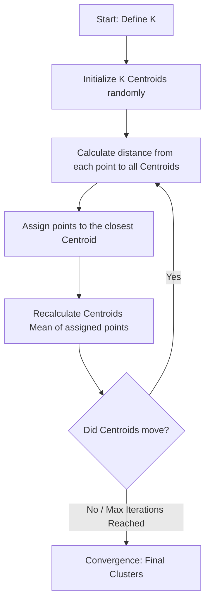

# K-Means Clustering

**K-Means Clustering is an unsupervised machine learning algorithm that partitions a dataset into K distinct, non-overlapping subgroups (clusters) by minimizing the variance within each cluster.**

## Why It Matters

In many real-world scenarios, data comes without labels. You don't know the "right answer," but you suspect there are underlying patterns, groupings, or segments within the data. This is where unsupervised learning and clustering shine. K-Means is the most famous and widely used clustering algorithm because it is intuitive, mathematically elegant, and highly scalable. It matters because it is the foundational tool for customer segmentation (grouping users with similar purchasing habits), anomaly detection (finding data points far from any cluster), and document categorization. In a distributed environment like Spark, K-Means is implemented to handle massive datasets by efficiently updating cluster centroids across a cluster of machines, making it possible to segment billions of events in minutes.

## How It Works

K-Means relies on the concept of geometric distance, typically Euclidean distance. The algorithm requires you to define "K", the number of clusters you want to discover. 

The algorithm operates in an iterative loop:
1. **Initialization:** The algorithm randomly selects K data points from the dataset to act as the initial cluster centers (centroids). Spark ML provides an optimized initialization method called `k-means||` (a parallel variant of k-means++) which intelligently spaces out the initial centroids to speed up convergence.
2. **Assignment Step:** The algorithm calculates the distance between every single data point and all K centroids. Each data point is assigned to the cluster of the centroid it is closest to.
3. **Update Step:** Once all points are assigned, the algorithm recalculates the position of the centroids. The new centroid becomes the mathematical mean (average) of all the data points currently assigned to that cluster.
4. **Repeat:** The assignment and update steps repeat. The centroids move towards the center of their respective clusters. The algorithm stops when the centroids no longer move significantly (convergence) or a maximum number of iterations is reached.

Choosing the right value for K is critical. If K is too small, distinct groups are forced together. If K is too large, natural groups are artificially split. The two most common techniques for evaluating clustering quality are the **Elbow Method** (plotting the within-cluster sum of squared errors and looking for a "kink") and the **Silhouette Score** (measuring how similar an object is to its own cluster compared to other clusters, ranging from -1 to 1). Spark ML provides the `ClusteringEvaluator` which calculates the Silhouette Score automatically.

## Flow Diagram



## Data Visualization

**K-Means Iteration Process (2D Features)**

| Point | Feature X | Feature Y | Iter 1: Assign | Iter 2: New Centroids | Iter 2: Re-assign |
| :--- | :--- | :--- | :--- | :--- | :--- |
| P1 | 1.0 | 1.0 | Cluster A | Centroid A moves to (1.2, 1.2) | Cluster A |
| P2 | 1.5 | 1.5 | Cluster A | - | Cluster A |
| P3 | 8.0 | 8.0 | Cluster B | Centroid B moves to (8.5, 8.5) | Cluster B |
| P4 | 9.0 | 9.0 | Cluster A (Wrong) | - | Cluster B (Corrected)|

*Notice how P4 was initially closer to the random starting point of A, but after Centroid B shifted towards P3, P4 is correctly re-assigned to B.*

## Code Example

```python
# Python example: Customer Segmentation using K-Means Clustering
from pyspark.sql import SparkSession
from pyspark.ml.clustering import KMeans
from pyspark.ml.feature import VectorAssembler, StandardScaler
from pyspark.ml.evaluation import ClusteringEvaluator

# 1. Initialize SparkSession
spark = SparkSession.builder.appName("KMeansClustering").getOrCreate()

# 2. Create sample un-labeled data
# Columns: Annual Income (k$), Spending Score (1-100)
data = spark.createDataFrame([
    (15, 39), (15, 81), (16, 6), (16, 77), (17, 40),
    (80, 80), (82, 85), (85, 90), (90, 95), (95, 99),
    (85, 10), (90, 15), (92, 20), (100, 15), (105, 20)
], ["income", "spending_score"])

# 3. Assemble features
assembler = VectorAssembler(
    inputCols=["income", "spending_score"],
    outputCol="unscaled_features"
)
assembled_data = assembler.transform(data)

# 4. CRITICAL: Scale features for distance-based algorithms
scaler = StandardScaler(
    inputCol="unscaled_features",
    outputCol="features",
    withStd=True,
    withMean=True
)
scaler_model = scaler.fit(assembled_data)
scaled_data = scaler_model.transform(assembled_data)

# 5. Configure and Train K-Means
# We suspect 3 clusters: Low/Low, High/High, High Income/Low Spending
kmeans = KMeans(
    k=3, 
    seed=1, 
    featuresCol="features", 
    predictionCol="cluster_id"
)
model = kmeans.fit(scaled_data)

# 6. Make Predictions (Assign clusters)
predictions = model.transform(scaled_data)
predictions.select("income", "spending_score", "cluster_id").show()

# 7. Evaluate Clustering using Silhouette Score
evaluator = ClusteringEvaluator(
    predictionCol="cluster_id",
    featuresCol="features",
    metricName="silhouette",
    distanceMeasure="squaredEuclidean"
)

silhouette = evaluator.evaluate(predictions)
print(f"Silhouette with squared euclidean distance = {silhouette}")

# 8. View Cluster Centers
print("Cluster Centers: ")
centers = model.clusterCenters()
for center in centers:
    print(center)
```

## Common Pitfalls

*   **Forgetting to Scale Data:** K-Means is a distance-based algorithm. If Feature A ranges from 0-1 and Feature B ranges from 0-1,000,000, Feature B will completely dominate the distance calculation. Always use `StandardScaler` or `MinMaxScaler`.
*   **Choosing K Arbitrarily:** Guessing K without evaluation leads to poor segments. Always run a loop testing K=2 through K=10, evaluate the Silhouette Score for each, and choose the most mathematically sound grouping.
*   **Sensitivity to Outliers:** K-Means calculates means. A single massive outlier can drag a centroid far away from the actual cluster. Consider removing extreme outliers before clustering.
*   **Curse of Dimensionality:** In extremely high-dimensional spaces (e.g., text data with 10,000 TF-IDF features), distance metrics lose their meaning because all points become roughly equidistant. Dimensionality reduction (like PCA) is often required before K-Means.

## Key Takeaway

K-Means is a powerful, distance-based algorithm for discovering hidden groupings in unlabeled data, but it requires careful feature scaling and mathematical evaluation to determine the optimal number of clusters.

<br><br><br><br><br><br><br><br><br><br><br><br><br><br><br><br><br><br><br><br><br><br><br><br><br><br><br><br><br><br><br><br><br><br><br><br><br><br><br><br><br><br><br><br><br><br><br><br><br><br><br><br><br><br><br><br><br><br><br><br><br><br><br><br><br><br><br><br><br><br><br><br><br><br><br><br><br><br><br><br>
