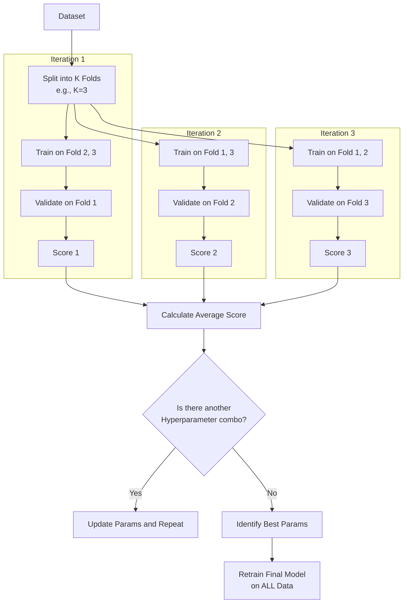

# Cross-Validation

**Cross-validation is a robust model evaluation technique that assesses how the results of a statistical analysis will generalize to an independent dataset by partitioning the data into folds and iteratively training and testing.**

## Why It Matters

A beginner in machine learning might split their dataset 80/20, train the model on the 80%, test it on the 20%, see a 95% accuracy, and deploy the model. This is incredibly dangerous. What if all the difficult, complex edge cases accidentally ended up in the training set, and the test set only contained "easy" examples? The model would appear highly accurate but would fail catastrophically in production. This phenomenon is caused by variance in the train/test split. Cross-validation matters because it eliminates this luck factor. By rotating the data so that every single data point is eventually used for testing, cross-validation provides a statistically reliable, unbiased estimate of model performance. Furthermore, when combined with Hyperparameter Tuning (Grid Search), it provides a rigorous framework for finding the absolute best configuration for a model without leaking information.

## How It Works

The most common form of cross-validation is **K-Fold Cross-Validation**. The process works as follows:

1.  The dataset is randomly partitioned into `k` equal-sized, mutually exclusive subsets called "folds" (typically k=3, 5, or 10).
2.  The algorithm initiates a loop that runs `k` times.
3.  In iteration 1, Fold 1 is held out as the validation (test) set. The model is trained on Folds 2, 3, 4, and 5 combined. The model is evaluated on Fold 1, and the metric (e.g., accuracy) is recorded.
4.  In iteration 2, Fold 2 is held out as the validation set. The model is trained on Folds 1, 3, 4, and 5. The metric is recorded.
5.  This repeats until every fold has served exactly once as the validation set.
6.  The final performance of the model is the average of the metrics recorded across all `k` iterations.

Spark ML automates this entire process via the `CrossValidator` class. But `CrossValidator` does more than just evaluation; it performs **Grid Search**. You provide it with an Estimator (like Logistic Regression), an Evaluator, and a grid of parameters (using `ParamGridBuilder`). For example, if you want to test 3 different regularization parameters and 2 different max iteration limits, you have a grid of 6 combinations.

If you use 3-fold cross-validation with a grid of 6 parameter combinations, Spark will train and evaluate 18 different models (3 folds * 6 combinations) behind the scenes! Once all combinations are tested across all folds, the `CrossValidator` automatically identifies the best parameter combination based on the average evaluation metric. It then takes those best parameters and retrains a single final model using the *entire* dataset, which is returned as the final output.

## Flow Diagram



## Data Visualization

**K-Fold Process Visualization (k=4)**

| Fold 1 | Fold 2 | Fold 3 | Fold 4 | Action |
| :---: | :---: | :---: | :---: | :--- |
| **TEST** | Train | Train | Train | Model tested on Fold 1. Score: 0.85 |
| Train | **TEST** | Train | Train | Model tested on Fold 2. Score: 0.82 |
| Train | Train | **TEST** | Train | Model tested on Fold 3. Score: 0.88 |
| Train | Train | Train | **TEST** | Model tested on Fold 4. Score: 0.81 |

*Average Score: 0.84. This gives a much more reliable metric than a single 75/25 split.*

## Code Example

```scala
// Scala example: Cross-Validation and Hyperparameter Tuning in Spark ML
import org.apache.spark.sql.SparkSession
import org.apache.spark.ml.Pipeline
import org.apache.spark.ml.classification.LogisticRegression
import org.apache.spark.ml.evaluation.BinaryClassificationEvaluator
import org.apache.spark.ml.tuning.{CrossValidator, ParamGridBuilder}
import org.apache.spark.ml.feature.{HashingTF, Tokenizer}

// 1. Initialize Spark
val spark = SparkSession.builder().appName("CrossValidationEx").master("local[*]").getOrCreate()

// 2. Prepare Data (Spam classification example)
val training = spark.createDataFrame(Seq(
  (0L, "win free cash now", 1.0),
  (1L, "meeting at 3pm tomorrow", 0.0),
  (2L, "click here for prize", 1.0),
  (3L, "project update attached", 0.0),
  (4L, "urgent account alert", 1.0),
  (5L, "lunch on friday?", 0.0)
)).toDF("id", "text", "label")

// 3. Define Pipeline Stages
val tokenizer = new Tokenizer().setInputCol("text").setOutputCol("words")
val hashingTF = new HashingTF().setInputCol(tokenizer.getOutputCol).setOutputCol("features")
val lr = new LogisticRegression().setMaxIter(10)
val pipeline = new Pipeline().setStages(Array(tokenizer, hashingTF, lr))

// 4. Build Parameter Grid for Hyperparameter Tuning
// We will test 3 values for HashingTF numFeatures, and 2 values for LR regParam
val paramGrid = new ParamGridBuilder()
  .addGrid(hashingTF.numFeatures, Array(10, 100, 1000))
  .addGrid(lr.regParam, Array(0.1, 0.01))
  .build()

// 5. Configure Evaluator
val evaluator = new BinaryClassificationEvaluator() // Default metric is areaUnderROC

// 6. Setup CrossValidator
// It requires an Estimator (our pipeline), Evaluator, ParamGrid, and Number of Folds
val cv = new CrossValidator()
  .setEstimator(pipeline)
  .setEvaluator(evaluator)
  .setEstimatorParamMaps(paramGrid)
  .setNumFolds(3)  // 3-fold cross validation
  .setParallelism(2) // Evaluate up to 2 parameter settings in parallel

// 7. Run Cross-Validation to find the best model
// This will run: 3 folds * (3 * 2) grid combinations = 18 training runs!
println("Starting Cross-Validation Grid Search...")
val cvModel = cv.fit(training)

// 8. Analyze Results
// cvModel is the best model found, automatically retrained on the full dataset
val bestPipelineModel = cvModel.bestModel.asInstanceOf[org.apache.spark.ml.PipelineModel]
val bestLR = bestPipelineModel.stages(2).asInstanceOf[org.apache.spark.ml.classification.LogisticRegressionModel]

println(s"Best Model Regularization Param: ${bestLR.getRegParam}")
println("Cross-Validation Complete.")
```

## Common Pitfalls

*   **Cross-Validating the Algorithm, Not the Pipeline:** This is a massive source of data leakage. If you apply `StandardScaler` to your entire dataset *before* passing it to `CrossValidator`, information from the test folds leaks into the training folds via the mean/variance. Always pass the entire `Pipeline` (including scalers and feature engineering) to the `CrossValidator` so transformations are calculated purely on the training folds inside the loop.
*   **Computational Explosion:** A grid with 5 parameters, each with 4 options, over 5 folds requires training 5,120 models. Cross-validation is computationally expensive. Use smaller grids or `TrainValidationSplit` (a single holdout set instead of k-folds) for massive datasets.
*   **Time Series Leakage:** K-Fold randomly shuffles data. If your data is time-series (e.g., stock prices), you cannot use future data to predict past data. Standard K-Fold is invalid for time-series; you must use specialized temporal cross-validation.

## Key Takeaway

Cross-validation guarantees an unbiased, statistically rigorous evaluation of model performance and, when combined with grid search, automates the discovery of optimal hyperparameter configurations.

<br><br><br><br><br><br><br><br><br><br><br><br><br><br><br><br><br><br><br><br><br><br><br><br><br><br><br><br><br><br><br><br><br><br><br><br><br><br><br><br><br><br><br><br><br><br><br><br><br><br><br><br><br><br><br><br><br><br><br><br><br><br><br><br><br><br><br><br><br><br><br><br><br><br><br><br><br><br><br><br>
