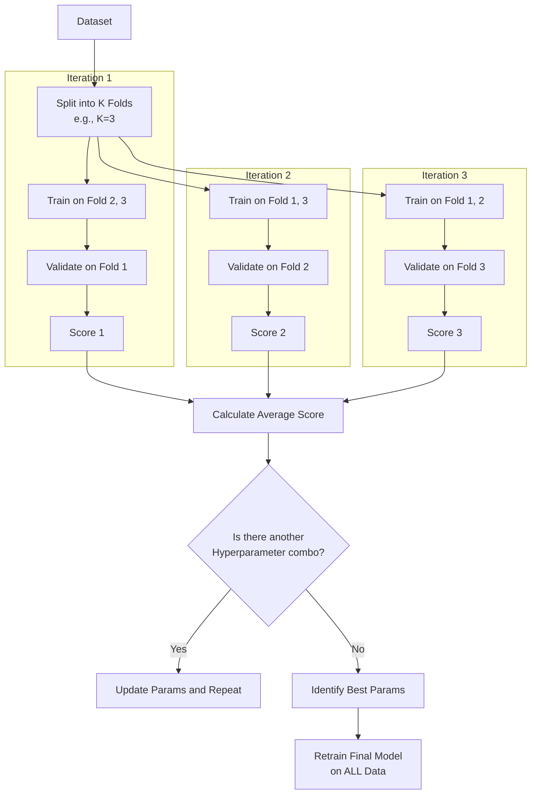

# Cross-Validation

**Cross-validation is a robust model evaluation technique that assesses how the results of a statistical analysis will generalize to an independent dataset by partitioning the data into folds and iteratively training and testing.**

## Why It Matters

A beginner in machine learning might split their dataset 80/20, train the model on the 80%, test it on the 20%, see a 95% accuracy, and deploy the model. This is incredibly dangerous. What if all the difficult, complex edge cases accidentally ended up in the training set, and the test set only contained "easy" examples? The model would appear highly accurate but would fail catastrophically in production. This phenomenon is caused by variance in the train/test split. Cross-validation matters because it eliminates this luck factor. By rotating the data so that every single data point is eventually used for testing, cross-validation provides a statistically reliable, unbiased estimate of model performance. Furthermore, when combined with Hyperparameter Tuning (Grid Search), it provides a rigorous framework for finding the absolute best configuration for a model without leaking information.

## How It Works

The most common form of cross-validation is **K-Fold Cross-Validation**. The process works as follows:

1.  The dataset is randomly partitioned into `k` equal-sized, mutually exclusive subsets called "folds" (typically k=3, 5, or 10).
2.  The algorithm initiates a loop that runs `k` times.
3.  In iteration 1, Fold 1 is held out as the validation (test) set. The model is trained on Folds 2, 3, 4, and 5 combined. The model is evaluated on Fold 1, and the metric (e.g., accuracy) is recorded.
4.  In iteration 2, Fold 2 is held out as the validation set. The model is trained on Folds 1, 3, 4, and 5. The metric is recorded.
5.  This repeats until every fold has served exactly once as the validation set.
6.  The final performance of the model is the average of the metrics recorded across all `k` iterations.

Spark ML automates this entire process via the `CrossValidator` class. But `CrossValidator` does more than just evaluation; it performs **Grid Search**. You provide it with an Estimator (like Logistic Regression), an Evaluator, and a grid of parameters (using `ParamGridBuilder`). For example, if you want to test 3 different regularization parameters and 2 different max iteration limits, you have a grid of 6 combinations.

If you use 3-fold cross-validation with a grid of 6 parameter combinations, Spark will train and evaluate 18 different models (3 folds * 6 combinations) behind the scenes! Once all combinations are tested across all folds, the `CrossValidator` automatically identifies the best parameter combination based on the average evaluation metric. It then takes those best parameters and retrains a single final model using the *entire* dataset, which is returned as the final output.

## Flow Diagram



## Data Visualization

**K-Fold Process Visualization (k=4)**

| Fold 1 | Fold 2 | Fold 3 | Fold 4 | Action |
| :---: | :---: | :---: | :---: | :--- |
| **TEST** | Train | Train | Train | Model tested on Fold 1. Score: 0.85 |
| Train | **TEST** | Train | Train | Model tested on Fold 2. Score: 0.82 |
| Train | Train | **TEST** | Train | Model tested on Fold 3. Score: 0.88 |
| Train | Train | Train | **TEST** | Model tested on Fold 4. Score: 0.81 |

*Average Score: 0.84. This gives a much more reliable metric than a single 75/25 split.*

## Code Example

```scala
// Scala example: Cross-Validation and Hyperparameter Tuning in Spark ML
import org.apache.spark.sql.SparkSession
import org.apache.spark.ml.Pipeline
import org.apache.spark.ml.classification.LogisticRegression
import org.apache.spark.ml.evaluation.BinaryClassificationEvaluator
import org.apache.spark.ml.tuning.{CrossValidator, ParamGridBuilder}
import org.apache.spark.ml.feature.{HashingTF, Tokenizer}

// 1. Initialize Spark
val spark = SparkSession.builder().appName("CrossValidationEx").master("local[*]").getOrCreate()

// 2. Prepare Data (Spam classification example)
val training = spark.createDataFrame(Seq(
  (0L, "win free cash now", 1.0),
  (1L, "meeting at 3pm tomorrow", 0.0),
  (2L, "click here for prize", 1.0),
  (3L, "project update attached", 0.0),
  (4L, "urgent account alert", 1.0),
  (5L, "lunch on friday?", 0.0)
)).toDF("id", "text", "label")

// 3. Define Pipeline Stages
val tokenizer = new Tokenizer().setInputCol("text").setOutputCol("words")
val hashingTF = new HashingTF().setInputCol(tokenizer.getOutputCol).setOutputCol("features")
val lr = new LogisticRegression().setMaxIter(10)
val pipeline = new Pipeline().setStages(Array(tokenizer, hashingTF, lr))

// 4. Build Parameter Grid for Hyperparameter Tuning
// We will test 3 values for HashingTF numFeatures, and 2 values for LR regParam
val paramGrid = new ParamGridBuilder()
  .addGrid(hashingTF.numFeatures, Array(10, 100, 1000))
  .addGrid(lr.regParam, Array(0.1, 0.01))
  .build()

// 5. Configure Evaluator
val evaluator = new BinaryClassificationEvaluator() // Default metric is areaUnderROC

// 6. Setup CrossValidator
// It requires an Estimator (our pipeline), Evaluator, ParamGrid, and Number of Folds
val cv = new CrossValidator()
  .setEstimator(pipeline)
  .setEvaluator(evaluator)
  .setEstimatorParamMaps(paramGrid)
  .setNumFolds(3)  // 3-fold cross validation
  .setParallelism(2) // Evaluate up to 2 parameter settings in parallel

// 7. Run Cross-Validation to find the best model
// This will run: 3 folds * (3 * 2) grid combinations = 18 training runs!
println("Starting Cross-Validation Grid Search...")
val cvModel = cv.fit(training)

// 8. Analyze Results
// cvModel is the best model found, automatically retrained on the full dataset
val bestPipelineModel = cvModel.bestModel.asInstanceOf[org.apache.spark.ml.PipelineModel]
val bestLR = bestPipelineModel.stages(2).asInstanceOf[org.apache.spark.ml.classification.LogisticRegressionModel]

println(s"Best Model Regularization Param: ${bestLR.getRegParam}")
println("Cross-Validation Complete.")
```

## Common Pitfalls

*   **Cross-Validating the Algorithm, Not the Pipeline:** This is a massive source of data leakage. If you apply `StandardScaler` to your entire dataset *before* passing it to `CrossValidator`, information from the test folds leaks into the training folds via the mean/variance. Always pass the entire `Pipeline` (including scalers and feature engineering) to the `CrossValidator` so transformations are calculated purely on the training folds inside the loop.
*   **Computational Explosion:** A grid with 5 parameters, each with 4 options, over 5 folds requires training 5,120 models. Cross-validation is computationally expensive. Use smaller grids or `TrainValidationSplit` (a single holdout set instead of k-folds) for massive datasets.
*   **Time Series Leakage:** K-Fold randomly shuffles data. If your data is time-series (e.g., stock prices), you cannot use future data to predict past data. Standard K-Fold is invalid for time-series; you must use specialized temporal cross-validation.

## Key Takeaway

Cross-validation guarantees an unbiased, statistically rigorous evaluation of model performance and, when combined with grid search, automates the discovery of optimal hyperparameter configurations.

<br><br><br><br><br><br><br><br><br><br><br><br><br><br><br><br><br><br><br><br><br><br><br><br><br><br><br><br><br><br><br><br><br><br><br><br><br><br><br><br><br><br><br><br><br><br><br><br><br><br><br><br><br><br><br><br><br><br><br><br><br><br><br><br><br><br><br><br><br><br><br><br><br><br><br><br><br><br><br><br>


---

## 🎓 Deep Learning Questions

### Q1: Why Was This Concept Introduced?
Before advanced distributed ML frameworks, model training and hyperparameter tuning were mostly done sequentially on single machines using libraries like Scikit-Learn. When dealing with big data, analyzing every possible combination of hyperparameters (grid search) combined with cross-validation (splitting data into k-folds and training repeatedly) became prohibitively slow and computationally expensive. 

Apache Spark introduced distributed Cross-Validation (via `CrossValidator`) and Hyperparameter Tuning to solve this scalability bottleneck. By distributing the training of different models across a cluster of executors, Spark can train multiple hyperparameter combinations in parallel. It overcomes the limitation of single-node memory and CPU constraints, enabling data scientists to perform rigorous model evaluation and tuning on massive datasets that wouldn't fit into memory on a single machine, drastically reducing the time to find the optimal model.

### Q2: What Exactly Is This Concept and How Does It Work?
Cross-validation is a statistical method used to estimate the skill of machine learning models. Spark's `CrossValidator` automates the process of splitting a dataset into a set of non-overlapping folds. It systematically holds out one fold as a validation set while training on the remaining folds.

Here is how it works internally:
1. **Grid Generation**: `ParamGridBuilder` constructs a grid of all possible hyperparameter combinations.
2. **Data Splitting**: The input dataset is divided into `k` folds.
3. **Iterative Training**: For each hyperparameter combination, the `CrossValidator` trains a model on `k-1` folds and evaluates it on the held-out fold.
4. **Parallel Execution**: Depending on the `parallelism` parameter, Spark can train multiple models concurrently across the cluster.
5. **Averaging Metrics**: The evaluation metrics (e.g., RMSE, Area Under ROC) are averaged over the `k` folds for each parameter combination.
6. **Best Model Selection**: The combination with the best average metric is selected.
7. **Final Retraining**: A final model is trained using the best parameters on the *entire* original dataset.

### Q3: Where Should This Concept Be Used?
This concept is essential whenever you are building machine learning pipelines that require rigorous evaluation and tuning to ensure they generalize well to unseen data.

- **Netflix (Recommendation Engines)**: Tuning hyperparameters (like rank and regularization) for ALS (Alternating Least Squares) models to prevent overfitting to users' specific watch histories.
- **Banking (Fraud Detection)**: Searching for the optimal tree depth and number of trees in a Random Forest model to balance precision and recall when detecting fraudulent transactions.
- **Healthcare (Predictive Modeling)**: Cross-validating Logistic Regression models predicting patient readmissions to ensure robustness across different patient demographic splits.
- **Retail (Demand Forecasting)**: Tuning Gradient Boosted Trees to predict inventory needs without overfitting to seasonal anomalies.

### Q4: Where Should This Concept NOT Be Used?
- **Massive Parameter Grids on Huge Datasets**: If you have terabytes of data and a grid of 1,000 combinations, k-fold cross-validation will explode computationally. Instead, use `TrainValidationSplit`, which evaluates each combination only once on a single train/validation split.
- **Time-Series Data**: Standard random k-fold cross-validation leaks "future" information into the "past." You should use a temporal split approach instead of Spark's default random fold assignments.
- **Deep Learning / Iterative Epoch Training**: For very complex neural networks, training even one model takes a long time. Grid search via CV is often replaced with more efficient search strategies like Bayesian Optimization or random search.
- **Streaming Data**: Cross-validation is a batch processing technique and cannot be applied directly to continuous data streams in Spark Structured Streaming.

### Q5: How Is This Concept Different from Hadoop?

| Aspect | Hadoop MapReduce | Apache Spark |
| :--- | :--- | :--- |
| **Architecture** | Disk-based execution, not suited for iterative ML algorithms. | In-memory distributed execution, ideal for iterative ML and tuning. |
| **Processing Model** | No native ML tuning framework. Requires custom map/reduce logic. | High-level MLlib Pipelines with native `CrossValidator` and `ParamGridBuilder`. |
| **Performance** | Extremely slow for grid search due to disk I/O between Map and Reduce phases. | High performance due to in-memory caching and task parallelism. |
| **Fault Tolerance** | Writes to disk after every step, reliable but slow. | Recalculates lost partitions via DAG lineage, much faster. |
| **Scalability** | High, but impractical for training thousands of models. | High, scales well for parallel model training across executor cores. |
| **Ease of Development** | Very complex, requiring hundreds of lines of Java code. | Simple, concise API in Python/Scala using ML Pipelines. |

### Q6: How Can This Concept Be Related to a Traditional RDBMS?

| Spark ML Concept | Traditional RDBMS Equivalent | Explanation |
| :--- | :--- | :--- |
| **CrossValidator** | Stored Procedure with Loops | Automates the repetitive task of slicing data and testing configurations. |
| **ParamGridBuilder** | `CROSS JOIN` (Cartesian Product) | Creates all possible combinations of variables to be tested. |
| **K-Folds** | `NTILE(k)` Window Function | Dividing a table into `k` equally sized, random partitions. |
| **Evaluator Metric** | `AVG(Error)` with `GROUP BY` | Averaging the error metric across all folds for a specific configuration. |
| **Best Model Retraining** | `CREATE VIEW` with Optimal Filters | Finalizing the best logic to apply to the entire dataset. |

### Q7: What Happens Behind the Scenes?
When you call `cv.fit(dataset)`, a complex distributed process kicks off.

1. **Driver**: Computes the parameter grid. If there are 3 params with 2 values each, it creates 8 combinations. For `k=3` folds, it plans 24 total training tasks.
2. **DAG Generation**: The Driver generates a DAG where each branch represents training a specific pipeline configuration on a specific set of folds.
3. **Caching**: The data is automatically cached or managed by Spark to avoid reading from disk 24 times.
4. **Task Parallelism**: Based on the `parallelism` setting (e.g., 4), the Scheduler sends up to 4 model training tasks to the Executors simultaneously.
5. **Executors**: Executors run the actual algorithms (e.g., calculating gradients for Logistic Regression) on their memory partitions.
6. **Shuffle**: Algorithms may cause shuffles (e.g., aggregating tree statistics), which are distributed across the cluster.
7. **Aggregation**: Evaluation metrics are sent back to the Driver, which averages them and picks the best model.

```text
[Driver] Generate Param Grid (e.g., 4 combos) & Split Data (K=3)
    |
    +---> [Scheduler] Queue 12 Training Tasks
            |
            +--- Parallel Task 1: Train Combo 1 on Folds 1,2 --> Eval Fold 3
            |       [Executors] -> [Partitions] -> [Metrics]
            +--- Parallel Task 2: Train Combo 1 on Folds 2,3 --> Eval Fold 1
            |       [Executors] -> [Partitions] -> [Metrics]
            ...
    |
[Driver] Receive Metrics -> Average per Combo -> Identify Best Combo
    |
[Driver] Train Final Model with Best Combo on ALL Data
```

### Q8: Performance Considerations, Best Practices, and Common Mistakes

| Category | Recommendation | Why It Matters |
| :--- | :--- | :--- |
| **Performance** | Use `.setParallelism(N)` appropriately. | By default, Spark evaluates models sequentially. Setting `parallelism` (e.g., 2-4) allows Spark to train multiple independent models concurrently, massively speeding up grid search. |
| **Best Practice** | Put Feature Engineering in the Pipeline. | If you scale or transform data *before* the CrossValidator, information leaks from the validation fold into the training folds, causing overfitting and overly optimistic metrics. |
| **Optimization** | Cache the dataset before calling `.fit()`. | `CrossValidator` will read the input DataFrame `k * grid_size + 1` times. Caching prevents re-evaluating the entire data lineage for every model. |
| **Mistake** | Too large parameter grids. | Testing 100 combinations with 5-fold CV means training 501 models. This can cause OOM errors or take days. Start coarse, then narrow down the grid. |
| **Production Tip** | Use `TrainValidationSplit` for Big Data. | If your dataset is huge (e.g., 100M rows), a single 80/20 split is often robust enough. Skipping k-folds saves 80% of compute time. |

### Q9: Interview Questions

**Beginner**
1. **What is the purpose of Cross-Validation in Spark ML?**
   *Answer:* It provides an unbiased evaluation of a model's performance by training and testing on different partitions (folds) of the data, ensuring the model generalizes well and isn't overfitted to a specific train/test split.
2. **What does `ParamGridBuilder` do?**
   *Answer:* It constructs a grid of all possible combinations of hyperparameters that you want to test during the tuning process.
3. **If I have a parameter grid of 4 combinations and use 3-fold cross-validation, how many models are trained?**
   *Answer:* 13 models. (4 combinations * 3 folds = 12 models for evaluation, plus 1 final model trained on the entire dataset using the best parameters).

**Intermediate**
1. **How do you speed up `CrossValidator` in Spark?**
   *Answer:* You can cache the input DataFrame before calling `.fit()`, use a smaller grid, reduce the number of folds, or increase the `parallelism` parameter to evaluate models concurrently.
2. **Why should you pass the entire `Pipeline` to `CrossValidator` instead of just the estimator?**
   *Answer:* To prevent data leakage. If feature scaling or NLP transformers are applied outside the CV loop, they compute statistics (like TF-IDF document frequencies or mean/variance) using the whole dataset, leaking validation data information into the training phase.
3. **What is the difference between `CrossValidator` and `TrainValidationSplit`?**
   *Answer:* `CrossValidator` evaluates each parameter combination across `k` different folds and averages the results. `TrainValidationSplit` evaluates each combination only once on a single random split of the data, which is faster but more prone to variance.

**Advanced**
1. **How does Spark handle the parallelism of Cross-Validation internally?**
   *Answer:* Spark uses a thread pool on the Driver node to launch multiple Spark jobs in parallel (controlled by `.setParallelism()`). Each job corresponds to evaluating one parameter combination on one fold.
2. **Can you perform nested cross-validation in Spark ML?**
   *Answer:* While not natively supported by a single class, you can achieve it by wrapping a `CrossValidator` inside another `CrossValidator` as an Estimator, though this leads to an extreme multiplicative explosion of computational cost.
3. **What happens if an executor fails during a Cross-Validation run?**
   *Answer:* Thanks to Spark's fault tolerance, only the specific tasks running on the failed executor are retried on other available executors. The entire CV grid search does not need to restart from scratch.

**Scenario-Based**
1. **You are running a Grid Search with 50 combinations on 100GB of data. The job is taking hours and occasionally crashing. How do you fix it?**
   *Answer:* Switch from `CrossValidator` to `TrainValidationSplit` to reduce the workload. Reduce the grid size using a randomized search approach or coarser steps. Ensure the input DataFrame is cached, and increase cluster memory.
2. **Your model performs excellently during Spark Cross-Validation but poorly in production on live data. What is the most likely cause?**
   *Answer:* Data leakage. You likely applied feature transformations (like `StringIndexer` or `StandardScaler`) to the DataFrame before passing it to the `CrossValidator`, meaning the validation folds influenced the training transformations. Alternatively, the data represents a time-series, and random K-folds ignored temporal ordering.

### Q10: Complete Real-World Example

**Business Problem:** A Telecom company wants to predict customer churn (whether a customer will cancel their subscription). They need to build a Random Forest model and find the optimal tree depth and number of trees using Cross-Validation.

**Sample Dataset (`churn_data.csv`):**
```text
customer_id,tenure_months,monthly_charges,total_charges,churn
1,24,65.5,1570.0,0
2,1,70.0,70.0,1
3,12,20.0,240.0,0
4,45,100.5,4500.5,0
5,2,85.0,170.0,1
```

**Full Working PySpark Code:**

```python
from pyspark.sql import SparkSession
from pyspark.ml import Pipeline
from pyspark.ml.feature import VectorAssembler
from pyspark.ml.classification import RandomForestClassifier
from pyspark.ml.evaluation import BinaryClassificationEvaluator
from pyspark.ml.tuning import CrossValidator, ParamGridBuilder

# 1. Initialize Spark Session
spark = SparkSession.builder \\
    .appName("TelecomChurnTuning") \\
    .master("local[*]") \\
    .getOrCreate()

# 2. Load and Prepare Data
data = [
    (1, 24, 65.5, 1570.0, 0.0),
    (2, 1, 70.0, 70.0, 1.0),
    (3, 12, 20.0, 240.0, 0.0),
    (4, 45, 100.5, 4500.5, 0.0),
    (5, 2, 85.0, 170.0, 1.0),
    (6, 60, 110.0, 6600.0, 0.0),
    (7, 5, 50.0, 250.0, 1.0)
]
columns = ["customer_id", "tenure_months", "monthly_charges", "total_charges", "label"]
df = spark.createDataFrame(data, columns)

# Cache data to speed up Cross-Validation
df.cache()

# 3. Define Feature Engineering and Model
assembler = VectorAssembler(
    inputCols=["tenure_months", "monthly_charges", "total_charges"],
    outputCol="features"
)
rf = RandomForestClassifier(labelCol="label", featuresCol="features")

# 4. Create Pipeline (CRITICAL: Assembler is inside the pipeline)
pipeline = Pipeline(stages=[assembler, rf])

# 5. Build Parameter Grid
# Testing 2 values for numTrees and 2 values for maxDepth (4 combinations total)
paramGrid = ParamGridBuilder() \\
    .addGrid(rf.numTrees, [10, 20]) \\
    .addGrid(rf.maxDepth, [3, 5]) \\
    .build()

# 6. Define Evaluator
evaluator = BinaryClassificationEvaluator(
    labelCol="label", 
    rawPredictionCol="rawPrediction", 
    metricName="areaUnderROC"
)

# 7. Setup CrossValidator
cv = CrossValidator(
    estimator=pipeline,
    estimatorParamMaps=paramGrid,
    evaluator=evaluator,
    numFolds=3,            # 3-Fold Cross Validation
    parallelism=2          # Train 2 models concurrently
)

# 8. Execute Grid Search
print("Starting Grid Search with Cross-Validation...")
cvModel = cv.fit(df)

# 9. Extract and Print Best Parameters
best_pipeline = cvModel.bestModel
best_rf = best_pipeline.stages[-1]

print(f"Best Number of Trees: {best_rf.getNumTrees}")
print(f"Best Max Depth: {best_rf.getOrDefault('maxDepth')}")

# 10. Make Predictions with the Best Model
predictions = cvModel.transform(df)
predictions.select("customer_id", "label", "prediction", "probability").show()

spark.stop()
```

**Step-by-step execution walkthrough:**
1. Spark initializes and loads the DataFrame, caching it in memory for performance.
2. The `ParamGridBuilder` creates 4 combinations: (Trees=10, Depth=3), (Trees=10, Depth=5), (Trees=20, Depth=3), (Trees=20, Depth=5).
3. `CrossValidator` splits the data into 3 random folds.
4. With `parallelism=2`, Spark launches parallel threads on the driver to evaluate combinations. It trains on 2 folds and evaluates ROC on the 3rd fold.
5. After 12 evaluations (4 combos * 3 folds), the driver averages the ROC scores for each combo.
6. The winning combination is identified.
7. `CrossValidator` automatically fits a brand-new `PipelineModel` on the entire dataset using the winning parameters.

**Performance notes:**
Caching the DataFrame before `cv.fit()` is crucial here. Without it, Spark would re-evaluate the raw data creation/loading 13 different times. Setting `parallelism=2` utilizes multicore execution, cutting the wall-clock time roughly in half.

### 💡 Key Takeaways
- Cross-validation protects against overfitting by rotating train and test partitions.
- `CrossValidator` in Spark combines both cross-validation and hyperparameter grid search into a single API.
- Always encapsulate feature transformers inside a `Pipeline` before passing to `CrossValidator` to prevent data leakage.
- You can significantly speed up grid search by caching input data and setting the `parallelism` parameter > 1.
- For massive datasets or huge grids, prefer `TrainValidationSplit` to save computational resources.

### ⚠️ Common Misconceptions
- **Misconception:** Grid search always finds the perfect model. **Reality:** It only finds the best model *within the grid you defined*. If your grid doesn't contain optimal values, you won't find them.
- **Misconception:** You should only pass the ML algorithm to `CrossValidator`. **Reality:** You must pass the entire Pipeline to prevent data leakage from validation folds.
- **Misconception:** 10-fold CV is always better than 3-fold. **Reality:** 10-fold takes 3.3x longer to compute than 3-fold. In big data contexts, 3-fold or even a simple TrainValidationSplit is usually sufficient because the data volume reduces variance.

### 🔗 Related Spark Concepts
- Spark ML Pipelines (`Pipeline`, `PipelineModel`)
- `TrainValidationSplit`
- `ParamGridBuilder`
- Evaluators (`BinaryClassificationEvaluator`, `RegressionEvaluator`)

### 📚 References for Further Reading
- Apache Spark Official Documentation
- Learning Spark (O'Reilly)
- Spark: The Definitive Guide (O'Reilly)
