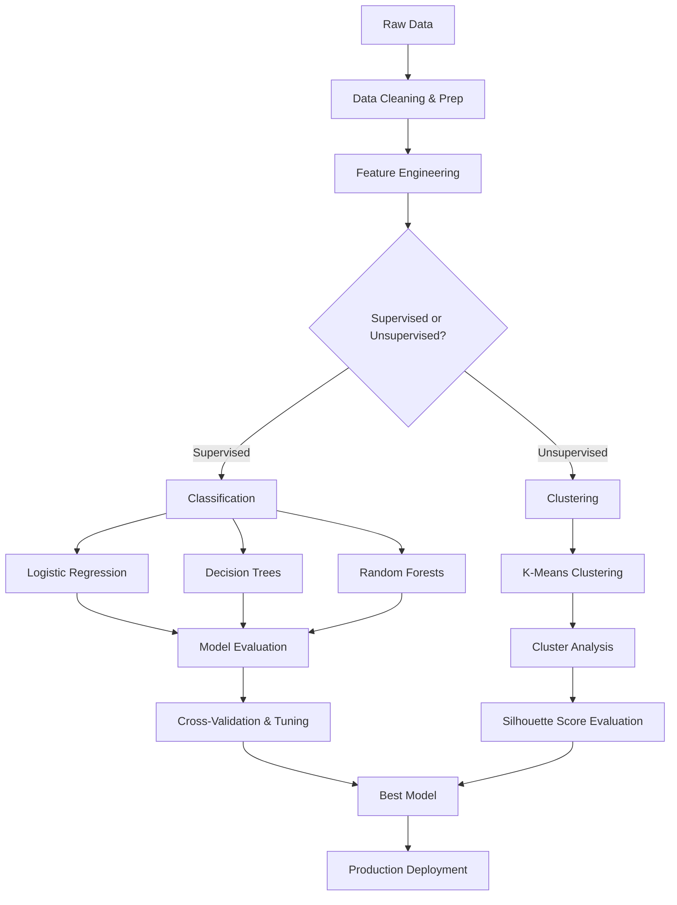

# Chapter 8: ML Classification and Clustering Overview

**A comprehensive guide to Spark's Machine Learning capabilities, focusing on the Spark ML library, classification algorithms like Logistic Regression and Random Forests, unsupervised clustering with K-Means, and model tuning via Cross-Validation.**

## Why It Matters

In the era of big data, machine learning is the engine that drives insights, predictions, and automated decision-making. Apache Spark provides a scalable, distributed framework for machine learning that allows data engineers and data scientists to process massive datasets that would otherwise overwhelm a single machine. The MLlib (and particularly the modern `spark.ml` DataFrame-based API) represents a paradigm shift in how we build, tune, and deploy machine learning models at scale. By understanding classification (predicting categories) and clustering (discovering hidden groupings), you unlock the ability to build sophisticated data products—from fraud detection systems to customer segmentation engines. Mastering these tools within the Spark ecosystem is critical because it seamlessly integrates data preparation, feature engineering, model training, and evaluation into unified, scalable pipelines.

## How It Works

The Spark ML ecosystem operates on the principle of distributed computation. When you run a machine learning algorithm in Spark, the framework automatically distributes the data and the computation across a cluster of machines. This is a fundamentally different approach compared to single-node libraries like scikit-learn. The core abstraction in the modern Spark ML library is the Pipeline, which consists of a sequence of Transformers (which transform data, typically adding new columns like feature vectors or predictions) and Estimators (which algorithmically learn from data to produce a Transformer, i.e., a trained model).

Classification in Spark involves supervised learning, where the algorithm is provided with a dataset containing both the features (the input variables) and the labels (the correct answers). The goal is to learn a mapping from features to labels so that the model can accurately predict the labels of new, unseen data. We cover several key classification algorithms in this chapter. Logistic Regression is a foundational algorithm that uses a sigmoid function to model probabilities, making it highly interpretable and effective for binary and multiclass problems. Decision Trees offer a different approach by recursively partitioning the data based on feature thresholds, creating a tree-like structure of rules that is easy to understand. Random Forests build upon decision trees by using ensemble learning—specifically bagging—to combine multiple trees, reducing overfitting and improving overall predictive performance.

Clustering, on the other hand, is an unsupervised learning technique where the algorithm is given data without any labels. The objective is to discover inherent structures or groupings within the data. K-Means is the most widely used clustering algorithm in Spark. It works by iteratively assigning data points to the nearest cluster centroid and then updating the centroids based on the assignments. This process continues until the centroids converge or a maximum number of iterations is reached.

Finally, building a machine learning model is only part of the challenge. You must also rigorously evaluate its performance and tune its hyperparameters. Spark ML provides robust tools for Cross-Validation and Hyperparameter Tuning. By using techniques like k-fold cross-validation, you ensure that your model's performance estimates are reliable and not simply a result of overfitting to a specific train-test split. The `CrossValidator` and `ParamGridBuilder` components automate the process of searching through combinations of parameters to find the optimal model configuration, ensuring your deployed pipelines are as accurate and robust as possible.

## Flow Diagram



## Data Visualization

| Algorithm | Learning Type | Task | Output Type | Example Use Case |
| :--- | :--- | :--- | :--- | :--- |
| **Logistic Regression** | Supervised | Classification | Probability / Class Label | Predicting if an email is spam (Binary) |
| **Decision Trees** | Supervised | Classification/Regression | Class Label / Continuous | Classifying loan default risk |
| **Random Forests** | Supervised | Classification/Regression | Class Label / Continuous | Predicting customer churn with high accuracy |
| **K-Means** | Unsupervised | Clustering | Cluster ID | Segmenting users based on purchasing behavior |
| **Cross-Validation** | Meta-Algorithm | Model Tuning | Best Model | Finding the optimal `maxDepth` for a Random Forest |

## Code Example

```python
# Overview example showing how to structure a basic ML workflow in PySpark
from pyspark.sql import SparkSession
from pyspark.ml.feature import VectorAssembler, StandardScaler
from pyspark.ml.classification import RandomForestClassifier
from pyspark.ml import Pipeline

# Initialize Spark Session
spark = SparkSession.builder \
    .appName("Chapter8_Overview") \
    .getOrCreate()

# 1. Load Data
data = spark.read.csv("data/user_activity.csv", header=True, inferSchema=True)

# 2. Prepare Features
assembler = VectorAssembler(
    inputCols=["age", "time_on_site", "pages_visited"],
    outputCol="rawFeatures"
)
scaler = StandardScaler(
    inputCol="rawFeatures",
    outputCol="features",
    withStd=True,
    withMean=False
)

# 3. Choose Algorithm
rf = RandomForestClassifier(
    labelCol="is_subscriber",
    featuresCol="features",
    numTrees=50
)

# 4. Create Pipeline
pipeline = Pipeline(stages=[assembler, scaler, rf])

# 5. Train Model
# In a real scenario, we would split data and use Cross-Validation
# model = pipeline.fit(train_data)
# predictions = model.transform(test_data)

print("Overview Pipeline structured successfully.")
```

## Common Pitfalls

*   **Skipping Exploratory Data Analysis (EDA):** Jumping straight into algorithms without understanding the data distributions, missing values, or correlations.
*   **Data Leakage:** Accidentally including information in the training data that will not be available at prediction time, leading to artificially high model performance.
*   **Ignoring Feature Scaling:** Using distance-based algorithms (like K-Means or Logistic Regression with regularization) without standardizing or normalizing features.
*   **Overfitting:** Training a highly complex model (like a deep decision tree) that memorizes the training data but performs poorly on unseen data.
*   **Improper Evaluation Metrics:** Using accuracy for highly imbalanced classification datasets instead of metrics like Area Under the ROC Curve (AUC) or F1-Score.

## Key Takeaway

Spark's machine learning capabilities provide a unified, scalable pipeline approach to transforming raw data into predictive insights through robust classification, clustering, and evaluation techniques.

<br><br><br><br><br><br><br><br><br><br><br><br><br><br><br><br><br><br><br><br><br><br><br><br><br><br><br><br><br><br><br><br><br><br><br><br><br><br><br><br><br><br><br><br><br><br><br><br><br><br><br><br><br><br><br><br><br><br><br><br><br><br><br><br><br><br><br><br><br><br><br><br><br><br><br><br><br><br><br><br>
