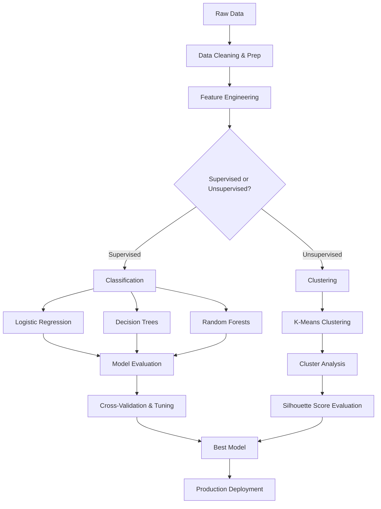

# Chapter 8: ML Classification and Clustering Overview

**A comprehensive guide to Spark's Machine Learning capabilities, focusing on the Spark ML library, classification algorithms like Logistic Regression and Random Forests, unsupervised clustering with K-Means, and model tuning via Cross-Validation.**

## Why It Matters

In the era of big data, machine learning is the engine that drives insights, predictions, and automated decision-making. Apache Spark provides a scalable, distributed framework for machine learning that allows data engineers and data scientists to process massive datasets that would otherwise overwhelm a single machine. The MLlib (and particularly the modern `spark.ml` DataFrame-based API) represents a paradigm shift in how we build, tune, and deploy machine learning models at scale. By understanding classification (predicting categories) and clustering (discovering hidden groupings), you unlock the ability to build sophisticated data products—from fraud detection systems to customer segmentation engines. Mastering these tools within the Spark ecosystem is critical because it seamlessly integrates data preparation, feature engineering, model training, and evaluation into unified, scalable pipelines.

## How It Works

The Spark ML ecosystem operates on the principle of distributed computation. When you run a machine learning algorithm in Spark, the framework automatically distributes the data and the computation across a cluster of machines. This is a fundamentally different approach compared to single-node libraries like scikit-learn. The core abstraction in the modern Spark ML library is the Pipeline, which consists of a sequence of Transformers (which transform data, typically adding new columns like feature vectors or predictions) and Estimators (which algorithmically learn from data to produce a Transformer, i.e., a trained model).

Classification in Spark involves supervised learning, where the algorithm is provided with a dataset containing both the features (the input variables) and the labels (the correct answers). The goal is to learn a mapping from features to labels so that the model can accurately predict the labels of new, unseen data. We cover several key classification algorithms in this chapter. Logistic Regression is a foundational algorithm that uses a sigmoid function to model probabilities, making it highly interpretable and effective for binary and multiclass problems. Decision Trees offer a different approach by recursively partitioning the data based on feature thresholds, creating a tree-like structure of rules that is easy to understand. Random Forests build upon decision trees by using ensemble learning—specifically bagging—to combine multiple trees, reducing overfitting and improving overall predictive performance.

Clustering, on the other hand, is an unsupervised learning technique where the algorithm is given data without any labels. The objective is to discover inherent structures or groupings within the data. K-Means is the most widely used clustering algorithm in Spark. It works by iteratively assigning data points to the nearest cluster centroid and then updating the centroids based on the assignments. This process continues until the centroids converge or a maximum number of iterations is reached.

Finally, building a machine learning model is only part of the challenge. You must also rigorously evaluate its performance and tune its hyperparameters. Spark ML provides robust tools for Cross-Validation and Hyperparameter Tuning. By using techniques like k-fold cross-validation, you ensure that your model's performance estimates are reliable and not simply a result of overfitting to a specific train-test split. The `CrossValidator` and `ParamGridBuilder` components automate the process of searching through combinations of parameters to find the optimal model configuration, ensuring your deployed pipelines are as accurate and robust as possible.

## Flow Diagram



## Data Visualization

| Algorithm | Learning Type | Task | Output Type | Example Use Case |
| :--- | :--- | :--- | :--- | :--- |
| **Logistic Regression** | Supervised | Classification | Probability / Class Label | Predicting if an email is spam (Binary) |
| **Decision Trees** | Supervised | Classification/Regression | Class Label / Continuous | Classifying loan default risk |
| **Random Forests** | Supervised | Classification/Regression | Class Label / Continuous | Predicting customer churn with high accuracy |
| **K-Means** | Unsupervised | Clustering | Cluster ID | Segmenting users based on purchasing behavior |
| **Cross-Validation** | Meta-Algorithm | Model Tuning | Best Model | Finding the optimal `maxDepth` for a Random Forest |

## Code Example

```python
# Overview example showing how to structure a basic ML workflow in PySpark
from pyspark.sql import SparkSession
from pyspark.ml.feature import VectorAssembler, StandardScaler
from pyspark.ml.classification import RandomForestClassifier
from pyspark.ml import Pipeline

# Initialize Spark Session
spark = SparkSession.builder \
    .appName("Chapter8_Overview") \
    .getOrCreate()

# 1. Load Data
data = spark.read.csv("data/user_activity.csv", header=True, inferSchema=True)

# 2. Prepare Features
assembler = VectorAssembler(
    inputCols=["age", "time_on_site", "pages_visited"],
    outputCol="rawFeatures"
)
scaler = StandardScaler(
    inputCol="rawFeatures",
    outputCol="features",
    withStd=True,
    withMean=False
)

# 3. Choose Algorithm
rf = RandomForestClassifier(
    labelCol="is_subscriber",
    featuresCol="features",
    numTrees=50
)

# 4. Create Pipeline
pipeline = Pipeline(stages=[assembler, scaler, rf])

# 5. Train Model
# In a real scenario, we would split data and use Cross-Validation
# model = pipeline.fit(train_data)
# predictions = model.transform(test_data)

print("Overview Pipeline structured successfully.")
```

## Common Pitfalls

*   **Skipping Exploratory Data Analysis (EDA):** Jumping straight into algorithms without understanding the data distributions, missing values, or correlations.
*   **Data Leakage:** Accidentally including information in the training data that will not be available at prediction time, leading to artificially high model performance.
*   **Ignoring Feature Scaling:** Using distance-based algorithms (like K-Means or Logistic Regression with regularization) without standardizing or normalizing features.
*   **Overfitting:** Training a highly complex model (like a deep decision tree) that memorizes the training data but performs poorly on unseen data.
*   **Improper Evaluation Metrics:** Using accuracy for highly imbalanced classification datasets instead of metrics like Area Under the ROC Curve (AUC) or F1-Score.

## Key Takeaway

Spark's machine learning capabilities provide a unified, scalable pipeline approach to transforming raw data into predictive insights through robust classification, clustering, and evaluation techniques.

<br><br><br><br><br><br><br><br><br><br><br><br><br><br><br><br><br><br><br><br><br><br><br><br><br><br><br><br><br><br><br><br><br><br><br><br><br><br><br><br><br><br><br><br><br><br><br><br><br><br><br><br><br><br><br><br><br><br><br><br><br><br><br><br><br><br><br><br><br><br><br><br><br><br><br><br><br><br><br><br>


---

## 🎓 Deep Learning Questions

### Q1: Why Was This Concept Introduced?
Before Spark MLlib and specifically the DataFrame-based `spark.ml` API, distributed machine learning was fragmented and difficult to scale. Early Hadoop ecosystems relied on Apache Mahout running atop MapReduce, which was notoriously slow because it wrote intermediate states to disk after every iteration. Machine learning algorithms (like Logistic Regression and K-Means) are highly iterative by nature. Spark introduced MLlib (and later the ML Pipelines API) to solve this by keeping intermediate data in memory (RAM) across iterations, drastically speeding up training times. Furthermore, the pipeline concept was introduced to overcome the complexity of moving data through multiple stages—cleaning, feature extraction, scaling, and model training—by abstracting this into unified `Transformer` and `Estimator` components, standardizing the entire end-to-end ML workflow.

### Q2: What Exactly Is This Concept and How Does It Work?
The Spark ML Classification and Clustering framework provides distributed algorithms to predict categories (classification) and group data (clustering). It works via a unified abstraction called an **ML Pipeline**.
- **Transformers** convert one DataFrame into another, typically by appending a new column (e.g., a `VectorAssembler` combining raw features into a single vector, or a trained model outputting predictions).
- **Estimators** are algorithms (like `RandomForestClassifier` or `KMeans`) that learn from a DataFrame and produce a `Model` (which is itself a Transformer).
- **Evaluators** measure how well the model performed (e.g., using `BinaryClassificationEvaluator` for AUC).
During execution, Spark translates the high-level ML operations into an optimized physical plan of RDD transformations. Because it leverages Catalyst Optimizer and Project Tungsten under the hood, operations on DataFrames in Spark ML are highly efficient, performing distributed matrix operations across the cluster nodes.

### Q3: Where Should This Concept Be Used?
Spark ML Classification and Clustering should be used for structured or semi-structured datasets that are too large to fit into the memory of a single machine (typically hundreds of gigabytes to terabytes).
- **Classification (Predicting outcomes):** Used in **Banking** for fraud detection (predicting if a transaction is fraudulent based on historical patterns), in **Telecommunications** for customer churn prediction (identifying users likely to cancel their subscriptions), and in **Healthcare** for predicting patient readmission risks.
- **Clustering (Finding patterns):** Used in **Retail and E-commerce** (like Amazon) for customer segmentation (grouping users with similar buying behaviors for targeted marketing), in **Cybersecurity** for anomaly detection (grouping normal network traffic and isolating outliers), and in **Media** for topic modeling of articles.

### Q4: Where Should This Concept NOT Be Used?
Spark ML should NOT be used for:
1. **Small Datasets:** If your data fits comfortably in a single machine's RAM (e.g., < 10 GB), using scikit-learn or XGBoost in pandas will be significantly faster and easier to debug because you avoid Spark's distributed networking overhead.
2. **Deep Learning on Unstructured Data:** While Spark is great for tree-based models and linear regression, it is not optimized for training deep neural networks on images, audio, or complex text out-of-the-box. Frameworks like TensorFlow, PyTorch, or specialized distributed DL tools (like Ray) are much better suited.
3. **Real-time / Latency-critical Inference:** Spark's batch-oriented design means there is overhead when making single-record predictions (e.g., in millisecond-latency web apps). For real-time scoring, models trained in Spark should be exported (using tools like MLeap or ONNX) to a lightweight serving layer.

### Q5: How Is This Concept Different from Hadoop?

| Aspect | Hadoop MapReduce (Mahout) | Apache Spark ML |
| :--- | :--- | :--- |
| **Architecture** | Disk-based execution; reads/writes HDFS per job. | In-memory execution; caches data across iterations. |
| **Performance** | Very slow for iterative ML algorithms. | Up to 100x faster for iterative ML algorithms. |
| **Processing Model** | Strict Map and Reduce phases. | DAG (Directed Acyclic Graph) of diverse transformations. |
| **Memory Usage** | Minimal RAM required, high disk I/O. | Heavy RAM utilization; spills to disk only if memory is full. |
| **Fault Tolerance** | Replicates data to disk after every stage. | Recomputes lost partitions using RDD lineage. |
| **Scalability** | Excellent, but bottlenecked by disk speed. | Excellent, highly optimized for distributed memory. |
| **Ease of Development**| Verbose, low-level Java API. | High-level DataFrame Pipeline APIs in Python, Scala, SQL. |
| **Typical Use Cases** | Batch ETL, legacy historical processing. | Interactive ML, fast iterative training, scalable pipelines. |
| **Advantages** | Extremely fault-tolerant on cheap hardware. | Blazing fast, rich ecosystem, unified pipeline creation. |
| **Disadvantages** | Unfit for modern machine learning workflows. | Memory tuning (OOM errors) can be challenging. |

### Q6: How Can This Concept Be Related to a Traditional RDBMS?

| RDBMS Concept | Spark ML Equivalent | Explanation |
| :--- | :--- | :--- |
| **Table** | **DataFrame** | Both hold structured data in rows and columns. Spark ML expects input features packed into a single column. |
| **Stored Procedure** | **Pipeline** | A sequence of automated steps. A Pipeline strings together data transformations and model training. |
| **Mathematical Functions** | **Transformers** | E.g., `StandardScaler` in Spark acts like applying `(col - mean) / stddev` in SQL to normalize data. |
| **Model Table** | **Trained Model (Transformer)** | In SQL, you might store logic to assign segments. In Spark, the Estimator trains and outputs a Model for this. |
| **GROUP BY (Heuristic)** | **K-Means Clustering** | Instead of manually grouping by hardcoded rules, K-Means statistically groups rows by multidimensional similarity. |

### Q7: What Happens Behind the Scenes?
When you call `pipeline.fit(trainingData)` in Spark:
1. **Driver Setup:** The Driver parses your pipeline stages (Transformers and Estimators).
2. **Feature Transformation:** Transformers (like `VectorAssembler`) add new columns to the distributed DataFrame across partitions.
3. **DAG Generation:** For Estimators (like `RandomForestClassifier`), Spark builds a logical plan, optimizes it via Catalyst, and creates a Directed Acyclic Graph (DAG) of stages.
4. **Iterative Execution:** 
   - ML algorithms iterate over the data multiple times.
   - The data (often cached automatically or manually) stays in Executor RAM.
   - The Driver coordinates partial model updates (e.g., gathering tree statistics or cluster centroids) and broadcasts them back to Executors for the next pass.
5. **Model Generation:** Once convergence or max iterations are reached, the Driver finalizes the mathematical model and returns a trained `PipelineModel`.

```text
[ Driver Node ] ---> 1. Pipeline defined (Transformers + Estimator)
      |
      v
[ DAG Scheduler ] -> 2. Optimizes physical execution plan
      |
      v
[ Task Scheduler ]-> 3. Sends tasks to Executors
      |
      +-----------------------------+-----------------------------+
      v                             v                             v
[ Executor 1 (RAM) ]          [ Executor 2 (RAM) ]          [ Executor 3 (RAM) ]
Partition 1 (Data)            Partition 2 (Data)            Partition 3 (Data)
 -> VectorAssembler            -> VectorAssembler            -> VectorAssembler
 -> Train Trees (Partial)      -> Train Trees (Partial)      -> Train Trees (Partial)
      |                             |                             |
      +------------(Shuffle/Reduce to Driver)---------------------+
                                    |
[ Driver Node ] <--- 4. Aggregates tree stats / updates model
                                    |
[ Trained Model ]<-- 5. Final PipelineModel returned
```

### Q8: Performance Considerations, Best Practices, and Common Mistakes

| Category | Recommendation | Why It Matters |
| :--- | :--- | :--- |
| **Caching** | `cache()` or `persist()` the DataFrame before fitting. | ML algorithms scan data iteratively. Caching prevents recomputing the whole feature engineering DAG on every iteration. |
| **Data Format** | Pack features into a single `Vector` column using `VectorAssembler`. | Spark\'s internal linear algebra libraries (Breeze/BLAS) require vector formats to optimize mathematical operations. |
| **Data Skew** | Ensure balanced labels for classification. | If 99% of data is "No Churn", the model will naively predict "No Churn" always. Use class weights or undersampling. |
| **Categorical Data** | Always use `StringIndexer` and `OneHotEncoder`. | ML models require numerical input. `StringIndexer` converts strings to numbers, and `OHE` prevents false ordinal relationships. |
| **Tuning Overhead** | Be careful with large `ParamGridBuilder` grids in `CrossValidator`. | A grid of 3 params (3x3x3 = 27 models) with 5-fold CV means training 135 models! This can take hours/days on large datasets. |
| **Memory Errors** | Monitor Executor memory (OOM errors). | Deep decision trees or large vocabulary sizes in feature extraction can cause memory to blow up during the shuffle/reduce phases. |

### Q9: Interview Questions

**Beginner**
1. **What is the difference between a Transformer and an Estimator in Spark ML?**
   *Answer:* A Transformer converts one DataFrame into another (e.g., adding predictions), implementing a `.transform()` method. An Estimator learns from data to produce a model, implementing a `.fit()` method.
2. **Why does Spark ML require features to be in a single column?**
   *Answer:* Spark\'s underlying distributed matrix operations and BLAS optimizations require data to be represented as mathematical vectors to execute efficiently.
3. **What is K-Means used for?**
   *Answer:* It is an unsupervised clustering algorithm used to partition data into *k* distinct groups based on feature similarity, without predefined labels.

**Intermediate**
4. **How does `CrossValidator` work in Spark?**
   *Answer:* It splits the dataset into *k* folds, trains models on *k-1* folds, and evaluates on the remaining fold. It does this for every parameter combination in a grid, automatically picking the model with the best average metric.
5. **What happens if you don\'t scale features before using Logistic Regression?**
   *Answer:* Features with larger numeric ranges (like income) will disproportionately dominate the objective function compared to small-range features (like age), leading to poor performance and slow convergence.
6. **Why are Random Forests generally preferred over single Decision Trees?**
   *Answer:* Single decision trees are prone to overfitting (memorizing the training data). Random Forests use an ensemble of trees trained on random subsets of data and features, which reduces variance and improves generalization.

**Advanced**
7. **How does Spark handle categorical features differently in Tree algorithms vs. Linear algorithms?**
   *Answer:* Linear algorithms require `OneHotEncoder` to avoid assuming numerical order. Spark\'s Tree algorithms (if told via `VectorIndexer`) can handle categorical indices directly without One-Hot Encoding, splitting optimally based on category bins.
8. **Explain the memory implications of increasing `maxDepth` in Spark\'s Decision Trees.**
   *Answer:* Tree nodes grow exponentially with depth (2^d). The driver must gather and broadcast statistics for every node. A very high `maxDepth` will exhaust driver/executor memory and cause OutOfMemory errors.
9. **How would you handle a massive imbalanced dataset for binary classification in Spark?**
   *Answer:* I would either downsample the majority class using `.sampleBy()`, apply SMOTE (via third-party packages), or pass a `weightCol` to the classifier to penalize misclassifications of the minority class heavily.

**Scenario-Based**
10. **Your Spark ML Pipeline is taking 10 hours to train, mostly failing on `CrossValidator`. How do you optimize it?**
    *Answer:* First, `cache()` the assembled dataset before the CrossValidator. Second, reduce the search grid size. Third, consider using `TrainValidationSplit` (which only does a single random split) instead of full k-fold CV if the dataset is massive.
11. **You trained a model in Spark but need to serve it in a low-latency REST API. What is the best approach?**
    *Answer:* Serving a Spark model directly in an API requires a SparkContext, which adds seconds of latency. I would export the `PipelineModel` to MLeap or ONNX format, which allows microsecond-level scoring in a lightweight Java/Python service without Spark dependencies.

### Q10: Complete Real-World Example

**Business Problem:** A Telecom company (like AT&T or Vodafone) wants to predict customer churn (customers leaving for a competitor) so they can proactively offer retention discounts.
**Sample Dataset:** `telecom_churn.csv` containing columns: `customer_id`, `tenure_months`, `monthly_charges`, `contract_type` (String), and `churn` (1=Yes, 0=No).

```python
from pyspark.sql import SparkSession
from pyspark.ml.feature import StringIndexer, OneHotEncoder, VectorAssembler
from pyspark.ml.classification import RandomForestClassifier
from pyspark.ml.evaluation import BinaryClassificationEvaluator
from pyspark.ml import Pipeline

# 1. Initialize Spark
spark = SparkSession.builder.appName("TelecomChurnPrediction").getOrCreate()

# 2. Load Data
# Assuming data has columns: customer_id, tenure, monthly_charges, contract, churn
data = spark.read.csv("hdfs:///data/telecom_churn.csv", header=True, inferSchema=True)

# 3. Handle Categorical Features (contract)
# Convert string categories to numerical indices
indexer = StringIndexer(inputCol="contract", outputCol="contract_idx")
# Convert indices to one-hot vectors
encoder = OneHotEncoder(inputCol="contract_idx", outputCol="contract_vec")

# 4. Assemble all features into a single Vector column
assembler = VectorAssembler(
    inputCols=["tenure", "monthly_charges", "contract_vec"],
    outputCol="features"
)

# 5. Define the Model (Estimator)
rf = RandomForestClassifier(
    featuresCol="features", 
    labelCol="churn", 
    numTrees=100, 
    maxDepth=5
)

# 6. Build the Pipeline
pipeline = Pipeline(stages=[indexer, encoder, assembler, rf])

# 7. Split Data
train_data, test_data = data.randomSplit([0.8, 0.2], seed=42)

# OPTIMIZATION: Cache the training data to speed up iterative training
train_data.cache()

# 8. Train the Model
model = pipeline.fit(train_data)

# 9. Make Predictions
predictions = model.transform(test_data)

# 10. Evaluate the Model
evaluator = BinaryClassificationEvaluator(
    labelCol="churn", 
    rawPredictionCol="rawPrediction", 
    metricName="areaUnderROC"
)
auc = evaluator.evaluate(predictions)
print(f"Random Forest Model AUC: {auc:.4f}")

# Unpersist to free memory
train_data.unpersist()
```

**Step-by-Step Execution Walkthrough:**
1. **Categorical Encoding:** `StringIndexer` converts strings like "Month-to-month" into numeric categories. `OneHotEncoder` transforms these into binary flags, preventing the model from assuming false ordinal ranking.
2. **Feature Assembly:** `VectorAssembler` squashes `tenure`, `monthly_charges`, and the one-hot vectors into a single mathematical vector column (`features`).
3. **Pipeline Construction:** Spark groups these operations logically. When `pipeline.fit()` is called, it executes the stages in order.
4. **Training:** The Driver initiates training on Executor nodes. The Random Forest algorithm builds 100 decision trees in parallel across random subsets of data and features.
5. **Evaluation:** The `BinaryClassificationEvaluator` calculates the AUC (Area Under the ROC Curve) to measure how well the model distinguishes between churners and non-churners.

**Performance Notes:** Caching `train_data` before calling `.fit()` saves enormous amounts of time, as Spark doesn\'t have to reread the raw CSV from HDFS for every iteration of the Random Forest building process.

### 💡 Key Takeaways
- **Pipeline Abstraction:** Spark ML standardizes workflows into `Transformers` (data in, data out) and `Estimators` (learns a model).
- **Vectorized Inputs:** All machine learning algorithms in Spark require features to be combined into a single `Vector` column.
- **In-Memory Speed:** Spark ML drastically outperforms MapReduce-based tools by leveraging RAM for the iterative computations intrinsic to machine learning.
- **Scalability:** Spark shines on large datasets distributed across a cluster, seamlessly scaling linear algebra operations.
- **Hyperparameter Tuning:** `CrossValidator` paired with a `ParamGridBuilder` is essential for finding optimal model parameters without manual intervention.

### ⚠️ Common Misconceptions
- **Spark is the best choice for all ML tasks:** *Wrong.* If your dataset is small, scikit-learn or XGBoost will be faster and easier. Spark is for big data.
- **Deep Learning is built-in:** *Wrong.* While there is a `MultilayerPerceptronClassifier`, Spark is not optimized for Deep Learning (like CNNs or RNNs). You need external integrations like Elephas or Horovod for that.
- **Transformers modify the DataFrame in place:** *Wrong.* DataFrames are immutable. Transformers append new columns to a new DataFrame.
- **Pipelines only train models:** *Wrong.* Pipelines are also used in production to apply identical feature transformations to incoming inference data.

### 🔗 Related Spark Concepts
- **DataFrames & Spark SQL:** The foundation upon which Spark ML operates.
- **Catalyst Optimizer:** Optimizes the DAG of data transformations prior to model training.
- **Spark Streaming:** Can be combined with ML Pipelines to run trained models on live data streams.

### 📚 References for Further Reading
- Apache Spark Official MLlib Documentation
- Learning Spark (O\'Reilly)
- Spark: The Definitive Guide (O\'Reilly)
