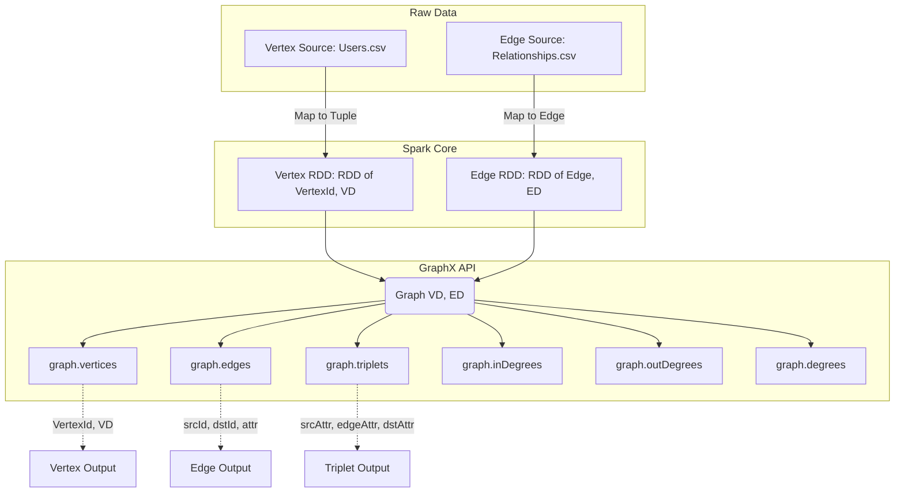

# The GraphX API

**The fundamental building blocks for constructing, manipulating, and querying property graphs in a distributed environment using Apache Spark.**

## Why It Matters

Before you can run complex graph algorithms like PageRank or Shortest Paths, you must first know how to construct and inspect your graph. The GraphX API is the gateway to graph processing in Spark. Real-world data is messy—it lives in CSV files, JSON payloads, or relational tables. The GraphX API provides the essential tools to lift this flat data into a highly structured `Graph` object. Once data is represented as a property graph, you have access to powerful abstractions like `EdgeTriplet`, which allow you to view a relationship and the properties of both connected entities simultaneously. Mastering the GraphX API is crucial because all advanced operations, custom algorithms, and graph transformations rely heavily on this foundational layer.

## How It Works

At its core, GraphX introduces a new data structure: the `Graph[VD, ED]`. This is a directed multigraph (a graph where multiple edges can exist between the same pair of vertices) with properties attached to every vertex and edge. 
*   **VD (Vertex Data)** represents the property type of the vertices.
*   **ED (Edge Data)** represents the property type of the edges.

The graph is composed of two primary underlying structures:
1.  **VertexRDD**: An `RDD[(VertexId, VD)]`. The `VertexId` is an explicitly defined type alias for `Long` in GraphX. This is mandatory. If you have string identifiers, you must hash them or map them to `Long` values.
2.  **EdgeRDD**: An `RDD[Edge[ED]]`. The `Edge` class contains a `srcId` (VertexId), a `dstId` (VertexId), and an `attr` (the edge property of type ED).

To build a graph, you simply create these two RDDs and pass them to the `Graph` object constructor. GraphX then optimizes this structure internally. It maintains a routing table to keep track of where vertices and edges reside across the Spark cluster, minimizing network shuffles during joins.

One of the most important concepts in the GraphX API is the **EdgeTriplet**. An `EdgeTriplet[VD, ED]` extends the `Edge` class by explicitly including the properties of the source and destination vertices (`srcAttr` and `dstAttr`). When you query the `graph.triplets` property, GraphX performs a three-way join between the edges and the vertices (source and destination) to construct these triplets. This allows you to evaluate conditions that depend on both the edge and the vertices it connects, such as "Find all relationships where an older person manages a younger person."

GraphX also provides built-in attributes to compute simple graph metrics instantly:
*   `graph.numVertices` and `graph.numEdges` for sizing.
*   `graph.degrees`, `graph.inDegrees`, and `graph.outDegrees` for analyzing the connectivity and popularity of nodes in the network.

## Flow Diagram



## Data Visualization

Let's visualize the construction of an `EdgeTriplet` from separate Vertex and Edge RDDs.

**Vertices RDD Data:**

| VertexId (Long) | Attribute (VD: String) |
|---|---|
| 1L | "User A" |
| 2L | "User B" |
| 3L | "User C" |

**Edges RDD Data:**

| srcId (Long) | dstId (Long) | Attribute (ED: String) |
|---|---|---|
| 1L | 2L | "Follows" |
| 2L | 3L | "Blocks" |

**Resulting EdgeTriplets (graph.triplets):**

| srcId | srcAttr | edgeAttr | dstId | dstAttr |
|---|---|---|---|---|
| 1L | "User A" | "Follows" | 2L | "User B" |
| 2L | "User B" | "Blocks" | 3L | "User C" |

## Code Example

```scala
import org.apache.spark.sql.SparkSession
import org.apache.spark.graphx._
import org.apache.spark.rdd.RDD

object GraphXAPIExample {
  def main(args: Array[String]): Unit = {
    val spark = SparkSession.builder()
      .appName("GraphX_API_Demo")
      .master("local[*]")
      .getOrCreate()
    
    val sc = spark.sparkContext
    sc.setLogLevel("ERROR")

    // 1. Create the Vertices RDD
    // Note: VertexId MUST be a Long
    val users: RDD[(VertexId, (String, Int))] = sc.parallelize(Array(
      (1L, ("Alice", 28)),
      (2L, ("Bob", 27)),
      (3L, ("Charlie", 65)),
      (4L, ("David", 42)),
      (5L, ("Ed", 55)),
      (6L, ("Fran", 50))
    ))

    // 2. Create the Edges RDD
    // An Edge connects a source VertexId to a destination VertexId, and has an attribute
    val relationships: RDD[Edge[String]] = sc.parallelize(Array(
      Edge(2L, 1L, "likes"),
      Edge(2L, 4L, "follows"),
      Edge(3L, 2L, "follows"),
      Edge(3L, 6L, "advisor"),
      Edge(5L, 2L, "coworker"),
      Edge(5L, 3L, "boss"),
      Edge(5L, 6L, "follows")
    ))

    // 3. Instantiate the Graph object
    // The default vertex attribute is used if an edge references a missing vertex
    val defaultUser = ("Unknown", 0)
    val graph = Graph(users, relationships, defaultUser)

    // 4. Basic Properties
    println(s"Number of vertices: ${graph.numVertices}")
    println(s"Number of edges: ${graph.numEdges}")

    // 5. Using EdgeTriplets to query based on both vertices and the edge
    // Question: Who likes someone older than them?
    println("\nUsers who like someone older than them:")
    graph.triplets
      .filter(t => t.attr == "likes" && t.srcAttr._2 < t.dstAttr._2)
      .collect()
      .foreach(t => println(s"${t.srcAttr._1} (${t.srcAttr._2}) likes ${t.dstAttr._1} (${t.dstAttr._2})"))

    // 6. Analyzing Degrees
    // In-Degree: How many people follow/like this person? (Number of incoming edges)
    println("\nTop users by In-Degree:")
    graph.inDegrees
      .sortBy(_._2, ascending = false)
      .collect()
      .foreach(d => println(s"Vertex ${d._1} has ${d._2} incoming edges"))

    spark.stop()
  }
}
```

## Common Pitfalls

*   **Missing Vertices in Edge Definitions**: If an edge refers to a `srcId` or `dstId` that does not exist in the vertex RDD, GraphX will not crash. Instead, it will create a dummy vertex using the `defaultVertexAttr` provided during graph creation. This can silently skew your analytics if you aren't expecting it.
*   **Assuming Triplet Creation is Free**: Accessing `graph.triplets` forces a distributed join between the edges, the source vertices, and the destination vertices. On massive graphs, this is an expensive operation. Only use triplets when you absolutely need both vertex attributes; otherwise, stick to `graph.edges`.
*   **Non-Long Identifiers**: As mentioned, `VertexId` must be a Long. If your primary keys are strings, UUIDs, or composite keys, you must generate unique `Long` IDs (e.g., using Spark's `monotonically_increasing_id()` or MurmurHash) and maintain a mapping to the original IDs if you need them later.
*   **Caching Strategy**: A Graph object is composed of multiple RDDs. Calling `graph.cache()` persists both the vertices and the edges. In complex iterative algorithms, make sure you understand which parts of the graph are changing and require re-caching, and remember to `unpersist()` old graphs to avoid filling up cluster memory.

## Key Takeaway

**The GraphX API provides a unified, highly-typed interface that seamlessly blends graph properties (vertices and edges) with relational querying (EdgeTriplets), forming the foundation for all graph-parallel processing in Apache Spark.**
