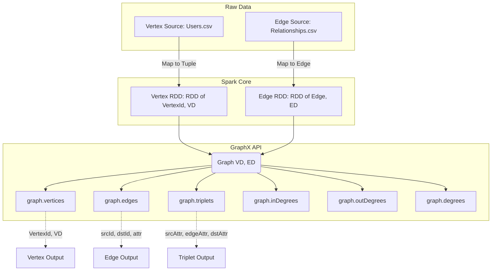

# The GraphX API

**The fundamental building blocks for constructing, manipulating, and querying property graphs in a distributed environment using Apache Spark.**

## Why It Matters

Before you can run complex graph algorithms like PageRank or Shortest Paths, you must first know how to construct and inspect your graph. The GraphX API is the gateway to graph processing in Spark. Real-world data is messy—it lives in CSV files, JSON payloads, or relational tables. The GraphX API provides the essential tools to lift this flat data into a highly structured `Graph` object. Once data is represented as a property graph, you have access to powerful abstractions like `EdgeTriplet`, which allow you to view a relationship and the properties of both connected entities simultaneously. Mastering the GraphX API is crucial because all advanced operations, custom algorithms, and graph transformations rely heavily on this foundational layer.

## How It Works

At its core, GraphX introduces a new data structure: the `Graph[VD, ED]`. This is a directed multigraph (a graph where multiple edges can exist between the same pair of vertices) with properties attached to every vertex and edge. 
*   **VD (Vertex Data)** represents the property type of the vertices.
*   **ED (Edge Data)** represents the property type of the edges.

The graph is composed of two primary underlying structures:
1.  **VertexRDD**: An `RDD[(VertexId, VD)]`. The `VertexId` is an explicitly defined type alias for `Long` in GraphX. This is mandatory. If you have string identifiers, you must hash them or map them to `Long` values.
2.  **EdgeRDD**: An `RDD[Edge[ED]]`. The `Edge` class contains a `srcId` (VertexId), a `dstId` (VertexId), and an `attr` (the edge property of type ED).

To build a graph, you simply create these two RDDs and pass them to the `Graph` object constructor. GraphX then optimizes this structure internally. It maintains a routing table to keep track of where vertices and edges reside across the Spark cluster, minimizing network shuffles during joins.

One of the most important concepts in the GraphX API is the **EdgeTriplet**. An `EdgeTriplet[VD, ED]` extends the `Edge` class by explicitly including the properties of the source and destination vertices (`srcAttr` and `dstAttr`). When you query the `graph.triplets` property, GraphX performs a three-way join between the edges and the vertices (source and destination) to construct these triplets. This allows you to evaluate conditions that depend on both the edge and the vertices it connects, such as "Find all relationships where an older person manages a younger person."

GraphX also provides built-in attributes to compute simple graph metrics instantly:
*   `graph.numVertices` and `graph.numEdges` for sizing.
*   `graph.degrees`, `graph.inDegrees`, and `graph.outDegrees` for analyzing the connectivity and popularity of nodes in the network.

## Flow Diagram



## Data Visualization

Let's visualize the construction of an `EdgeTriplet` from separate Vertex and Edge RDDs.

**Vertices RDD Data:**

| VertexId (Long) | Attribute (VD: String) |
|---|---|
| 1L | "User A" |
| 2L | "User B" |
| 3L | "User C" |

**Edges RDD Data:**

| srcId (Long) | dstId (Long) | Attribute (ED: String) |
|---|---|---|
| 1L | 2L | "Follows" |
| 2L | 3L | "Blocks" |

**Resulting EdgeTriplets (graph.triplets):**

| srcId | srcAttr | edgeAttr | dstId | dstAttr |
|---|---|---|---|---|
| 1L | "User A" | "Follows" | 2L | "User B" |
| 2L | "User B" | "Blocks" | 3L | "User C" |

## Code Example

```scala
import org.apache.spark.sql.SparkSession
import org.apache.spark.graphx._
import org.apache.spark.rdd.RDD

object GraphXAPIExample {
  def main(args: Array[String]): Unit = {
    val spark = SparkSession.builder()
      .appName("GraphX_API_Demo")
      .master("local[*]")
      .getOrCreate()
    
    val sc = spark.sparkContext
    sc.setLogLevel("ERROR")

    // 1. Create the Vertices RDD
    // Note: VertexId MUST be a Long
    val users: RDD[(VertexId, (String, Int))] = sc.parallelize(Array(
      (1L, ("Alice", 28)),
      (2L, ("Bob", 27)),
      (3L, ("Charlie", 65)),
      (4L, ("David", 42)),
      (5L, ("Ed", 55)),
      (6L, ("Fran", 50))
    ))

    // 2. Create the Edges RDD
    // An Edge connects a source VertexId to a destination VertexId, and has an attribute
    val relationships: RDD[Edge[String]] = sc.parallelize(Array(
      Edge(2L, 1L, "likes"),
      Edge(2L, 4L, "follows"),
      Edge(3L, 2L, "follows"),
      Edge(3L, 6L, "advisor"),
      Edge(5L, 2L, "coworker"),
      Edge(5L, 3L, "boss"),
      Edge(5L, 6L, "follows")
    ))

    // 3. Instantiate the Graph object
    // The default vertex attribute is used if an edge references a missing vertex
    val defaultUser = ("Unknown", 0)
    val graph = Graph(users, relationships, defaultUser)

    // 4. Basic Properties
    println(s"Number of vertices: ${graph.numVertices}")
    println(s"Number of edges: ${graph.numEdges}")

    // 5. Using EdgeTriplets to query based on both vertices and the edge
    // Question: Who likes someone older than them?
    println("\nUsers who like someone older than them:")
    graph.triplets
      .filter(t => t.attr == "likes" && t.srcAttr._2 < t.dstAttr._2)
      .collect()
      .foreach(t => println(s"${t.srcAttr._1} (${t.srcAttr._2}) likes ${t.dstAttr._1} (${t.dstAttr._2})"))

    // 6. Analyzing Degrees
    // In-Degree: How many people follow/like this person? (Number of incoming edges)
    println("\nTop users by In-Degree:")
    graph.inDegrees
      .sortBy(_._2, ascending = false)
      .collect()
      .foreach(d => println(s"Vertex ${d._1} has ${d._2} incoming edges"))

    spark.stop()
  }
}
```

## Common Pitfalls

*   **Missing Vertices in Edge Definitions**: If an edge refers to a `srcId` or `dstId` that does not exist in the vertex RDD, GraphX will not crash. Instead, it will create a dummy vertex using the `defaultVertexAttr` provided during graph creation. This can silently skew your analytics if you aren't expecting it.
*   **Assuming Triplet Creation is Free**: Accessing `graph.triplets` forces a distributed join between the edges, the source vertices, and the destination vertices. On massive graphs, this is an expensive operation. Only use triplets when you absolutely need both vertex attributes; otherwise, stick to `graph.edges`.
*   **Non-Long Identifiers**: As mentioned, `VertexId` must be a Long. If your primary keys are strings, UUIDs, or composite keys, you must generate unique `Long` IDs (e.g., using Spark's `monotonically_increasing_id()` or MurmurHash) and maintain a mapping to the original IDs if you need them later.
*   **Caching Strategy**: A Graph object is composed of multiple RDDs. Calling `graph.cache()` persists both the vertices and the edges. In complex iterative algorithms, make sure you understand which parts of the graph are changing and require re-caching, and remember to `unpersist()` old graphs to avoid filling up cluster memory.

## Key Takeaway

**The GraphX API provides a unified, highly-typed interface that seamlessly blends graph properties (vertices and edges) with relational querying (EdgeTriplets), forming the foundation for all graph-parallel processing in Apache Spark.**


---

## 🎓 Deep Learning Questions

### Q1: Why Was This Concept Introduced?
Before GraphX, processing graph data in MapReduce or standard Spark RDDs was incredibly tedious and inefficient. Developers had to manually write iterative algorithms using flat records, tracking node connections and properties across multiple RDDs, which required expensive self-joins and huge data shuffling at every iteration. Standard big data tools struggled with the highly iterative, interconnected nature of graph processing. GraphX was introduced to combine the advantages of data-parallel processing (like standard RDDs) and graph-parallel processing (like Pregel). It bridges the gap between tabular and graph representations, offering an optimized, unified API that automatically handles routing, partitioning, and distributed execution, allowing developers to express complex graph queries without worrying about the underlying networking limitations.

### Q2: What Exactly Is This Concept and How Does It Work?
GraphX is Apache Spark’s API for graphs and graph-parallel computation. It abstracts data as a property graph—a directed multigraph where both vertices (nodes) and edges (connections) can have user-defined properties (VD and ED). 
Under the hood, GraphX does not use a specialized graph database. Instead, it seamlessly translates the property graph into two standard Spark RDDs: a `VertexRDD` and an `EdgeRDD`. To optimize distributed computation, GraphX employs a technique called vertex-cut partitioning, where edges are partitioned across the cluster while vertices are duplicated across the machines where their edges reside. 
When an operation needs to access both edge and vertex properties, GraphX dynamically generates an `EdgeTriplet` view. The API also introduces the Pregel operator, which provides an iterative messaging framework. All of these components work together in memory, making GraphX highly efficient for computing iterative graph algorithms like PageRank, connected components, and shortest paths.

### Q3: Where Should This Concept Be Used?
GraphX excels in scenarios where relationships and network topology are as important as the data itself.
- **Social Network Analysis:** Finding influencers (PageRank), identifying tightly knit communities (Connected Components), or calculating degrees of separation (Shortest Paths) in platforms like Facebook or LinkedIn.
- **Fraud Detection:** Banks and financial institutions use GraphX to identify synthetic identity fraud or money laundering rings by detecting unusually dense clusters of transactions among seemingly unrelated accounts.
- **Recommendation Systems:** E-commerce platforms analyze bipartite graphs connecting users to products they have purchased or viewed, discovering patterns to suggest "users who bought this also bought..."
- **IT Network & Infrastructure Routing:** Analyzing network topologies to identify single points of failure, optimize routing paths, and visualize dependency graphs for microservices or telecommunication networks.

### Q4: Where Should This Concept NOT Be Used?
- **Transactional (OLTP) Graph Operations:** GraphX is an analytical (OLAP) engine. It should not be used if you need single-node lookups, real-time node insertions, or edge updates with millisecond latency (use Neo4j or Amazon Neptune instead).
- **Simple Tabular Processing:** If your problem does not involve analyzing relationships, hops, or topologies, and can be solved with a simple SQL `JOIN` or `GROUP BY`, using GraphX adds unnecessary overhead.
- **Single-Machine Scale Data:** If the entire graph fits into the memory of a single machine (e.g., less than a few million edges), single-node libraries like NetworkX (Python) or JGraphT (Java) will be drastically faster as they avoid distributed networking and serialization overhead.
- **Highly Dynamic Graphs:** GraphX relies on immutable RDDs. If the graph structure changes constantly (streaming edges), Spark Streaming + GraphX is historically clunky, and regenerating the entire graph representation for every micro-batch is inefficient.

### Q5: How Is This Concept Different from Hadoop?

| Aspect | Hadoop MapReduce | Apache Spark GraphX |
|---|---|---|
| **Architecture** | Disk-based flat processing | In-memory distributed property graphs |
| **Performance** | Extremely slow for iterative graph algorithms | Up to 100x faster due to in-memory computing |
| **Processing Model** | Data-parallel (Map and Reduce phases) | Both Data-parallel (RDDs) and Graph-parallel (Pregel) |
| **Memory Usage** | Writes intermediate state to disk | Retains intermediate graph state in RAM |
| **Fault Tolerance** | HDFS replication | RDD Lineage (recomputes lost partitions) |
| **Scalability** | High, but impractical for large graphs | High, uses optimized vertex-cut partitioning |
| **Ease of Development** | Complex; requires manual join logic | Simple; unified API with `EdgeTriplets` |
| **Typical Use Cases** | Batch ETL, flat file aggregation | PageRank, connected components, network analysis |
| **Advantages** | Robust for massive batch tabular data | Fast, native graph abstractions, rich built-in algorithms |
| **Disadvantages** | Unusable for real graph analytics | Only available in Scala/Java natively, high memory footprint |

### Q6: How Can This Concept Be Related to a Traditional RDBMS?

| RDBMS Concept | Spark GraphX Equivalent | Explanation |
|---|---|---|
| **Entities / `Users` Table** | `VertexRDD` | Vertices represent discrete objects (e.g., users). The `VertexId` is the Primary Key. |
| **Join Table (Many-to-Many)** | `EdgeRDD` | Edges represent relationships. `srcId` and `dstId` are Foreign Keys linking to vertices. |
| **3-Way JOIN** | `EdgeTriplet` | Joining the edge table with the vertex table twice (for source and destination) to get all properties. |
| **`GROUP BY` Foreign Key** | `graph.degrees` | Counting the number of relationships (edges) attached to a single entity (vertex). |
| **Recursive CTEs** | `Pregel` API | Iterative graph algorithms traversing deep relationships, similar to recursive SQL but highly optimized. |
| **`WHERE` Clauses** | `subgraph` | Filtering nodes and relationships based on specific property conditions. |

### Q7: What Happens Behind the Scenes?
When you define a Graph in GraphX, it heavily optimizes the underlying RDDs for graph operations.

```text
[Driver Program]
       |
       v
[Graph Object Creation] -> Vertices (VertexRDD) + Edges (EdgeRDD)
       |
       v
[Vertex-Cut Partitioning]
GraphX distributes EDGES across the cluster evenly to balance load.
Vertices are conceptually cut and duplicated to the machines where their edges reside.
       |
       v
[Routing Table Maintenance]
Maintains a mapping of which vertex properties need to be shipped to which edge partitions.
       |
       v
[EdgeTriplet Construction (Triplet View)]
       |---> Executor 1: Ships Vertex A & B to join with Edge 1
       |---> Executor 2: Ships Vertex B & C to join with Edge 2
       v
[Pregel Iteration (If running an algorithm)]
Superstep 1 -> Send Messages -> Aggregate -> Update Vertices -> Superstep 2 ...
```
Behind the scenes, GraphX avoids sending entire edges over the network. Instead, it only ships the modified vertex properties to the edge partitions during joins, heavily reducing network shuffle overhead.

### Q8: Performance Considerations, Best Practices, and Common Mistakes

| Category | Recommendation | Why It Matters |
|---|---|---|
| **Partitioning** | Call `graph.partitionBy(PartitionStrategy.EdgePartition2D)` | Optimizes edge distribution and reduces network communication (vertex replication) during joins. |
| **Memory/Caching** | Cache carefully and unpersist unused graphs. | Graphs consist of multiple RDDs. Iterative algorithms create a new graph per iteration, leading to memory leaks if old graphs aren't unpersisted. |
| **Identifiers** | Hash string IDs into `Long` types for `VertexId`. | GraphX strongly enforces `Long` for vertex IDs to optimize memory. Using complex hashing without handling collisions is a common mistake. |
| **Triplets** | Avoid `graph.triplets` if only edge data is needed. | `triplets` forces a distributed three-way join between edges and vertices. Use `graph.edges` if vertex properties aren't required. |
| **Serialization** | Use Kryo Serialization. | Graph structures generate many small objects. Kryo is significantly faster and more compact than Java serialization. |

### Q9: Interview Questions

**Beginner**
1. **What are the two primary RDDs that make up a Graph in GraphX?**
   *Answer:* The `VertexRDD` (containing `VertexId` and vertex properties) and the `EdgeRDD` (containing `srcId`, `dstId`, and edge properties).
2. **What data type must a `VertexId` be in GraphX?**
   *Answer:* It must be a 64-bit `Long`.
3. **What is an `EdgeTriplet`?**
   *Answer:* An object that conceptually joins an edge with its source and destination vertices, providing access to all three property sets at once.

**Intermediate**
4. **How does GraphX partition its graph data across the cluster?**
   *Answer:* It uses a vertex-cut partitioning approach, meaning edges are distributed evenly across partitions, and vertices are duplicated (cut) to the machines where their connecting edges reside.
5. **Why might you use `graph.subgraph` instead of just filtering RDDs?**
   *Answer:* `subgraph` allows you to filter vertices and edges simultaneously while maintaining a valid Graph structure, automatically dropping edges that no longer have valid connected vertices.
6. **What happens if an edge references a `VertexId` that doesn't exist in the `VertexRDD`?**
   *Answer:* GraphX will use the `defaultVertexAttr` provided during graph creation to generate a dummy vertex for that missing ID.

**Advanced**
7. **Explain the purpose of the Routing Table in GraphX.**
   *Answer:* Because vertices are duplicated across edge partitions, the routing table tracks which edge partitions require which vertex properties, minimizing the amount of data shuffled during triplet joins.
8. **Why is GraphX mostly restricted to Scala, and what is the alternative for Python users?**
   *Answer:* GraphX relies heavily on Scala's macros and advanced type system to optimize RDDs. Python users typically use GraphFrames, which provides graph processing built on top of Spark DataFrames instead of RDDs.
9. **How would you handle String-based identifiers (like usernames or UUIDs) in GraphX?**
   *Answer:* You must generate unique `Long` IDs (using `monotonically_increasing_id` or hashing algorithms like MurmurHash) for GraphX, and maintain a separate RDD or DataFrame mapping the `Long` ID back to the original String for final output.

**Scenario-Based**
10. **You are running PageRank on a massive graph, and your Spark job fails with an OutOfMemoryError after 15 iterations. What is the likely cause?**
    *Answer:* In iterative algorithms, new RDD lineages are created at every step. If you do not checkpoint the graph or explicitly `unpersist()` intermediate graph states, the lineage grows too large and fills the memory/disk, causing OOM errors or StackOverflows.
11. **You need to find all users in a social network who follow someone living in the same city. How do you approach this in GraphX?**
    *Answer:* You would access `graph.triplets` (which exposes source and destination vertex attributes) and apply a filter where `triplet.attr == "follows"` and `triplet.srcAttr.city == triplet.dstAttr.city`.

### Q10: Complete Real-World Example
**Business Problem:** A telecom company wants to identify patterns in call detail records (CDRs) to find users who make frequent international calls to each other, potentially indicating business usage on personal plans.
*Note: As GraphX is a Scala API, this example is written in Scala, Spark's native language for GraphX.*

```scala
import org.apache.spark.sql.SparkSession
import org.apache.spark.graphx._
import org.apache.spark.rdd.RDD

object TelecomFraudGraph {
  def main(args: Array[String]): Unit = {
    val spark = SparkSession.builder()
      .appName("TelecomNetworkGraph")
      .master("local[*]")
      .getOrCreate()
    
    val sc = spark.sparkContext
    sc.setLogLevel("ERROR")

    // 1. Define Vertices: Users with (Name, Country)
    val users: RDD[(VertexId, (String, String))] = sc.parallelize(Array(
      (1L, ("Alice", "USA")),
      (2L, ("Bob", "USA")),
      (3L, ("Carlos", "Mexico")),
      (4L, ("Diana", "UK"))
    ))

    // 2. Define Edges: Calls with (CallDurationMinutes)
    val calls: RDD[Edge[Int]] = sc.parallelize(Array(
      Edge(1L, 2L, 45), // Alice to Bob (Domestic)
      Edge(1L, 3L, 120),// Alice to Carlos (International, long)
      Edge(2L, 4L, 15), // Bob to Diana (International, short)
      Edge(3L, 1L, 90)  // Carlos to Alice (International, long)
    ))

    // 3. Create Graph
    val graph = Graph(users, calls, ("Unknown", "Unknown"))

    // 4. Identify Heavy International Connections (> 60 mins between different countries)
    println("Suspicious International Call Patterns:")
    val suspiciousCalls = graph.triplets.filter { triplet =>
      val callerCountry = triplet.srcAttr._2
      val receiverCountry = triplet.dstAttr._2
      val duration = triplet.attr

      // Condition: Different countries AND duration > 60
      callerCountry != receiverCountry && duration > 60
    }

    // 5. Output Results
    suspiciousCalls.collect().foreach { t =>
      println(s"ALERT: ${t.srcAttr._1} (${t.srcAttr._2}) called ${t.dstAttr._1} (${t.dstAttr._2}) for ${t.attr} minutes.")
    }
    
    spark.stop()
  }
}
```
**Expected Output:**
```text
Suspicious International Call Patterns:
ALERT: Alice (USA) called Carlos (Mexico) for 120 minutes.
ALERT: Carlos (Mexico) called Alice (USA) for 90 minutes.
```
**Performance Notes:** By filtering on `triplets`, GraphX leverages the routing table to join vertex countries only where edges exist. If this graph had billions of calls, applying `PartitionStrategy.EdgePartition2D` before querying would minimize the shuffle footprint.

### 💡 Key Takeaways
- GraphX unifies property graphs and standard RDD data-parallel processing within Spark.
- It operates on a `VertexRDD` and an `EdgeRDD`, relying exclusively on 64-bit `Long` identifiers for vertices.
- `EdgeTriplet` is the most powerful tool for querying relationships that depend on properties of both the nodes and the edge itself.
- GraphX partitions data using vertex-cuts (distributing edges, replicating vertices) to optimize distributed joins.
- Although native to Scala/Java, Python users can achieve similar graph capabilities using the DataFrame-based GraphFrames library.

### ⚠️ Common Misconceptions
- **"GraphX is a Graph Database."** False. It is an in-memory analytics engine. It does not replace Neo4j or TigerGraph for transactional, real-time graph lookups.
- **"Triplets are stored in memory."** False. Triplets are logically constructed on-the-fly via distributed joins between the `VertexRDD` and `EdgeRDD`.
- **"I can use Strings for Vertex IDs."** False. You must manually hash or map strings to `Long` values before using GraphX.

### 🔗 Related Spark Concepts
- **Spark RDDs:** The foundational data structure underlying GraphX.
- **GraphFrames:** The DataFrame-based spiritual successor to GraphX, offering Python support and Catalyst optimizations.
- **Pregel API:** The message-passing framework embedded in GraphX for iterative graph algorithms.

### 📚 References for Further Reading
- Apache Spark Official Documentation (GraphX Programming Guide)
- Learning Spark (O'Reilly)
- Spark: The Definitive Guide (O'Reilly)
