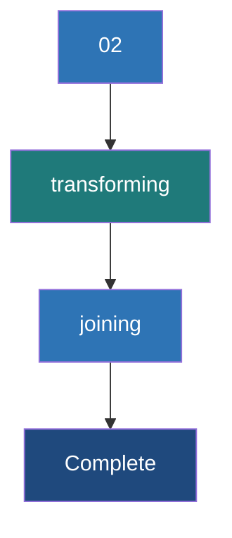

# Transforming and Joining Graphs

**Core operations to mutate properties, filter topologies, and enrich graph data with external datasets without rebuilding the graph from scratch.**

## Why It Matters

In real-world data engineering pipelines, a graph is rarely static. You often need to normalize data, update node statuses based on new events, filter out noise (like spam accounts or inactive links), or enrich the graph with metadata from external systems (like joining user profiles from a relational database onto a social graph). Rebuilding the entire Graph object from raw RDDs every time a property changes is computationally expensive and inefficient. GraphX provides specialized operators—`mapVertices`, `mapEdges`, `subgraph`, `aggregateMessages`, and `joinVertices`—that allow you to transform the graph's properties and structure efficiently. Understanding these operators allows you to execute graph ETL, perform structural filtering, and compute neighborhood aggregations optimally.

## How It Works

GraphX property graphs are immutable. When you transform a graph, you create a new graph. However, GraphX optimizes this heavily: it shares structural indices (like routing tables) between the old and new graphs if the topology (the edges themselves) hasn't changed.

**1. Property Transformations (`mapVertices`, `mapEdges`)**
These operators change the attributes of vertices or edges while preserving the graph structure.
*   `mapVertices`: Takes a function `(VertexId, VD) => VD2` and returns a new graph with updated vertex properties. Because the topology doesn't change, the internal routing indices are fully reused, making this operation extremely fast.
*   `mapEdges`: Similar to `mapVertices`, but applied to edges. Takes a function `Edge[ED] => ED2`.

**2. Structural Filtering (`subgraph`)**
The `subgraph` operator creates a new graph containing only the vertices and edges that satisfy specified predicates. You provide a vertex predicate function and an edge predicate function (which operates on `EdgeTriplet` so you can filter based on connected node properties). When you filter out a vertex, any edge connected to it is automatically filtered out as well to maintain structural integrity.

**3. Neighborhood Aggregation (`aggregateMessages`)**
This is the core of GraphX's message-passing architecture, replacing the older `mapReduceTriplets`. It has two phases:
*   *sendMsg*: Runs on every edge in the graph. It can access the triplet (source and destination vertex properties and the edge property) and optionally send a message to the source vertex, the destination vertex, or both.
*   *mergeMsg*: Runs on each vertex. It takes two incoming messages and merges them into one. This must be a commutative and associative operation (like sum, min, or max).
The result is a `VertexRDD[Msg]` containing the aggregated message for each vertex that received one.

**4. Joining External Data (`joinVertices`, `outerJoinVertices`)**
These operations allow you to join an external `RDD[(VertexId, U)]` with your graph.
*   `joinVertices`: Updates the vertex property ONLY if the vertex exists in the external RDD.
*   `outerJoinVertices`: Updates every vertex in the graph. The update function receives an `Option[U]` because the external data might not have a matching `VertexId`. This is preferred for handling missing data safely.

## Flow Diagram



## Data Visualization

**Transforming with outerJoinVertices**

Original Vertex Data (`VD = String` for Name):
| VertexId | Attribute |
|---|---|
| 1L | "Alice" |
| 2L | "Bob" |

External Data `RDD[(VertexId, Int)]` (Credit Score):
| VertexId | Credit Score |
|---|---|
| 1L | 750 |
| 3L | 800 |

Applying `outerJoinVertices` mapping function: `(id, name, optScore) => (name, optScore.getOrElse(0))`

Resulting Vertex Data:
| VertexId | Attribute | Explanation |
|---|---|---|
| 1L | ("Alice", 750) | Match found, Option is Some(750). |
| 2L | ("Bob", 0) | No match in external RDD, Option is None. Defaulted to 0. |

## Code Example

```scala
import org.apache.spark.sql.SparkSession
import org.apache.spark.graphx._
import org.apache.spark.rdd.RDD

object GraphTransformations {
  def main(args: Array[String]): Unit = {
    val spark = SparkSession.builder().appName("GraphTransforms").master("local[*]").getOrCreate()
    val sc = spark.sparkContext
    sc.setLogLevel("ERROR")

    // Define Base Graph
    val users: RDD[(VertexId, (String, Int))] = sc.parallelize(Array(
      (1L, ("Alice", 28)), (2L, ("Bob", 27)), (3L, ("Charlie", 17)), (4L, ("David", 42))
    ))
    val edges: RDD[Edge[Int]] = sc.parallelize(Array(
      Edge(1L, 2L, 1), Edge(2L, 3L, 1), Edge(3L, 4L, 1), Edge(4L, 1L, 1)
    ))
    val graph = Graph(users, edges)

    // 1. mapVertices: Create a boolean flag if user is adult
    val graphWithAdultFlag = graph.mapVertices { case (id, (name, age)) =>
      (name, age, age >= 18)
    }

    // 2. subgraph: Keep only adult users and edges connecting them
    val validGraph = graphWithAdultFlag.subgraph(
      vpred = (id, attr) => attr._3 == true // Keep only if adult flag is true
    )
    println("Vertices in Subgraph (Adults only):")
    validGraph.vertices.collect().foreach(println)
    println("Edges in Subgraph (Charlie is removed, so his edges are gone):")
    validGraph.edges.collect().foreach(println)

    // 3. aggregateMessages: Count incoming edges (Followers)
    // MsgContext contains srcAttr, dstAttr, attr (edge), sendToDst, sendToSrc
    val followerCounts: VertexRDD[Int] = graph.aggregateMessages[Int](
      sendMsg = triplet => {
        // Send a message of '1' to the destination vertex
        triplet.sendToDst(1)
      },
      mergeMsg = (a, b) => a + b // Sum up the messages
    )

    // 4. outerJoinVertices: Join the follower counts back to the graph
    val enrichedGraph = graph.outerJoinVertices(followerCounts) {
      (id, userAttr, optFollowerCount) =>
        val count = optFollowerCount.getOrElse(0)
        (userAttr._1, userAttr._2, count) // (Name, Age, FollowerCount)
    }

    println("\nEnriched Graph with Follower Counts:")
    enrichedGraph.vertices.collect().foreach { case (id, (name, age, count)) =>
        println(s"$name (Age $age) has $count followers.")
    }

    spark.stop()
  }
}
```

## Common Pitfalls

*   **Misunderstanding `joinVertices` vs `outerJoinVertices`**: `joinVertices` only modifies properties for vertices that exist in the external RDD; if a vertex has no match, it keeps its original property without executing the mapping function. If you need to explicitly handle missing data (e.g., setting a default value like `0`), you MUST use `outerJoinVertices` to process the `None` case.
*   **Complex `mergeMsg` Logic**: The `mergeMsg` function in `aggregateMessages` must be commutative and associative. If your merge logic depends on order (e.g., concatenating strings without sorting, or maintaining lists), the results will be non-deterministic across Spark executors.
*   **Heavy Objects in `aggregateMessages`**: Sending large objects (like full data sets or long arrays) in `sendMsg` can cause massive network shuffles and out-of-memory errors. Always reduce messages to the absolute minimum necessary (e.g., send primitive numbers, sums, or small sets).
*   **Subgraphs causing isolated vertices**: Filtering edges using `subgraph` might leave some vertices completely isolated (degree of 0). If your algorithm expects a connected graph, you must manually identify and filter out these isolated vertices after applying the edge predicate.

## Key Takeaway

**By utilizing GraphX's structural sharing and specialized operators like `aggregateMessages` and `outerJoinVertices`, you can iteratively mutate properties and efficiently traverse relationships without incurring the massive overhead of re-instantiating graphs.**


---

## 🎓 Deep Learning Questions

### Q1: Why Was This Concept Introduced?
Before GraphX, applying graph transformations or joining graph data with external datasets meant dropping the graph structure, working on raw RDDs (Vertices and Edges), and then re-instantiating the entire Graph object. Rebuilding graphs from scratch is computationally expensive because the underlying structural indices (routing tables and partition metadata) have to be completely recomputed, resulting in massive network shuffles and memory consumption. Spark introduced `mapVertices`, `mapEdges`, `subgraph`, `aggregateMessages`, and `joinVertices` to mutate properties, filter graph topology, and enrich data while reusing the existing structural indices. This overcomes the limitation of costly graph regeneration, making iterative graph algorithms (like PageRank) and ETL pipelines significantly faster by maintaining structural sharing whenever the topology is unchanged.

### Q2: What Exactly Is This Concept and How Does It Work?
Transforming and joining graphs in GraphX involves applying functions over the graph's fundamental components without breaking the distributed structural routing. 
- **Property transformations (`mapVertices`, `mapEdges`)**: Apply a map function over vertex or edge data. Since relationships don't change, GraphX purely copies the routing indices.
- **Structural filtering (`subgraph`)**: Takes predicates to filter out nodes and edges. It generates a new graph containing only the sub-topology that passes the predicates.
- **Neighborhood Aggregation (`aggregateMessages`)**: Uses the `EdgeContext` to run a map phase (`sendMsg`) on edges, sending messages to source/destination nodes, and a reduce phase (`mergeMsg`) on vertices to combine incoming messages.
- **Joining (`joinVertices`, `outerJoinVertices`)**: Joins an external RDD with the graph's `VertexRDD`, updating vertex properties based on a hash join against the existing structural index.

### Q3: Where Should This Concept Be Used?
- **Social Networks (LinkedIn, Facebook)**: Updating user profiles with real-time activity metrics (using `joinVertices`), or computing the number of influential followers per user (using `aggregateMessages`).
- **Fraud Detection in Banking**: Filtering out legitimate transactions to focus purely on high-risk, suspicious network topologies (using `subgraph`), and joining external watchlists to the account vertices (using `outerJoinVertices`).
- **Recommendation Engines (Netflix, Amazon)**: Iteratively calculating item similarity or user affinity scores by passing messages between users and the items they rated (using `aggregateMessages`).
- **Telecommunications & IT Networks**: Transforming network latency graphs by updating edge weights (`mapEdges`) when physical links degrade.

### Q4: Where Should This Concept NOT Be Used?
- **Non-Relational Data Processing**: If your problem doesn't involve traversing relationships, don't use GraphX operators. Standard DataFrame/Dataset joins are much more optimized for flat, tabular data thanks to the Catalyst optimizer and Tungsten execution engine.
- **Dynamic Topology Changes**: If you are constantly adding or deleting thousands of edges dynamically, GraphX is inefficient. It is built on immutable RDDs, meaning new structures force index recalculations. For highly dynamic, real-time graph mutations, a native graph database (like Neo4j or Amazon Neptune) is better.
- **Complex Non-Commutative Messages**: Do not use `aggregateMessages` if your message reduction depends on order (e.g., maintaining an ordered list of neighbors). The `mergeMsg` function must be commutative and associative; otherwise, the results are unpredictable.

### Q5: How Is This Concept Different from Hadoop?
| Aspect | Hadoop MapReduce | Apache Spark GraphX |
|---|---|---|
| **Architecture** | Disk-based MapReduce jobs, no native graph structure. | In-memory structural sharing of distributed graphs. |
| **Performance** | Very slow for iterative algorithms, high disk I/O. | Extremely fast due to memory caching and index reuse. |
| **Processing Model** | Flat key-value pairs; relationships manually joined. | Native vertex and edge properties, triplet views. |
| **Memory Usage** | Low memory, heavy disk spilling. | High memory, leverages structural indices. |
| **Fault Tolerance** | Recomputes from HDFS blocks. | Recomputes lost RDD partitions via lineage. |
| **Scalability** | Scales well, but at the cost of high latency. | Scales well with optimized routing tables. |
| **Typical Use Cases** | Batch log processing, simple aggregations. | Iterative graph algorithms, PageRank, connected components. |
| **Advantages** | Simple batch processing, low memory requirements. | Fast iterative graph ETL, robust API. |
| **Disadvantages** | Terrible for graph joins, no graph primitives. | High memory requirements, steeper learning curve. |

### Q6: How Can This Concept Be Related to a Traditional RDBMS?
| GraphX Concept | RDBMS SQL Equivalent | Explanation |
|---|---|---|
| `mapVertices` | `UPDATE table SET col = func(col)` | Modifying attributes of existing records without changing keys. |
| `subgraph` | `SELECT * FROM table WHERE condition` | Filtering out nodes/edges based on predicates. |
| `joinVertices` | `UPDATE t1 SET val = t2.val FROM t1 JOIN t2` | Updating graph vertices with matching records from an external table. |
| `outerJoinVertices` | `LEFT OUTER JOIN` + `COALESCE` | Safely joining external data and handling missing values with defaults. |
| `aggregateMessages` | `SELECT parent_id, SUM(val) FROM edges GROUP BY parent_id` | Grouping edges by a target vertex and aggregating properties. |

### Q7: What Happens Behind the Scenes?
When you call an operation like `aggregateMessages` or `joinVertices`:
1. **Driver**: Translates the operation into a DAG of RDD operations. 
2. **Structural Sharing**: If using `mapVertices`, the new `VertexRDD` reuses the routing table of the old one.
3. **Tasks & Partitions**: Spark partitions the graph into Edge partitions and Vertex partitions. `aggregateMessages` pushes computation to the edge partitions.
4. **Execution (sendMsg)**: Executors scan edges, extracting properties and generating messages for target vertices.
5. **Shuffle**: Messages are routed across the network to the partition holding the destination `VertexId`.
6. **Execution (mergeMsg)**: The receiving executor combines incoming messages using the commutative `mergeMsg` function.
7. **Join**: `joinVertices` performs a hash join between the new messages and the existing `VertexRDD`.

```text
Driver --> DAG --> Scheduler
             |
       [Edge Partitions] (Executors)
       - sendMsg() generates messages
             |
        (Network Shuffle) -> routes to Vertex partitions
             |
      [Vertex Partitions] (Executors)
       - mergeMsg() combines messages
       - joinVertices() updates state
```

### Q8: Performance Considerations, Best Practices, and Common Mistakes
| Category | Recommendation | Why It Matters |
|---|---|---|
| **Performance** | Prefer `mapVertices` over rebuilding graphs. | Reuses internal structural indices, saving massive computation time. |
| **Performance** | Use `outerJoinVertices` over dropping to RDDs and rejoining. | Prevents loss of structural integrity and hash-partitioning. |
| **Best Practice** | Keep `sendMsg` payloads tiny in `aggregateMessages`. | Large objects cause massive network shuffle traffic and OOM errors. |
| **Best Practice** | Ensure `mergeMsg` is commutative and associative. | Distributed task execution order is random; non-commutative logic causes errors. |
| **Common Mistake** | Using `joinVertices` expecting all nodes to update. | `joinVertices` only updates matched IDs. Use `outerJoinVertices` to handle `None`. |
| **Debugging** | Watch out for disconnected subgraphs after `subgraph`. | Filtering edges may isolate vertices, skewing downstream algorithms. |

### Q9: Interview Questions

**Beginner**
1. **What is the difference between `mapVertices` and rebuilding a graph?** 
   `mapVertices` reuses structural indices and partition layouts, making it much faster than building a graph from scratch.
2. **What does the `subgraph` operator do?** 
   It filters nodes and edges based on user-defined predicates to create a smaller, valid sub-graph.
3. **What is the purpose of `joinVertices`?** 
   To enrich graph nodes with external RDD data based on their `VertexId`.

**Intermediate**
4. **Why would you use `outerJoinVertices` instead of `joinVertices`?** 
   To safely handle cases where the external RDD lacks data for some vertices, allowing you to set defaults via the `Option` type.
5. **What are the two phases of `aggregateMessages`?** 
   The `sendMsg` phase (runs on edges to emit messages) and the `mergeMsg` phase (runs on vertices to combine messages).
6. **Why must `mergeMsg` be commutative and associative?** 
   Because Spark processes messages across distributed partitions in a non-deterministic order.

**Advanced**
7. **How does GraphX avoid shuffling when using `mapVertices`?** 
   It creates a new `VertexRDD` but shares the underlying routing table and edge partitions entirely with the original graph.
8. **Explain the memory overhead of `aggregateMessages`.** 
   Generating complex messages per edge causes massive shuffle memory footprints. It's critical to send only primitive types or small aggregates.
9. **How does `subgraph` handle edge consistency?** 
   If a vertex is filtered out, all connected edges are implicitly dropped as well to maintain graph integrity.

**Scenario-Based**
10. **You have a social graph and need to count how many likes each user received. How do you implement this?** 
    Use `aggregateMessages`, send `1` to the destination vertex in `sendMsg`, and sum the values in `mergeMsg`. Finally, use `outerJoinVertices` to apply the counts to the user vertices.
11. **Your graph algorithm throws OOM errors during `aggregateMessages`. What do you check?** 
    Ensure the message object sent in `sendMsg` isn't a large collection or complex object. Sending large objects causes a network bottleneck and heap exhaustion during the shuffle phase.

### Q10: Complete Real-World Example
**Business Problem:** A bank wants to detect accounts receiving massive amounts of money to identify potential money laundering activity.
**Sample Dataset:** Bank accounts (vertices) and financial transactions (edges).

```scala
import org.apache.spark.graphx._
import org.apache.spark.rdd.RDD
import org.apache.spark.sql.SparkSession

object HighRiskDetection {
  def main(args: Array[String]): Unit = {
    // 1. Setup Spark Environment
    val spark = SparkSession.builder().appName("GraphETL").master("local[*]").getOrCreate()
    val sc = spark.sparkContext
    sc.setLogLevel("ERROR")

    // 2. Vertices: (AccountId, AccountHolderName)
    val accounts: RDD[(VertexId, String)] = sc.parallelize(Seq(
      (1L, "Alice"), (2L, "Bob"), (3L, "Charlie")
    ))

    // 3. Edges: (SrcId, DstId, TransactionAmount)
    val transactions: RDD[Edge[Double]] = sc.parallelize(Seq(
      Edge(1L, 2L, 500.0),
      Edge(1L, 3L, 10000.0),
      Edge(2L, 3L, 5000.0)
    ))

    val bankGraph = Graph(accounts, transactions)

    // 4. aggregateMessages: Calculate total incoming funds per account
    val incomingFunds: VertexRDD[Double] = bankGraph.aggregateMessages[Double](
      sendMsg = triplet => {
        // Send transaction amount to the destination account
        triplet.sendToDst(triplet.attr)
      },
      mergeMsg = (a, b) => a + b // Sum the amounts
    )

    // 5. outerJoinVertices: Enrich graph with the aggregated total
    val enrichedGraph = bankGraph.outerJoinVertices(incomingFunds) {
      (id, name, optFunds) =>
        (name, optFunds.getOrElse(0.0)) // Default to 0.0 if no incoming funds
    }

    // 6. subgraph: Filter for high-risk accounts (e.g., >= 10,000 incoming)
    val highRiskGraph = enrichedGraph.subgraph(
      vpred = (id, attr) => attr._2 >= 10000.0
    )

    // 7. Output Results
    highRiskGraph.vertices.collect().foreach { case (id, (name, amount)) =>
      println(s"ALERT: High risk account $name received $$${amount}")
    }
    // Expected Output:
    // ALERT: High risk account Charlie received $15000.0
    
    spark.stop()
  }
}
```

### 💡 Key Takeaways
- GraphX provides operators to mutate properties without rebuilding the graph.
- `mapVertices` and `mapEdges` change properties while reusing structural indices.
- `subgraph` safely filters nodes/edges while maintaining topology integrity.
- `aggregateMessages` enables powerful vertex-neighborhood computations.
- `outerJoinVertices` is the safest way to join external data handling missing matches.

### ⚠️ Common Misconceptions
- **"I have to rebuild the graph to change it."** False, operators like `mapVertices` reuse internal structures for efficiency.
- **"`joinVertices` updates all vertices."** False, it only updates matched ones; use `outerJoinVertices` for all.
- **"`aggregateMessages` can collect ordered lists."** Dangerous; distributed merges are order-independent and could lead to OOM.

### 🔗 Related Spark Concepts
- GraphX Pregel API
- VertexRDD and EdgeRDD
- RDD lineage and structural sharing
- Network Shuffle

### 📚 References for Further Reading
- Apache Spark Official Documentation
- Learning Spark (O'Reilly)
- Spark: The Definitive Guide (O'Reilly)
