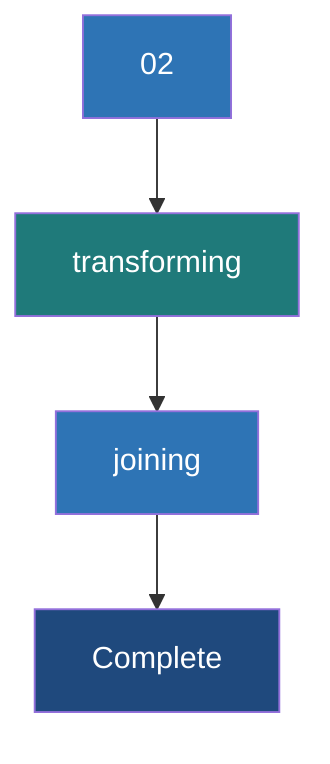

# Transforming and Joining Graphs

**Core operations to mutate properties, filter topologies, and enrich graph data with external datasets without rebuilding the graph from scratch.**

## Why It Matters

In real-world data engineering pipelines, a graph is rarely static. You often need to normalize data, update node statuses based on new events, filter out noise (like spam accounts or inactive links), or enrich the graph with metadata from external systems (like joining user profiles from a relational database onto a social graph). Rebuilding the entire Graph object from raw RDDs every time a property changes is computationally expensive and inefficient. GraphX provides specialized operators—`mapVertices`, `mapEdges`, `subgraph`, `aggregateMessages`, and `joinVertices`—that allow you to transform the graph's properties and structure efficiently. Understanding these operators allows you to execute graph ETL, perform structural filtering, and compute neighborhood aggregations optimally.

## How It Works

GraphX property graphs are immutable. When you transform a graph, you create a new graph. However, GraphX optimizes this heavily: it shares structural indices (like routing tables) between the old and new graphs if the topology (the edges themselves) hasn't changed.

**1. Property Transformations (`mapVertices`, `mapEdges`)**
These operators change the attributes of vertices or edges while preserving the graph structure.
*   `mapVertices`: Takes a function `(VertexId, VD) => VD2` and returns a new graph with updated vertex properties. Because the topology doesn't change, the internal routing indices are fully reused, making this operation extremely fast.
*   `mapEdges`: Similar to `mapVertices`, but applied to edges. Takes a function `Edge[ED] => ED2`.

**2. Structural Filtering (`subgraph`)**
The `subgraph` operator creates a new graph containing only the vertices and edges that satisfy specified predicates. You provide a vertex predicate function and an edge predicate function (which operates on `EdgeTriplet` so you can filter based on connected node properties). When you filter out a vertex, any edge connected to it is automatically filtered out as well to maintain structural integrity.

**3. Neighborhood Aggregation (`aggregateMessages`)**
This is the core of GraphX's message-passing architecture, replacing the older `mapReduceTriplets`. It has two phases:
*   *sendMsg*: Runs on every edge in the graph. It can access the triplet (source and destination vertex properties and the edge property) and optionally send a message to the source vertex, the destination vertex, or both.
*   *mergeMsg*: Runs on each vertex. It takes two incoming messages and merges them into one. This must be a commutative and associative operation (like sum, min, or max).
The result is a `VertexRDD[Msg]` containing the aggregated message for each vertex that received one.

**4. Joining External Data (`joinVertices`, `outerJoinVertices`)**
These operations allow you to join an external `RDD[(VertexId, U)]` with your graph.
*   `joinVertices`: Updates the vertex property ONLY if the vertex exists in the external RDD.
*   `outerJoinVertices`: Updates every vertex in the graph. The update function receives an `Option[U]` because the external data might not have a matching `VertexId`. This is preferred for handling missing data safely.

## Flow Diagram



## Data Visualization

**Transforming with outerJoinVertices**

Original Vertex Data (`VD = String` for Name):
| VertexId | Attribute |
|---|---|
| 1L | "Alice" |
| 2L | "Bob" |

External Data `RDD[(VertexId, Int)]` (Credit Score):
| VertexId | Credit Score |
|---|---|
| 1L | 750 |
| 3L | 800 |

Applying `outerJoinVertices` mapping function: `(id, name, optScore) => (name, optScore.getOrElse(0))`

Resulting Vertex Data:
| VertexId | Attribute | Explanation |
|---|---|---|
| 1L | ("Alice", 750) | Match found, Option is Some(750). |
| 2L | ("Bob", 0) | No match in external RDD, Option is None. Defaulted to 0. |

## Code Example

```scala
import org.apache.spark.sql.SparkSession
import org.apache.spark.graphx._
import org.apache.spark.rdd.RDD

object GraphTransformations {
  def main(args: Array[String]): Unit = {
    val spark = SparkSession.builder().appName("GraphTransforms").master("local[*]").getOrCreate()
    val sc = spark.sparkContext
    sc.setLogLevel("ERROR")

    // Define Base Graph
    val users: RDD[(VertexId, (String, Int))] = sc.parallelize(Array(
      (1L, ("Alice", 28)), (2L, ("Bob", 27)), (3L, ("Charlie", 17)), (4L, ("David", 42))
    ))
    val edges: RDD[Edge[Int]] = sc.parallelize(Array(
      Edge(1L, 2L, 1), Edge(2L, 3L, 1), Edge(3L, 4L, 1), Edge(4L, 1L, 1)
    ))
    val graph = Graph(users, edges)

    // 1. mapVertices: Create a boolean flag if user is adult
    val graphWithAdultFlag = graph.mapVertices { case (id, (name, age)) =>
      (name, age, age >= 18)
    }

    // 2. subgraph: Keep only adult users and edges connecting them
    val validGraph = graphWithAdultFlag.subgraph(
      vpred = (id, attr) => attr._3 == true // Keep only if adult flag is true
    )
    println("Vertices in Subgraph (Adults only):")
    validGraph.vertices.collect().foreach(println)
    println("Edges in Subgraph (Charlie is removed, so his edges are gone):")
    validGraph.edges.collect().foreach(println)

    // 3. aggregateMessages: Count incoming edges (Followers)
    // MsgContext contains srcAttr, dstAttr, attr (edge), sendToDst, sendToSrc
    val followerCounts: VertexRDD[Int] = graph.aggregateMessages[Int](
      sendMsg = triplet => {
        // Send a message of '1' to the destination vertex
        triplet.sendToDst(1)
      },
      mergeMsg = (a, b) => a + b // Sum up the messages
    )

    // 4. outerJoinVertices: Join the follower counts back to the graph
    val enrichedGraph = graph.outerJoinVertices(followerCounts) {
      (id, userAttr, optFollowerCount) =>
        val count = optFollowerCount.getOrElse(0)
        (userAttr._1, userAttr._2, count) // (Name, Age, FollowerCount)
    }

    println("\nEnriched Graph with Follower Counts:")
    enrichedGraph.vertices.collect().foreach { case (id, (name, age, count)) =>
        println(s"$name (Age $age) has $count followers.")
    }

    spark.stop()
  }
}
```

## Common Pitfalls

*   **Misunderstanding `joinVertices` vs `outerJoinVertices`**: `joinVertices` only modifies properties for vertices that exist in the external RDD; if a vertex has no match, it keeps its original property without executing the mapping function. If you need to explicitly handle missing data (e.g., setting a default value like `0`), you MUST use `outerJoinVertices` to process the `None` case.
*   **Complex `mergeMsg` Logic**: The `mergeMsg` function in `aggregateMessages` must be commutative and associative. If your merge logic depends on order (e.g., concatenating strings without sorting, or maintaining lists), the results will be non-deterministic across Spark executors.
*   **Heavy Objects in `aggregateMessages`**: Sending large objects (like full data sets or long arrays) in `sendMsg` can cause massive network shuffles and out-of-memory errors. Always reduce messages to the absolute minimum necessary (e.g., send primitive numbers, sums, or small sets).
*   **Subgraphs causing isolated vertices**: Filtering edges using `subgraph` might leave some vertices completely isolated (degree of 0). If your algorithm expects a connected graph, you must manually identify and filter out these isolated vertices after applying the edge predicate.

## Key Takeaway

**By utilizing GraphX's structural sharing and specialized operators like `aggregateMessages` and `outerJoinVertices`, you can iteratively mutate properties and efficiently traverse relationships without incurring the massive overhead of re-instantiating graphs.**
