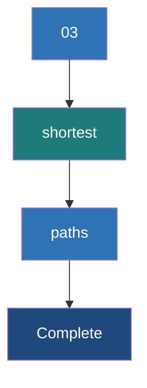

# Shortest Paths Algorithm

**A distributed graph algorithm that computes the minimum number of hops or lowest-cost distance from every vertex to a set of designated target vertices.**

## Why It Matters

Finding the shortest path between entities is one of the most fundamental and widely used graph algorithms in computer science. In the real world, "shortest path" can mean multiple things depending on the context. In a road network, it means the fastest driving route (like Google Maps routing). In a telecommunications network, it means routing packets through routers with the lowest latency. In social networks, it calculates degrees of separation—like the famous "Six Degrees of Kevin Bacon," identifying the shortest chain of acquaintances connecting two people. Implementing shortest paths on a single machine using standard algorithms (like Dijkstra's or Breadth-First Search) is straightforward, but doing this over a graph with billions of nodes and edges requires a distributed approach. GraphX provides this capability, allowing massive-scale pathfinding.

## How It Works

In traditional computing, Shortest Path is often solved using Dijkstra’s Algorithm (for weighted graphs) or Breadth-First Search (BFS, for unweighted graphs). However, these algorithms are highly sequential—they explore the graph one node at a time, making them difficult to distribute across a cluster.

GraphX solves the Single-Source (or Multi-Source) Shortest Path problem using the **Pregel API**. Pregel is a bulk-synchronous, vertex-centric programming model introduced by Google. In the Pregel model, computation proceeds in a series of iterations called "supersteps." 

Here is how the Shortest Path algorithm is implemented in GraphX via Pregel:
1.  **Initialization**: Each target vertex is initialized with a distance of `0` to itself. All other vertices are initialized with a distance of infinity (or a very high number).
2.  **Superstep 1 (Message Passing)**: During the superstep, each vertex examines its current distance. It sends a message to its neighbors containing its `distance + 1` (or `distance + edge_weight`).
3.  **Superstep 2 (Merging & Updating)**: When a vertex receives messages from its neighbors, it uses a `mergeMsg` function to find the minimum distance among all incoming messages. If this new minimum distance is shorter than its currently known distance, the vertex updates its own distance state.
4.  **Iteration & Convergence**: If a vertex's state was updated, it will send out new messages in the next superstep. If a vertex's state did not change, it "halts" and sends no messages. The algorithm continues iteratively until no more messages are sent across the entire graph. This signifies convergence—the shortest paths have been found.

GraphX includes a built-in `ShortestPaths.run()` utility. This specific built-in function computes the unweighted shortest path (number of hops) from all vertices to a defined set of "landmark" vertices. For weighted shortest paths, engineers write a custom Pregel implementation.

## Flow Diagram



## Data Visualization

Tracing the Pregel state of Vertex 3 finding the shortest path to Vertex 1. Target = Vertex 1.

| Iteration (Superstep) | Vertex 1 State (Dist to V1) | Vertex 2 State (Dist to V1) | Vertex 3 State (Dist to V1) | Messages Sent |
|---|---|---|---|---|
| Initialization | `{V1: 0}` | `{}` (Empty/Inf) | `{}` (Empty/Inf) | V1 sends `{V1: 1}` to V2, V3 |
| Superstep 1 | `{V1: 0}` | `{V1: 1}` (Updated) | `{V1: 5}` (Updated via long edge) | V2 sends `{V1: 2}` to V3 |
| Superstep 2 | `{V1: 0}` | `{V1: 1}` | `{V1: 2}` (Updated, 2 < 5) | V3 sends `{V1: 3}` (ignored by neighbors) |
| Convergence | `{V1: 0}` | `{V1: 1}` | `{V1: 2}` | None (Algorithm Halts) |

## Code Example

```scala
import org.apache.spark.sql.SparkSession
import org.apache.spark.graphx._
import org.apache.spark.graphx.lib.ShortestPaths
import org.apache.spark.rdd.RDD

object ShortestPathsExample {
  def main(args: Array[String]): Unit = {
    val spark = SparkSession.builder().appName("ShortestPaths").master("local[*]").getOrCreate()
    val sc = spark.sparkContext
    sc.setLogLevel("ERROR")

    // Define vertices representing Wikipedia articles
    val vertices: RDD[(VertexId, String)] = sc.parallelize(Array(
      (1L, "Apache Spark"),
      (2L, "Distributed Computing"),
      (3L, "Computer Cluster"),
      (4L, "Hadoop"),
      (5L, "Big Data")
    ))

    // Define edges representing links between articles
    val edges: RDD[Edge[Int]] = sc.parallelize(Array(
      Edge(1L, 2L, 1),
      Edge(2L, 3L, 1),
      Edge(3L, 4L, 1),
      Edge(4L, 5L, 1),
      Edge(1L, 4L, 1) // Direct link from Spark to Hadoop
    ))

    val graph = Graph(vertices, edges)

    // 1. Define Landmarks
    // We want to find the shortest path FROM all nodes TO these specific landmarks
    val landmarks = Seq(5L, 3L) 

    // 2. Run the Built-in ShortestPaths algorithm
    // Resulting vertex attribute is a Map[VertexId, Int] mapping landmark ID to distance
    val resultGraph = ShortestPaths.run(graph, landmarks)

    // 3. Process and interpret the results
    println("Shortest path distances (number of hops):")
    
    // Join back with original vertices to get the article names
    val finalResults = resultGraph.vertices.join(vertices).map {
      case (vertexId, (distanceMap, articleName)) =>
        val distTo5 = distanceMap.getOrElse(5L, -1) // -1 if unreachable
        val distTo3 = distanceMap.getOrElse(3L, -1)
        s"Article: '$articleName' -> Hops to 'Big Data'(5): $distTo5, Hops to 'Cluster'(3): $distTo3"
    }

    finalResults.collect().foreach(println)
    
    // Output should show Spark -> Big Data is 2 hops (Spark->Hadoop->Big Data)
    // rather than 4 hops through Distributed Computing.

    spark.stop()
  }
}
```

## Common Pitfalls

*   **Assuming `ShortestPaths.run` handles weights**: The built-in `ShortestPaths` object in `org.apache.spark.graphx.lib` ONLY calculates hop counts (unweighted graphs). If you have distance or cost weights on your edges, you must write a custom Pregel implementation; otherwise, your results will just be topological hops.
*   **Too many landmarks**: The built-in algorithm stores a `Map` in every vertex representing distances to *every* requested landmark. If you provide thousands of landmarks, this Map grows huge, inflating RDD sizes, triggering massive network shuffles, and causing Out-Of-Memory (OOM) errors.
*   **Unreachable Vertices**: If a graph is disconnected (or directed in a way that prevents reaching the target), the resulting Map for a vertex will simply not contain a key for that landmark. Engineers often fail to handle the missing key (using `.getOrElse`), resulting in `NoSuchElementException` crashes.
*   **Infinite Loops in Custom Pregel**: When writing a custom weighted shortest path, if you have negative edge weights (or fail to properly check if `new_dist < old_dist` before updating), the Pregel algorithm will never converge, leading to an infinite loop until the Spark job is killed.

## Key Takeaway

**GraphX tackles the Shortest Path problem at massive scale by shifting away from sequential path-tracing algorithms toward Pregel’s iterative, vertex-centric message-passing model.**
