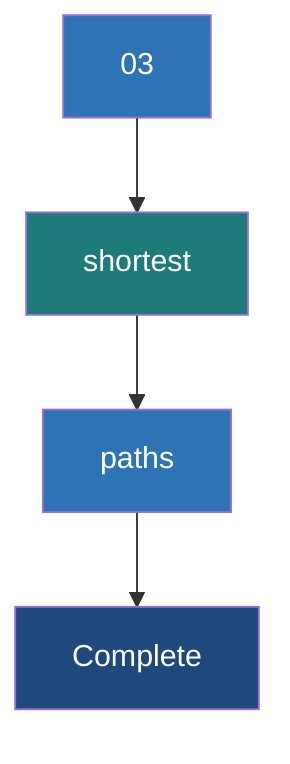

# Shortest Paths Algorithm

**A distributed graph algorithm that computes the minimum number of hops or lowest-cost distance from every vertex to a set of designated target vertices.**

## Why It Matters

Finding the shortest path between entities is one of the most fundamental and widely used graph algorithms in computer science. In the real world, "shortest path" can mean multiple things depending on the context. In a road network, it means the fastest driving route (like Google Maps routing). In a telecommunications network, it means routing packets through routers with the lowest latency. In social networks, it calculates degrees of separation—like the famous "Six Degrees of Kevin Bacon," identifying the shortest chain of acquaintances connecting two people. Implementing shortest paths on a single machine using standard algorithms (like Dijkstra's or Breadth-First Search) is straightforward, but doing this over a graph with billions of nodes and edges requires a distributed approach. GraphX provides this capability, allowing massive-scale pathfinding.

## How It Works

In traditional computing, Shortest Path is often solved using Dijkstra’s Algorithm (for weighted graphs) or Breadth-First Search (BFS, for unweighted graphs). However, these algorithms are highly sequential—they explore the graph one node at a time, making them difficult to distribute across a cluster.

GraphX solves the Single-Source (or Multi-Source) Shortest Path problem using the **Pregel API**. Pregel is a bulk-synchronous, vertex-centric programming model introduced by Google. In the Pregel model, computation proceeds in a series of iterations called "supersteps." 

Here is how the Shortest Path algorithm is implemented in GraphX via Pregel:
1.  **Initialization**: Each target vertex is initialized with a distance of `0` to itself. All other vertices are initialized with a distance of infinity (or a very high number).
2.  **Superstep 1 (Message Passing)**: During the superstep, each vertex examines its current distance. It sends a message to its neighbors containing its `distance + 1` (or `distance + edge_weight`).
3.  **Superstep 2 (Merging & Updating)**: When a vertex receives messages from its neighbors, it uses a `mergeMsg` function to find the minimum distance among all incoming messages. If this new minimum distance is shorter than its currently known distance, the vertex updates its own distance state.
4.  **Iteration & Convergence**: If a vertex's state was updated, it will send out new messages in the next superstep. If a vertex's state did not change, it "halts" and sends no messages. The algorithm continues iteratively until no more messages are sent across the entire graph. This signifies convergence—the shortest paths have been found.

GraphX includes a built-in `ShortestPaths.run()` utility. This specific built-in function computes the unweighted shortest path (number of hops) from all vertices to a defined set of "landmark" vertices. For weighted shortest paths, engineers write a custom Pregel implementation.

## Flow Diagram



## Data Visualization

Tracing the Pregel state of Vertex 3 finding the shortest path to Vertex 1. Target = Vertex 1.

| Iteration (Superstep) | Vertex 1 State (Dist to V1) | Vertex 2 State (Dist to V1) | Vertex 3 State (Dist to V1) | Messages Sent |
|---|---|---|---|---|
| Initialization | `{V1: 0}` | `{}` (Empty/Inf) | `{}` (Empty/Inf) | V1 sends `{V1: 1}` to V2, V3 |
| Superstep 1 | `{V1: 0}` | `{V1: 1}` (Updated) | `{V1: 5}` (Updated via long edge) | V2 sends `{V1: 2}` to V3 |
| Superstep 2 | `{V1: 0}` | `{V1: 1}` | `{V1: 2}` (Updated, 2 < 5) | V3 sends `{V1: 3}` (ignored by neighbors) |
| Convergence | `{V1: 0}` | `{V1: 1}` | `{V1: 2}` | None (Algorithm Halts) |

## Code Example

```scala
import org.apache.spark.sql.SparkSession
import org.apache.spark.graphx._
import org.apache.spark.graphx.lib.ShortestPaths
import org.apache.spark.rdd.RDD

object ShortestPathsExample {
  def main(args: Array[String]): Unit = {
    val spark = SparkSession.builder().appName("ShortestPaths").master("local[*]").getOrCreate()
    val sc = spark.sparkContext
    sc.setLogLevel("ERROR")

    // Define vertices representing Wikipedia articles
    val vertices: RDD[(VertexId, String)] = sc.parallelize(Array(
      (1L, "Apache Spark"),
      (2L, "Distributed Computing"),
      (3L, "Computer Cluster"),
      (4L, "Hadoop"),
      (5L, "Big Data")
    ))

    // Define edges representing links between articles
    val edges: RDD[Edge[Int]] = sc.parallelize(Array(
      Edge(1L, 2L, 1),
      Edge(2L, 3L, 1),
      Edge(3L, 4L, 1),
      Edge(4L, 5L, 1),
      Edge(1L, 4L, 1) // Direct link from Spark to Hadoop
    ))

    val graph = Graph(vertices, edges)

    // 1. Define Landmarks
    // We want to find the shortest path FROM all nodes TO these specific landmarks
    val landmarks = Seq(5L, 3L) 

    // 2. Run the Built-in ShortestPaths algorithm
    // Resulting vertex attribute is a Map[VertexId, Int] mapping landmark ID to distance
    val resultGraph = ShortestPaths.run(graph, landmarks)

    // 3. Process and interpret the results
    println("Shortest path distances (number of hops):")
    
    // Join back with original vertices to get the article names
    val finalResults = resultGraph.vertices.join(vertices).map {
      case (vertexId, (distanceMap, articleName)) =>
        val distTo5 = distanceMap.getOrElse(5L, -1) // -1 if unreachable
        val distTo3 = distanceMap.getOrElse(3L, -1)
        s"Article: '$articleName' -> Hops to 'Big Data'(5): $distTo5, Hops to 'Cluster'(3): $distTo3"
    }

    finalResults.collect().foreach(println)
    
    // Output should show Spark -> Big Data is 2 hops (Spark->Hadoop->Big Data)
    // rather than 4 hops through Distributed Computing.

    spark.stop()
  }
}
```

## Common Pitfalls

*   **Assuming `ShortestPaths.run` handles weights**: The built-in `ShortestPaths` object in `org.apache.spark.graphx.lib` ONLY calculates hop counts (unweighted graphs). If you have distance or cost weights on your edges, you must write a custom Pregel implementation; otherwise, your results will just be topological hops.
*   **Too many landmarks**: The built-in algorithm stores a `Map` in every vertex representing distances to *every* requested landmark. If you provide thousands of landmarks, this Map grows huge, inflating RDD sizes, triggering massive network shuffles, and causing Out-Of-Memory (OOM) errors.
*   **Unreachable Vertices**: If a graph is disconnected (or directed in a way that prevents reaching the target), the resulting Map for a vertex will simply not contain a key for that landmark. Engineers often fail to handle the missing key (using `.getOrElse`), resulting in `NoSuchElementException` crashes.
*   **Infinite Loops in Custom Pregel**: When writing a custom weighted shortest path, if you have negative edge weights (or fail to properly check if `new_dist < old_dist` before updating), the Pregel algorithm will never converge, leading to an infinite loop until the Spark job is killed.

## Key Takeaway

**GraphX tackles the Shortest Path problem at massive scale by shifting away from sequential path-tracing algorithms toward Pregel’s iterative, vertex-centric message-passing model.**


---

## 🎓 Deep Learning Questions

### Q1: Why Was This Concept Introduced?
Before GraphX and distributed graph processing engines, computing shortest paths was done on single-node systems using algorithms like Dijkstra's or Breadth-First Search (BFS). While highly efficient for smaller graphs, these sequential algorithms fail completely when a graph reaches billions of vertices and edges (like social networks or global telecommunications networks). A single machine simply lacks the memory and processing power to hold and traverse the entire graph.

Spark introduced the Shortest Paths algorithm within GraphX to solve this massive-scale limitation. By utilizing the Pregel API—a bulk-synchronous, vertex-centric programming model—GraphX distributes the graph across multiple machines in a cluster. This allows the system to compute shortest paths concurrently by passing messages between vertices rather than tracking a single path sequentially. It overcomes memory bottlenecks and allows data engineers to perform pathfinding on internet-scale datasets efficiently.

### Q2: What Exactly Is This Concept and How Does It Work?
The Shortest Paths algorithm in GraphX calculates the minimum number of edges (hops) needed to travel from every vertex in the graph to a defined set of "landmark" vertices. 

Under the hood, it uses the **Pregel API**, which operates in iterative loops called "supersteps":
1. **Initialization**: Each landmark vertex sets its distance to itself as `0`. All other vertices start with an empty map (meaning infinite distance).
2. **Message Passing**: In each superstep, any vertex that updated its distance in the previous step sends a message to its neighbors, saying "I can reach the landmark in `N` hops, so you can reach it in `N + 1`."
3. **State Update**: Vertices receive these messages, compare the incoming `N + 1` distance with their current known distance, and keep the minimum. 
4. **Convergence**: This iterative message passing continues until no vertex updates its distance. At this point, the shortest paths are found, and the algorithm halts.

### Q3: Where Should This Concept Be Used?
This concept is widely used across various industries where relationships and connectivity are crucial:
* **Telecommunications**: Routing packets through a network grid. Finding the lowest-hop route minimizes network latency and avoids bottlenecks.
* **Social Networks (LinkedIn/Facebook)**: Calculating "degrees of separation." Recommending connections by finding the shortest chain of mutual friends between two users.
* **Logistics and Supply Chain (Amazon/FedEx)**: Determining the minimum number of transfer hubs a package must pass through from a warehouse to a final destination.
* **Cybersecurity**: Identifying the shortest path an attacker can take from a compromised low-level endpoint to a highly privileged server.
* **Epidemiology**: Tracing the shortest path of disease transmission between "patient zero" and newly infected individuals.

### Q4: Where Should This Concept NOT Be Used?
* **Weighted Routing Computations**: The built-in `ShortestPaths.run()` API in GraphX only calculates hops (unweighted edges). If you need to calculate paths based on physical distance, travel time, or toll costs (like Google Maps), do not use the built-in API. You must write a custom Pregel implementation for Dijkstra's algorithm.
* **Single-Node Sized Graphs**: If the graph easily fits in the RAM of a single machine (e.g., a few million edges), using Spark and GraphX is an anti-pattern. Network shuffling overhead will make it significantly slower than a local Python library like NetworkX or a graph database like Neo4j.
* **Continuous Real-Time Pathfinding**: GraphX processes data in batches. If you need real-time, millisecond-latency pathfinding for a live GPS application, Spark is not the right tool. Use a dedicated operational graph database.

### Q5: How Is This Concept Different from Hadoop?

| Aspect | Hadoop MapReduce | Apache Spark (GraphX Shortest Paths) |
|---|---|---|
| **Architecture** | Disk-based, batch processing. Map and Reduce phases. | Memory-based, vertex-centric Pregel model. |
| **Performance** | Very slow for iterative graph algorithms due to constant disk I/O. | 10x-100x faster by keeping graph states in memory across iterations. |
| **Processing Model** | Flat, disconnected key-value pairs. | Distributed Property Graph (vertices and edges). |
| **Memory Usage** | Low (flushes to disk). | High (requires enough RAM to hold vertex states and messages). |
| **Fault Tolerance** | Recomputes from disk blocks (HDFS). | Recomputes lost graph partitions via RDD lineage. |
| **Scalability** | Scales linearly but slowly. | Scales linearly and efficiently across distributed executors. |
| **Ease of Development** | Nightmare for graphs. Requires chaining MapReduce jobs manually. | High. Built-in `ShortestPaths.run()` API or simple Pregel API. |
| **Typical Use Cases** | Log parsing, simple ETL. | Social network analysis, network routing, recommendation engines. |
| **Advantages** | Fault tolerance on cheap hardware. | In-memory speed, native graph primitives. |
| **Disadvantages** | Unusable for iterative graph traversal. | Can face Out-Of-Memory (OOM) on highly dense graphs. |

### Q6: How Can This Concept Be Related to a Traditional RDBMS?

| RDBMS Concept | GraphX Shortest Path Equivalent | Explanation |
|---|---|---|
| **Tables** | **Vertices and Edges RDDs** | RDBMS stores relations in tables. GraphX stores entities in a Vertex RDD and connections in an Edge RDD. |
| **Recursive CTEs** | **Pregel Iterations (Supersteps)** | SQL uses `WITH RECURSIVE` to traverse hierarchies (like finding all employees under a manager). GraphX uses Pregel iterations to traverse graphs. |
| **Foreign Keys** | **Edge Source & Destination IDs** | SQL links tables via Foreign Keys. GraphX links vertices using `srcId` and `dstId` in the Edge object. |
| **GROUP BY / MIN()** | **Message Merging (`mergeMsg`)** | SQL aggregates data to find minimums. Pregel merges incoming messages at a vertex and keeps the minimum distance. |
| **Indexes** | **Landmark Vertices** | SQL uses indexes for fast lookups. GraphX uses landmarks as pre-defined targets to calculate paths efficiently. |

### Q7: What Happens Behind the Scenes?

When you call `ShortestPaths.run(graph, landmarks)`, Spark orchestrates a distributed, iterative Pregel execution:

1. **Driver**: The Spark Driver initializes the Pregel API. It sets the starting states for the landmarks (distance 0).
2. **DAG Scheduler**: The iterations are mapped into a DAG of RDD transformations.
3. **Partitioning**: The graph is divided into partitions and distributed to the Executors. Vertices and Edges reside across the cluster.
4. **Supersteps (Tasks)**: 
   - Each superstep runs as a Spark Job.
   - Executors look at vertices that updated in the previous step.
   - Vertices generate messages (`distance + 1`) to their neighbors.
5. **Shuffle (Message Routing)**: Because neighbors might exist on different machines, Spark performs a network **Shuffle** to route messages to the correct destination vertex.
6. **Merge**: Vertices receive messages, update their state (if the new distance is shorter), and the loop repeats until no messages are sent.

```text
[Driver] Sets Landmarks (e.g., Vertex A)
   |
   v
[Executors] Initialize: A=0, B=Inf, C=Inf
   |
   +--> Superstep 1:
          Vertex A (dist 0) sends "1" to Vertex B
          Shuffle: Route message to B's machine
   |
   +--> Superstep 2:
          Vertex B (dist 1) sends "2" to Vertex C
          Shuffle: Route message to C's machine
   |
   +--> Superstep 3:
          Vertex C (dist 2) sends "3" to neighbors. 
          Neighbors reject (no shorter path).
   |
   v
[Halts] Convergence Reached. Return Result Graph.
```

### Q8: Performance Considerations, Best Practices, and Common Mistakes

| Category | Recommendation | Why It Matters |
|---|---|---|
| **Performance** | Limit the number of Landmark vertices. | Each landmark adds an entry to every vertex's Map attribute. Thousands of landmarks cause massive message bloat, leading to severe network shuffling and Out-Of-Memory (OOM) errors. |
| **Optimization** | Use Edge Partitioning (e.g., `PartitionStrategy.RandomVertexCut`). | GraphX routes messages across partitions. Proper partitioning minimizes cross-node network traffic during the shuffle phase of Pregel iterations. |
| **Best Practice** | Filter unreachable vertices post-processing. | If a graph is disconnected, vertices will have empty maps. Always use `.getOrElse(landmark, -1)` when extracting results to avoid `NoSuchElementException`. |
| **Common Mistake** | Attempting weighted paths with built-in API. | The built-in `ShortestPaths.run()` ignores edge weights. If distances are required (e.g., miles between cities), you must write a custom Pregel function. |
| **Production Tip** | Checkpoint the graph before running. | Pregel generates deep RDD lineages due to iterative supersteps. If a node fails, Spark must recalculate from the start. Checkpointing truncates the lineage, saving recovery time. |

### Q9: Interview Questions

#### Beginner
1. **What is the primary purpose of the Shortest Paths algorithm in GraphX?**
   To find the minimum number of hops (edges) from all vertices in a graph to a defined set of target "landmark" vertices.
2. **What programming model does GraphX use under the hood for Shortest Paths?**
   It uses the Pregel API, which is a vertex-centric, bulk-synchronous message-passing model.
3. **Does the built-in `ShortestPaths.run()` method consider edge weights?**
   No, it strictly calculates topological hops (unweighted paths). For weighted paths, a custom Pregel implementation is required.

#### Intermediate
4. **How does the algorithm know when to stop iterating?**
   The Pregel API halts when a superstep completes without any messages being sent. This means no vertex found a shorter path, signifying convergence.
5. **Why can adding too many landmarks to the algorithm cause Spark to crash?**
   Each vertex maintains a state Map containing its distance to *every* requested landmark. Many landmarks create huge maps, causing memory bloat and massive network payload during message passing, leading to OOM.
6. **How do you handle a graph where some vertices cannot reach the landmark at all?**
   Unreachable vertices will simply lack a key for that landmark in their result Map. You must handle this safely in code (e.g., using `getOrElse` to return a default value like -1).

#### Advanced
7. **Explain how message merging works in the Shortest Paths Pregel implementation.**
   During the message-passing phase, a vertex might receive multiple distance updates from different neighbors simultaneously. The `mergeMsg` function takes these incoming distance values and keeps the minimum (`math.min(a, b)`).
8. **Why are deep RDD lineages a problem in Pregel, and how do you solve it?**
   Because Pregel is iterative, every superstep adds a layer to the RDD lineage DAG. If a task fails on step 50, Spark must recompute all 50 steps from the source data. You solve this by calling `graph.checkpoint()` periodically to save the state to HDFS and truncate the lineage.
9. **If you needed to implement a *weighted* shortest path (Dijkstra) in GraphX, how would you structure the `vprog`, `sendMsg`, and `mergeMsg` functions?**
   `vprog`: Updates the vertex distance if the incoming message is smaller. `sendMsg`: Sends `src_dist + edge_weight` to the destination if it's smaller than the destination's current known distance. `mergeMsg`: Returns `math.min(msg1, msg2)`.

#### Scenario-Based
10. **You ran `ShortestPaths.run` on a telecommunications graph with 10 landmarks, but the job is stuck in an infinite loop. What is wrong?**
    The built-in API shouldn't loop infinitely on valid graphs. However, if you wrote a *custom* weighted Pregel implementation and your graph contains negative edge cycles, the distances will endlessly decrease, causing an infinite loop. You must implement cycle detection or cap the iterations.
11. **Your GraphX Shortest Path job is taking 5 hours on a 1-billion edge graph. The Spark UI shows huge network read/write metrics. How do you optimize it?**
    The massive network traffic is due to messages crossing machine boundaries. You should apply a `PartitionStrategy` (like `EdgePartition2D` or `RandomVertexCut`) before running the algorithm to group connected components and minimize cross-network shuffling.

### Q10: Complete Real-World Example

**Business Problem**: A global logistics company (like FedEx) wants to optimize their package routing. They have a network of warehouse distribution centers. They want to find the minimum number of transit hubs (hops) required to route packages from any warehouse in their network to two main central hubs: "New York Hub" and "Chicago Hub".

**Sample Dataset**: 
*   **Vertices**: Warehouses (ID, Name).
*   **Edges**: Direct trucking routes between warehouses.

**Code Execution:**

```scala
import org.apache.spark.sql.SparkSession
import org.apache.spark.graphx._
import org.apache.spark.graphx.lib.ShortestPaths

object LogisticsRouting {
  def main(args: Array[String]): Unit = {
    // 1. Initialize Spark
    val spark = SparkSession.builder()
      .appName("Logistics Shortest Paths")
      .master("local[*]")
      .getOrCreate()
    
    val sc = spark.sparkContext
    sc.setLogLevel("ERROR")

    // 2. Define Warehouse Vertices (ID, Name)
    val vertices = sc.parallelize(Array(
      (1L, "Seattle Hub"),
      (2L, "Denver Hub"),
      (3L, "Chicago Hub"), // LANDMARK 1
      (4L, "Dallas Hub"),
      (5L, "New York Hub"), // LANDMARK 2
      (6L, "Miami Hub")
    ))

    // 3. Define Trucking Routes (Edges)
    val edges = sc.parallelize(Array(
      Edge(1L, 2L, 1), // Seattle to Denver
      Edge(2L, 3L, 1), // Denver to Chicago
      Edge(1L, 3L, 1), // Seattle to Chicago (Direct)
      Edge(3L, 5L, 1), // Chicago to New York
      Edge(4L, 3L, 1), // Dallas to Chicago
      Edge(4L, 6L, 1), // Dallas to Miami
      Edge(6L, 5L, 1)  // Miami to New York
    ))

    // 4. Create the Graph
    val logisticsGraph = Graph(vertices, edges)

    // 5. Define the Landmarks (Chicago: 3L, New York: 5L)
    val landmarks = Seq(3L, 5L)

    // 6. Execute Shortest Paths
    // This returns a graph where the vertex attribute is a Map[VertexId, Int]
    val resultGraph = ShortestPaths.run(logisticsGraph, landmarks)

    // 7. Process the Results
    val finalRoutingMap = resultGraph.vertices.join(vertices).map {
      case (hubId, (distanceMap, hubName)) =>
        // Safely extract distances, default to -1 if unreachable
        val hopsToChicago = distanceMap.getOrElse(3L, -1)
        val hopsToNewYork = distanceMap.getOrElse(5L, -1)
        
        s"Warehouse: $hubName -> Hops to Chicago: $hopsToChicago | Hops to New York: $hopsToNewYork"
    }

    // 8. Output Results
    println("--- Logistics Routing Hops ---")
    finalRoutingMap.collect().foreach(println)

    spark.stop()
  }
}
```

**Execution Walkthrough**:
1. Spark creates the Graph and initializes the Pregel API.
2. Chicago (3L) and New York (5L) set their internal distance maps to `0` for themselves.
3. In Superstep 1, Chicago sends "I am 1 hop away" to Denver, Seattle, Dallas, and New York. New York sends "I am 1 hop away" to Chicago and Miami.
4. The vertices update their states. For example, Seattle receives the message from Chicago and sets its distance to Chicago as `1`.
5. In Superstep 2, Denver, Dallas, and Miami broadcast their new distances. Seattle realizes it is `2` hops from New York (via Chicago).
6. The algorithm halts when no shorter paths can be found.

**Expected Output**:
```text
--- Logistics Routing Hops ---
Warehouse: Chicago Hub -> Hops to Chicago: 0 | Hops to New York: 1
Warehouse: Denver Hub -> Hops to Chicago: 1 | Hops to New York: 2
Warehouse: Seattle Hub -> Hops to Chicago: 1 | Hops to New York: 2
Warehouse: Miami Hub -> Hops to Chicago: -1 | Hops to New York: 1
Warehouse: New York Hub -> Hops to Chicago: -1 | Hops to New York: 0
Warehouse: Dallas Hub -> Hops to Chicago: 1 | Hops to New York: 2
```
*(Note: Because edges are directional in GraphX by default, some return paths like Miami to Chicago are unreachable (-1) unless bidirectional edges are explicitly added).*

**Performance Notes**:
Using `.getOrElse` prevents crashes for unreachable vertices. If this network had 10,000 warehouses, running the built-in API is much faster than running 10,000 independent Dijkstra algorithms locally.

**When This Approach is Best**:
This approach is ideal when you need to calculate network topology (minimum connection steps) rather than exact physical distances, and your network is too massive for a single machine's memory.

### 💡 Key Takeaways
- GraphX Shortest Paths calculates the minimum topological hops (edges) to a set of landmark vertices.
- It operates using the Pregel API, passing messages between vertices iteratively until convergence.
- The built-in `ShortestPaths.run()` does **not** consider edge weights; it is strictly an unweighted hop-counter.
- Unreachable vertices are simply omitted from the resulting distance map; you must handle them safely in code.
- Limiting the number of landmark vertices is critical to preventing Out-Of-Memory errors and excessive network shuffling.

### ⚠️ Common Misconceptions
- **Misconception**: GraphX Shortest Path works just like Google Maps. **Reality**: It doesn't factor in weights (like traffic or distance) unless you write a custom Pregel implementation.
- **Misconception**: You should use it to find the shortest path between *all* pairs of nodes. **Reality**: Doing an "All-Pairs Shortest Path" on a huge graph will crash Spark; you must restrict it to specific "landmarks."
- **Misconception**: The algorithm will crash if a node is unreachable. **Reality**: The algorithm won't crash, but your downstream code will crash if you don't handle missing keys properly.

### 🔗 Related Spark Concepts
- **Pregel API**: The underlying message-passing engine that powers the Shortest Paths algorithm.
- **PageRank**: Another iterative Pregel-based graph algorithm used for measuring node importance.
- **Connected Components**: Used to find isolated subgraphs, often run before Shortest Paths to ensure reachability.
- **GraphFrames**: The DataFrame-based evolution of GraphX that supports Python/PySpark and provides a `shortestPaths` method.

### 📚 References for Further Reading
- Apache Spark Official Documentation: GraphX Programming Guide
- Learning Spark (O'Reilly)
- Spark: The Definitive Guide (O'Reilly) - Chapter on Graph Processing
