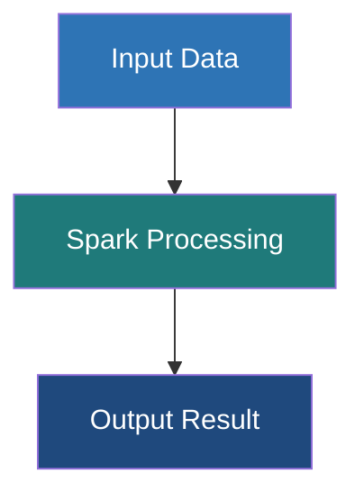

# PageRank Algorithm

**A link analysis algorithm that determines the relative importance, influence, or authority of vertices based on the quantity and quality of incoming connections.**

## Why It Matters

Originally developed by Larry Page and Sergey Brin to power the Google Search engine, PageRank revolutionized how we understand interconnected data. In the early days of the internet, search engines ranked pages merely by counting keywords. PageRank introduced a groundbreaking intuition: a webpage is important if other important webpages link to it. This concept extends far beyond just websites. In social networks, PageRank identifies the most influential users (influencers). In biology, it can highlight critical proteins in interaction networks. In finance, it can identify key nodes in transaction networks that might represent systemic risk or money laundering hubs. Because PageRank requires analyzing the entire topology of a network simultaneously and iteratively, it is one of the benchmark algorithms for distributed graph processing frameworks like GraphX.

## How It Works

PageRank models a "random surfer" navigating the graph. Imagine a user randomly clicking links on web pages. The PageRank score of a page represents the probability that the random surfer will land on that page at any given moment.

The formula relies on the transfer of "rank" or "weight". If a node $A$ has a PageRank of $PR(A)$ and has $N$ outgoing edges, it distributes $PR(A)/N$ of its rank to each of its destinations. Therefore, a node receives a high PageRank if it has many incoming links, or if it has a few incoming links from nodes that themselves have a very high PageRank.

There is a catch: what if the surfer reaches a "sink" node (a page with no outgoing links), or gets trapped in a loop? To solve this, PageRank introduces a **Damping Factor** (traditionally set to 0.85). This represents a 15% probability that the surfer gets bored, stops clicking links, and teleports to a completely random page in the network. This ensures all nodes have a baseline probability of being visited and prevents sinks from hoarding all the rank.

GraphX implements PageRank efficiently using the Pregel API. It offers two variants:
1.  **Static PageRank**: Runs for a fixed number of iterations. It is predictable in its execution time but might not reach mathematical convergence.
2.  **Dynamic PageRank**: Runs until convergence. It takes a tolerance parameter (e.g., `0.001`). The algorithm continues until no vertex's PageRank changes by more than the tolerance value between supersteps. This ensures high accuracy but execution time can be unpredictable depending on graph topology.

## Flow Diagram



## Data Visualization

Observe how rank accumulates over iterations in a simple 3-node network (A->B, A->C, B->C, C->A). 
*(Note: Simplified mathematically for demonstration, assuming a total initial rank of 3.0 and applying basic transfers).*

| Iteration | Node A Rank | Node B Rank | Node C Rank | System Total |
|---|---|---|---|---|
| 0 (Init) | 1.00 | 1.00 | 1.00 | 3.00 |
| 1 | 1.00 | 0.50 | 1.50 | 3.00 |
| 2 | 1.50 | 0.50 | 1.00 | 3.00 |
| 3 | 1.00 | 0.75 | 1.25 | 3.00 |
| Convergence | 1.20 | 0.60 | 1.20 | 3.00 |

*Notice that Node B ends with the lowest rank because it only has one incoming link (from A), which it has to share with C. Node C gets rank from both A and B, making it important.*

## Code Example

```scala
import org.apache.spark.sql.SparkSession
import org.apache.spark.graphx._
import org.apache.spark.rdd.RDD

object PageRankExample {
  def main(args: Array[String]): Unit = {
    val spark = SparkSession.builder().appName("PageRank").master("local[*]").getOrCreate()
    val sc = spark.sparkContext
    sc.setLogLevel("ERROR")

    // 1. Create a graph representing Wikipedia page links
    val pages: RDD[(VertexId, String)] = sc.parallelize(Array(
      (1L, "Home"), (2L, "About"), (3L, "Product"), (4L, "Blog"), (5L, "Contact")
    ))

    val links: RDD[Edge[Int]] = sc.parallelize(Array(
      Edge(1L, 2L, 1), Edge(1L, 3L, 1), Edge(1L, 4L, 1), // Home links to many
      Edge(2L, 1L, 1),                                   // About links back to Home
      Edge(3L, 1L, 1), Edge(3L, 5L, 1),                  // Product links to Home & Contact
      Edge(4L, 1L, 1), Edge(4L, 3L, 1),                  // Blog links to Home & Product
      Edge(5L, 1L, 1)                                    // Contact links back to Home
    ))

    val graph = Graph(pages, links)

    // 2. Run Dynamic PageRank
    // The tolerance is 0.0001. The algorithm runs until no rank changes by more than 0.0001.
    val pageRankGraph = graph.pageRank(0.0001)

    // 3. Join the resulting ranks with the original page names
    val rankedPages = pageRankGraph.vertices.join(pages).map {
      case (id, (rank, name)) => (name, rank)
    }

    // 4. Sort and display the top pages
    println("PageRank Results (Sorted by importance):")
    rankedPages
      .sortBy(_._2, ascending = false)
      .collect()
      .foreach { case (name, rank) => 
        // Format rank to 4 decimal places
        println(f"Page: $name%-10s | Rank: $rank%.4f")
      }

    // Expected Output Context:
    // 'Home' will have the highest rank because almost every other page links back to it.

    spark.stop()
  }
}
```

## Common Pitfalls

*   **Dangling Nodes (Sinks)**: Nodes with no outgoing edges "absorb" PageRank and do not pass it on. Over many iterations, they can artificially siphon rank away from the rest of the graph. GraphX's implementation handles this internally, but when writing custom random-walk algorithms, engineers often forget to handle sinks, leading to rank leakage.
*   **Using Dynamic PageRank on Massive Graphs**: Setting the tolerance too low (e.g., `0.000001`) on a billion-edge graph can cause the algorithm to run for hundreds of iterations, taking hours or days. For massive datasets, it is often much safer and more efficient to use `graph.staticPageRank(numIter = 10)` which usually converges "good enough" for relative ordering in just 10-15 iterations.
*   **Assuming Rank Sums to 1.0**: GraphX's implementation does not normalize the sum of all PageRanks to 1.0 (as some academic texts describe). Instead, the sum of all PageRanks in GraphX converges roughly to the total number of vertices in the graph. The relative differences are what matter, not the absolute values.
*   **Interpreting Results as Absolute Metrics**: PageRank scores are relative to the specific network graph. A PageRank of 1.5 in Graph A cannot be compared to a PageRank of 1.5 in Graph B.

## Key Takeaway

**PageRank elegantly leverages the structural connectivity of a graph, shifting the definition of "importance" from intrinsic attributes to the collective endorsement of a node's peers.**
