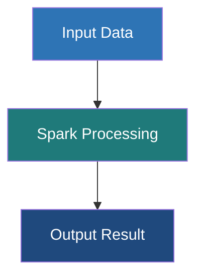

# PageRank Algorithm

**A link analysis algorithm that determines the relative importance, influence, or authority of vertices based on the quantity and quality of incoming connections.**

## Why It Matters

Originally developed by Larry Page and Sergey Brin to power the Google Search engine, PageRank revolutionized how we understand interconnected data. In the early days of the internet, search engines ranked pages merely by counting keywords. PageRank introduced a groundbreaking intuition: a webpage is important if other important webpages link to it. This concept extends far beyond just websites. In social networks, PageRank identifies the most influential users (influencers). In biology, it can highlight critical proteins in interaction networks. In finance, it can identify key nodes in transaction networks that might represent systemic risk or money laundering hubs. Because PageRank requires analyzing the entire topology of a network simultaneously and iteratively, it is one of the benchmark algorithms for distributed graph processing frameworks like GraphX.

## How It Works

PageRank models a "random surfer" navigating the graph. Imagine a user randomly clicking links on web pages. The PageRank score of a page represents the probability that the random surfer will land on that page at any given moment.

The formula relies on the transfer of "rank" or "weight". If a node $A$ has a PageRank of $PR(A)$ and has $N$ outgoing edges, it distributes $PR(A)/N$ of its rank to each of its destinations. Therefore, a node receives a high PageRank if it has many incoming links, or if it has a few incoming links from nodes that themselves have a very high PageRank.

There is a catch: what if the surfer reaches a "sink" node (a page with no outgoing links), or gets trapped in a loop? To solve this, PageRank introduces a **Damping Factor** (traditionally set to 0.85). This represents a 15% probability that the surfer gets bored, stops clicking links, and teleports to a completely random page in the network. This ensures all nodes have a baseline probability of being visited and prevents sinks from hoarding all the rank.

GraphX implements PageRank efficiently using the Pregel API. It offers two variants:
1.  **Static PageRank**: Runs for a fixed number of iterations. It is predictable in its execution time but might not reach mathematical convergence.
2.  **Dynamic PageRank**: Runs until convergence. It takes a tolerance parameter (e.g., `0.001`). The algorithm continues until no vertex's PageRank changes by more than the tolerance value between supersteps. This ensures high accuracy but execution time can be unpredictable depending on graph topology.

## Flow Diagram



## Data Visualization

Observe how rank accumulates over iterations in a simple 3-node network (A->B, A->C, B->C, C->A). 
*(Note: Simplified mathematically for demonstration, assuming a total initial rank of 3.0 and applying basic transfers).*

| Iteration | Node A Rank | Node B Rank | Node C Rank | System Total |
|---|---|---|---|---|
| 0 (Init) | 1.00 | 1.00 | 1.00 | 3.00 |
| 1 | 1.00 | 0.50 | 1.50 | 3.00 |
| 2 | 1.50 | 0.50 | 1.00 | 3.00 |
| 3 | 1.00 | 0.75 | 1.25 | 3.00 |
| Convergence | 1.20 | 0.60 | 1.20 | 3.00 |

*Notice that Node B ends with the lowest rank because it only has one incoming link (from A), which it has to share with C. Node C gets rank from both A and B, making it important.*

## Code Example

```scala
import org.apache.spark.sql.SparkSession
import org.apache.spark.graphx._
import org.apache.spark.rdd.RDD

object PageRankExample {
  def main(args: Array[String]): Unit = {
    val spark = SparkSession.builder().appName("PageRank").master("local[*]").getOrCreate()
    val sc = spark.sparkContext
    sc.setLogLevel("ERROR")

    // 1. Create a graph representing Wikipedia page links
    val pages: RDD[(VertexId, String)] = sc.parallelize(Array(
      (1L, "Home"), (2L, "About"), (3L, "Product"), (4L, "Blog"), (5L, "Contact")
    ))

    val links: RDD[Edge[Int]] = sc.parallelize(Array(
      Edge(1L, 2L, 1), Edge(1L, 3L, 1), Edge(1L, 4L, 1), // Home links to many
      Edge(2L, 1L, 1),                                   // About links back to Home
      Edge(3L, 1L, 1), Edge(3L, 5L, 1),                  // Product links to Home & Contact
      Edge(4L, 1L, 1), Edge(4L, 3L, 1),                  // Blog links to Home & Product
      Edge(5L, 1L, 1)                                    // Contact links back to Home
    ))

    val graph = Graph(pages, links)

    // 2. Run Dynamic PageRank
    // The tolerance is 0.0001. The algorithm runs until no rank changes by more than 0.0001.
    val pageRankGraph = graph.pageRank(0.0001)

    // 3. Join the resulting ranks with the original page names
    val rankedPages = pageRankGraph.vertices.join(pages).map {
      case (id, (rank, name)) => (name, rank)
    }

    // 4. Sort and display the top pages
    println("PageRank Results (Sorted by importance):")
    rankedPages
      .sortBy(_._2, ascending = false)
      .collect()
      .foreach { case (name, rank) => 
        // Format rank to 4 decimal places
        println(f"Page: $name%-10s | Rank: $rank%.4f")
      }

    // Expected Output Context:
    // 'Home' will have the highest rank because almost every other page links back to it.

    spark.stop()
  }
}
```

## Common Pitfalls

*   **Dangling Nodes (Sinks)**: Nodes with no outgoing edges "absorb" PageRank and do not pass it on. Over many iterations, they can artificially siphon rank away from the rest of the graph. GraphX's implementation handles this internally, but when writing custom random-walk algorithms, engineers often forget to handle sinks, leading to rank leakage.
*   **Using Dynamic PageRank on Massive Graphs**: Setting the tolerance too low (e.g., `0.000001`) on a billion-edge graph can cause the algorithm to run for hundreds of iterations, taking hours or days. For massive datasets, it is often much safer and more efficient to use `graph.staticPageRank(numIter = 10)` which usually converges "good enough" for relative ordering in just 10-15 iterations.
*   **Assuming Rank Sums to 1.0**: GraphX's implementation does not normalize the sum of all PageRanks to 1.0 (as some academic texts describe). Instead, the sum of all PageRanks in GraphX converges roughly to the total number of vertices in the graph. The relative differences are what matter, not the absolute values.
*   **Interpreting Results as Absolute Metrics**: PageRank scores are relative to the specific network graph. A PageRank of 1.5 in Graph A cannot be compared to a PageRank of 1.5 in Graph B.

## Key Takeaway

**PageRank elegantly leverages the structural connectivity of a graph, shifting the definition of "importance" from intrinsic attributes to the collective endorsement of a node's peers.**


---

## 🎓 Deep Learning Questions

### Q1: Why Was This Concept Introduced?
Before PageRank, search engines and analytical systems primarily evaluated the importance of an entity (like a webpage) based on its intrinsic content, such as keyword frequency. This naive approach was easily manipulated and often failed to surface genuinely authoritative results. The problem of determining objective importance within a massive web of interconnected data remained unsolved. 

Apache Spark introduced PageRank in its GraphX library to bring distributed, web-scale graph processing to general-purpose analytics. Analyzing massive networks requires an iterative algorithm that traverses edges repeatedly. Traditional map-reduce paradigms (like Hadoop) are notoriously slow at iterative algorithms because they write intermediate data to disk after every step. Spark’s in-memory computation paradigm fundamentally overcomes this limitation, allowing PageRank’s iterative matrix multiplications to stay in memory, providing orders of magnitude faster execution for graph analytics.

### Q2: What Exactly Is This Concept and How Does It Work?
PageRank is a link analysis algorithm that assigns a numerical weighting to each element of a hyperlinked set of documents to measure its relative importance within the set. 

It works on the principle of a "random surfer". Imagine a user navigating a graph by randomly clicking outgoing links. The PageRank score is the mathematical probability that the surfer ends up on a specific vertex at any given time.
Internally, GraphX uses the Pregel API to implement PageRank via a message-passing model:
1. **Initialization:** Each vertex is assigned an initial rank (usually 1.0).
2. **Message Generation:** Each vertex divides its current rank by its out-degree (number of outgoing edges) and sends this fraction to its neighbors.
3. **Message Aggregation:** Each vertex sums all incoming messages (rank fractions).
4. **Rank Update:** The vertex updates its rank using the damping factor formula: `Rank = 0.15 + 0.85 * (Sum of incoming ranks)`. The `0.85` is the default damping factor, representing the probability the surfer continues clicking, while `0.15` represents the chance they jump to a random new node.
This process repeats statically (for a set number of iterations) or dynamically (until ranks stop changing beyond a given tolerance).

### Q3: Where Should This Concept Be Used?
PageRank is incredibly versatile and applies to any scenario involving influence, trust, or hierarchical flow in a network.
- **Social Media (Twitter/LinkedIn):** Identifying influencers. A user with fewer followers who are themselves highly influential will receive a high PageRank, revealing true network value over mere follower counts.
- **Fraud Detection (Banking):** Identifying money laundering rings. Fraudulent accounts often form dense sub-graphs. PageRank, and its variant Personalized PageRank, can trace the flow of illicit funds to central "hub" accounts.
- **Recommendation Systems (Netflix/Amazon):** Using Personalized PageRank (where the random jumps teleport back to a specific user node rather than any random node) to recommend items purchased by connected, similar users.
- **Healthcare & Biology:** Protein-protein interaction networks to discover central proteins that might be targets for new drugs.

### Q4: Where Should This Concept NOT Be Used?
- **Static, Unconnected Data:** If your data lacks meaningful relationships or edges (e.g., standard transactional tables without cross-references), PageRank is useless.
- **Strictly Hierarchical Data (Trees):** If the graph is a strict top-down tree (like an organizational chart), simple aggregations or recursive SQL queries are more efficient than running a full distributed PageRank.
- **Real-time Latency Requirements:** PageRank on massive graphs takes time (seconds to hours). It should not be used synchronously in the critical path of a sub-second user-facing web request. Ranks should be computed offline in batch and cached.
- **When absolute scores are needed:** PageRank gives *relative* importance. If you need absolute metrics (e.g., exact revenue generated), standard aggregations are required.

### Q5: How Is This Concept Different from Hadoop?

| Aspect | Hadoop MapReduce (Graph Processing) | Apache Spark (GraphX PageRank) |
| :--- | :--- | :--- |
| **Architecture** | Writes intermediate states to HDFS after every Map/Reduce phase. | Keeps graph state and messages in memory across iterations. |
| **Performance** | Extremely slow for iterative algorithms like PageRank due to disk I/O. | 10x to 100x faster due to in-memory computing and RDD lineage. |
| **Processing Model** | Stateless batch processing. | Stateful distributed message passing (Pregel API). |
| **Memory Usage** | Low (spills to disk immediately). | High (requires enough RAM to hold vertices, edges, and messages). |
| **Fault Tolerance** | Recovers from disk checkpoints. | Recovers via RDD lineage graph re-computation. |
| **Scalability** | Excellent, but bounded by disk speed. | Excellent, bounded by available cluster memory. |
| **Typical Use Cases** | Simple ETL, flat file processing. | Iterative graph algorithms, machine learning. |
| **Advantages** | Highly resilient to node failures on cheap hardware. | Unmatched speed for iterative algorithms. |

### Q6: How Can This Concept Be Related to a Traditional RDBMS?

| Spark GraphX PageRank | Traditional RDBMS Equivalent | Explanation |
| :--- | :--- | :--- |
| **Vertices / Nodes** | Rows in a primary Entity Table (e.g., `Users`) | The distinct entities in the network. |
| **Edges / Links** | Rows in a Join/Mapping Table (e.g., `Followers`) | The relationships connecting entities (foreign keys). |
| **Message Passing** | Recursive CTEs (Common Table Expressions) | SQL requires `WITH RECURSIVE` to traverse hierarchies, which is highly complex and scales poorly compared to Pregel. |
| **Iterations** | Loops in Stored Procedures | SQL lacks native distributed iterative computation. |
| **Convergence** | Loop termination conditions | Stopping the stored procedure when delta is below a threshold. |

### Q7: What Happens Behind the Scenes?
When you call `pageRank(tol)` or `staticPageRank(iters)` in GraphX:

1. **Driver**: The Spark Driver translates the Pregel PageRank code into a logical plan.
2. **DAG Generation**: The graph is represented as EdgeRDDs and VertexRDDs. An iterative DAG is constructed where each loop represents a Pregel superstep.
3. **Partitioning**: Vertices and edges are distributed across Executors. GraphX uses vertex-cut partitioning (edges are cut, vertices are replicated) to balance load.
4. **Stages & Tasks**: Each iteration creates a new Stage. Tasks are dispatched to Executors to compute message generation.
5. **Executors & Shuffle**: Executors calculate outgoing messages. Because a vertex's neighbors might live on different partitions, sending messages triggers a **Shuffle** phase across the network.
6. **Memory**: New RDDs are created for each iteration. Spark relies heavily on caching to prevent recomputing the entire graph from disk every step.

```text
Driver -> Submits Pregel Job
           |
           v
[ Iteration 1 (Superstep) ]
 Executors: 
  1. Generate Messages (Rank / OutDegree)
  2. Network SHUFFLE (Route messages to destination vertices)
  3. Aggregate Messages (Sum incoming ranks)
  4. Update Ranks (Damping factor applied)
           |
           v
[ Iteration N (Convergence or Max Iterations reached) ]
           |
           v
Final VertexRDD with Computed PageRanks
```

### Q8: Performance Considerations, Best Practices, and Common Mistakes

| Category | Recommendation | Why It Matters |
| :--- | :--- | :--- |
| **Performance** | Prefer `staticPageRank` over dynamic on huge graphs. | Dynamic PageRank can run unpredictably long if a few nodes oscillate, wasting compute resources. |
| **Optimization** | Use Edge Partitioning (e.g., `PartitionStrategy.RandomVertexCut`). | Minimizes the massive network shuffle required when sending Pregel messages between partitions. |
| **Best Practice** | Filter isolated subgraphs or disconnected nodes before running. | Speeds up processing and prevents memory bloat from nodes that don't contribute to network centrality. |
| **Common Mistake** | Not caching the input Graph before calling PageRank. | GraphX will re-read and reconstruct the graph from source storage on every single iteration! |
| **Memory** | Ensure adequate Executor Memory overhead. | GraphX creates many intermediate RDDs for routing tables and messages, leading to heavy Garbage Collection if memory is tight. |

### Q9: Interview Questions

#### Beginner
1. **What is the main purpose of the PageRank algorithm?** 
   To measure the relative importance or influence of nodes in a graph based on their incoming connections.
2. **What does the damping factor represent?** 
   It represents the probability (usually 0.85) that a random surfer continues clicking links, rather than randomly jumping to a completely new node (0.15).
3. **What is the difference between static and dynamic PageRank in GraphX?** 
   Static runs for a fixed, predetermined number of iterations. Dynamic runs until the change in ranks between iterations falls below a specified tolerance threshold.

#### Intermediate
4. **Why is MapReduce a poor choice for implementing PageRank compared to Spark?** 
   PageRank requires iterative processing. MapReduce writes data to disk after every iteration, causing massive I/O bottlenecks. Spark keeps intermediate state in memory.
5. **How does GraphX handle graph partitioning to optimize message passing in PageRank?** 
   GraphX uses "vertex-cut" partitioning, where edges are split and vertices are replicated across partitions, significantly reducing communication overhead for dense graphs.
6. **What is a "sink node" and how does PageRank handle it?** 
   A sink node has no outgoing edges. Without the damping factor, sinks would hoard all the rank in the network. The damping factor ensures rank continues to circulate.

#### Advanced
7. **Explain how GraphX utilizes the Pregel API to execute PageRank.** 
   Pregel operates in supersteps. In each step, vertices receive messages (incoming ranks) from the previous step, update their own state (calculate new rank), and send new messages (rank/out-degree) to outgoing neighbors.
8. **What happens to RDD lineage during a dynamic PageRank that runs for 100 iterations? How does Spark prevent StackOverflows?** 
   The lineage graph becomes extremely long, which can cause StackOverflow exceptions or massive recomputation on failure. GraphX periodically checkpoints the RDDs to truncate the lineage.
9. **How would you implement Personalized PageRank for a recommendation system?** 
   Instead of the random jump (damping factor) teleporting to *any* node in the graph, it teleports exclusively back to the user's source node, biasing the ranks heavily toward the user's immediate neighborhood.

#### Scenario-Based
10. **Your dynamic PageRank job on a billion-edge graph has been running for 6 hours without finishing. What steps do you take?** 
    I would kill the job and switch to `staticPageRank` with 10-15 iterations. If dynamic is strictly required, I would increase the tolerance parameter (e.g., from 0.0001 to 0.01) to allow earlier convergence, and ensure the input graph is cached and properly partitioned.
11. **You are tasked with finding fraudulent bank accounts. You have a table of transactions (Sender, Receiver, Amount). How do you apply PageRank?** 
    I would map Senders and Receivers to Vertices, and Transactions to Edges. I could run a reverse PageRank (reversing edge direction) to find accounts that *send* money to many important accounts, or use Personalized PageRank starting from known fraudulent nodes to find tightly connected accomplices.

### Q10: Complete Real-World Example

**Business Problem:** A telecom company wants to identify the most "influential" callers in their network to target them for a special loyalty campaign. If an influential user leaves, they are likely to cause churn among their network.

**Sample Dataset:** Call Detail Records (CDRs) showing who called whom.

```python
from pyspark.sql import SparkSession
from pyspark.sql.functions import col
from graphframes import GraphFrame

# Note: While the chapter discusses Scala/GraphX, PySpark developers typically 
# use GraphFrames, the DataFrame-based successor to GraphX.

# 1. Initialize Spark Session
spark = SparkSession.builder \
    .appName("TelecomInfluencerPageRank") \
    .config("spark.jars.packages", "graphframes:graphframes:0.8.2-spark3.1-s_2.12") \
    .getOrCreate()
spark.sparkContext.setLogLevel("ERROR")

# 2. Create Vertices (Users)
vertices = spark.createDataFrame([
    ("U1", "Alice"),
    ("U2", "Bob"),
    ("U3", "Charlie"),
    ("U4", "David"),
    ("U5", "Eve")
], ["id", "name"])

# 3. Create Edges (Calls made)
# e.g., Alice (U1) called Bob (U2)
edges = spark.createDataFrame([
    ("U1", "U2", "call"),
    ("U1", "U3", "call"),
    ("U2", "U3", "call"),
    ("U4", "U3", "call"),
    ("U5", "U3", "call"),
    ("U3", "U1", "call") # Charlie calls Alice back
], ["src", "dst", "relationship"])

# 4. Initialize GraphFrame
g = GraphFrame(vertices, edges)

# 5. Run Static PageRank
# We use static (maxIter=10) for predictable performance on CDR datasets.
# resetProbability is the 0.15 teleportation chance (1 - 0.85 damping factor).
print("Calculating PageRank...")
pr_results = g.pageRank(resetProbability=0.15, maxIter=10)

# 6. Display Results
# Join the ranks back to the user names and sort descending
influencers = pr_results.vertices.select("id", "name", "pagerank") \
    .orderBy(col("pagerank").desc())

print("Top Telecom Influencers:")
influencers.show(truncate=False)

# Expected Output:
# Charlie (U3) will have the highest PageRank because he receives calls from 
# almost everyone in the network (U1, U2, U4, U5).

spark.stop()
```

### 💡 Key Takeaways
- PageRank shifts the paradigm from content-based importance to structure-based importance.
- It operates on the principle of a "random surfer" navigating a network.
- The Damping Factor is crucial to prevent "sink nodes" from hoarding all the network rank.
- GraphX implements PageRank efficiently in-memory using the iterative Pregel API.
- Use static PageRank for massive datasets to ensure predictable completion times.

### ⚠️ Common Misconceptions
- **"PageRank scores always sum to 1.0."** False. In Spark GraphX, the sum of PageRanks converges towards the total number of vertices in the graph, not 1.0.
- **"Dynamic PageRank is always better."** False. Dynamic can run endlessly on oscillating graphs. Static is often "good enough" and much safer for production.
- **"PageRank is only for search engines."** False. It is widely used in fraud detection, recommendation systems, biology, and social network analysis.

### 🔗 Related Spark Concepts
- GraphX Pregel API
- GraphFrames (DataFrame equivalent)
- RDD Checkpointing (crucial for long lineages)
- Broadcast Hash Joins (used internally for routing tables)

### 📚 References for Further Reading
- Apache Spark Official Documentation (GraphX Programming Guide)
- Learning Spark (O'Reilly)
- Spark: The Definitive Guide (O'Reilly)
