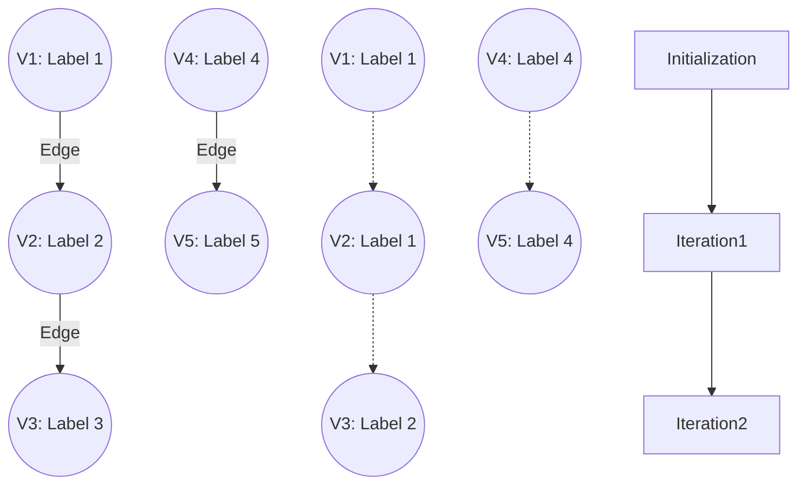

# Connected Components

**A clustering algorithm that identifies distinct, isolated subgraphs where every vertex can reach every other vertex within that subgraph, assigning a unique community ID to each group.**

## Why It Matters

In massive graphs, everything is rarely connected to everything else. Usually, the graph fractures into multiple distinct islands or "components." Finding these islands is a critical step in data analysis, community detection, and data quality enforcement. For instance, in fraud detection, a cluster of user accounts that frequently interact with each other—but are completely isolated from the rest of the normal user base—often indicates a coordinated fraud ring or a botnet. In master data management (MDM) and entity resolution, if you create edges between records that share similarities (like matching phone numbers or addresses), running Connected Components will cluster all records belonging to the same physical person, effectively deduplicating the database. It is an indispensable tool for identifying isolated communities and disjointed networks.

## How It Works

A **Connected Component** is a maximal set of vertices such that there is a path between every pair of vertices in the set.
*   **Strongly Connected Components (SCC)**: Takes edge direction into account. Vertex A and Vertex B are in the same SCC only if there is a path from A to B *and* a path from B to A.
*   **Weakly Connected Components (WCC)**: Ignores edge direction. If you treat all directed edges as undirected, any cluster of connected nodes forms a component. GraphX's default `connectedComponents()` algorithm calculates *weakly* connected components.

GraphX computes Connected Components using a Label Propagation algorithm via the Pregel API. The algorithm is elegant and highly efficient in a distributed system:
1.  **Initialization**: Every vertex is assigned its own `VertexId` as its initial "component ID" (or label). 
2.  **Iteration (Message Passing)**: In each superstep, a vertex examines its own component ID and sends it to all of its neighbors.
3.  **Merge & Update**: When a vertex receives component IDs from its neighbors, it compares them to its own. It keeps the **lowest** (minimum) ID it has seen. 
4.  **Convergence**: The label propagation continues. Like water flowing downhill, the smallest `VertexId` in a connected cluster eventually propagates to every single vertex in that cluster. Once no vertex updates its component ID to a lower value, the algorithm halts. All vertices sharing the same lowest ID belong to the same component.

Because SCC requires tracking paths in both directions, it is significantly more computationally expensive than WCC. GraphX provides a separate `stronglyConnectedComponents(numIter)` method for this purpose.

## Flow Diagram



## Data Visualization

Tracing the Label Propagation of a 3-node connected line: $V3 \leftrightarrow V2 \leftrightarrow V1$

| Node | Init Label | Iteration 1 Receives | Iteration 1 Result Label | Iteration 2 Receives | Iteration 2 Result Label |
|---|---|---|---|---|---|
| **V3** | 3 | Min(2) | 2 | Min(1) | **1** |
| **V2** | 2 | Min(3, 1) | 1 | Min(3, 1) | **1** |
| **V1** | 1 | Min(2) | 1 | Min(2) | **1** |

*Result: All nodes converge to Component ID 1.*

## Code Example

```scala
import org.apache.spark.sql.SparkSession
import org.apache.spark.graphx._
import org.apache.spark.rdd.RDD

object ConnectedComponentsExample {
  def main(args: Array[String]): Unit = {
    val spark = SparkSession.builder().appName("ConnectedComponents").master("local[*]").getOrCreate()
    val sc = spark.sparkContext
    sc.setLogLevel("ERROR")

    // Define vertices (Users)
    val users: RDD[(VertexId, String)] = sc.parallelize(Array(
      (1L, "Alice"), (2L, "Bob"), (3L, "Charlie"), // Group A
      (4L, "David"), (5L, "Eve"),                  // Group B
      (6L, "Frank")                                // Group C (Isolated)
    ))

    // Define edges (Friendships). Notice they are disjointed.
    val relationships: RDD[Edge[String]] = sc.parallelize(Array(
      Edge(1L, 2L, "friend"), Edge(2L, 3L, "friend"), // 1-2-3 are connected
      Edge(4L, 5L, "friend")                          // 4-5 are connected
      // 6 has no edges
    ))

    val graph = Graph(users, relationships)

    // 1. Run the Connected Components algorithm
    // This returns a graph where the vertex attribute is the Component ID (lowest VertexId in the cluster)
    val ccGraph = graph.connectedComponents()

    // 2. Join the component IDs back to the original usernames
    val usersWithComponents = ccGraph.vertices.join(users).map {
      case (id, (componentId, name)) => (componentId, name)
    }

    // 3. Group by Component ID to see the communities
    val communities = usersWithComponents.groupByKey()

    println("Identified Communities / Connected Components:")
    communities.collect().foreach { case (compId, members) =>
      println(s"Component ID $compId consists of users: ${members.mkString(", ")}")
    }

    /* Expected Output:
       Component ID 1 consists of users: Alice, Bob, Charlie
       Component ID 4 consists of users: David, Eve
       Component ID 6 consists of users: Frank
    */

    spark.stop()
  }
}
```

## Common Pitfalls

*   **Assuming `connectedComponents` respects direction**: As mentioned, GraphX's `connectedComponents()` treats the graph as undirected (weakly connected). If an edge exists A->B, the label propagation will traverse it in both directions. If directionality is strictly required for your definition of a community, you must use `stronglyConnectedComponents()`.
*   **"Hairballs" in Social Graphs**: In highly dense social networks (like Twitter), a phenomenon called the "Giant Component" occurs. Almost the entire graph forms a single massive connected component, rendering the algorithm useless for finding granular communities. For dense graphs, algorithms like Label Propagation Algorithm (LPA, which looks at neighbor frequencies rather than minimum IDs) or Triangle Counting are better suited for community detection.
*   **Performance on deep graphs**: Label propagation takes as many supersteps as the diameter (longest path) of the connected component. If your graph is a long "chain" of a million nodes, it will require a million iterations, completely freezing your Spark job. GraphX is optimized for graphs with "small-world" properties (short diameters).

## Key Takeaway

**Connected Components uses an elegant label-propagation mechanism to quickly partition massive datasets into isolated islands, serving as a foundational tool for entity resolution, anomaly detection, and graph segregation.**


---

## 🎓 Deep Learning Questions

### Q1: Why Was This Concept Introduced?
Before graph processing frameworks, identifying groups of connected entities in distributed datasets was highly complex. Using traditional relational databases or standard MapReduce required multiple self-joins or complex iterative MapReduce jobs that were extremely slow and difficult to maintain. GraphX introduced Connected Components (and Strongly Connected Components) to solve the problem of identifying isolated subgraphs efficiently in a distributed environment. It leverages the Pregel API to pass messages across nodes concurrently, overcoming the limitations of traditional table-centric processing and allowing massive networks to be partitioned into distinct islands quickly.

### Q2: What Exactly Is This Concept and How Does It Work?
A Connected Component is a maximal subgraph where all vertices are connected to each other by paths. 
In GraphX, this works through a distributed Label Propagation algorithm. 
- **Initialization:** Every vertex starts by assigning its own `VertexId` as its component label.
- **Message Passing:** In each superstep, vertices send their label to adjacent neighbors.
- **Updating:** When a vertex receives labels from its neighbors, it updates its own label to the minimum `VertexId` it has seen so far.
- **Convergence:** This process repeats iteratively until no vertex changes its label. Like water settling at the lowest point, the minimum `VertexId` cascades through the entire connected group, assigning the same ID to all members of that community.

### Q3: Where Should This Concept Be Used?
- **Fraud Detection (Banking/Finance):** Identifying fraud rings. Legitimate accounts rarely form dense, isolated clusters with other accounts, whereas synthetic identities often interact heavily with each other.
- **Master Data Management / Entity Resolution (Retail/Healthcare):** Deduplicating patient or customer records by treating similarities (shared address, phone number) as edges. A connected component represents a single real-world entity.
- **Network Segmentation (Telecommunications):** Finding distinct subnetworks or disconnected hardware clusters in IT infrastructure.
- **Recommendation Engines (Netflix/Amazon):** Finding isolated groups of items that are frequently bought or viewed together to segment catalogs.

### Q4: Where Should This Concept NOT Be Used?
- **Dense "Small World" Networks:** In dense social graphs (e.g., Twitter, Facebook), almost all users are connected by a few hops. Connected Components will just return one massive "Giant Component" containing 99% of the vertices, offering no real insight.
- **Finding Granular Sub-communities:** If you want to find sub-groups *within* a larger connected network, you should use the Label Propagation Algorithm (LPA) or PageRank, not Connected Components.
- **Extremely Deep/Linear Graphs:** Since the algorithm requires as many iterations as the longest path (diameter) of the graph, long "chain-like" graphs will cause extreme performance degradation due to too many Spark supersteps.

### Q5: How Is This Concept Different from Hadoop?

| Aspect | Hadoop MapReduce | Apache Spark (GraphX) |
|---|---|---|
| **Architecture** | Disk-based, stateless Map and Reduce phases. | In-memory distributed graph processing (Pregel API). |
| **Performance** | Very slow for iterative graph algorithms; writes to disk between steps. | Extremely fast; keeps graph state in memory across iterations. |
| **Processing Model** | Tabular/Record-based. | Graph-based (Vertices and Edges). |
| **Memory Usage** | High disk I/O, low memory dependency. | High memory dependency; caches intermediate graph states. |
| **Fault Tolerance** | Replicates data to HDFS at each step. | Lineage-based recomputation (RDDs). |
| **Typical Use Cases** | Batch ETL, flat file processing. | Iterative graph algorithms, community detection. |
| **Ease of Development** | Requires complex custom logic for multi-hop graph traversal. | Out-of-the-box `connectedComponents()` function. |

### Q6: How Can This Concept Be Related to a Traditional RDBMS?

| Feature | Relational Database (SQL) | Spark GraphX |
|---|---|---|
| **Graph Representation** | Two tables (Nodes and Edges). | `Graph[VD, ED]` object. |
| **Traversal** | Recursive Common Table Expressions (CTEs). | Pregel API / Message Passing. |
| **Performance on deep paths**| CTEs become exponentially slow and memory-heavy. | Distributed execution scales horizontally. |
| **Component ID Assignment**| Complex recursive window functions or loops. | Built-in `connectedComponents()` method. |

### Q7: What Happens Behind the Scenes?
1. **Driver**: The Spark Driver initializes the GraphX Connected Components algorithm and converts it into a Pregel iterative job.
2. **DAG Scheduler**: Creates a DAG of RDD operations for the initial state and the loop of supersteps.
3. **Task Execution**:
   - **Superstep 0**: Executors initialize all vertex values to their own `VertexId`.
   - **Superstep 1+**: Executors send the minimum `VertexId` across edges to neighbor partitions (Shuffle).
4. **Shuffle**: Message passing heavily relies on the network shuffle to move messages from an edge's source vertex partition to its destination vertex partition.
5. **Convergence**: Once a superstep produces no new updates, the DAG terminates.

```text
Driver 
  └── Initializes Pregel Job
      ├── Superstep 1: Map Edges -> Shuffle Messages -> Update Vertices
      ├── Superstep 2: Map Edges -> Shuffle Messages -> Update Vertices
      └── ...
          └── Convergence (No messages sent) -> Return ccGraph
```

### Q8: Performance Considerations, Best Practices, and Common Mistakes

| Category | Recommendation | Why It Matters |
|---|---|---|
| **Partitioning** | Use `PartitionStrategy.EdgePartition2D`. | Minimizes network shuffle by intelligently grouping edges across executors. |
| **Checkpointing** | Enable checkpointing for deep graphs (e.g., `sc.setCheckpointDir`). | Prevents RDD lineage from growing infinitely, avoiding StackOverflow errors. |
| **Caching** | Unpersist intermediate graphs if writing custom Pregel jobs. | Prevents out-of-memory (OOM) errors over many iterations. |
| **Graph Density** | Check for the "Giant Component" before running. | Running this on a fully connected graph wastes resources with no analytical value. |

### Q9: Interview Questions

**Beginner**
1. **What is a Connected Component?** A subgraph where any node can reach any other node, totally isolated from the rest of the network.
2. **What is the difference between WCC and SCC?** WCC ignores edge direction; SCC requires a path in both directions between nodes.
3. **What is the initial label given to a node?** Its own unique `VertexId`.

**Intermediate**
4. **How does GraphX find the component ID?** It uses message passing where nodes share their component ID, and neighbors always adopt the minimum ID they receive.
5. **Why does Connected Components cause network bottlenecks?** It is an iterative algorithm that shuffles messages across the network at every superstep.
6. **How can you optimize a GraphX job?** By using 2D edge partitioning and checkpointing the lineage.

**Advanced**
7. **Explain the Pregel API's role here.** Pregel provides the vertex-centric model (think like a vertex) where nodes compute their state, send messages via edges, and update state based on received messages.
8. **What happens if a graph is highly linear (a long chain of nodes)?** The algorithm will require $N$ iterations (where $N$ is the chain length), causing severe performance degradation and potential driver crashes due to extreme lineage.
9. **How would you implement this on PySpark?** Since PySpark doesn't support GraphX, you must use GraphFrames, which provides `connectedComponents()` using DataFrames.

**Scenario-Based**
10. **Your entity resolution job is failing with a StackOverflow error. Why?** The graph diameter is too large, causing the RDD lineage to exceed JVM stack limits. Solution: Enable Spark checkpointing.
11. **You run the algorithm on user data and 99% of users have the same Component ID. What happened?** You hit the "Giant Component" phenomenon. You need a different algorithm like LPA or need to filter out weak edges first.

### Q10: Complete Real-World Example
**Business Problem:** A retail bank wants to perform Entity Resolution. They have customer records that might be duplicates. They create edges between records that share the same Phone Number or Email.
**Sample Dataset:** Customer nodes and Similarity edges. We will use PySpark with GraphFrames (the standard for Python graph processing on Spark).

```python
from pyspark.sql import SparkSession
from graphframes import GraphFrame

# Initialize Spark Session with checkpoint directory required by GraphFrames
spark = SparkSession.builder \\
    .appName("EntityResolutionWCC") \\
    .config("spark.jars.packages", "graphframes:graphframes:0.8.2-spark3.0-s_2.12") \\
    .getOrCreate()
spark.sparkContext.setCheckpointDir("/tmp/checkpoints")

# 1. Vertices: Customer Records
vertices = spark.createDataFrame([
    ("C1", "John Doe"),
    ("C2", "J. Doe"),
    ("C3", "Johnathan D."),
    ("C4", "Alice Smith"),
    ("C5", "A. Smith"),
    ("C6", "Bob Unknown")  # Isolated
], ["id", "name"])

# 2. Edges: Shared attributes (e.g., C1 and C2 share a phone number)
edges = spark.createDataFrame([
    ("C1", "C2", "Shared Phone"),
    ("C2", "C3", "Shared Email"),
    ("C4", "C5", "Shared Address")
], ["src", "dst", "relationship"])

# 3. Create GraphFrame
g = GraphFrame(vertices, edges)

# 4. Run Connected Components
# The result adds a 'component' column to the vertices DataFrame
result = g.connectedComponents()

# 5. Show resolved entities
print("Resolved Entities / Connected Components:")
result.select("id", "name", "component").orderBy("component").show()

\"\"\"
Expected Output:
+---+------------+------------+
| id|        name|   component|
+---+------------+------------+
| C1|    John Doe|154618822656|
| C2|      J. Doe|154618822656|
| C3|Johnathan D.|154618822656|
| C4| Alice Smith|352187318272|
| C5|    A. Smith|352187318272|
| C6| Bob Unknown|816043786240|
+---+------------+------------+
Performance Note: GraphFrames requires a checkpoint directory because 
WCC is highly iterative and generates massive execution plans.
\"\"\"
```

### 💡 Key Takeaways
- Bullet list of 5-7 key insights:
  - Connected Components clusters graphs into completely isolated subgraphs.
  - It is heavily used in master data management (MDM) and fraud detection.
  - It computes by propagating the lowest Vertex ID to all connected neighbors iteratively.
  - Direction matters: WCC (default) ignores edge directions; SCC enforces them.
  - Graph processing requires checkpointing for deep datasets to truncate execution plans.

### ⚠️ Common Misconceptions
- Bullet list of 3-5 things people get wrong:
  - **Misconception:** It finds communities within a connected network. **Fact:** It only finds isolated islands. For internal communities, use LPA.
  - **Misconception:** It's cheap to run. **Fact:** It requires heavy network shuffling and iterations proportional to the graph's diameter.
  - **Misconception:** PySpark natively supports GraphX. **Fact:** Python users must use GraphFrames to achieve the same result.

### 🔗 Related Spark Concepts
- GraphX Pregel API
- Label Propagation Algorithm (LPA)
- Strongly Connected Components (SCC)
- Spark Checkpointing
- RDD Lineage and DAG Execution

### 📚 References for Further Reading
- Apache Spark GraphX Official Documentation
- Learning Spark (O'Reilly)
- Spark: The Definitive Guide (O'Reilly)
