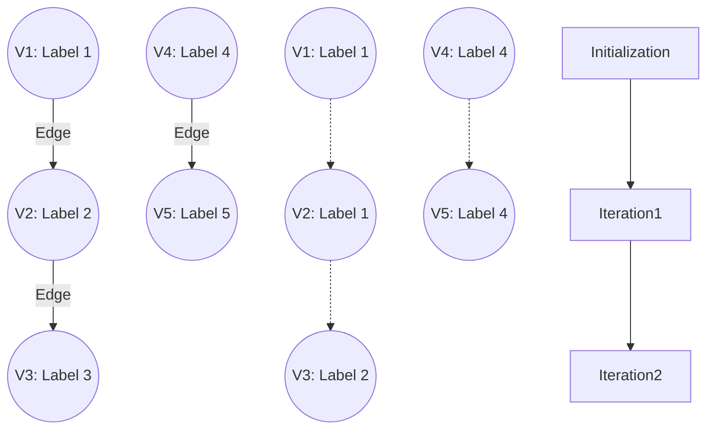

# Connected Components

**A clustering algorithm that identifies distinct, isolated subgraphs where every vertex can reach every other vertex within that subgraph, assigning a unique community ID to each group.**

## Why It Matters

In massive graphs, everything is rarely connected to everything else. Usually, the graph fractures into multiple distinct islands or "components." Finding these islands is a critical step in data analysis, community detection, and data quality enforcement. For instance, in fraud detection, a cluster of user accounts that frequently interact with each other—but are completely isolated from the rest of the normal user base—often indicates a coordinated fraud ring or a botnet. In master data management (MDM) and entity resolution, if you create edges between records that share similarities (like matching phone numbers or addresses), running Connected Components will cluster all records belonging to the same physical person, effectively deduplicating the database. It is an indispensable tool for identifying isolated communities and disjointed networks.

## How It Works

A **Connected Component** is a maximal set of vertices such that there is a path between every pair of vertices in the set.
*   **Strongly Connected Components (SCC)**: Takes edge direction into account. Vertex A and Vertex B are in the same SCC only if there is a path from A to B *and* a path from B to A.
*   **Weakly Connected Components (WCC)**: Ignores edge direction. If you treat all directed edges as undirected, any cluster of connected nodes forms a component. GraphX's default `connectedComponents()` algorithm calculates *weakly* connected components.

GraphX computes Connected Components using a Label Propagation algorithm via the Pregel API. The algorithm is elegant and highly efficient in a distributed system:
1.  **Initialization**: Every vertex is assigned its own `VertexId` as its initial "component ID" (or label). 
2.  **Iteration (Message Passing)**: In each superstep, a vertex examines its own component ID and sends it to all of its neighbors.
3.  **Merge & Update**: When a vertex receives component IDs from its neighbors, it compares them to its own. It keeps the **lowest** (minimum) ID it has seen. 
4.  **Convergence**: The label propagation continues. Like water flowing downhill, the smallest `VertexId` in a connected cluster eventually propagates to every single vertex in that cluster. Once no vertex updates its component ID to a lower value, the algorithm halts. All vertices sharing the same lowest ID belong to the same component.

Because SCC requires tracking paths in both directions, it is significantly more computationally expensive than WCC. GraphX provides a separate `stronglyConnectedComponents(numIter)` method for this purpose.

## Flow Diagram



## Data Visualization

Tracing the Label Propagation of a 3-node connected line: $V3 \leftrightarrow V2 \leftrightarrow V1$

| Node | Init Label | Iteration 1 Receives | Iteration 1 Result Label | Iteration 2 Receives | Iteration 2 Result Label |
|---|---|---|---|---|---|
| **V3** | 3 | Min(2) | 2 | Min(1) | **1** |
| **V2** | 2 | Min(3, 1) | 1 | Min(3, 1) | **1** |
| **V1** | 1 | Min(2) | 1 | Min(2) | **1** |

*Result: All nodes converge to Component ID 1.*

## Code Example

```scala
import org.apache.spark.sql.SparkSession
import org.apache.spark.graphx._
import org.apache.spark.rdd.RDD

object ConnectedComponentsExample {
  def main(args: Array[String]): Unit = {
    val spark = SparkSession.builder().appName("ConnectedComponents").master("local[*]").getOrCreate()
    val sc = spark.sparkContext
    sc.setLogLevel("ERROR")

    // Define vertices (Users)
    val users: RDD[(VertexId, String)] = sc.parallelize(Array(
      (1L, "Alice"), (2L, "Bob"), (3L, "Charlie"), // Group A
      (4L, "David"), (5L, "Eve"),                  // Group B
      (6L, "Frank")                                // Group C (Isolated)
    ))

    // Define edges (Friendships). Notice they are disjointed.
    val relationships: RDD[Edge[String]] = sc.parallelize(Array(
      Edge(1L, 2L, "friend"), Edge(2L, 3L, "friend"), // 1-2-3 are connected
      Edge(4L, 5L, "friend")                          // 4-5 are connected
      // 6 has no edges
    ))

    val graph = Graph(users, relationships)

    // 1. Run the Connected Components algorithm
    // This returns a graph where the vertex attribute is the Component ID (lowest VertexId in the cluster)
    val ccGraph = graph.connectedComponents()

    // 2. Join the component IDs back to the original usernames
    val usersWithComponents = ccGraph.vertices.join(users).map {
      case (id, (componentId, name)) => (componentId, name)
    }

    // 3. Group by Component ID to see the communities
    val communities = usersWithComponents.groupByKey()

    println("Identified Communities / Connected Components:")
    communities.collect().foreach { case (compId, members) =>
      println(s"Component ID $compId consists of users: ${members.mkString(", ")}")
    }

    /* Expected Output:
       Component ID 1 consists of users: Alice, Bob, Charlie
       Component ID 4 consists of users: David, Eve
       Component ID 6 consists of users: Frank
    */

    spark.stop()
  }
}
```

## Common Pitfalls

*   **Assuming `connectedComponents` respects direction**: As mentioned, GraphX's `connectedComponents()` treats the graph as undirected (weakly connected). If an edge exists A->B, the label propagation will traverse it in both directions. If directionality is strictly required for your definition of a community, you must use `stronglyConnectedComponents()`.
*   **"Hairballs" in Social Graphs**: In highly dense social networks (like Twitter), a phenomenon called the "Giant Component" occurs. Almost the entire graph forms a single massive connected component, rendering the algorithm useless for finding granular communities. For dense graphs, algorithms like Label Propagation Algorithm (LPA, which looks at neighbor frequencies rather than minimum IDs) or Triangle Counting are better suited for community detection.
*   **Performance on deep graphs**: Label propagation takes as many supersteps as the diameter (longest path) of the connected component. If your graph is a long "chain" of a million nodes, it will require a million iterations, completely freezing your Spark job. GraphX is optimized for graphs with "small-world" properties (short diameters).

## Key Takeaway

**Connected Components uses an elegant label-propagation mechanism to quickly partition massive datasets into isolated islands, serving as a foundational tool for entity resolution, anomaly detection, and graph segregation.**
