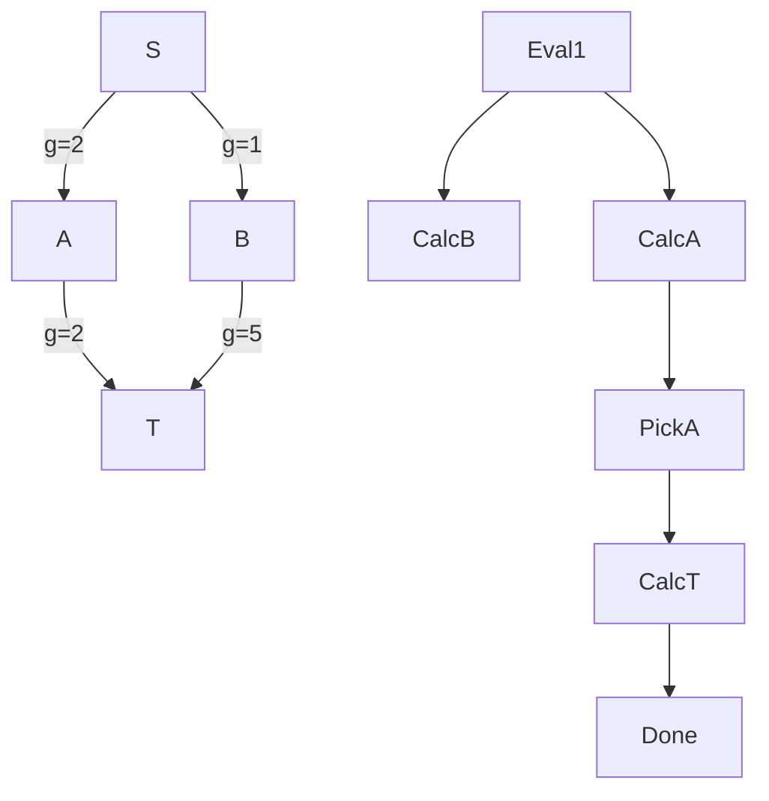

# A* Search Algorithm

**An informed, best-first search algorithm that finds the shortest path by utilizing a heuristic function to intelligently guide the search toward the destination, massively reducing the computation space compared to blind search.**

## Why It Matters

Dijkstra’s algorithm finds the shortest path, but it searches blindly. Imagine you are in New York and want to drive to Los Angeles. Dijkstra’s algorithm will explore roads leading to Boston, Miami, and Chicago just as eagerly as roads heading West, expanding outward in a perfect circle until it eventually hits LA. This blind expansion requires evaluating a massive number of irrelevant nodes. 

The A* (A-star) search algorithm solves this by introducing "heuristics"—rules of thumb. By knowing that LA is West of New York, A* prioritizes evaluating paths that move geographically closer to the destination. It is the gold standard for pathfinding in GPS navigation systems, video game AI, and robotics routing. Understanding how to implement A* is crucial because it bridges the gap between pure graph theory and practical, high-performance, real-world routing where evaluating the entire graph is computationally impossible.

## How It Works

A* evaluates nodes by combining two metrics into a single cost function, $f(n)$:
$$f(n) = g(n) + h(n)$$

*   **$g(n)$**: The actual, exact cost (distance/weight) to reach node $n$ from the start node. This is identical to how Dijkstra operates.
*   **$h(n)$**: The **heuristic** cost. This is an estimated cost from node $n$ to the target. In a physical map, this is often the "straight-line" (Euclidean) distance or Manhattan distance to the target. 

By adding these together, $f(n)$ estimates the total cost of the path going *through* node $n$. A* maintains two sets:
1.  **Open Set (Priority Queue)**: The set of discovered nodes that need to be evaluated. Nodes with the lowest $f(n)$ are evaluated first.
2.  **Closed Set**: The set of nodes already evaluated.

At each step, A* pulls the node with the lowest $f(n)$ from the Open Set. If this node is the target, the path is found. Otherwise, it adds the node to the Closed Set, evaluates all its neighbors, calculates their $g(n)$, $h(n)$, and $f(n)$, and adds them to the Open Set.

**The Admissibility Rule**: For A* to guarantee finding the optimal (shortest) path, the heuristic $h(n)$ must be **admissible**. This means $h(n)$ must *never overestimate* the true cost to reach the target. If the straight-line distance is 10 miles, the actual road distance might be 15 miles, which is fine (underestimate). But if the heuristic estimates 20 miles, A* might incorrectly skip optimal paths.

While GraphX does not have a built-in A* function (because heuristics are heavily domain-dependent), implementing it typically involves extracting the relevant subgraph or utilizing Spark's map-reduce capabilities alongside local collections (PriorityQueues) for driving the heuristic search.

## Flow Diagram



## Data Visualization

**Comparing Dijkstra vs. A* Node Expansion**
Imagine a 10x10 grid with Start at (0,0) and Target at (9,9).

| Algorithm | Heuristic Used | Nodes Evaluated (Approx) | Path Found | Execution Time |
|---|---|---|---|---|
| Dijkstra | None (Blind Search) | 100 (Entire Grid) | Optimal | Slow |
| Greedy Best-First | $h(n)$ only | 19 (Direct line) | Sub-optimal | Very Fast |
| **A\*** | **$f(n) = g(n) + h(n)$** | **~25 (Directed Expansion)** | **Optimal** | **Fast** |

*A\* balances the optimality of Dijkstra with the speed of a greedy search.*

## Code Example

```python
# Note: A* is heavily sequential by nature. While it operates on graphs, 
# distributing a priority queue across a Spark cluster is highly inefficient. 
# In practice, for A* on Spark, engineers often extract a localized subgraph 
# using GraphX, collect it to the driver, and run A* locally. 
# Here is the core logical implementation of A* in Python for clarity.

import heapq

def heuristic(node, target):
    # Manhattan distance heuristic for grid-based graphs
    return abs(node[0] - target[0]) + abs(node[1] - target[1])

def a_star_search(graph_edges, start, target):
    # Open set is a priority queue: (f_score, node)
    open_set = []
    heapq.heappush(open_set, (0, start))
    
    # Track the exact cost to reach each node from start
    g_score = {start: 0}
    
    # Track paths for reconstruction
    came_from = {}
    
    while open_set:
        # Get node with lowest f_score
        current_f, current = heapq.heappop(open_set)
        
        if current == target:
            # Reconstruct path
            path = []
            while current in came_from:
                path.append(current)
                current = came_from[current]
            path.append(start)
            return path[::-1] # Reverse to get Start -> Target
            
        # Check neighbors (assuming graph_edges is a dict of dicts: node -> neighbor -> weight)
        for neighbor, weight in graph_edges.get(current, {}).items():
            # Calculate tentative g_score
            tentative_g = g_score[current] + weight
            
            # If this is a better path to the neighbor
            if neighbor not in g_score or tentative_g < g_score[neighbor]:
                came_from[neighbor] = current
                g_score[neighbor] = tentative_g
                
                # f(n) = g(n) + h(n)
                f_score = tentative_g + heuristic(neighbor, target)
                heapq.heappush(open_set, (f_score, neighbor))
                
    return None # Path not found

# Example Usage
graph = {
    (0,0): {(0,1): 1, (1,0): 1},
    (1,0): {(1,1): 1, (2,0): 1},
    (0,1): {(1,1): 1},
    (1,1): {(2,1): 1, (1,2): 1},
    (2,1): {(2,2): 1},
    (1,2): {(2,2): 1}
}

path = a_star_search(graph, (0,0), (2,2))
print(f"Optimal Path found by A*: {path}")
# Output: Optimal Path found by A*: [(0, 0), (1, 0), (1, 1), (2, 1), (2, 2)]
```

## Common Pitfalls

*   **Inadmissible Heuristics**: If you accidentally write a heuristic that overestimates the distance (e.g., using straight-line distance but failing to account for map scale), A* becomes a "greedy" search. It will find a path very quickly, but it is no longer guaranteed to be the shortest path.
*   **Attempting to distribute the Open Set**: Distributing a global Priority Queue across a Spark cluster requires a global lock and massive network shuffles on every iteration, effectively destroying performance. A* is inherently sequential. GraphX is best used to prepare the graph or compute heuristics offline, leaving the actual A* traversal to run locally on a driver or micro-service.
*   **Ignoring Tie-Breaking**: When many nodes have the same $f(n)$ score (common in grid maps), the priority queue expands randomly, creating a "flood-fill" effect that looks like Dijkstra. Slightly scaling the heuristic (e.g., $h(n) \times 1.001$) breaks ties and forces the algorithm to push aggressively toward the target.
*   **Dynamic Environments**: A* assumes the graph is static during traversal. If edge weights change (e.g., live traffic updates), the pre-calculated $g(n)$ and $f(n)$ scores become invalid. Algorithms like D* or Lifelong Planning A* (LPA*) are required for dynamic graphs.

## Key Takeaway

**By injecting human intuition as a mathematical heuristic, A* search transforms the blind exhaustion of Dijkstra into a focused, high-performance laser beam directed straight at the destination.**
