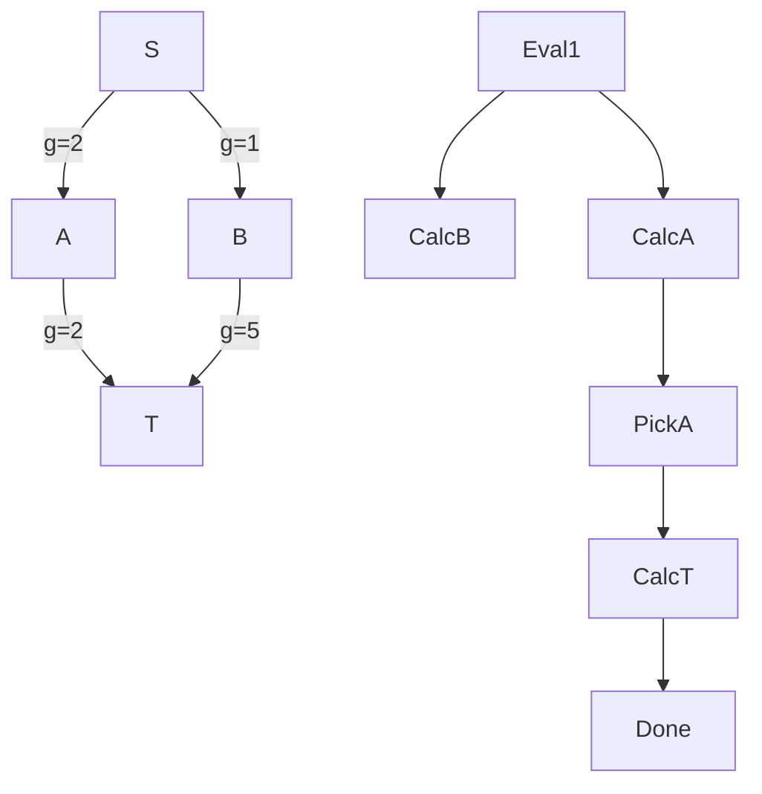

# A* Search Algorithm

**An informed, best-first search algorithm that finds the shortest path by utilizing a heuristic function to intelligently guide the search toward the destination, massively reducing the computation space compared to blind search.**

## Why It Matters

Dijkstra’s algorithm finds the shortest path, but it searches blindly. Imagine you are in New York and want to drive to Los Angeles. Dijkstra’s algorithm will explore roads leading to Boston, Miami, and Chicago just as eagerly as roads heading West, expanding outward in a perfect circle until it eventually hits LA. This blind expansion requires evaluating a massive number of irrelevant nodes. 

The A* (A-star) search algorithm solves this by introducing "heuristics"—rules of thumb. By knowing that LA is West of New York, A* prioritizes evaluating paths that move geographically closer to the destination. It is the gold standard for pathfinding in GPS navigation systems, video game AI, and robotics routing. Understanding how to implement A* is crucial because it bridges the gap between pure graph theory and practical, high-performance, real-world routing where evaluating the entire graph is computationally impossible.

## How It Works

A* evaluates nodes by combining two metrics into a single cost function, $f(n)$:
$$f(n) = g(n) + h(n)$$

*   **$g(n)$**: The actual, exact cost (distance/weight) to reach node $n$ from the start node. This is identical to how Dijkstra operates.
*   **$h(n)$**: The **heuristic** cost. This is an estimated cost from node $n$ to the target. In a physical map, this is often the "straight-line" (Euclidean) distance or Manhattan distance to the target. 

By adding these together, $f(n)$ estimates the total cost of the path going *through* node $n$. A* maintains two sets:
1.  **Open Set (Priority Queue)**: The set of discovered nodes that need to be evaluated. Nodes with the lowest $f(n)$ are evaluated first.
2.  **Closed Set**: The set of nodes already evaluated.

At each step, A* pulls the node with the lowest $f(n)$ from the Open Set. If this node is the target, the path is found. Otherwise, it adds the node to the Closed Set, evaluates all its neighbors, calculates their $g(n)$, $h(n)$, and $f(n)$, and adds them to the Open Set.

**The Admissibility Rule**: For A* to guarantee finding the optimal (shortest) path, the heuristic $h(n)$ must be **admissible**. This means $h(n)$ must *never overestimate* the true cost to reach the target. If the straight-line distance is 10 miles, the actual road distance might be 15 miles, which is fine (underestimate). But if the heuristic estimates 20 miles, A* might incorrectly skip optimal paths.

While GraphX does not have a built-in A* function (because heuristics are heavily domain-dependent), implementing it typically involves extracting the relevant subgraph or utilizing Spark's map-reduce capabilities alongside local collections (PriorityQueues) for driving the heuristic search.

## Flow Diagram



## Data Visualization

**Comparing Dijkstra vs. A* Node Expansion**
Imagine a 10x10 grid with Start at (0,0) and Target at (9,9).

| Algorithm | Heuristic Used | Nodes Evaluated (Approx) | Path Found | Execution Time |
|---|---|---|---|---|
| Dijkstra | None (Blind Search) | 100 (Entire Grid) | Optimal | Slow |
| Greedy Best-First | $h(n)$ only | 19 (Direct line) | Sub-optimal | Very Fast |
| **A\*** | **$f(n) = g(n) + h(n)$** | **~25 (Directed Expansion)** | **Optimal** | **Fast** |

*A\* balances the optimality of Dijkstra with the speed of a greedy search.*

## Code Example

```python
# Note: A* is heavily sequential by nature. While it operates on graphs, 
# distributing a priority queue across a Spark cluster is highly inefficient. 
# In practice, for A* on Spark, engineers often extract a localized subgraph 
# using GraphX, collect it to the driver, and run A* locally. 
# Here is the core logical implementation of A* in Python for clarity.

import heapq

def heuristic(node, target):
    # Manhattan distance heuristic for grid-based graphs
    return abs(node[0] - target[0]) + abs(node[1] - target[1])

def a_star_search(graph_edges, start, target):
    # Open set is a priority queue: (f_score, node)
    open_set = []
    heapq.heappush(open_set, (0, start))
    
    # Track the exact cost to reach each node from start
    g_score = {start: 0}
    
    # Track paths for reconstruction
    came_from = {}
    
    while open_set:
        # Get node with lowest f_score
        current_f, current = heapq.heappop(open_set)
        
        if current == target:
            # Reconstruct path
            path = []
            while current in came_from:
                path.append(current)
                current = came_from[current]
            path.append(start)
            return path[::-1] # Reverse to get Start -> Target
            
        # Check neighbors (assuming graph_edges is a dict of dicts: node -> neighbor -> weight)
        for neighbor, weight in graph_edges.get(current, {}).items():
            # Calculate tentative g_score
            tentative_g = g_score[current] + weight
            
            # If this is a better path to the neighbor
            if neighbor not in g_score or tentative_g < g_score[neighbor]:
                came_from[neighbor] = current
                g_score[neighbor] = tentative_g
                
                # f(n) = g(n) + h(n)
                f_score = tentative_g + heuristic(neighbor, target)
                heapq.heappush(open_set, (f_score, neighbor))
                
    return None # Path not found

# Example Usage
graph = {
    (0,0): {(0,1): 1, (1,0): 1},
    (1,0): {(1,1): 1, (2,0): 1},
    (0,1): {(1,1): 1},
    (1,1): {(2,1): 1, (1,2): 1},
    (2,1): {(2,2): 1},
    (1,2): {(2,2): 1}
}

path = a_star_search(graph, (0,0), (2,2))
print(f"Optimal Path found by A*: {path}")
# Output: Optimal Path found by A*: [(0, 0), (1, 0), (1, 1), (2, 1), (2, 2)]
```

## Common Pitfalls

*   **Inadmissible Heuristics**: If you accidentally write a heuristic that overestimates the distance (e.g., using straight-line distance but failing to account for map scale), A* becomes a "greedy" search. It will find a path very quickly, but it is no longer guaranteed to be the shortest path.
*   **Attempting to distribute the Open Set**: Distributing a global Priority Queue across a Spark cluster requires a global lock and massive network shuffles on every iteration, effectively destroying performance. A* is inherently sequential. GraphX is best used to prepare the graph or compute heuristics offline, leaving the actual A* traversal to run locally on a driver or micro-service.
*   **Ignoring Tie-Breaking**: When many nodes have the same $f(n)$ score (common in grid maps), the priority queue expands randomly, creating a "flood-fill" effect that looks like Dijkstra. Slightly scaling the heuristic (e.g., $h(n) \times 1.001$) breaks ties and forces the algorithm to push aggressively toward the target.
*   **Dynamic Environments**: A* assumes the graph is static during traversal. If edge weights change (e.g., live traffic updates), the pre-calculated $g(n)$ and $f(n)$ scores become invalid. Algorithms like D* or Lifelong Planning A* (LPA*) are required for dynamic graphs.

## Key Takeaway

**By injecting human intuition as a mathematical heuristic, A* search transforms the blind exhaustion of Dijkstra into a focused, high-performance laser beam directed straight at the destination.**


---

## 🎓 Deep Learning Questions

### Q1: Why Was This Concept Introduced?
Historically, pathfinding on large graphs relied on Dijkstra’s algorithm, which guaranteed the shortest path but operated blindly. It explored paths in every direction equally, expanding outwardly like a ripple in a pond. When navigating from New York to Los Angeles, Dijkstra would needlessly search through Boston or Miami before eventually reaching the West Coast. 

This exhaustive search is extremely computationally expensive for large-scale graphs, such as real-world road networks or complex gaming terrains. The A* (A-star) algorithm was introduced to solve this massive inefficiency. By incorporating a mathematical heuristic (a smart "guess" like geographical straight-line distance), A* gives the search algorithm a sense of direction. It introduced the ability to prioritize exploring nodes that move geographically closer to the target, avoiding paths that go the wrong way. In distributed environments like Apache Spark, reducing the search space is critical, because evaluating unnecessary nodes means unnecessary shuffles and computational overhead.

### Q2: What Exactly Is This Concept and How Does It Work?
A* is a "best-first" search algorithm. Unlike blind algorithms, it makes intelligent decisions about which node to explore next by assigning a score to each node.

The score function is exactly: **$f(n) = g(n) + h(n)$**

- **$g(n)$**: The known, exact cost to travel from the starting node to the current node $n$.
- **$h(n)$**: The heuristic cost. This is an estimated cost from node $n$ to the final destination (e.g., straight-line Euclidean distance).

**How it works:**
1. A* starts at the initial node and calculates $f(n)$ for all immediate neighbors.
2. It places these neighbors into a Priority Queue (the "Open Set").
3. The algorithm pulls the node with the lowest $f(n)$ score from the queue.
4. It explores this node's neighbors, calculates their scores, and adds them to the queue.
5. This repeats until the target is reached. Because the algorithm always pulls the lowest $f(n)$, it naturally favors paths that are short ($g$) and point toward the destination ($h$).

### Q3: Where Should This Concept Be Used?
A* is the ultimate algorithm for directed pathfinding where a heuristic can be calculated. Production use cases include:

*   **Logistics and Ride-Sharing (Uber, Lyft, Amazon):** Finding the fastest route for a driver to a passenger or a delivery van to a neighborhood, using geographical coordinates as the heuristic.
*   **Video Game AI:** Directing NPCs (non-player characters) to navigate complex terrain without evaluating every single tile on the map.
*   **Network Routing:** Finding optimal paths for data packets over large-scale wide-area networks, where geographic distance or historical latency serves as a heuristic.
*   **Robotics:** Autonomous robots navigating warehouse floors (like Amazon Kiva robots), using A* to dodge obstacles and reach specific racks.

### Q4: Where Should This Concept NOT Be Used?
A* relies entirely on the existence of a valid heuristic. It should **NOT** be used when:

*   **No Heuristic Exists:** In abstract graphs like social networks (e.g., "find the shortest connection between user A and user B"), there is no physical geometry or clear heuristic to guess distance. Use Breadth-First Search (BFS) or Dijkstra instead.
*   **Massively Distributed Open Sets:** True A* requires a global Priority Queue. Trying to distribute this queue across 100 Spark executors leads to massive network locking and shuffling, crippling performance. 
*   **Dynamic Graphs:** If road closures happen every second, the pre-calculated $g(n)$ costs invalidate instantly. Algorithms like D* Lite are better for constantly changing environments.
*   **Negative Edge Weights:** Like Dijkstra, A* cannot handle graphs where traveling a path gives a negative cost (use Bellman-Ford instead).

### Q5: How Is This Concept Different from Hadoop?

| Aspect | Hadoop MapReduce | Apache Spark / GraphX (A*) |
| :--- | :--- | :--- |
| **Architecture** | Disk-based Map/Reduce phases. | In-memory graph processing (Pregel API). |
| **Performance** | Extremely slow for iterative graph traversal. | 10x-100x faster due to in-memory caching. |
| **Processing Model** | Batch processing strictly. | Graph-parallel processing. |
| **Memory Usage** | Heavy disk I/O at every iteration. | Leverages RAM for caching subgraphs. |
| **Fault Tolerance** | Writes intermediate data to HDFS. | Lineage-based fault tolerance via RDDs. |
| **Scalability** | Scales well but incredibly slow. | Scales well, filters subgraphs efficiently. |
| **Ease of Development** | Requires complex custom Java MapReduce code. | GraphX provides Pregel API for message passing. |
| **Typical Use Cases** | Batch ETL, word count, data aggregation. | Fast pathfinding on filtered localized graphs. |
| **Advantages** | Extremely robust for massive data. | Real-time or near real-time pathfinding capabilities. |
| **Disadvantages** | Iterative algorithms are impossibly slow. | Requires extracting subgraph to Driver for true A*. |

### Q6: How Can This Concept Be Related to a Traditional RDBMS?
Relational databases are fundamentally not designed for A* search, but we can compare the mechanisms.

| RDBMS Concept | Spark GraphX / A* Equivalent | Explanation |
| :--- | :--- | :--- |
| Recursive CTEs | Graph Traversal (Open Set) | RDBMS uses `WITH RECURSIVE` to traverse hierarchies; A* uses a Priority Queue to traverse edges dynamically. |
| Indexing (B-Tree) | Heuristic Function | An index guides the database to skip irrelevant rows. A heuristic guides A* to skip irrelevant graph nodes. |
| Filter Pushdown | Directed Search Space | RDBMS pushes filters to storage to reduce data. A* uses $f(n)$ to inherently filter out bad paths. |
| Tables with Foreign Keys | Edge RDDs | The raw structure storing connections between nodes. |

### Q7: What Happens Behind the Scenes?
Because a global Priority Queue cannot be efficiently distributed in Spark, a production A* pipeline in Spark looks like this:

1. **Driver Phase 1:** You define a bounding box (based on the heuristic) to limit the graph size.
2. **DAG Generation:** Spark generates a plan to filter the massive graph (Vertices and Edges) using distributed processing.
3. **Task Execution:** Executors filter out nodes that are drastically far away (e.g., filtering out Europe when finding a path in the USA).
4. **Action (Collect):** The much smaller, localized subgraph is collected to the Driver's memory.
5. **Local A* Execution:** The Driver runs a standard, highly-optimized local A* algorithm using a standard Python/Scala Priority Queue.

```text
[Spark Executors] -> Filter 1 Billion Edges down to 10,000 Edges (Bounding Box)
       |
    (Collect)
       v
[Spark Driver] -> Initialize Open Set (Priority Queue)
       |
       +--> Loop: Pop lowest f(n)
       |      |
       |      +--> Check Neighbors
       |      +--> Calc g(n) + h(n)
       |      +--> Push to Open Set
       |
       +--> Destination Reached -> Return Path
```

### Q8: Performance Considerations, Best Practices, and Common Mistakes

| Category | Recommendation | Why It Matters |
| :--- | :--- | :--- |
| **Performance impact** | Pre-filter the graph with Spark before running A*. | A true distributed Priority Queue causes severe network bottlenecks. Collecting a bounding box to the Driver is much faster. |
| **Optimization** | Utilize memory caching for vertices and edges. | Speeds up the filtering process before subgraph extraction. |
| **Best practices** | Ensure heuristic is "Admissible". | If $h(n)$ overestimates the true cost, A* loses its mathematical guarantee to find the absolute shortest path. |
| **Common mistakes** | Trying to implement A* purely in Pregel. | Pregel processes all active vertices per superstep. A* requires strict sequential evaluation of the single best node, which fights Pregel's bulk-synchronous design. |
| **Production tips** | Run large pathfinding on a dedicated Driver or export to Neo4j. | The Driver can run out of memory (OOM) if the extracted bounding box is still too large. |
| **Debugging** | Check tie-breaking rules. | Inflating the heuristic ($h(n) \times 1.001$) prevents uniform grid explosion when many nodes have identical $f(n)$ scores. |

### Q9: Interview Questions

**Beginner**
1. **What is the main difference between A* and Dijkstra's algorithm?** 
   *Answer:* A* uses a heuristic to guide the search toward the target, whereas Dijkstra searches blindly in all directions.
2. **What does the formula $f(n) = g(n) + h(n)$ mean?**
   *Answer:* It calculates the total estimated cost of a path. $g(n)$ is the exact cost from start to node $n$, and $h(n)$ is the estimated cost from node $n$ to the target.
3. **What happens if the heuristic $h(n)$ is always 0?**
   *Answer:* A* degrades exactly into Dijkstra’s algorithm, effectively disabling the "smart" directional search.

**Intermediate**
4. **Why is it a bad idea to run a pure A* search algorithm using Spark's Pregel API?**
   *Answer:* A* requires a global Priority Queue to process the *single* best node next. Pregel evaluates *all* active nodes in parallel per step. Emulating a global queue in Pregel causes massive shuffle overhead and locks.
5. **What is an "admissible" heuristic?**
   *Answer:* A heuristic that never overestimates the true cost to reach the goal. It ensures A* finds the optimal path.
6. **How do you handle A* on a massive graph of 10 billion edges in Spark?**
   *Answer:* Use Spark to distributedly filter the graph to a reasonable bounding box based on coordinate geometry, collect the subgraph to the Driver, and run A* locally.

**Advanced**
7. **If you use Manhattan distance on a graph that allows diagonal movement, what happens to A*?**
   *Answer:* Manhattan distance will overestimate the true cost (since diagonals are faster). The heuristic becomes inadmissible, and A* may return a sub-optimal path (it becomes a greedy search).
8. **Explain how "tie-breaking" improves A* performance.**
   *Answer:* In grids, many paths have identical $f(n)$ costs. By slightly modifying the heuristic formula (e.g., multiplying by 1.001), you force the queue to favor paths slightly closer to the straight line, preventing explosive outward searching.
9. **How does A* handle dynamic graphs where edge weights change during traversal?**
   *Answer:* Standard A* cannot handle this because pre-calculated $g(n)$ costs become invalid. You would need algorithms designed for dynamic environments like D* or LPA*.

**Scenario-Based**
10. **You are building a delivery routing system for Uber in Spark. Dijkstra takes 10 minutes to run, which is too slow. Walk through your solution.**
    *Answer:* I would implement A* by introducing Euclidean distance as a heuristic. To scale it in Spark, I would pre-compute static geographical bounds, filter the road network RDD to only include roads between the origin and destination bounding box, and run the localized A* search on the Driver.
11. **Your A* implementation on a large grid is acting just like Dijkstra, expanding uniformly. What is wrong?**
    *Answer:* The environment likely has many paths with identical $f(n)$ scores. Without a tie-breaking rule, the priority queue pops nodes in all directions. I would slightly scale the heuristic by a tiny fraction to break the ties.

### Q10: Complete Real-World Example

**Business Problem:** A logistics company needs to find the shortest delivery route between two warehouses on a regional map. The full national map is too large for local memory, so they use PySpark to filter the graph, and then apply A* on the localized result.

**Sample Dataset:** A list of road segments (edges) with distances (weights), and a list of intersections (vertices) with X/Y coordinates.

**PySpark Code:**

```python
from pyspark.sql import SparkSession
import heapq
import math

# 1. Initialize Spark
spark = SparkSession.builder.appName("AStarHybridRouting").getOrCreate()

# 2. Sample Graph Data: (src, dst, distance)
edges_data = [
    ("WarehouseA", "Point1", 10),
    ("WarehouseA", "Point2", 15),
    ("Point1", "Point3", 12),
    ("Point2", "Point3", 5),
    ("Point3", "WarehouseB", 8),
    ("WarehouseA", "FarAwayCity", 100) # Irrelevant node
]

# Coordinates for the heuristic: (Node, X, Y)
nodes_data = {
    "WarehouseA": (0, 0),
    "Point1": (5, 5),
    "Point2": (10, 0),
    "Point3": (10, 5),
    "WarehouseB": (15, 5),
    "FarAwayCity": (100, 100)
}

# 3. Create DataFrame
edges_df = spark.createDataFrame(edges_data, ["src", "dst", "weight"])

# 4. Filter Graph using Spark (Distributed Bounding Box Logic)
# In reality, you'd filter out nodes structurally far from the path
filtered_edges = edges_df.filter("weight < 50") # Dropping obviously bad long-haul paths

# 5. Collect subgraph to Driver
local_edges = filtered_edges.collect()

# Build Local Graph Dictionary
graph = {}
for row in local_edges:
    graph.setdefault(row["src"], {})[row["dst"]] = row["weight"]
    graph.setdefault(row["dst"], {})[row["src"]] = row["weight"] # Undirected

# 6. Local A* Implementation on Driver
def heuristic(node, target):
    # Euclidean distance
    (x1, y1) = nodes_data[node]
    (x2, y2) = nodes_data[target]
    return math.sqrt((x1 - x2)**2 + (y1 - y2)**2)

def a_star(graph, start, target):
    open_set = []
    heapq.heappush(open_set, (0, start))
    g_score = {start: 0}
    came_from = {}
    
    while open_set:
        current_f, current = heapq.heappop(open_set)
        
        if current == target:
            path = []
            while current in came_from:
                path.append(current)
                current = came_from[current]
            path.append(start)
            return path[::-1]
            
        for neighbor, weight in graph.get(current, {}).items():
            tentative_g = g_score[current] + weight
            
            if neighbor not in g_score or tentative_g < g_score[neighbor]:
                came_from[neighbor] = current
                g_score[neighbor] = tentative_g
                f_score = tentative_g + heuristic(neighbor, target)
                heapq.heappush(open_set, (f_score, neighbor))
                
    return None

# 7. Execute Search
optimal_path = a_star(graph, "WarehouseA", "WarehouseB")
print(f"Distributed Filter -> Local A* Path: {optimal_path}")
# Output: Distributed Filter -> Local A* Path: ['WarehouseA', 'Point2', 'Point3', 'WarehouseB']
```

### 💡 Key Takeaways
- A* uses a mathematical heuristic to dramatically reduce the search space compared to Dijkstra's algorithm.
- The formula $f(n) = g(n) + h(n)$ perfectly balances the exact distance traveled with the estimated distance remaining.
- True A* requires a global Priority Queue, making it hostile to pure distributed processing (like Pregel).
- In Spark, the optimal pattern is using distributed DataFrames to filter a localized subgraph, then executing A* sequentially on the Driver or an edge microservice.
- The chosen heuristic must be "admissible" (never overestimating the distance) to guarantee the shortest path is found.

### ⚠️ Common Misconceptions
- **Misconception:** You can easily write a distributed A* in Spark GraphX. **Fact:** You can write a Pregel algorithm that mimics it, but synchronizing a distributed Priority Queue destroys performance due to global locks.
- **Misconception:** A* always finds a path faster than Dijkstra. **Fact:** If the heuristic is terrible (or 0), A* evaluates exactly the same number of nodes as Dijkstra.
- **Misconception:** A* works on all graphs. **Fact:** It only works when a logical heuristic can be calculated (like GPS coordinates). It is useless for abstract social network graphs.

### 🔗 Related Spark Concepts
- **Dijkstra's Shortest Path:** The foundational algorithm A* is built upon (without the heuristic).
- **GraphX Pregel API:** Spark's native distributed graph processing engine, which uses a bulk-synchronous model.
- **Breadth-First Search (BFS):** An unweighted graph traversal method often used in GraphX.

### 📚 References for Further Reading
- Apache Spark GraphX Official Documentation
- Learning Spark (O'Reilly)
- Graph Algorithms: Practical Examples in Apache Spark and Neo4j (O'Reilly)
