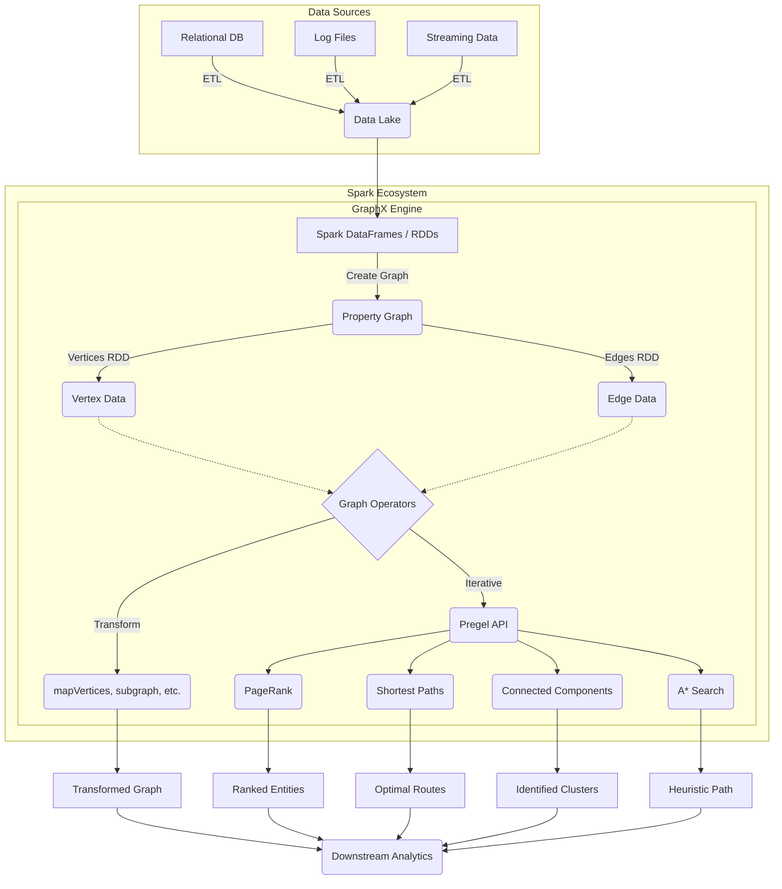

# Chapter 9: Connecting the Dots with GraphX - Overview

**A comprehensive guide to leveraging Apache Spark's GraphX library for distributed graph processing, uncovering relationships, and executing complex algorithms at scale.**

## Why It Matters

Graph processing is an essential paradigm in modern big data engineering because a massive amount of real-world data is naturally represented as graphs—entities and the relationships between them. Traditional relational databases and tabular data models often struggle to efficiently process highly interconnected data. GraphX, Apache Spark’s API for graphs and graph-parallel computation, bridges this gap. By unifying Extract, Transform, and Load (ETL), exploratory analysis, and iterative graph computation within a single system, GraphX eliminates the need to move data between specialized graph databases and general-purpose big data frameworks. 

Real-world use cases for graph processing span numerous domains. In social networks (like Facebook or LinkedIn), graph algorithms suggest friends, find influencers, and identify communities. In financial services, graphs are a crucial tool for fraud detection, uncovering complex rings of illicit transactions that would remain hidden in standard tabular views. In routing and logistics, graph processing optimizes delivery paths and models transportation networks. Knowledge graphs use relationships to improve search engine results and recommend products. Understanding how to harness GraphX allows data engineers to unlock the hidden value in relationships within their existing data lakes.

## How It Works

Apache Spark's GraphX works by extending the Spark RDD API, introducing a new distributed graph representation: a directed multigraph with properties attached to each vertex and edge. A property graph is parameterized over the vertex (VD) and edge (ED) attribute types. By inherently treating graphs as a pair of specialized RDDs (one for vertices and one for edges), GraphX seamlessly integrates with Spark’s existing ecosystem.

GraphX exposes a robust set of fundamental operators (such as `mapVertices`, `mapEdges`, `subgraph`, and `joinVertices`) as well as an optimized variant of the Pregel API. The Pregel API is particularly powerful; it provides a vertex-centric programming model where vertices "think like a vertex," receiving messages from neighbors, updating their state, and sending new messages in iterative supersteps. This iterative model is the backbone of most graph algorithms, as it naturally maps to how graph traversals and property propagations occur.

Furthermore, GraphX includes a growing library of built-in graph algorithms to simplify common analytics tasks. These include PageRank to evaluate node importance, Connected Components to identify distinct subgraphs or clusters, and Shortest Paths to find optimal routing between nodes. By combining Spark's distributed computation engine with advanced graph abstractions, GraphX achieves high performance. It uses specialized data structures, such as vertex routing tables, and optimization techniques, such as automatic join elimination, to minimize communication overhead across the cluster during iterative processing.

In this chapter, we will explore the core concepts of GraphX, from constructing your first property graph to transforming its properties, and finally applying sophisticated algorithms. We will systematically cover the API, message passing, shortest paths, PageRank, connected components, and even custom pathfinding like A* search.

## Flow Diagram



## Data Visualization

Below is an illustration of how raw relational data is transformed into a GraphX Property Graph abstraction.

| Step | Data Representation | Example Data |
|---|---|---|
| 1. Raw Vertex Table | RDD / DataFrame of Nodes | `(1, "Alice", 28)`, `(2, "Bob", 35)`, `(3, "Charlie", 30)` |
| 2. Raw Edge Table | RDD / DataFrame of Edges | `(1, 2, "Friend")`, `(2, 3, "Colleague")`, `(3, 1, "Sibling")` |
| 3. Vertex RDD | `RDD[(VertexId, VD)]` | `Array((1L, ("Alice", 28)), (2L, ("Bob", 35)), (3L, ("Charlie", 30)))` |
| 4. Edge RDD | `RDD[Edge[ED]]` | `Array(Edge(1L, 2L, "Friend"), Edge(2L, 3L, "Colleague"), Edge(3L, 1L, "Sibling"))` |
| 5. Property Graph | `Graph[VD, ED]` | Graph object seamlessly encapsulating the Vertices and Edges for operations. |
| 6. Edge Triplet | `EdgeTriplet[VD, ED]` | `(1L, ("Alice", 28)) -> "Friend" -> (2L, ("Bob", 35))` |

## Code Example

```scala
// Import required GraphX libraries
import org.apache.spark.graphx._
import org.apache.spark.rdd.RDD
import org.apache.spark.sql.SparkSession

object Chapter9Overview {
  def main(args: Array[String]): Unit = {
    // Initialize SparkSession
    val spark = SparkSession.builder()
      .appName("GraphX_Chapter9_Overview")
      .master("local[*]")
      .getOrCreate()
    
    val sc = spark.sparkContext
    
    // ---------------------------------------------------------
    // 1. Defining Vertices
    // Vertices are represented as an RDD of tuples: (VertexId, VD)
    // VertexId must be a Long. VD can be any type (here, a String for Name).
    // ---------------------------------------------------------
    val users: RDD[(VertexId, (String, String))] = sc.parallelize(Seq(
      (1L, ("Alice", "Student")),
      (2L, ("Bob", "Postdoc")),
      (3L, ("Charlie", "Professor")),
      (4L, ("David", "Professor")),
      (5L, ("Eve", "Student"))
    ))
    
    // ---------------------------------------------------------
    // 2. Defining Edges
    // Edges are represented as an RDD of Edge objects: Edge(srcId, dstId, ED)
    // ED can be any type (here, a String for relationship type).
    // ---------------------------------------------------------
    val relationships: RDD[Edge[String]] = sc.parallelize(Seq(
      Edge(1L, 2L, "Collaborator"),
      Edge(2L, 3L, "Advisee"),
      Edge(3L, 4L, "Colleague"),
      Edge(5L, 3L, "Advisee"),
      Edge(1L, 5L, "Classmate")
    ))
    
    // ---------------------------------------------------------
    // 3. Constructing the Property Graph
    // ---------------------------------------------------------
    val graph = Graph(users, relationships)
    
    // ---------------------------------------------------------
    // 4. Basic Graph Analytics Operations
    // ---------------------------------------------------------
    
    // Count vertices and edges
    println(s"Total Vertices: ${graph.numVertices}")
    println(s"Total Edges: ${graph.numEdges}")
    
    // Find all 'Advisee' relationships using edge triplets
    // Triplet contains srcAttr, dstAttr, and attr (edge attribute)
    println("Advisee Relationships:")
    val advisees = graph.triplets.filter(t => t.attr == "Advisee")
    advisees.collect().foreach { t =>
      println(s"${t.srcAttr._1} is an advisee of ${t.dstAttr._1}")
    }
    
    // Calculate out-degrees for each vertex
    println("Out-Degrees of vertices:")
    graph.outDegrees.collect().foreach { case (id, degree) =>
      println(s"Vertex $id has $degree outgoing edges.")
    }
    
    // Stop SparkContext
    spark.stop()
  }
}
```

## Common Pitfalls

*   **Forgetting VertexId must be a Long**: Engineers often try to use Strings (like UUIDs or usernames) directly as `VertexId`. GraphX requires `VertexId` to be a 64-bit Long integer. You must hash or map strings to longs before creating the graph.
*   **Memory Management in Iterative Algorithms**: Graph algorithms are inherently iterative (e.g., Pregel, PageRank). Failing to cache intermediate RDDs or properly unpersist them leads to long lineage chains and eventual `StackOverflowError` or out-of-memory crashes.
*   **Assuming Directed equals Undirected**: GraphX graphs are directed by default. If your use case involves undirected graphs (e.g., symmetric friendships), you explicitly need to add edges in both directions or handle symmetry in your algorithms.
*   **Data Skew in Power-Law Graphs**: Many real-world graphs (like social networks) follow a power-law distribution where a few vertices have millions of edges (e.g., a celebrity on Twitter). This creates massive data skew, bottlenecking specific executors and crippling performance.
*   **Overusing EdgeTriplets**: While convenient, materializing `EdgeTriplet` objects requires joining the vertex attributes with the edges. Doing this unnecessarily over massive graphs generates huge network shuffles. Use `mapEdges` if you only need edge properties.

## Key Takeaway

**GraphX transforms Spark from a flat data processing engine into a powerful relationship-uncovering machine, natively bridging the gap between distributed ETL and complex iterative graph algorithms within a single, unified ecosystem.**
