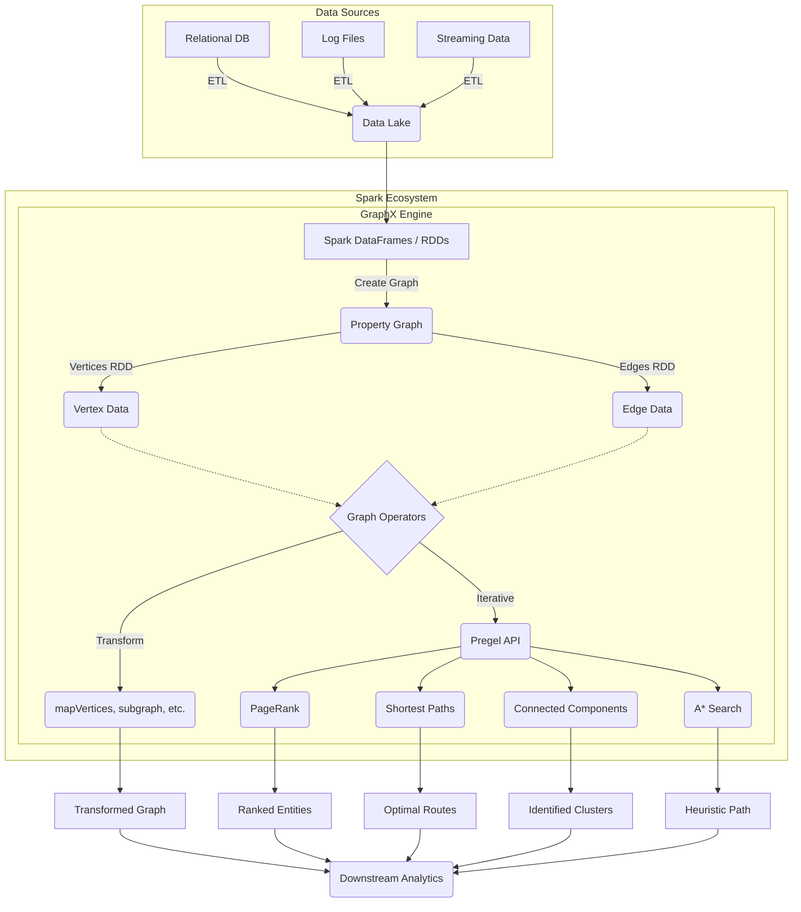

# Chapter 9: Connecting the Dots with GraphX - Overview

**A comprehensive guide to leveraging Apache Spark's GraphX library for distributed graph processing, uncovering relationships, and executing complex algorithms at scale.**

## Why It Matters

Graph processing is an essential paradigm in modern big data engineering because a massive amount of real-world data is naturally represented as graphs—entities and the relationships between them. Traditional relational databases and tabular data models often struggle to efficiently process highly interconnected data. GraphX, Apache Spark’s API for graphs and graph-parallel computation, bridges this gap. By unifying Extract, Transform, and Load (ETL), exploratory analysis, and iterative graph computation within a single system, GraphX eliminates the need to move data between specialized graph databases and general-purpose big data frameworks. 

Real-world use cases for graph processing span numerous domains. In social networks (like Facebook or LinkedIn), graph algorithms suggest friends, find influencers, and identify communities. In financial services, graphs are a crucial tool for fraud detection, uncovering complex rings of illicit transactions that would remain hidden in standard tabular views. In routing and logistics, graph processing optimizes delivery paths and models transportation networks. Knowledge graphs use relationships to improve search engine results and recommend products. Understanding how to harness GraphX allows data engineers to unlock the hidden value in relationships within their existing data lakes.

## How It Works

Apache Spark's GraphX works by extending the Spark RDD API, introducing a new distributed graph representation: a directed multigraph with properties attached to each vertex and edge. A property graph is parameterized over the vertex (VD) and edge (ED) attribute types. By inherently treating graphs as a pair of specialized RDDs (one for vertices and one for edges), GraphX seamlessly integrates with Spark’s existing ecosystem.

GraphX exposes a robust set of fundamental operators (such as `mapVertices`, `mapEdges`, `subgraph`, and `joinVertices`) as well as an optimized variant of the Pregel API. The Pregel API is particularly powerful; it provides a vertex-centric programming model where vertices "think like a vertex," receiving messages from neighbors, updating their state, and sending new messages in iterative supersteps. This iterative model is the backbone of most graph algorithms, as it naturally maps to how graph traversals and property propagations occur.

Furthermore, GraphX includes a growing library of built-in graph algorithms to simplify common analytics tasks. These include PageRank to evaluate node importance, Connected Components to identify distinct subgraphs or clusters, and Shortest Paths to find optimal routing between nodes. By combining Spark's distributed computation engine with advanced graph abstractions, GraphX achieves high performance. It uses specialized data structures, such as vertex routing tables, and optimization techniques, such as automatic join elimination, to minimize communication overhead across the cluster during iterative processing.

In this chapter, we will explore the core concepts of GraphX, from constructing your first property graph to transforming its properties, and finally applying sophisticated algorithms. We will systematically cover the API, message passing, shortest paths, PageRank, connected components, and even custom pathfinding like A* search.

## Flow Diagram



## Data Visualization

Below is an illustration of how raw relational data is transformed into a GraphX Property Graph abstraction.

| Step | Data Representation | Example Data |
|---|---|---|
| 1. Raw Vertex Table | RDD / DataFrame of Nodes | `(1, "Alice", 28)`, `(2, "Bob", 35)`, `(3, "Charlie", 30)` |
| 2. Raw Edge Table | RDD / DataFrame of Edges | `(1, 2, "Friend")`, `(2, 3, "Colleague")`, `(3, 1, "Sibling")` |
| 3. Vertex RDD | `RDD[(VertexId, VD)]` | `Array((1L, ("Alice", 28)), (2L, ("Bob", 35)), (3L, ("Charlie", 30)))` |
| 4. Edge RDD | `RDD[Edge[ED]]` | `Array(Edge(1L, 2L, "Friend"), Edge(2L, 3L, "Colleague"), Edge(3L, 1L, "Sibling"))` |
| 5. Property Graph | `Graph[VD, ED]` | Graph object seamlessly encapsulating the Vertices and Edges for operations. |
| 6. Edge Triplet | `EdgeTriplet[VD, ED]` | `(1L, ("Alice", 28)) -> "Friend" -> (2L, ("Bob", 35))` |

## Code Example

```scala
// Import required GraphX libraries
import org.apache.spark.graphx._
import org.apache.spark.rdd.RDD
import org.apache.spark.sql.SparkSession

object Chapter9Overview {
  def main(args: Array[String]): Unit = {
    // Initialize SparkSession
    val spark = SparkSession.builder()
      .appName("GraphX_Chapter9_Overview")
      .master("local[*]")
      .getOrCreate()
    
    val sc = spark.sparkContext
    
    // ---------------------------------------------------------
    // 1. Defining Vertices
    // Vertices are represented as an RDD of tuples: (VertexId, VD)
    // VertexId must be a Long. VD can be any type (here, a String for Name).
    // ---------------------------------------------------------
    val users: RDD[(VertexId, (String, String))] = sc.parallelize(Seq(
      (1L, ("Alice", "Student")),
      (2L, ("Bob", "Postdoc")),
      (3L, ("Charlie", "Professor")),
      (4L, ("David", "Professor")),
      (5L, ("Eve", "Student"))
    ))
    
    // ---------------------------------------------------------
    // 2. Defining Edges
    // Edges are represented as an RDD of Edge objects: Edge(srcId, dstId, ED)
    // ED can be any type (here, a String for relationship type).
    // ---------------------------------------------------------
    val relationships: RDD[Edge[String]] = sc.parallelize(Seq(
      Edge(1L, 2L, "Collaborator"),
      Edge(2L, 3L, "Advisee"),
      Edge(3L, 4L, "Colleague"),
      Edge(5L, 3L, "Advisee"),
      Edge(1L, 5L, "Classmate")
    ))
    
    // ---------------------------------------------------------
    // 3. Constructing the Property Graph
    // ---------------------------------------------------------
    val graph = Graph(users, relationships)
    
    // ---------------------------------------------------------
    // 4. Basic Graph Analytics Operations
    // ---------------------------------------------------------
    
    // Count vertices and edges
    println(s"Total Vertices: ${graph.numVertices}")
    println(s"Total Edges: ${graph.numEdges}")
    
    // Find all 'Advisee' relationships using edge triplets
    // Triplet contains srcAttr, dstAttr, and attr (edge attribute)
    println("Advisee Relationships:")
    val advisees = graph.triplets.filter(t => t.attr == "Advisee")
    advisees.collect().foreach { t =>
      println(s"${t.srcAttr._1} is an advisee of ${t.dstAttr._1}")
    }
    
    // Calculate out-degrees for each vertex
    println("Out-Degrees of vertices:")
    graph.outDegrees.collect().foreach { case (id, degree) =>
      println(s"Vertex $id has $degree outgoing edges.")
    }
    
    // Stop SparkContext
    spark.stop()
  }
}
```

## Common Pitfalls

*   **Forgetting VertexId must be a Long**: Engineers often try to use Strings (like UUIDs or usernames) directly as `VertexId`. GraphX requires `VertexId` to be a 64-bit Long integer. You must hash or map strings to longs before creating the graph.
*   **Memory Management in Iterative Algorithms**: Graph algorithms are inherently iterative (e.g., Pregel, PageRank). Failing to cache intermediate RDDs or properly unpersist them leads to long lineage chains and eventual `StackOverflowError` or out-of-memory crashes.
*   **Assuming Directed equals Undirected**: GraphX graphs are directed by default. If your use case involves undirected graphs (e.g., symmetric friendships), you explicitly need to add edges in both directions or handle symmetry in your algorithms.
*   **Data Skew in Power-Law Graphs**: Many real-world graphs (like social networks) follow a power-law distribution where a few vertices have millions of edges (e.g., a celebrity on Twitter). This creates massive data skew, bottlenecking specific executors and crippling performance.
*   **Overusing EdgeTriplets**: While convenient, materializing `EdgeTriplet` objects requires joining the vertex attributes with the edges. Doing this unnecessarily over massive graphs generates huge network shuffles. Use `mapEdges` if you only need edge properties.

## Key Takeaway

**GraphX transforms Spark from a flat data processing engine into a powerful relationship-uncovering machine, natively bridging the gap between distributed ETL and complex iterative graph algorithms within a single, unified ecosystem.**


---

## 🎓 Deep Learning Questions

### Q1: Why Was This Concept Introduced?
Before Apache Spark introduced GraphX, data engineering teams faced a "two-system problem." They had to use one system (like Hadoop or Spark DataFrames) for ETL and data preparation, and a completely separate distributed graph engine (like Apache Giraph or Neo4j) for graph algorithms. Moving terabytes of data between these systems was exceptionally slow, costly, and error-prone. 

GraphX was introduced to solve this by unifying ETL, exploratory analysis, and iterative graph computation within a single ecosystem. It allows engineers to extract data from a data lake, build a distributed graph, run iterative algorithms like PageRank or Connected Components, and join the results back with tabular data—all within the same Spark job without ever moving the data out of the cluster.

### Q2: What Exactly Is This Concept and How Does It Work?
GraphX is Spark's distributed graph processing framework. It represents graphs as **Property Graphs**, which are directed multigraphs with user-defined properties attached to each vertex and edge.

Internally, GraphX does not invent a new storage layer; it relies entirely on Spark RDDs. A graph is essentially stored as a `VertexRDD` and an `EdgeRDD`. To execute complex graph traversals, GraphX uses the **Pregel API**, which operates on the Bulk Synchronous Parallel (BSP) model. In this model, computation happens in discrete iterations called *supersteps*. During a superstep, every vertex acts independently ("thinking like a vertex"): it receives messages from its neighbors, updates its own state, and sends messages to other neighbors for the next superstep. This continues until no more messages are sent, signifying convergence.

### Q3: Where Should This Concept Be Used?
GraphX excels in offline, large-scale batch processing where relationships between entities are just as important as the entities themselves.
*   **Fraud Detection (Banking/FinTech):** Uncovering money laundering by finding circular transaction rings (e.g., using Triangle Counting) or identifying linked synthetic identities (Connected Components).
*   **Social Networks (LinkedIn/Facebook):** Discovering influencers using PageRank, suggesting "People You May Know," or clustering users into communities.
*   **Recommendation Engines (Retail/Netflix):** Bipartite graph analysis linking users to products or movies they have interacted with.
*   **Supply Chain & Logistics (Amazon/Uber):** Analyzing network topologies, computing shortest paths for delivery routes, and identifying single points of failure.

### Q4: Where Should This Concept NOT Be Used?
*   **Real-Time OLTP Queries:** GraphX is a batch processing engine. If you need millisecond-level lookups (e.g., "Find all friends of user X right now"), use a transactional graph database like Neo4j, Amazon Neptune, or TigerGraph.
*   **Highly Dynamic Graphs:** Since GraphX is built on RDDs (which are immutable), updating a single edge or vertex requires generating a brand new graph. It is not suitable for streaming or rapidly mutating graph structures.
*   **Simple Tabular Operations:** If you just need to join two tables and don't require multi-hop traversals or iterative algorithms, stick to Spark SQL/DataFrames. GraphX incurs overhead for routing tables and graph construction.

### Q5: How Is This Concept Different from Hadoop?

| Aspect | Hadoop MapReduce | Apache Spark GraphX |
| :--- | :--- | :--- |
| **Iterative Processing** | Horrible. MapReduce writes to disk after every step. | Excellent. Keeps intermediate states in RAM. |
| **Data Model** | Key-Value pairs. | `VertexRDD` and `EdgeRDD` (Property Graphs). |
| **Graph Abstraction** | None natively. Requires custom MapReduce logic. | First-class abstraction via Pregel API and triplets. |
| **Algorithms** | Must be coded from scratch. | Built-in PageRank, Connected Components, Shortest Paths. |
| **Performance** | Extremely slow for graph traversals. | Up to 100x faster due to memory caching and join optimizations. |

### Q6: How Can This Concept Be Related to a Traditional RDBMS?

| RDBMS Concept | Spark GraphX Equivalent | Explanation |
| :--- | :--- | :--- |
| **Entity Table** (e.g., `Users`) | **VertexRDD** | Stores the nodes (entities) and their attributes. |
| **Join/Mapping Table** (e.g., `User_Follows`) | **EdgeRDD** | Stores the relationships (edges) between the nodes. |
| **Recursive CTE / Self-Joins** | **Pregel API** | Navigating hierarchies or multi-hop relationships. |
| **Foreign Key** | **VertexId (Long)** | The standard 64-bit identifier used to link edges to vertices. |
| **Complex Aggregations (Centrality)** | **PageRank** | RDBMS struggles with recursive ranking; GraphX does it natively. |

### Q7: What Happens Behind the Scenes?
When you trigger a GraphX algorithm, a heavily optimized distributed execution unfolds:

1.  **Graph Construction:** Spark partitions the `EdgeRDD` across the cluster (often using a 2D grid partitioning strategy to avoid skew).
2.  **Routing Tables:** Spark builds a routing table for the `VertexRDD`. Because edges dictate communication, Spark needs to know which executors hold the edges for a given vertex.
3.  **Pregel Supersteps:**
    *   *Step A:* Vertices send messages along their outgoing (or incoming) edges.
    *   *Step B:* Spark groups messages by destination `VertexId` (causing a network Shuffle).
    *   *Step C:* Vertices receive the aggregated messages, update their properties, and trigger the next superstep.
4.  **Convergence:** The DAG executes recursively until a superstep produces zero messages.

```text
[Executor 1: Vertex A]      [Executor 2: Vertex B]
       |                              ^
       | (Send Message via Edge)      |
       +------------------------------+
            (Network Shuffle)
```

### Q8: Performance Considerations, Best Practices, and Common Mistakes

| Category | Recommendation | Why It Matters |
| :--- | :--- | :--- |
| **Partitioning** | Use `PartitionStrategy.EdgePartition2D`. | Graph processing is prone to severe data skew (e.g., celebrities in social graphs). 2D partitioning drastically reduces shuffle skew. |
| **Lineage** | Checkpoint the graph periodically (`graph.checkpoint()`). | Iterative algorithms create massive DAG lineages. Without checkpointing, a failure causes hours of recalculation or `StackOverflowError`. |
| **Data Types** | Hash Strings to Longs carefully for `VertexId`. | GraphX only accepts `Long` for `VertexId`. Hashing collisions will silently merge distinct vertices, corrupting results. |
| **Memory** | Avoid materializing `EdgeTriplet` if unnecessary. | Triplets require joining Vertex properties onto Edges. If you only need Edge properties, use `mapEdges` to save memory. |

### Q9: Interview Questions

**Beginner**
1.  *What is a Property Graph in GraphX?* A directed graph where both vertices and edges can hold arbitrary properties (attributes).
2.  *What are the two main RDDs that make up a Graph in GraphX?* `VertexRDD` and `EdgeRDD`.
3.  *What data type must a `VertexId` be?* A 64-bit `Long`.

**Intermediate**
4.  *What is the Pregel API?* A vertex-centric, bulk-synchronous message-passing API used to implement iterative graph algorithms.
5.  *Why is MapReduce bad for graph processing compared to GraphX?* MapReduce persists intermediate states to disk after every iteration, while GraphX keeps data in memory across iterations.
6.  *What is an `EdgeTriplet`?* A view that logically joins an edge with the properties of its source and destination vertices.

**Advanced**
7.  *How do you handle severe data skew in GraphX (e.g., the "Justin Bieber" problem)?* By using `EdgePartition2D` or `EdgePartition1D` strategies to co-locate edges and routing tables, distributing the heavy node's edges across multiple partitions.
8.  *Why do iterative GraphX jobs sometimes fail with a `StackOverflowError`?* Because the RDD lineage DAG becomes too long. It is solved by calling `checkpoint()` every few iterations to truncate the lineage.
9.  *How does GraphX optimize join operations during vertex updates?* It maintains vertex routing tables and only ships vertex updates to partitions that actually contain adjacent edges for that vertex.

**Scenario-Based**
10. *You need to identify disjointed rings of users interacting with each other in a fraud network. Which GraphX algorithm do you use?* Connected Components. It assigns the same component ID to all vertices in the same connected subgraph, perfectly identifying distinct rings.

### Q10: Complete Real-World Example
**Business Problem:** A FinTech company wants to detect fraudulent money laundering rings. Fraudsters often move money in circles (e.g., Account A -> B -> C -> A) to obfuscate the source.
**Solution:** Use GraphX's **Connected Components** to find isolated subgraphs (rings) of accounts that are trading heavily with each other.

```scala
import org.apache.spark.graphx._
import org.apache.spark.rdd.RDD
import org.apache.spark.sql.SparkSession

object FraudDetectionRing {
  def main(args: Array[String]): Unit = {
    val spark = SparkSession.builder()
      .appName("FraudRingDetection")
      .master("local[*]")
      .getOrCreate()
    val sc = spark.sparkContext

    // 1. Create Vertices: (AccountId, AccountName)
    val accounts: RDD[(VertexId, String)] = sc.parallelize(Seq(
      (1L, "Alice"), (2L, "Bob"), (3L, "Charlie"), // Ring 1
      (4L, "David"), (5L, "Eve"),                  // Ring 2
      (6L, "Frank")                                // Isolated
    ))

    // 2. Create Edges: Edge(SourceId, DestId, TransactionAmount)
    val transactions: RDD[Edge[Double]] = sc.parallelize(Seq(
      Edge(1L, 2L, 500.0), Edge(2L, 3L, 500.0), Edge(3L, 1L, 500.0), // Money laundering circle
      Edge(4L, 5L, 200.0), Edge(5L, 4L, 200.0)                       // Suspicious back-and-forth
    ))

    // 3. Build Graph
    val fraudGraph = Graph(accounts, transactions)

    // 4. Run Connected Components Algorithm
    // This assigns each vertex the lowest VertexId in its connected subgraph
    val ccGraph = fraudGraph.connectedComponents()

    // 5. Join the result back with original account names
    val componentsWithNames = ccGraph.vertices.innerJoin(accounts) {
      (id, componentId, name) => (name, componentId)
    }

    // 6. Group by Component to isolate the rings
    val fraudRings = componentsWithNames.map { case (id, (name, componentId)) =>
      (componentId, name)
    }.groupByKey().filter(_._2.size > 1) // Only rings with multiple accounts

    println("Detected Suspicious Rings:")
    fraudRings.collect().foreach { case (ringId, members) =>
      println(s"Ring $ringId: Accounts -> ${members.mkString(", ")}")
    }

    spark.stop()
  }
}
```
**Expected Output:**
```text
Detected Suspicious Rings:
Ring 1: Accounts -> Alice, Bob, Charlie
Ring 4: Accounts -> David, Eve
```
*Performance Note:* In a real production system with billions of edges, ensure you call `.partitionBy(PartitionStrategy.EdgePartition2D)` on the graph before running `.connectedComponents()` to prevent out-of-memory errors on heavily skewed nodes.

### 💡 Key Takeaways
*   GraphX brings distributed graph processing natively into Spark, eliminating data silos.
*   Graphs are defined as `VertexRDDs` and `EdgeRDDs` linked by 64-bit `Long` identifiers.
*   The Pregel API is the core engine for iterative graph algorithms like PageRank and Connected Components.
*   GraphX is for batch analytics and discovering deep relationships, not for real-time transactional graph queries.
*   Managing RDD lineage via checkpointing is mandatory for long-running iterative algorithms.

### ⚠️ Common Misconceptions
*   *Misconception:* GraphX replaces databases like Neo4j. *Reality:* GraphX is an OLAP batch engine; Neo4j is generally used for OLTP real-time queries.
*   *Misconception:* You can use strings (like usernames) directly as Node IDs. *Reality:* You MUST hash strings to 64-bit Longs for `VertexId`.
*   *Misconception:* `EdgeTriplet` is cheap to use. *Reality:* It forces a join between vertices and edges, which triggers a massive network shuffle.

### 🔗 Related Spark Concepts
*   **GraphFrames:** The DataFrame-based successor to GraphX, allowing graph processing using Spark SQL and Python.
*   **Spark RDDs:** The foundational data structure GraphX builds upon.
*   **DAG Scheduler:** Manages the complex physical execution plans of iterative Pregel supersteps.

### 📚 References for Further Reading
*   Apache Spark GraphX Programming Guide
*   Learning Spark (O'Reilly)
*   Spark: The Definitive Guide (O'Reilly)
