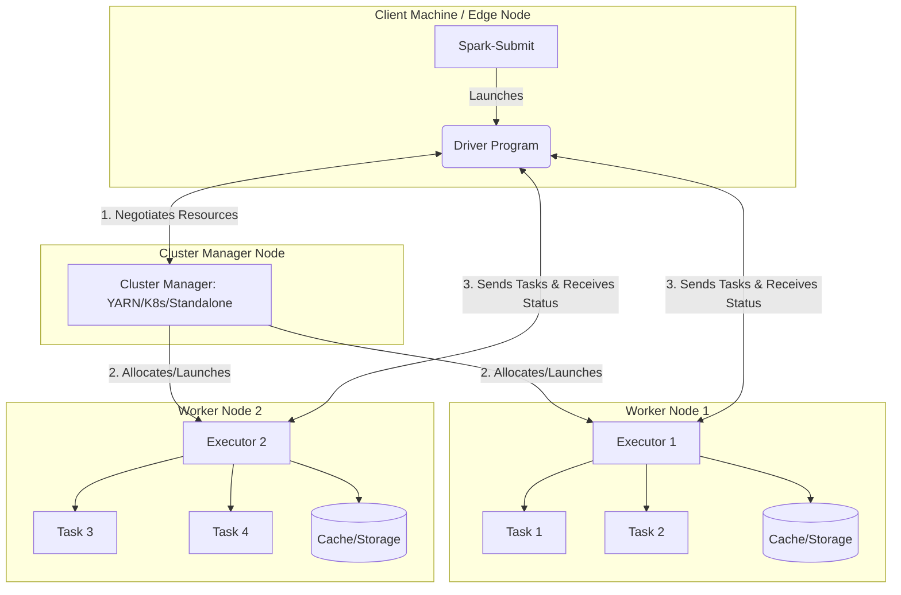

# Spark Runtime Architecture

**The Spark Runtime Architecture consists of a central Driver Program that coordinates distributed execution by dispatching tasks to worker Executor processes managed by a Cluster Manager.**

## Why It Matters
When a Spark job fails with an `OutOfMemoryError`, or when it hangs indefinitely, understanding the runtime architecture is the only way to diagnose the problem. Data engineers must know whether the failure occurred on the Driver (perhaps due to `collect()` bringing too much data back) or on an Executor (perhaps due to data skew during a shuffle). Furthermore, knowing how the Driver communicates with the Cluster Manager to negotiate resources is crucial for configuring applications in multi-tenant environments like YARN or Kubernetes.

## How It Works
The architecture is fundamentally a master-worker topology. The **Driver Program** is the brain of the operation. It runs the main() function of the application, creates the `SparkContext` or `SparkSession`, and converts the user's transformations and actions into a Directed Acyclic Graph (DAG). The Driver is responsible for breaking this DAG into Stages and Tasks, and then scheduling these Tasks across the available Executors.

The **Cluster Manager** is a pluggable component that handles physical resource allocation. It can be Spark's Standalone manager, Apache YARN, Apache Mesos, or Kubernetes. When the Driver needs resources, it requests them from the Cluster Manager. The Cluster Manager then launches **Executors** on the worker nodes of the cluster.

**Executors** are distributed JVM processes that serve two main purposes: they run the individual Tasks assigned by the Driver, and they store cached data (RDDs or DataFrames) in memory or on disk. Once Executors are running, they communicate directly with the Driver to receive Tasks and report back their status (Success, Failure, etc.) and metrics. The end-to-end lifecycle starts with `spark-submit`, which launches the Driver (either on the client machine or in the cluster). The Driver requests Executors, translates the code into a DAG, and orchestrates the distributed execution until the application completes or crashes.

## Flow Diagram



## Data Visualization

| Step | Component | Action Performed |
|------|-----------|------------------|
| 1 | spark-submit | Submits application code to the cluster. |
| 2 | Driver | Initializes SparkSession, reads code, builds DAG. |
| 3 | Driver | Requests resources from Cluster Manager. |
| 4 | Cluster Manager | Launches Executor JVMs on worker nodes. |
| 5 | Executors | Register themselves with the Driver. |
| 6 | Driver | Translates DAG into Stages/Tasks, assigns to Executors. |
| 7 | Executors | Execute Tasks, read/write data, store cached partitions. |
| 8 | Executors | Return Task results and metrics to the Driver. |
| 9 | Driver | Consolidates results, completes application. |

## Code Example

```scala
import org.apache.spark.sql.SparkSession

object ArchitectureDemo {
  def main(args: Array[String]): Unit = {
    // 1. The Driver starts here.
    val spark = SparkSession.builder()
      .appName("Runtime Architecture Demo")
      // Cluster Manager is inferred from spark-submit or set here
      .getOrCreate()

    // 2. Driver reads the logical plan
    val data = spark.range(1, 1000000)

    // 3. Transformations are lazy; DAG is built on the Driver
    val multiplied = data.map(x => x * 2)

    // 4. Action triggers job execution.
    // Driver requests Executors, splits DAG into Tasks, sends Tasks to Executors.
    // Executors compute the max value and send it back to the Driver.
    val maxValue = multiplied.reduce(_ max _)

    println(s"The maximum value is: $maxValue")

    // 5. Driver shuts down Executors and exits.
    spark.stop()
  }
}
```

## Common Pitfalls
* **Calling `collect()` on massive DataFrames**: This pulls all data from Executors to the Driver, crashing the Driver with an OOM error.
* **Misunderstanding Client vs. Cluster deployment modes**: In client mode, the Driver runs on the submitting machine (which might go to sleep or lose network). In cluster mode, the Driver runs inside the cluster.
* **Driver bottlenecking**: Overloading the Driver with heavy broadcast variables or complex local processing.
* **Assuming Executors share memory**: Executors are separate JVMs (often on separate physical machines). They cannot share global Java variables; they must use Spark accumulators or broadcast variables.

## Key Takeaway
Spark's Master-Worker architecture ensures horizontal scalability by separating the logical orchestration (Driver) from the physical execution and data storage (Executors).


