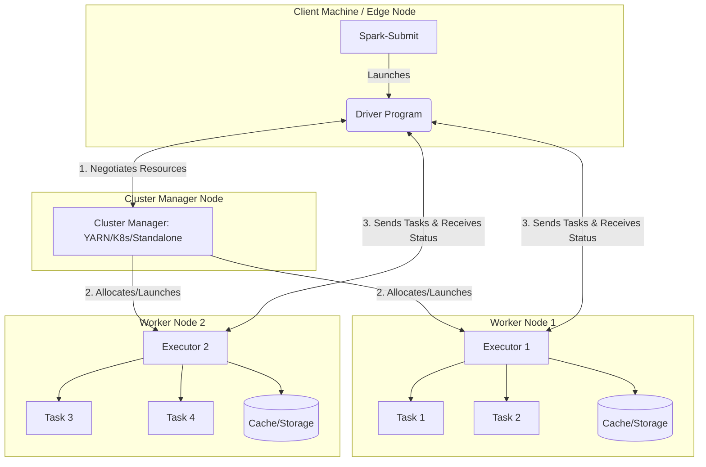

# Spark Runtime Architecture

**The Spark Runtime Architecture consists of a central Driver Program that coordinates distributed execution by dispatching tasks to worker Executor processes managed by a Cluster Manager.**

## Why It Matters
When a Spark job fails with an `OutOfMemoryError`, or when it hangs indefinitely, understanding the runtime architecture is the only way to diagnose the problem. Data engineers must know whether the failure occurred on the Driver (perhaps due to `collect()` bringing too much data back) or on an Executor (perhaps due to data skew during a shuffle). Furthermore, knowing how the Driver communicates with the Cluster Manager to negotiate resources is crucial for configuring applications in multi-tenant environments like YARN or Kubernetes.

## How It Works
The architecture is fundamentally a master-worker topology. The **Driver Program** is the brain of the operation. It runs the main() function of the application, creates the `SparkContext` or `SparkSession`, and converts the user's transformations and actions into a Directed Acyclic Graph (DAG). The Driver is responsible for breaking this DAG into Stages and Tasks, and then scheduling these Tasks across the available Executors.

The **Cluster Manager** is a pluggable component that handles physical resource allocation. It can be Spark's Standalone manager, Apache YARN, Apache Mesos, or Kubernetes. When the Driver needs resources, it requests them from the Cluster Manager. The Cluster Manager then launches **Executors** on the worker nodes of the cluster.

**Executors** are distributed JVM processes that serve two main purposes: they run the individual Tasks assigned by the Driver, and they store cached data (RDDs or DataFrames) in memory or on disk. Once Executors are running, they communicate directly with the Driver to receive Tasks and report back their status (Success, Failure, etc.) and metrics. The end-to-end lifecycle starts with `spark-submit`, which launches the Driver (either on the client machine or in the cluster). The Driver requests Executors, translates the code into a DAG, and orchestrates the distributed execution until the application completes or crashes.

## Flow Diagram



## Data Visualization

| Step | Component | Action Performed |
|------|-----------|------------------|
| 1 | spark-submit | Submits application code to the cluster. |
| 2 | Driver | Initializes SparkSession, reads code, builds DAG. |
| 3 | Driver | Requests resources from Cluster Manager. |
| 4 | Cluster Manager | Launches Executor JVMs on worker nodes. |
| 5 | Executors | Register themselves with the Driver. |
| 6 | Driver | Translates DAG into Stages/Tasks, assigns to Executors. |
| 7 | Executors | Execute Tasks, read/write data, store cached partitions. |
| 8 | Executors | Return Task results and metrics to the Driver. |
| 9 | Driver | Consolidates results, completes application. |

## Code Example

```scala
import org.apache.spark.sql.SparkSession

object ArchitectureDemo {
  def main(args: Array[String]): Unit = {
    // 1. The Driver starts here.
    val spark = SparkSession.builder()
      .appName("Runtime Architecture Demo")
      // Cluster Manager is inferred from spark-submit or set here
      .getOrCreate()

    // 2. Driver reads the logical plan
    val data = spark.range(1, 1000000)

    // 3. Transformations are lazy; DAG is built on the Driver
    val multiplied = data.map(x => x * 2)

    // 4. Action triggers job execution.
    // Driver requests Executors, splits DAG into Tasks, sends Tasks to Executors.
    // Executors compute the max value and send it back to the Driver.
    val maxValue = multiplied.reduce(_ max _)

    println(s"The maximum value is: $maxValue")

    // 5. Driver shuts down Executors and exits.
    spark.stop()
  }
}
```

## Common Pitfalls
* **Calling `collect()` on massive DataFrames**: This pulls all data from Executors to the Driver, crashing the Driver with an OOM error.
* **Misunderstanding Client vs. Cluster deployment modes**: In client mode, the Driver runs on the submitting machine (which might go to sleep or lose network). In cluster mode, the Driver runs inside the cluster.
* **Driver bottlenecking**: Overloading the Driver with heavy broadcast variables or complex local processing.
* **Assuming Executors share memory**: Executors are separate JVMs (often on separate physical machines). They cannot share global Java variables; they must use Spark accumulators or broadcast variables.

## Key Takeaway
Spark's Master-Worker architecture ensures horizontal scalability by separating the logical orchestration (Driver) from the physical execution and data storage (Executors).


---

## 🎓 Deep Learning Questions

### Q1: Why Was This Concept Introduced?
Before Spark's runtime architecture, Hadoop MapReduce executed tasks as separate Java processes, which incurred massive JVM startup overhead and wrote intermediate data to disk between every step. Spark introduced this master-worker topology with long-lived Executor JVMs and an orchestrating Driver. This approach allows multi-stage jobs to share data in memory across stages without disk I/O, and avoids JVM spin-up time for each task. It overcomes the slow, disk-bound limitations of MapReduce by keeping data resident in memory across distributed workers.

### Q2: What Exactly Is This Concept and How Does It Work?
The Spark Runtime Architecture is a distributed computing topology comprising a Driver program, a Cluster Manager, and multiple Executors.
1. The **Driver** acts as the brain. It hosts the SparkSession, converts your code into a logical plan, optimizes it into a physical plan, and breaks it down into Stages and Tasks (a DAG).
2. The **Cluster Manager** (like YARN or Kubernetes) allocates hardware resources (CPU/Memory).
3. The **Executors** are long-running JVMs on worker nodes that execute the actual Tasks assigned by the Driver and store intermediate data in memory (or disk).
Once a job runs, the Driver schedules Tasks on the Executors, which process partitions of data and return statuses and results to the Driver.

### Q3: Where Should This Concept Be Used?
This architecture shines in large-scale data processing scenarios across clusters:
- **Banking**: Nightly ETL jobs processing terabytes of transactions, utilizing hundreds of Executors to parallelize the workload.
- **Netflix**: Processing streaming logs and user events in near real-time, relying on long-running Executors to maintain state and process micro-batches.
- **Healthcare**: Running massive iterative machine learning algorithms (like clustering patient data) where data must remain cached in Executor memory between iterations to achieve performance.

### Q4: Where Should This Concept NOT Be Used?
- **Small Datasets**: If the data fits comfortably in a single machine's RAM, Spark's distributed architecture adds unnecessary overhead (serialization, network shuffling, cluster manager negotiation). A simple Pandas or Python script is better.
- **OLTP Workloads**: Spark is not designed for point queries, transactional updates, or low-latency sub-millisecond responses. Traditional RDBMS or NoSQL databases are suited for OLTP.
- **Single Node Deployments**: While Spark local mode exists for testing, using Spark solely on a single machine for production defeats the purpose of the master-worker distributed design.

### Q5: How Is This Concept Different from Hadoop?
| Aspect | Hadoop MapReduce | Apache Spark |
|--------|------------------|--------------|
| Architecture | Master-Slave (JobTracker/TaskTracker) | Driver, Cluster Manager, Executors |
| Performance | Disk-bound; writes intermediate data | Memory-bound; keeps data in RAM |
| Processing Model | Map -> Shuffle -> Reduce (Strict) | DAG-based, flexible multi-stage execution |
| Memory Usage | Low; drops state after task finishes | High; uses in-memory caching |
| Fault Tolerance | Replication and disk persistence | RDD lineage graph (recomputes lost data) |
| Scalability | Massively scalable | Massively scalable |
| Ease of Development | Verbose, complex Java code | Expressive APIs in Python, Scala, SQL |
| Typical Use Cases | Batch processing, archiving | Batch, Streaming, ML, Graph |
| Advantages | Simple, extremely fault-tolerant | 100x faster in memory, unified engine |
| Disadvantages | Very slow, heavy disk I/O | Memory intensive, complex tuning |

### Q6: How Can This Concept Be Related to a Traditional RDBMS?
| Spark Concept | Traditional RDBMS Equivalent | Explanation |
|---------------|------------------------------|-------------|
| Driver | Database Engine / Query Optimizer | Plans the query, optimizes it, and coordinates execution. |
| Executors | Worker Threads / CPU Cores | Processes the actual data blocks during a parallel query. |
| Cluster Manager | OS Resource Manager | Allocates RAM and CPU to the database process. |
| DataFrame/Dataset | Table / View | The structured data being operated upon. |
| Transformation | SQL Query (SELECT, WHERE, JOIN) | Defines what to do without executing it (Lazy Evaluation). |
| Action | Execute / Fetch Results | Triggers the query to run and return data. |

### Q7: What Happens Behind the Scenes?
1. **Submit**: You submit code via `spark-submit`.
2. **Driver**: Creates the SparkContext and constructs a Logical Plan, then a Physical Plan.
3. **DAG Scheduler**: Converts the Physical Plan into a Directed Acyclic Graph (DAG) of Stages separated by shuffles.
4. **Task Scheduler**: Breaks Stages into individual Tasks.
5. **Cluster Manager**: The Driver negotiates resources, and the manager launches Executor JVMs.
6. **Execution**: Executors receive Tasks, process data partitions, and cache data if requested.
7. **Shuffle**: If needed (e.g., for aggregations), Executors exchange data across the network.
8. **Result**: Executors send final metrics/results back to the Driver.

```text
User Code --> Driver (Builds DAG) --> DAG Scheduler (Creates Stages)
                                          |
                                     Task Scheduler (Creates Tasks)
                                          |
                                   [Cluster Manager Allocates]
                                          |
       +----------------------------------+----------------------------------+
       |                                  |                                  |
   Executor 1 (Tasks)                 Executor 2 (Tasks)                 Executor 3 (Tasks)
   [Partition A]                      [Partition B]                      [Partition C]
```

### Q8: Performance Considerations, Best Practices, and Common Mistakes
| Category | Recommendation | Why It Matters |
|----------|----------------|----------------|
| **Best Practice** | Right-size Executor Memory | Too much memory causes long Garbage Collection (GC) pauses; too little causes OOMs or disk spilling. |
| **Common Mistake** | `collect()` on large datasets | Brings all data from Executors to the Driver, crashing the Driver with `OutOfMemoryError`. |
| **Optimization** | Use broadcast variables for small lookups | Avoids sending the same data to tasks repeatedly; sends it once per Executor. |
| **Best Practice** | Balance partitions (e.g., `spark.sql.shuffle.partitions`) | Too few partitions leave Executors idle; too many add scheduling overhead. |
| **Debugging** | Check Spark UI Event Timeline | Helps identify if Tasks are stuck on a specific Executor (data skew) or if the Driver is bottlenecked. |

### Q9: Interview Questions
**Beginner**
1. **What is the role of the Driver in Spark?**
   *Answer:* It orchestrates the application, maintains the SparkContext, converts code into a DAG, schedules tasks, and collects final results.
2. **What is an Executor?**
   *Answer:* A distributed JVM process on a worker node that runs tasks and stores cached data in memory or disk.
3. **What is a Cluster Manager?**
   *Answer:* An external service (like YARN or Kubernetes) that manages physical hardware resources and allocates them to Spark applications.

**Intermediate**
4. **What happens if the Driver fails?**
   *Answer:* The entire Spark application fails because the Driver maintains the state and coordinates the Executors. (Unless running in cluster mode with supervision).
5. **What happens if an Executor fails?**
   *Answer:* The Driver notices the failure, and assigns the failed tasks to another active Executor. If data was cached on the failed Executor, Spark recomputes it using RDD lineage.
6. **Why shouldn't you use `collect()` on a massive DataFrame?**
   *Answer:* Because `collect()` forces all Executors to send their massive partitions to the single Driver node, which will exceed its memory and throw an OOM exception.

**Advanced**
7. **How does the DAG Scheduler differ from the Task Scheduler?**
   *Answer:* The DAG Scheduler breaks the logical plan into Stages at shuffle boundaries. The Task Scheduler takes those Stages, breaks them into Tasks (one per partition), and dispatches them to Executors.
8. **How does data skew affect Executor utilization?**
   *Answer:* If one partition is significantly larger than others, one Executor gets stuck processing it while others finish and sit idle, bottlenecking the entire Stage.
9. **How would you debug an application where Executors keep dying?**
   *Answer:* Look at the YARN/K8s logs for OOMKilled messages. Check the Spark UI for heavy shuffles or massive partitions causing memory bloat, and increase executor memory or repartition the data.

**Scenario-Based**
10. **You have 100 Executors, but only 2 are doing work. Why?**
    *Answer:* The data is likely partitioned into only 2 partitions, or severe data skew means 2 partitions hold all the records. You need to use `repartition()` to distribute the data evenly.
11. **Your Spark job runs fine in client mode but fails instantly in cluster mode. Why?**
    *Answer:* Often due to missing dependencies, files, or environment variables on the cluster nodes that exist on your local client machine. In cluster mode, the Driver runs remotely and doesn't have access to local local files unless shipped with the job.

### Q10: Complete Real-World Example
**Business Problem (Uber)**: Analyzing millions of daily ride logs to find the total distance traveled per city.
**Dataset**: CSV files containing `ride_id, city, distance_miles`.

```python
from pyspark.sql import SparkSession
from pyspark.sql.functions import sum as _sum

# 1. DRIVER INITIALIZATION
# The Driver program starts and connects to the Cluster Manager
spark = SparkSession.builder \
    .appName("UberRideAnalysis") \
    .master("yarn") \
    .config("spark.executor.instances", "10") \
    .config("spark.executor.memory", "4g") \
    .getOrCreate()

# 2. LAZY EVALUATION (DAG Building)
# Driver reads metadata but doesn't process data yet
rides_df = spark.read.csv("hdfs:///data/uber/rides.csv", header=True, inferSchema=True)

# Driver adds this grouping and aggregation to the DAG
city_distances = rides_df.groupBy("city").agg(_sum("distance_miles").alias("total_distance"))

# 3. ACTION TRIGGERED
# Driver submits the DAG to the DAGScheduler -> breaks into Stages -> TaskScheduler -> Tasks
# Executors pull data from HDFS, process their partitions, shuffle by city, and sum distances.
# show() pulls a small sample back to the Driver.
city_distances.show()

# 4. SHUTDOWN
# Driver tells Cluster Manager to release Executor resources.
spark.stop()
```
**Execution Walkthrough:**
1. The Driver starts the `SparkSession`.
2. The Driver requests 10 Executors from YARN.
3. YARN launches 10 JVMs across the cluster; they register with the Driver.
4. The Driver creates a plan: Stage 1 (read and map cities) -> Shuffle -> Stage 2 (sum distances).
5. Executors process the tasks in parallel and return the aggregated results.
6. The `show()` action pulls the top 20 rows to the Driver's console.

### 💡 Key Takeaways
- The **Driver** is the brain; it orchestrates the job but shouldn't process heavy data.
- **Executors** are the muscle; they process data in parallel and store cached results.
- The **Cluster Manager** handles hardware allocation.
- Spark is memory-centric; long-lived Executors retain data in RAM across tasks.
- Avoid pulling massive datasets back to the Driver.

### ⚠️ Common Misconceptions
- **Executors share memory:** False. They are isolated JVMs. Use Broadcast variables to share read-only data.
- **More Executors always means faster jobs:** False. Too many Executors can overload the network and the Driver due to task scheduling overhead.
- **The Driver does heavy lifting:** False. The Driver only plans and coordinates; Executors do the actual data processing.

### 🔗 Related Spark Concepts
- Directed Acyclic Graph (DAG)
- SparkSession & SparkContext
- Shuffling and Partitioning
- Deploy Modes (Client vs Cluster)

### 📚 References for Further Reading
- Apache Spark Official Documentation
- Learning Spark (O'Reilly)
- Spark: The Definitive Guide (O'Reilly)
