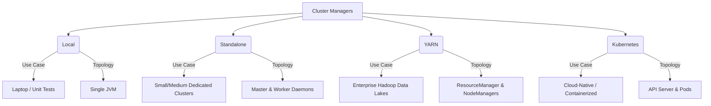

# Spark Cluster Types

**Spark can run on various cluster managers—Local, Standalone, YARN, Mesos, and Kubernetes—each offering different levels of resource isolation, scalability, and operational overhead.**

## Why It Matters
Choosing the right cluster manager is a foundational architectural decision. A data scientist prototyping a model on a laptop will use Local mode. A mid-sized company with a dedicated Spark cluster might use Standalone mode for simplicity. An enterprise with a massive Hadoop data lake will rely on YARN to share resources between Spark, Hive, and Flink. A modern cloud-native organization heavily invested in Docker will deploy Spark on Kubernetes. Using the wrong cluster type can lead to resource starvation, complex maintenance, or incompatibility with existing infrastructure.

## How It Works
**Local Mode** is not a true distributed cluster. The Driver and Executors run as threads within a single JVM on the local machine. It is invoked using `local` (1 thread), `local[N]` (N threads), or `local[*]` (one thread per logical CPU core). It is exclusively for testing and development.

**Standalone Mode** is Spark's built-in cluster manager. It involves running a Master daemon on one node and Worker daemons on other nodes. It is easy to set up and requires no external dependencies (like Hadoop or Kubernetes). However, it lacks advanced multi-tenant features and fine-grained resource sharing.

**YARN (Yet Another Resource Manager)** is the resource manager for Hadoop. When Spark runs on YARN, it leverages YARN's ResourceManager and NodeManagers. This is the enterprise standard for on-premise big data because it allows Spark to coexist with other workloads, supporting robust queueing, security (Kerberos), and dynamic resource allocation.

**Kubernetes (K8s)** is the modern standard for container orchestration. In K8s mode, Spark runs inside Docker containers. The `spark-submit` command communicates directly with the Kubernetes API server to create a Driver pod, which then requests Executor pods. This provides ultimate isolation, dependency management (via custom Docker images), and integrates seamlessly with cloud providers (EKS, GKE, AKS). Mesos is another option, though its usage has heavily declined in favor of Kubernetes.

## Flow Diagram



## Data Visualization

| Feature | Local | Standalone | YARN | Kubernetes |
|---------|-------|------------|------|------------|
| **Deployment Setup** | Zero | Simple | Complex (Hadoop) | Complex (K8s) |
| **Isolation** | None | Process level | JVM/Container level | Container level |
| **Multi-tenancy** | Poor | Basic | Excellent | Excellent |
| **Dependency Mgmt** | Host OS | Host OS / Conda | YARN Archives / Conda | Docker Images |
| **Dynamic Allocation**| No | Yes (limited) | Yes (robust) | Yes (robust) |

## Code Example

```bash
# 1. Local Mode (Using all available cores)
spark-submit --master local[*] my_app.py

# 2. Standalone Mode (Pointing to the Master UI URL)
spark-submit --master spark://master-node:7077 my_app.py

# 3. YARN Mode (Client mode - driver runs locally)
spark-submit --master yarn --deploy-mode client my_app.py

# 4. YARN Mode (Cluster mode - driver runs in the YARN cluster)
spark-submit --master yarn --deploy-mode cluster my_app.py

# 5. Kubernetes Mode (Creating pods on a K8s cluster)
spark-submit \
    --master k8s://https://<k8s-api-server>:<port> \
    --deploy-mode cluster \
    --name spark-k8s-demo \
    --conf spark.executor.instances=3 \
    --conf spark.kubernetes.container.image=my-repo/spark:v3.2.0 \
    local:///opt/spark/examples/jars/spark-examples.jar
```

## Common Pitfalls
* **Using `local` in production**: Deploying jobs with `master("local[*]")` hardcoded in the code, which ignores the actual cluster resources.
* **Dependency hell in YARN/Standalone**: Because these modes rely on the host OS for dependencies, Python libraries (pip) or native binaries might differ across worker nodes, leading to obscure runtime errors.
* **Network issues in K8s**: Misconfiguring headless services or pod networking in Kubernetes, causing Executors to be unable to communicate with the Driver.
* **Deploy mode confusion**: Using client deploy mode on a laptop on a VPN to connect to a YARN cluster, causing massive network bottlenecking as data moves between the cluster and the laptop.

## Key Takeaway
The cluster manager abstracts away physical infrastructure; Kubernetes represents the modern, container-native future of Spark, while YARN remains the heavyweight champion of on-premise Hadoop deployments.


---

## 🎓 Deep Learning Questions

### Q1: Why Was This Concept Introduced?
Before Apache Spark introduced a pluggable cluster management architecture, distributed data processing systems like Hadoop MapReduce were tightly coupled with their native resource managers. Spark was designed to be agnostic to the underlying cluster infrastructure. This allowed organizations to run Spark on their existing Hadoop (YARN) clusters without migrating data, on dedicated standalone clusters for simplicity, and eventually on modern container orchestrators like Kubernetes. By introducing multiple cluster types, Spark overcomes the limitation of vendor lock-in and infrastructure rigidity, enabling teams to deploy distributed computing in whatever environment best fits their operational and security requirements.

### Q2: What Exactly Is This Concept and How Does It Work?
Spark cluster types refer to the underlying "Resource Managers" that handle allocating CPU and memory to a Spark application. Regardless of the cluster type, the internal architecture remains a Master-Worker model. 
When a Spark job is submitted, the **Driver** process starts and creates a `SparkContext`. It connects to the chosen **Cluster Manager** (like YARN, Kubernetes, or Standalone). The Cluster Manager evaluates the available resources across the cluster nodes and allocates containers or pods. Once allocated, Spark launches **Executors** inside those resources. The Driver then sends tasks to these Executors to perform the actual data processing in parallel.

### Q3: Where Should This Concept Be Used?
- **Local Mode**: Used on personal laptops for unit testing, debugging, and initial pipeline prototyping.
- **Standalone Mode**: Best for mid-sized organizations with dedicated physical or virtual machines strictly used for Spark, without the need for complex multi-tenancy.
- **YARN**: The absolute standard for large-scale enterprise deployments (e.g., Banks, Retailers) that already have massive Hadoop Data Lakes and need to share cluster resources among Spark, Hive, and HBase.
- **Kubernetes**: Ideal for cloud-native tech companies (e.g., Uber, Netflix) that utilize microservices and want to standardize all application deployments via Docker containers, allowing infinite scalability on cloud providers like AWS EKS or GCP GKE.

### Q4: Where Should This Concept NOT Be Used?
- **Local Mode**: NEVER in production. It does not provide fault tolerance or distributed processing.
- **Standalone Mode**: Avoid in highly multi-tenant environments where strict security, role-based access control, and dynamic resource sharing among hundreds of users are required.
- **Mesos**: Generally deprecated in the Spark community; new deployments should choose Kubernetes instead.
- **YARN**: Avoid if you do not already have a Hadoop ecosystem. Setting up Hadoop just to run Spark is unnecessary overhead.

### Q5: How Is This Concept Different from Hadoop?
| Aspect | Hadoop MapReduce (YARN) | Apache Spark on YARN/K8s |
|--------|-------------------------|--------------------------|
| **Architecture** | Map and Reduce tasks as separate JVMs | Driver and long-running Executor JVMs |
| **Performance** | Slower, disk I/O between phases | 10-100x faster, in-memory processing |
| **Processing Model** | Strictly batch processing | Unified engine (Batch, Streaming, ML) |
| **Memory Usage** | Spills to disk heavily | Aggressively caches in RAM |
| **Fault Tolerance** | Re-runs failed map/reduce tasks | Recomputes lost partitions via Lineage DAG |
| **Scalability** | High, but heavy overhead | High, with dynamic allocation |
| **Ease of Development** | Verbose Java code | Simple APIs in Python, Scala, SQL |
| **Typical Use Cases** | Legacy ETL, nightly batch jobs | Real-time analytics, ML, fast ETL |
| **Advantages** | Extremely resilient for huge data | Blistering speed and versatile API |
| **Disadvantages** | Very slow, hard to maintain | Memory intensive, harder to tune |

### Q6: How Can This Concept Be Related to a Traditional RDBMS?
| Feature | Traditional RDBMS | Apache Spark Cluster |
|---------|-------------------|----------------------|
| **Execution Environment** | Single monolithic server (mostly) | Distributed cluster of many machines |
| **Scaling Strategy** | Vertical (buy a bigger server) | Horizontal (add more commodity nodes) |
| **Resource Management** | OS handles memory/CPU for one process | Cluster manager (YARN/K8s) handles distributed nodes |
| **Fault Tolerance** | Active-Passive replication, backups | RDD lineage and automatic task retries |
| **Storage** | Tightly coupled with compute (SAN/Disk) | Decoupled (S3, HDFS, Azure Blob) |

### Q7: What Happens Behind the Scenes?
1. The user submits a job via `spark-submit`.
2. The **Driver** starts (either on the client machine or in the cluster) and requests resources from the **Cluster Manager**.
3. The Cluster Manager (e.g., YARN ResourceManager) provisions resources across Worker Nodes.
4. **Executors** are launched on the Worker Nodes and register back with the Driver.
5. The Driver converts the code into a **DAG** (Directed Acyclic Graph), splits it into **Stages**, and breaks those down into individual **Tasks**.
6. The Task Scheduler sends Tasks to the Executors.
7. Executors process the **Partitions** of data in memory, write shuffle data if necessary, and return the final results.

```text
[Spark-Submit]
      |
      v
+------------+       Requests       +-----------------+
|   Driver   | -------------------> | Cluster Manager | (YARN, K8s, Standalone)
+------------+                      +-----------------+
      |                               /        |        \
      | Assigns Tasks                /         |         \ Allocates
      |                             v          v          v
      +-------------------> [Executor 1] [Executor 2] [Executor 3]
                            (Worker A)   (Worker B)   (Worker C)
```

### Q8: Performance Considerations, Best Practices, and Common Mistakes
| Category | Recommendation | Why It Matters |
|----------|----------------|----------------|
| **Resource Allocation** | Enable Dynamic Allocation (`spark.dynamicAllocation.enabled=true`) | Automatically scales executors up/down based on workload, saving cluster costs. |
| **Sizing** | Do not assign all cores to one Executor (keep it ~5 cores max) | Too many cores per executor leads to massive JVM garbage collection pauses. |
| **Memory** | Set `spark.yarn.executor.memoryOverhead` properly | Prevents YARN from killing containers due to off-heap memory usage (like Python processes). |
| **Deploy Mode** | Use `cluster` mode for production | In `client` mode, if your laptop disconnects, the entire production job fails. |
| **Common Mistake** | Using `local[*]` in a submitted production script | Ignores the cluster manager entirely; job runs on a single node and bottlenecks. |

### Q9: Interview Questions
**Beginner**
1. What is the difference between `local` and `local[*]`? 
*Answer: `local` uses 1 thread; `local[*]` uses as many threads as there are logical CPU cores on the machine.*
2. What are the main cluster managers supported by Spark? 
*Answer: Standalone, YARN, Kubernetes, Mesos, and Local.*
3. What is an Executor in Spark? 
*Answer: A distributed process launched on worker nodes that runs tasks and keeps data in memory or disk.*

**Intermediate**
1. How does `client` deploy mode differ from `cluster` deploy mode? 
*Answer: In client mode, the Driver runs on the machine where the job was submitted. In cluster mode, the Driver runs inside a container on one of the cluster worker nodes.*
2. Why is Kubernetes becoming more popular than YARN for Spark? 
*Answer: It provides superior container-level isolation, natively integrates with cloud infrastructure, and prevents dependency conflicts using Docker images.*
3. What happens if the Driver node crashes in Spark? 
*Answer: The entire application fails, as the Driver maintains the application state and task orchestration.*

**Advanced**
1. How does dynamic allocation work in Spark on YARN? 
*Answer: Spark monitors backlogged tasks. If tasks pend for too long, it requests more containers from YARN. When executors are idle, they are decommissioned. It requires the External Shuffle Service so shuffle data isn't lost when an executor is killed.*
2. What is the role of the External Shuffle Service? 
*Answer: It runs independently on worker nodes to serve shuffle files. This allows Spark to dynamically scale down executors without losing the shuffle data they produced.*
3. How do you handle Python dependency management in YARN vs Kubernetes? 
*Answer: In YARN, you package dependencies using `venv` or `conda` and ship them via `--archives`. In K8s, you simply bake them into a custom Docker image.*

**Scenario-Based**
1. You submitted a job in YARN client mode from your laptop, and the job runs very slowly while your laptop fan spins loudly. Why? 
*Answer: The Driver is running on your laptop. Every time an executor needs a task or sends a result (e.g., `collect()`), it travels over the network (likely a VPN) to your machine, causing a massive bottleneck.*
2. Your Kubernetes Spark job keeps getting OOMKilled by the node, but Spark UI doesn't show out of memory. What's wrong? 
*Answer: The memory overhead threshold was exceeded. PySpark uses off-heap memory for Python workers. You need to increase `spark.kubernetes.memoryOverheadFactor` to request a larger container from K8s.*

### Q10: Complete Real-World Example
**Business Problem**: A global ride-sharing company (like Uber) needs to analyze yesterday's completed trips to calculate the average fare per city. They run this heavily parallelized job on a dedicated cloud Kubernetes cluster to ensure isolation from other analytical workloads.

**Dataset**: Parquet files on AWS S3 (`s3a://uber-data/trips/date=2023-10-01/`) containing `trip_id`, `city`, `fare_amount`, `driver_id`.

**PySpark Code**:
```python
from pyspark.sql import SparkSession
from pyspark.sql.functions import avg, round

# 1. Initialize SparkSession targeting a Kubernetes cluster
# Note: In production, these configs are usually passed via spark-submit,
# but we show them here for instructional clarity.
spark = SparkSession.builder \
    .appName("DailyFareAggregation") \
    .config("spark.master", "k8s://https://kubernetes.default.svc") \
    .config("spark.submit.deployMode", "cluster") \
    .config("spark.kubernetes.container.image", "myrepo/spark-py:v3.3.0") \
    .config("spark.executor.instances", "10") \
    .config("spark.executor.memory", "4g") \
    .config("spark.executor.cores", "2") \
    .getOrCreate()

def process_daily_fares():
    # 2. Read distributed data from S3
    # The Driver assigns tasks to the 10 Executors to read partitions in parallel
    df = spark.read.parquet("s3a://uber-data/trips/date=2023-10-01/")
    
    # 3. Perform Transformation (Shuffle occurs here across the cluster network)
    city_avg_df = df.groupBy("city") \
                    .agg(round(avg("fare_amount"), 2).alias("avg_fare"))
    
    # 4. Write results back to S3
    city_avg_df.write \
               .mode("overwrite") \
               .parquet("s3a://uber-data/aggregations/daily_avg_fares/")

if __name__ == "__main__":
    process_daily_fares()
    spark.stop()
```

**Step-by-Step Execution Walkthrough**:
1. `spark-submit` contacts the Kubernetes API server and spins up a Driver Pod.
2. The Driver Pod executes the Python script and requests 10 Executor Pods from K8s.
3. K8s pulls the Docker image (`myrepo/spark-py:v3.3.0`) and starts the Executor Pods.
4. The Driver reads the S3 directory metadata and creates tasks to read chunks (partitions) of the Parquet files.
5. The Executors read the data, perform a partial aggregation (combiner), and then shuffle data across the network so all records for a specific "city" land on the same Executor.
6. The Executors write the final aggregated Parquet files back to S3.
7. `spark.stop()` shuts down the context, and Kubernetes terminates all Pods.

**Expected Output**:
A set of Parquet files in `s3a://uber-data/aggregations/daily_avg_fares/` containing cities and their average fares (e.g., San Francisco: $24.50, New York: $31.20).

**Performance Notes**:
By using Kubernetes, the job runs in a fully isolated container environment. If the job fails, the pods are destroyed, leaving no dirty state behind. The 10 instances with 2 cores each (20 total concurrent tasks) ensure the job completes quickly without overwhelming a single machine's memory.

### 💡 Key Takeaways
- Spark is decoupled from cluster management, supporting Local, Standalone, YARN, and Kubernetes.
- Local mode is exclusively for development; never use it in production.
- YARN is the traditional heavyweight champion for enterprise Hadoop ecosystems.
- Kubernetes is the modern, cloud-native standard providing container-level isolation.
- Using `cluster` deploy mode is critical for production reliability, keeping the Driver safely inside the cluster.

### ⚠️ Common Misconceptions
- **Spark is a cluster manager**: False. Spark is a compute engine. It relies on YARN, K8s, or its Standalone manager for resource orchestration.
- **Client mode is fine for production**: False. If the client machine (like a developer's laptop) goes to sleep, the production job fails.
- **More cores per executor is always better**: False. Assigning >5 cores per executor can cause massive Garbage Collection (GC) pauses in the JVM.

### 🔗 Related Spark Concepts
- Spark Architecture (Driver, Executor, Master, Worker)
- Deploy Modes (Client vs. Cluster)
- Dynamic Resource Allocation
- Data Locality and External Shuffle Service

### 📚 References for Further Reading
- Apache Spark Official Documentation
- Learning Spark (O'Reilly)
- Spark: The Definitive Guide (O'Reilly)


