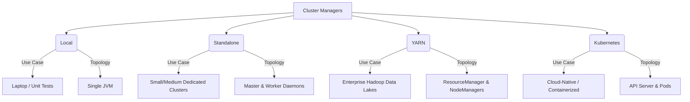

# Spark Cluster Types

**Spark can run on various cluster managers—Local, Standalone, YARN, Mesos, and Kubernetes—each offering different levels of resource isolation, scalability, and operational overhead.**

## Why It Matters
Choosing the right cluster manager is a foundational architectural decision. A data scientist prototyping a model on a laptop will use Local mode. A mid-sized company with a dedicated Spark cluster might use Standalone mode for simplicity. An enterprise with a massive Hadoop data lake will rely on YARN to share resources between Spark, Hive, and Flink. A modern cloud-native organization heavily invested in Docker will deploy Spark on Kubernetes. Using the wrong cluster type can lead to resource starvation, complex maintenance, or incompatibility with existing infrastructure.

## How It Works
**Local Mode** is not a true distributed cluster. The Driver and Executors run as threads within a single JVM on the local machine. It is invoked using `local` (1 thread), `local[N]` (N threads), or `local[*]` (one thread per logical CPU core). It is exclusively for testing and development.

**Standalone Mode** is Spark's built-in cluster manager. It involves running a Master daemon on one node and Worker daemons on other nodes. It is easy to set up and requires no external dependencies (like Hadoop or Kubernetes). However, it lacks advanced multi-tenant features and fine-grained resource sharing.

**YARN (Yet Another Resource Manager)** is the resource manager for Hadoop. When Spark runs on YARN, it leverages YARN's ResourceManager and NodeManagers. This is the enterprise standard for on-premise big data because it allows Spark to coexist with other workloads, supporting robust queueing, security (Kerberos), and dynamic resource allocation.

**Kubernetes (K8s)** is the modern standard for container orchestration. In K8s mode, Spark runs inside Docker containers. The `spark-submit` command communicates directly with the Kubernetes API server to create a Driver pod, which then requests Executor pods. This provides ultimate isolation, dependency management (via custom Docker images), and integrates seamlessly with cloud providers (EKS, GKE, AKS). Mesos is another option, though its usage has heavily declined in favor of Kubernetes.

## Flow Diagram



## Data Visualization

| Feature | Local | Standalone | YARN | Kubernetes |
|---------|-------|------------|------|------------|
| **Deployment Setup** | Zero | Simple | Complex (Hadoop) | Complex (K8s) |
| **Isolation** | None | Process level | JVM/Container level | Container level |
| **Multi-tenancy** | Poor | Basic | Excellent | Excellent |
| **Dependency Mgmt** | Host OS | Host OS / Conda | YARN Archives / Conda | Docker Images |
| **Dynamic Allocation**| No | Yes (limited) | Yes (robust) | Yes (robust) |

## Code Example

```bash
# 1. Local Mode (Using all available cores)
spark-submit --master local[*] my_app.py

# 2. Standalone Mode (Pointing to the Master UI URL)
spark-submit --master spark://master-node:7077 my_app.py

# 3. YARN Mode (Client mode - driver runs locally)
spark-submit --master yarn --deploy-mode client my_app.py

# 4. YARN Mode (Cluster mode - driver runs in the YARN cluster)
spark-submit --master yarn --deploy-mode cluster my_app.py

# 5. Kubernetes Mode (Creating pods on a K8s cluster)
spark-submit \
    --master k8s://https://<k8s-api-server>:<port> \
    --deploy-mode cluster \
    --name spark-k8s-demo \
    --conf spark.executor.instances=3 \
    --conf spark.kubernetes.container.image=my-repo/spark:v3.2.0 \
    local:///opt/spark/examples/jars/spark-examples.jar
```

## Common Pitfalls
* **Using `local` in production**: Deploying jobs with `master("local[*]")` hardcoded in the code, which ignores the actual cluster resources.
* **Dependency hell in YARN/Standalone**: Because these modes rely on the host OS for dependencies, Python libraries (pip) or native binaries might differ across worker nodes, leading to obscure runtime errors.
* **Network issues in K8s**: Misconfiguring headless services or pod networking in Kubernetes, causing Executors to be unable to communicate with the Driver.
* **Deploy mode confusion**: Using client deploy mode on a laptop on a VPN to connect to a YARN cluster, causing massive network bottlenecking as data moves between the cluster and the laptop.

## Key Takeaway
The cluster manager abstracts away physical infrastructure; Kubernetes represents the modern, container-native future of Spark, while YARN remains the heavyweight champion of on-premise Hadoop deployments.


