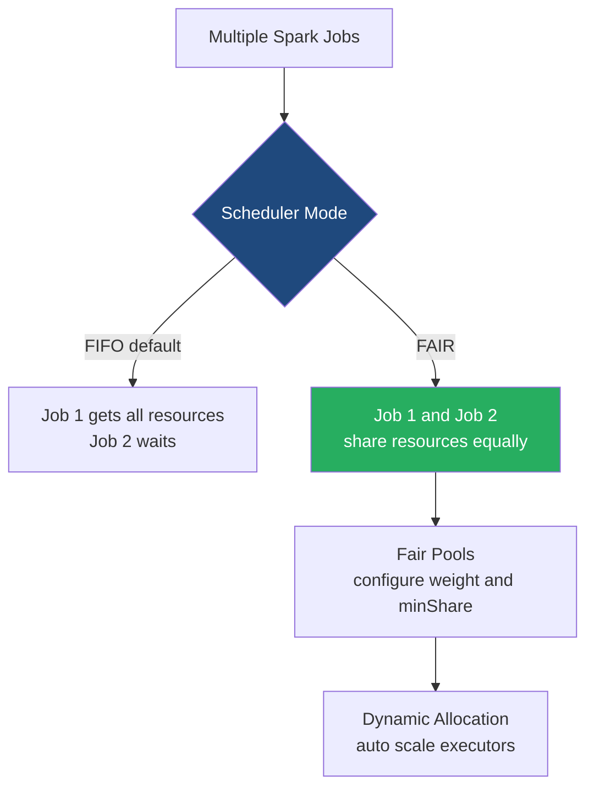

# Job and Resource Scheduling

**Job and Resource Scheduling in Spark determines how applications share cluster resources and how individual jobs within an application are prioritized using FIFO, Fair Scheduling, and Dynamic Allocation.**

## Why It Matters
In a real-world environment, multiple users and applications compete for limited cluster resources (CPU and Memory). Without proper scheduling, a single heavy job (e.g., a massive `GROUP BY`) could monopolize the entire cluster for hours, forcing small, critical ad-hoc queries to wait indefinitely. Understanding how to configure scheduling pools, enable fair sharing, and configure dynamic resource allocation ensures high cluster utilization, reduces costs, and provides a smooth experience for concurrent users (such as on a shared Spark Thrift Server or JupyterHub).

## How It Works
Scheduling happens at two levels: **Cross-Application Scheduling** (Cluster level) and **Intra-Application Scheduling** (Job level).

At the **Cluster level**, the Cluster Manager (YARN, K8s, Standalone) decides how to divide physical resources among different Spark applications. **Dynamic Resource Allocation** (`spark.dynamicAllocation.enabled=true`) is a crucial feature here. It allows a Spark application to request Executors when it has a backlog of pending tasks and release Executors back to the cluster when they are idle. This elasticity is vital in cloud environments to scale down costs when the application is resting.

At the **Intra-Application level**, a single SparkContext might receive multiple job submissions simultaneously (e.g., multiple users hitting a BI dashboard powered by Spark). By default, Spark uses **FIFO (First-In, First-Out)** scheduling. The first job gets all the resources it needs. If there are leftover resources, the second job can use them.
To support concurrency, Spark offers **FAIR Scheduling**. When `spark.scheduler.mode=FAIR` is set, Spark assigns tasks between jobs in a "round-robin" fashion. All jobs get a roughly equal share of cluster resources. You can further tune this by defining **Scheduling Pools** (via a `fairscheduler.xml` file) to give certain types of jobs (e.g., "high-priority-reports") a larger weight or minimum guarantee than others (e.g., "background-batch").

## Flow Diagram



## Data Visualization

| Concept | Scope | Behavior | Key Configurations |
|---------|-------|----------|--------------------|
| **FIFO** | Intra-App | Sequential execution of jobs. | `spark.scheduler.mode=FIFO` (default) |
| **FAIR** | Intra-App | Concurrent execution, resources shared. | `spark.scheduler.mode=FAIR`, `spark.scheduler.allocation.file` |
| **Dynamic Allocation** | Cross-App | Scales Executors based on workload. | `spark.dynamicAllocation.enabled=true`, `spark.dynamicAllocation.minExecutors`, `spark.dynamicAllocation.maxExecutors` |
| **Task Locality** | Task | Attempts to run tasks on nodes where data resides. | `spark.locality.wait` |

## Code Example

```python
from pyspark.sql import SparkSession
import threading

# Initialize Spark with FAIR scheduling enabled
spark = SparkSession.builder \
    .appName("FairSchedulerDemo") \
    .config("spark.scheduler.mode", "FAIR") \
    .getOrCreate()

df = spark.range(10000000)

def run_query(pool_name, query_name):
    # Assign the current thread to a specific scheduling pool
    spark.sparkContext.setLocalProperty("spark.scheduler.pool", pool_name)
    print(f"Starting {query_name} in pool {pool_name}")
    
    # A heavy action
    count = df.repartition(100).count()
    print(f"Finished {query_name} with count {count}")

# Using Python threads to submit jobs concurrently to the same SparkContext
thread1 = threading.Thread(target=run_query, args=("high_priority", "Query_A"))
thread2 = threading.Thread(target=run_query, args=("low_priority", "Query_B"))

thread1.start()
thread2.start()

thread1.join()
thread2.join()

spark.stop()
```

## Common Pitfalls
* **Using FIFO for multi-tenant applications**: If a BI tool connects to a Spark Thrift Server running in FIFO mode, one user's heavy query will freeze everyone else's dashboards.
* **Forgetting External Shuffle Service with Dynamic Allocation**: If an Executor is released by Dynamic Allocation, its shuffle files are lost unless an External Shuffle Service is running. In K8s, this requires specific shuffle tracking configurations (`spark.dynamicAllocation.shuffleTracking.enabled`).
* **Misconfiguring Fair Scheduler weights**: Setting extreme weights in `fairscheduler.xml` can cause resource starvation for lower-priority pools, mimicking the problems of FIFO.
* **Task Locality timeouts**: Setting `spark.locality.wait` too high can cause jobs to wait too long for a specific node to free up, slowing down overall execution.

## Key Takeaway
Dynamic Allocation manages the total size of your cluster automatically, while Fair Scheduling ensures that multiple jobs running inside your application share that space fairly without blocking one another.


