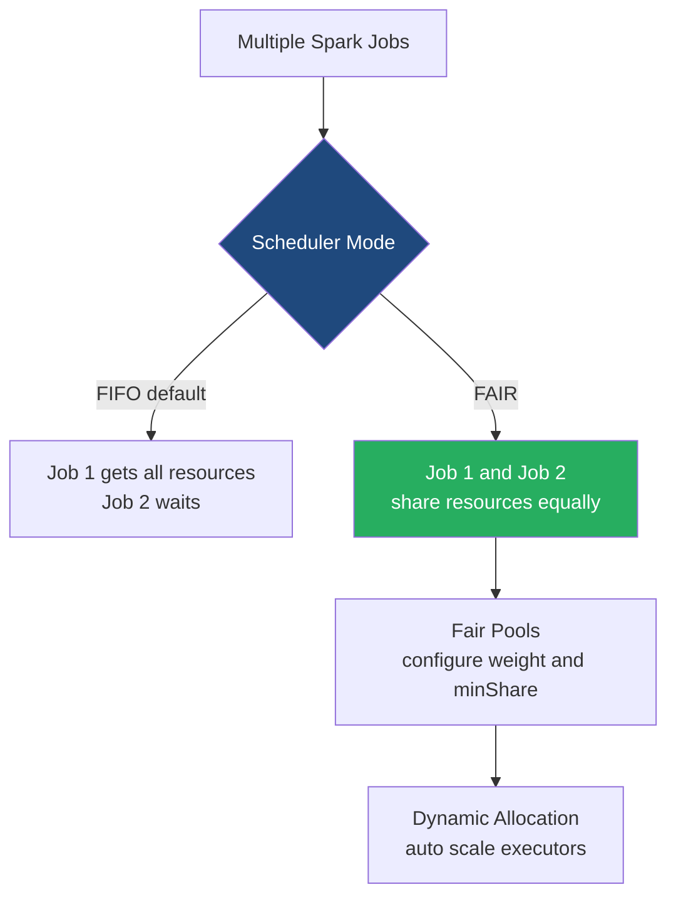

# Job and Resource Scheduling

**Job and Resource Scheduling in Spark determines how applications share cluster resources and how individual jobs within an application are prioritized using FIFO, Fair Scheduling, and Dynamic Allocation.**

## Why It Matters
In a real-world environment, multiple users and applications compete for limited cluster resources (CPU and Memory). Without proper scheduling, a single heavy job (e.g., a massive `GROUP BY`) could monopolize the entire cluster for hours, forcing small, critical ad-hoc queries to wait indefinitely. Understanding how to configure scheduling pools, enable fair sharing, and configure dynamic resource allocation ensures high cluster utilization, reduces costs, and provides a smooth experience for concurrent users (such as on a shared Spark Thrift Server or JupyterHub).

## How It Works
Scheduling happens at two levels: **Cross-Application Scheduling** (Cluster level) and **Intra-Application Scheduling** (Job level).

At the **Cluster level**, the Cluster Manager (YARN, K8s, Standalone) decides how to divide physical resources among different Spark applications. **Dynamic Resource Allocation** (`spark.dynamicAllocation.enabled=true`) is a crucial feature here. It allows a Spark application to request Executors when it has a backlog of pending tasks and release Executors back to the cluster when they are idle. This elasticity is vital in cloud environments to scale down costs when the application is resting.

At the **Intra-Application level**, a single SparkContext might receive multiple job submissions simultaneously (e.g., multiple users hitting a BI dashboard powered by Spark). By default, Spark uses **FIFO (First-In, First-Out)** scheduling. The first job gets all the resources it needs. If there are leftover resources, the second job can use them.
To support concurrency, Spark offers **FAIR Scheduling**. When `spark.scheduler.mode=FAIR` is set, Spark assigns tasks between jobs in a "round-robin" fashion. All jobs get a roughly equal share of cluster resources. You can further tune this by defining **Scheduling Pools** (via a `fairscheduler.xml` file) to give certain types of jobs (e.g., "high-priority-reports") a larger weight or minimum guarantee than others (e.g., "background-batch").

## Flow Diagram



## Data Visualization

| Concept | Scope | Behavior | Key Configurations |
|---------|-------|----------|--------------------|
| **FIFO** | Intra-App | Sequential execution of jobs. | `spark.scheduler.mode=FIFO` (default) |
| **FAIR** | Intra-App | Concurrent execution, resources shared. | `spark.scheduler.mode=FAIR`, `spark.scheduler.allocation.file` |
| **Dynamic Allocation** | Cross-App | Scales Executors based on workload. | `spark.dynamicAllocation.enabled=true`, `spark.dynamicAllocation.minExecutors`, `spark.dynamicAllocation.maxExecutors` |
| **Task Locality** | Task | Attempts to run tasks on nodes where data resides. | `spark.locality.wait` |

## Code Example

```python
from pyspark.sql import SparkSession
import threading

# Initialize Spark with FAIR scheduling enabled
spark = SparkSession.builder \
    .appName("FairSchedulerDemo") \
    .config("spark.scheduler.mode", "FAIR") \
    .getOrCreate()

df = spark.range(10000000)

def run_query(pool_name, query_name):
    # Assign the current thread to a specific scheduling pool
    spark.sparkContext.setLocalProperty("spark.scheduler.pool", pool_name)
    print(f"Starting {query_name} in pool {pool_name}")
    
    # A heavy action
    count = df.repartition(100).count()
    print(f"Finished {query_name} with count {count}")

# Using Python threads to submit jobs concurrently to the same SparkContext
thread1 = threading.Thread(target=run_query, args=("high_priority", "Query_A"))
thread2 = threading.Thread(target=run_query, args=("low_priority", "Query_B"))

thread1.start()
thread2.start()

thread1.join()
thread2.join()

spark.stop()
```

## Common Pitfalls
* **Using FIFO for multi-tenant applications**: If a BI tool connects to a Spark Thrift Server running in FIFO mode, one user's heavy query will freeze everyone else's dashboards.
* **Forgetting External Shuffle Service with Dynamic Allocation**: If an Executor is released by Dynamic Allocation, its shuffle files are lost unless an External Shuffle Service is running. In K8s, this requires specific shuffle tracking configurations (`spark.dynamicAllocation.shuffleTracking.enabled`).
* **Misconfiguring Fair Scheduler weights**: Setting extreme weights in `fairscheduler.xml` can cause resource starvation for lower-priority pools, mimicking the problems of FIFO.
* **Task Locality timeouts**: Setting `spark.locality.wait` too high can cause jobs to wait too long for a specific node to free up, slowing down overall execution.

## Key Takeaway
Dynamic Allocation manages the total size of your cluster automatically, while Fair Scheduling ensures that multiple jobs running inside your application share that space fairly without blocking one another.


---

## 🎓 Deep Learning Questions

### Q1: Why Was This Concept Introduced?
Before advanced job and resource scheduling existed in Spark, clusters suffered from severe inefficiency and resource monopolization. By default, Spark runs jobs in a First-In, First-Out (FIFO) order. If a data scientist submitted a massive machine learning job that took hours to run, it would consume all available cluster resources. Meanwhile, a business analyst submitting a quick 5-second SQL query would have to wait hours just for the ML job to finish. Additionally, with static resource allocation, a Spark application would hold onto its executors for its entire lifecycle, even when sitting idle, preventing other applications from using those precious resources. 

To overcome these limitations, Spark introduced **FAIR Scheduling** (for intra-application multi-tenancy) and **Dynamic Resource Allocation** (for cross-application elasticity). FAIR scheduling allows jobs submitted to the same SparkContext to share resources in a round-robin fashion, ensuring quick ad-hoc queries don't get stuck behind massive batch jobs. Dynamic Allocation allows an application to dynamically request executors when tasks are pending and release them when idle, drastically improving cluster utilization and reducing cloud compute costs.

### Q2: What Exactly Is This Concept and How Does It Work?
Job and Resource Scheduling in Spark operates on two distinct levels:
1. **Intra-Application Scheduling (Job Level):** When multiple jobs are submitted to the same Spark application (e.g., via a Thrift Server or shared notebook), the `TaskScheduler` decides which job's tasks to run next. In **FIFO mode** (default), the first job gets all resources. In **FAIR mode**, Spark distributes tasks across jobs in a round-robin manner. Administrators can further group jobs into "pools" (via `fairscheduler.xml`) and assign different weights (priorities) and `minShare` (guaranteed CPU cores) to each pool.
2. **Cross-Application Scheduling (Resource Level):** When multiple Spark applications share a cluster (managed by YARN, Mesos, or Kubernetes), **Dynamic Resource Allocation** comes into play. If an application has pending tasks waiting for more than `spark.dynamicAllocation.schedulerBacklogTimeout`, it requests more executors. Conversely, if an executor remains idle for `spark.dynamicAllocation.executorIdleTimeout`, it is returned to the cluster manager. This elasticity ensures resources are only consumed when actual computation is happening.

### Q3: Where Should This Concept Be Used?
Advanced scheduling and dynamic allocation are critical in:
* **Multi-Tenant BI Environments:** Companies like **Uber** or **Airbnb** run Spark Thrift Servers where hundreds of analysts run concurrent SQL queries using tools like Tableau or Superset. FAIR scheduling ensures interactive queries return quickly.
* **Shared Interactive Notebooks:** Platforms like JupyterHub or Databricks where multiple data scientists share the same cluster.
* **Cloud Environments (AWS EMR, Databricks):** In the cloud, compute time is money. Dynamic allocation is essential to scale down cluster size automatically when pipelines finish their heavy lifting and transition to lighter tasks or sit idle.

### Q4: Where Should This Concept NOT Be Used?
* **Spark Streaming (Structured Streaming):** Dynamic resource allocation is generally discouraged for low-latency streaming applications. The overhead of constantly requesting and releasing executors can introduce unpredictable latency spikes. It's better to statically allocate resources to guarantee real-time SLAs.
* **Single-Tenant, Time-Bound Batch Jobs:** If you have an isolated cluster dedicated to running a single massive nightly ETL job, FAIR scheduling adds unnecessary complexity. FIFO is perfectly fine here.
* **Clusters without an External Shuffle Service:** If you use dynamic allocation, an executor might be killed when idle. If it stored shuffle data, that data is lost, causing costly recomputations. You must enable an External Shuffle Service (or shuffle tracking in K8s) to safely use dynamic allocation.

### Q5: How Is This Concept Different from Hadoop?

| Aspect | Hadoop MapReduce | Apache Spark |
|--------|------------------|--------------|
| **Architecture** | Relies entirely on the Cluster Manager (YARN Capacity/Fair Scheduler) for all scheduling. | Has a two-tiered approach: Cluster Manager handles App scheduling, and SparkContext handles internal Job scheduling. |
| **Processing Model** | Jobs are mostly independent and sequential. | A single long-running Spark application can handle thousands of concurrent jobs internally. |
| **Memory Usage** | Containers are requested per task and released immediately after the task completes. | Executors are long-lived JVMs that cache data in memory across multiple tasks and jobs. |
| **Fault Tolerance** | Writes to disk after every stage. | RDD lineage and in-memory caching. |
| **Scalability** | Good for batch, slow for interactive. | Highly scalable, better for both batch and interactive. |
| **Ease of Development** | Complex Map and Reduce paradigms. | Rich APIs (DataFrame, Dataset, SQL). |
| **Typical Use Cases** | Massive batch processing. | Machine Learning, Streaming, Interactive Analytics, Batch. |
| **Advantages** | Robust, mature, simple resource model. | Much faster (100x), versatile, supports FAIR scheduling internally. |
| **Disadvantages** | Slow disk I/O, no interactive querying. | Memory intensive, complex tuning required (e.g. Dynamic Allocation). |

### Q6: How Can This Concept Be Related to a Traditional RDBMS?

| Traditional RDBMS Concept | Spark Scheduling Equivalent | Explanation |
|---------------------------|-----------------------------|-------------|
| **Resource Governor** | **YARN/K8s + Dynamic Allocation** | Limits the max CPU/Memory a database instance can consume and scales resources based on load. |
| **Query Queues/Priorities** | **FAIR Scheduler Pools** | In RDBMS, you can assign high priority to CEO reports and low priority to background stats gathering. Spark pools do exactly this. |
| **Execution Plan Scheduling** | **DAGScheduler** | Both systems break down a SQL query into a physical execution plan (stages and tasks). |
| **Connection Pooling** | **Spark Thrift Server** | Allows multiple clients (JDBC/ODBC) to connect and submit queries concurrently to the same execution engine. |

### Q7: What Happens Behind the Scenes?
When multiple jobs are submitted to a FAIR-scheduled Spark application with dynamic allocation:
1. **Driver:** Receives the job submissions.
2. **DAGScheduler:** Breaks jobs into Stages based on shuffle boundaries, then creates Tasks.
3. **TaskScheduler:** Looks at the active pools. Because FAIR mode is on, it pulls tasks from both pools round-robin.
4. **Executors & Partitions:** Tasks are sent to Executors to process Partitions of data.
5. **Dynamic Request:** If the TaskScheduler realizes there are many pending tasks, it triggers Dynamic Allocation to request more executors from the cluster manager.
6. **Execution & Scale Down:** Both jobs finish. After a timeout period of inactivity, Dynamic Allocation releases the executors back to the cluster.

```text
[Users A & B] -> Submit Jobs -> [SparkContext/Driver]
                                      |
                              [DAGScheduler] (Creates Stages/Tasks)
                                      |
                              [TaskScheduler (FAIR Mode)]
                                 /                  \
                        [Pool: Interactive]    [Pool: Batch]
                          (Weight: 3)           (Weight: 1)
                                 \                  /
                                [Available Executors]
                                      | (If backlogged)
                            [Dynamic Allocation Engine] -> Requests more nodes
```

### Q8: Performance Considerations, Best Practices, and Common Mistakes

| Category | Recommendation | Why It Matters |
|----------|----------------|----------------|
| **Dynamic Allocation** | Always use with an External Shuffle Service. | Prevents shuffle data loss when executors are dynamically spun down, avoiding massive stage retries. |
| **FAIR Scheduler** | Group users into distinct pools via `fairscheduler.xml`. | Assign higher weights to interactive pools and lower weights to heavy ETL pools to ensure fast dashboard load times. |
| **Timeouts** | Tune `spark.dynamicAllocation.executorIdleTimeout`. | Setting this too low causes thrashing (constant JVM startup/shutdown). 60s is a safe default. |
| **Locality** | Don't set `spark.locality.wait` too high. | If tasks wait too long to run on a data-local node, the overall job slows down. Sometimes it's faster to process data remotely. |
| **Anti-Pattern** | Using FIFO in Thrift Servers. | Causes severe queue-blocking; one bad query will freeze all other BI analysts connected to the server. |

### Q9: Interview Questions

**Beginner**
1. What is the default scheduling mode within a Spark application?
*(FIFO - First In, First Out)*
2. What feature allows Spark to automatically add or remove executors based on workload?
*(Dynamic Resource Allocation)*
3. Why might a small Spark SQL query hang indefinitely behind a large machine learning job?
*(Because the application is running in FIFO mode and the large job is hogging all resources.)*

**Intermediate**
4. How do you configure a Spark application to allow concurrent jobs to share resources?
*(Set `spark.scheduler.mode` to `FAIR`.)*
5. What is the role of `fairscheduler.xml` in Spark?
*(It defines scheduling pools, allowing you to assign weights and minimum resource guarantees to different job types.)*
6. Why is an External Shuffle Service necessary when using Dynamic Allocation?
*(To preserve shuffle files written by executors that are subsequently scaled down and killed due to idleness.)*

**Advanced**
7. Explain the difference between cross-application scheduling and intra-application scheduling.
*(Cross-app is handled by the Cluster Manager like YARN to allocate resources between different SparkContexts. Intra-app is handled by Spark's TaskScheduler to allocate resources between jobs within the same SparkContext.)*
8. How does Spark's Delay Scheduling (Task Locality) interact with the FAIR scheduler?
*(The FAIR scheduler might skip over a pool if its tasks cannot achieve data locality immediately, allowing other pools to execute, thus balancing fairness with performance.)*
9. What happens if a pool's `minShare` is not met?
*(The FAIR scheduler will prioritize tasks from that pool over pools that have already met or exceeded their `minShare`.)*

**Scenario-Based**
10. You run a Spark Thrift Server for 50 BI analysts. During peak hours, dashboards take 10 minutes to load, even for simple `SELECT count(*)` queries. How do you fix this?
*(Enable FAIR scheduling. Create separate pools for "ad-hoc" and "heavy-reports". Route quick BI queries to the high-weight ad-hoc pool.)*
11. Your nightly Spark ETL job in AWS EMR finishes its heavy processing in 1 hour but then spends 3 hours doing light sequential aggregations. Your AWS bill is huge. What feature should you enable?
*(Enable Dynamic Resource Allocation so the cluster scales down the executors during the 3-hour light processing phase.)*

### Q10: Complete Real-World Example

**Business Problem:** A retail company (like Walmart) has a shared Spark cluster. Data Engineers run heavy batch jobs to calculate weekly sales, while Store Managers use a web dashboard to query real-time inventory. Both connect to the same SparkContext. We need to ensure the Managers' inventory queries are not blocked by the Engineers' heavy batch jobs.

**Sample Dataset:** `sales_data` (massive, billions of rows), `inventory_data` (small, quick lookups).

**PySpark Code:**
```python
from pyspark.sql import SparkSession
import threading
import time

# 1. Initialize Spark with FAIR scheduling
spark = SparkSession.builder \
    .appName("MultiTenantRetailCluster") \
    .config("spark.scheduler.mode", "FAIR") \
    .config("spark.dynamicAllocation.enabled", "true") \
    .config("spark.dynamicAllocation.minExecutors", "2") \
    .config("spark.dynamicAllocation.maxExecutors", "20") \
    .getOrCreate()

# Generate dummy data
sales_df = spark.range(100000000).withColumnRenamed("id", "sales_id")
inventory_df = spark.range(1000).withColumnRenamed("id", "item_id")

def run_heavy_batch_job():
    # Assign thread to 'batch' pool
    spark.sparkContext.setLocalProperty("spark.scheduler.pool", "batch_pool")
    print("[ENGINEER] Starting heavy weekly sales aggregation...")
    # Simulate heavy shuffle
    sales_df.repartition(200).groupBy("sales_id").count().write.format("noop").mode("overwrite").save()
    print("[ENGINEER] Weekly sales batch job completed.")

def run_quick_interactive_query():
    # Wait slightly so the batch job starts first
    time.sleep(2)
    # Assign thread to 'interactive' pool
    spark.sparkContext.setLocalProperty("spark.scheduler.pool", "interactive_pool")
    print("[MANAGER] Querying current inventory...")
    count = inventory_df.count()
    print(f"[MANAGER] Inventory count is {count}. Query completed instantly!")

# 2. Submit both jobs concurrently using Python threads
batch_thread = threading.Thread(target=run_heavy_batch_job)
interactive_thread = threading.Thread(target=run_quick_interactive_query)

batch_thread.start()
interactive_thread.start()

batch_thread.join()
interactive_thread.join()

spark.stop()
```

**Step-by-step execution walkthrough:**
1. SparkContext initializes with FAIR mode and dynamic allocation (scaling between 2 and 20 executors).
2. The `batch_thread` starts first. It's assigned to `batch_pool` and submits a massive shuffle job. Under FIFO, this would lock the cluster.
3. Two seconds later, `interactive_thread` starts. It's assigned to `interactive_pool`.
4. Because FAIR scheduling is active, the TaskScheduler immediately suspends assigning *new* batch tasks and assigns an available executor to the inventory query.
5. The inventory query finishes in milliseconds. The batch job continues to run. Dynamic allocation requests more executors to speed up the batch job since there is a backlog of tasks.

### 💡 Key Takeaways
- **FIFO is the default** but is terrible for multi-tenant, shared Spark environments.
- **FAIR Scheduling** enables concurrent job execution within a single Spark application, heavily utilized by Thrift Servers and shared Notebooks.
- **Scheduling Pools** allow fine-grained control, giving priority to interactive queries over background batch tasks.
- **Dynamic Resource Allocation** allows Spark to dynamically scale up executors during heavy workloads and release them to save money when idle.
- Dynamic allocation **must** be paired with an External Shuffle Service or shuffle tracking to prevent data loss.

### ⚠️ Common Misconceptions
- **Misconception:** YARN queues and Spark pools are the same thing. **Correction:** YARN queues schedule resources *between* different applications. Spark pools schedule resources *within* a single application.
- **Misconception:** Dynamic allocation automatically makes jobs run faster. **Correction:** It saves cluster resources and money; it can actually add slight delays due to the time it takes to spin up new JVMs.
- **Misconception:** Setting higher pool weights guarantees tasks finish faster. **Correction:** It only guarantees they get a larger share of the CPU time; poorly written code will still be slow.

### 🔗 Related Spark Concepts
- External Shuffle Service
- Task Locality (Delay Scheduling)
- Spark Thrift Server
- YARN Resource Manager / Kubernetes Scheduler

### 📚 References for Further Reading
- Apache Spark Official Documentation
- Learning Spark (O'Reilly)
- Spark: The Definitive Guide (O'Reilly)
