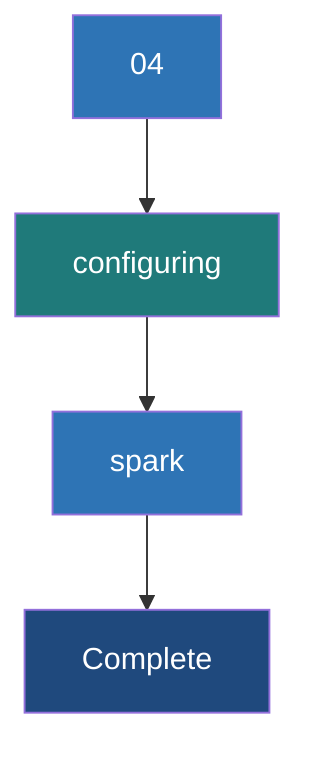

# Configuring Spark

**Spark Configuration controls application behavior, resource usage, and performance tuning through a strict hierarchy of code-level settings, command-line flags, and properties files.**

## Why It Matters
Out of the box, Spark is configured to run on a laptop. If you deploy a job to a 100-node cluster without configuring memory, cores, and parallelism, Spark will likely use a tiny fraction of the available power, or it will crash violently with OutOfMemory (OOM) errors. Properly configuring Spark is the core skill of Spark performance tuning. You must understand not just *what* to configure, but *how* properties are overridden based on precedence.

## How It Works
Spark properties control everything: memory (`spark.executor.memory`), shuffle behavior (`spark.sql.shuffle.partitions`), serialization (`spark.serializer`), and network timeouts.

There are three primary ways to set these configurations, and they follow a strict order of precedence (from highest priority to lowest):
1. **SparkConf/SparkSession in Code**: Hardcoding the config in the application code (e.g., `.config("spark.executor.memory", "4g")`). This overrides everything else and cannot be changed without recompiling/editing the code.
2. **Command-line arguments via `spark-submit`**: Passing flags like `--executor-memory 4g` or `--conf spark.sql.shuffle.partitions=500`. This is the recommended way to set environment-specific configs because it separates code from deployment.
3. **`spark-defaults.conf` file**: A file located in `$SPARK_HOME/conf/`. Properties defined here apply to all applications submitted from that machine unless overridden by methods 1 or 2.

Additionally, some settings are controlled via **Environment Variables** (like `SPARK_HOME`, `JAVA_HOME`, `HADOOP_CONF_DIR`). These are typically defined in `spark-env.sh`. 

When configuring resources, the golden rule of Spark tuning applies: do not allocate massive Executors (e.g., 64GB RAM, 32 cores). Large JVMs suffer from massive Garbage Collection (GC) pauses, and HDFS throughput degrades with too many cores per executor. The sweet spot is usually 4-8 cores and 16-32GB of RAM per Executor.

## Flow Diagram



## Data Visualization

| Property Name | Default | Recommended / Tuning | Description |
|---------------|---------|----------------------|-------------|
| `spark.executor.memory` | 1g | 16g - 32g | Memory per executor. Avoid > 64g due to GC pauses. |
| `spark.executor.cores` | 1 (YARN) / All (Standalone) | 4 - 8 | Cores per executor. Determines concurrent tasks per JVM. |
| `spark.sql.shuffle.partitions` | 200 | 2x - 3x Total Cluster Cores | Number of partitions used for Joins/Aggregations. |
| `spark.serializer` | JavaSerializer | org.apache.spark.serializer.KryoSerializer | Use Kryo for faster, more compact data serialization. |
| `spark.memory.fraction` | 0.6 | 0.6 | Fraction of heap space used for execution and storage. |

## Code Example

```python
from pyspark.sql import SparkSession

# BEST PRACTICE: Do not hardcode cluster resources (memory/cores) in the code.
# Leave those for spark-submit.
# ONLY hardcode application-specific logic configurations here.

spark = SparkSession.builder \
    .appName("ConfigurationPrecedenceDemo") \
    .config("spark.sql.shuffle.partitions", "500") \
    .config("spark.serializer", "org.apache.spark.serializer.KryoSerializer") \
    .getOrCreate()

# To run this script:
# spark-submit \
#   --executor-memory 16G \
#   --executor-cores 5 \
#   --driver-memory 4G \
#   --conf spark.sql.shuffle.partitions=1000 \  <-- This will be IGNORED because the code hardcoded it to 500!
#   my_script.py

print(f"Shuffle Partitions: {spark.conf.get('spark.sql.shuffle.partitions')}")

spark.stop()
```

## Common Pitfalls
* **Hardcoding resources in code**: Writing `.config("spark.executor.memory", "32g")` in the code means this job can only run on a cluster with 32g nodes. It makes the code non-portable between dev, staging, and production.
* **Ignoring `spark.sql.shuffle.partitions`**: Leaving the default of 200 on a massive dataset results in out-of-memory errors (spill to disk) and slow performance. Leaving it at 200 on tiny datasets results in overhead of scheduling too many tiny tasks.
* **Fat Executors**: Assigning all cores and all memory on a node to a single Executor leads to severe Garbage Collection overhead.
* **Driver Memory OOM**: Increasing Executor memory but forgetting to increase `spark.driver.memory` when the job relies heavily on `collect()` or massive Broadcast variables.

## Key Takeaway
Command-line arguments (`spark-submit`) should manage environmental resources (memory, cores), while the code should only hardcode configurations related to internal application logic (serializers, custom formats).


---

## 🎓 Deep Learning Questions

### Q1: Why Was This Concept Introduced?
Before Spark, configuring massive distributed processing jobs (like Hadoop MapReduce) was notoriously tedious, often requiring editing huge XML files distributed across every node. Spark introduced a structured, layered configuration system to make it simple for developers to define logical job settings inside code, while giving cluster administrators the power to allocate physical resources via scripts. This separation of concerns allows the exact same compiled Spark code to run on a developer's 16GB laptop or a 1,000-node production cluster just by changing `spark-submit` arguments. It overcomes the limitation of hardcoded deployment configurations and enables true portability and dynamic resource allocation.

### Q2: What Exactly Is This Concept and How Does It Work?
Configuring Spark is the process of setting parameters that dictate how Spark behaves, how much memory and CPU it uses, and how it handles data shuffling. 
It works via a strict hierarchy:
1. **Application Code (`SparkConf`)**: Has the highest priority. If you set something here, it cannot be overridden without recompiling.
2. **Command-line arguments (`spark-submit`)**: Used to pass environment-specific configurations at runtime (e.g., `--executor-memory 16G`).
3. **Configuration Files (`spark-defaults.conf`)**: Cluster-wide defaults loaded automatically if neither the code nor command line specifies a property.

When a Spark job starts, the Driver reads these configurations, merges them according to precedence, and requests the exact requested resources (memory and cores) from the Cluster Manager (YARN, Mesos, or Kubernetes).

### Q3: Where Should This Concept Be Used?
This configuration hierarchy is used everywhere Spark is deployed, but its real power shines in enterprise environments:
- **Banks & Healthcare (Multi-tenant Clusters):** Administrators enforce strict memory limits via `spark-defaults.conf`, while analysts adjust `spark.sql.shuffle.partitions` dynamically via `spark-submit` for their specific workloads.
- **Retail & E-commerce (Cloud Auto-scaling):** When running ephemeral clusters on AWS EMR or Databricks, deployment pipelines inject instance-specific configurations at runtime without touching the PySpark scripts.
- **CI/CD Pipelines:** Staging environments get smaller memory allocations via command-line flags, while production runs use massive executors, all sharing the exact same codebase.

### Q4: Where Should This Concept NOT Be Used?
You should **NOT** hardcode physical cluster resources (like `spark.executor.memory`, `spark.executor.cores`, or `spark.driver.memory`) inside your application code (`SparkSession.builder.config(...)`). 
If you do this, your code becomes permanently locked to a specific hardware profile. It will fail if deployed to a smaller environment or waste resources if deployed to a larger one. These environmental settings belong exclusively in `spark-submit` or configuration files. Application code should only contain logical configurations (like `spark.serializer` or custom UDF behavior).

### Q5: How Is This Concept Different from Hadoop?

| Aspect | Hadoop MapReduce | Apache Spark |
|--------|------------------|--------------|
| **Configuration Format** | Cumbersome XML files (`core-site.xml`, `mapred-site.xml`). | Key-value properties, command-line flags, and code-level `SparkConf`. |
| **Hierarchy** | File-based overrides, often static and hard to change per job. | Strict dynamic precedence: Code > Command-Line > Defaults file. |
| **Memory Tuning** | Configured per Map/Reduce slot, highly rigid. | Flexible allocation of Executor Memory and Driver Memory. |
| **Ease of Development** | Tedious. Requires restarting services or distributing XMLs. | Extremely easy. Can be set dynamically via `spark-submit` per job. |
| **Scalability** | Relies on static cluster limits. | Supports dynamic allocation (`spark.dynamicAllocation.enabled`). |

### Q6: How Can This Concept Be Related to a Traditional RDBMS?

| RDBMS Concept | Spark Configuration Equivalent | Why It Matters |
|---------------|--------------------------------|----------------|
| `my.cnf` / `postgresql.conf` | `spark-defaults.conf` | Defines the global base settings for the server/cluster. |
| Session Variables (`SET SESSION...`) | `spark-submit --conf` or `SparkSession.config()` | Changes the behavior for just the current query/job execution. |
| `innodb_buffer_pool_size` | `spark.executor.memory` | Defines how much RAM is available for data processing and caching. |
| `max_connections` | `spark.executor.cores` | Determines how many parallel tasks (or queries) can run simultaneously. |
| Query Optimizer Hints | `spark.sql.shuffle.partitions` | Tells the execution engine how to distribute the workload during joins. |

### Q7: What Happens Behind the Scenes?
1. **Submission**: User runs `spark-submit --executor-memory 16g app.py`.
2. **Initialization**: The Spark JVM starts and reads `spark-defaults.conf`.
3. **Command-Line Override**: Spark overwrites any defaults with the `spark-submit` arguments.
4. **Code Execution**: The `SparkSession` is created in `app.py`. Any `.config()` commands in the code overwrite previous settings.
5. **Resource Request**: The Driver sends the final resolved configuration (e.g., memory, cores) to the Cluster Manager (YARN/K8s).
6. **Allocation**: The Cluster Manager spawns Executors with the exact specifications requested.

```text
User Command -> spark-submit (16G)
                     |
                     v
Reads defaults -> spark-defaults.conf (4G -> Overwritten to 16G)
                     |
                     v
Code executes -> app.py (Hardcoded 32G? -> Overwrites to 32G!)
                     |
                     v
Final Config Sent to Cluster Manager (Allocates 32G Executors)
```

### Q8: Performance Considerations, Best Practices, and Common Mistakes

| Category | Recommendation | Why It Matters |
|----------|----------------|----------------|
| **Best Practice** | Use 4-8 cores per Executor. | >8 cores leads to poor HDFS I/O. <4 cores wastes JVM overhead. |
| **Performance** | Limit `spark.executor.memory` to 32GB-64GB. | Massive heaps cause multi-second Garbage Collection (GC) pauses. |
| **Optimization** | Set `spark.sql.shuffle.partitions` to 2-3x cluster cores. | Default is 200. On large clusters, this starves idle cores. On small clusters, it creates too many tiny files. |
| **Common Mistake** | Hardcoding memory in Python/Scala code. | Ruins portability across Dev/QA/Prod environments. |
| **Debugging** | Check the Spark UI "Environment" tab. | Shows exactly which configs are active and where they were set from. |

### Q9: Interview Questions

**Beginner**
1. **What is the order of precedence for Spark configurations?**
   *Answer:* `SparkConf` in code (highest) > `spark-submit` flags > `spark-defaults.conf` (lowest).
2. **Where should you define cluster memory settings?**
   *Answer:* In `spark-submit` or a properties file, never inside the application code.
3. **What is the default number of shuffle partitions?**
   *Answer:* 200 (`spark.sql.shuffle.partitions`).

**Intermediate**
4. **Why shouldn't you allocate a single 128GB Executor per node?**
   *Answer:* Huge JVM heaps suffer from massive Garbage Collection pauses, which freeze processing and can cause node timeouts.
5. **How do you change the serializer Spark uses?**
   *Answer:* Set `spark.serializer` to `org.apache.spark.serializer.KryoSerializer` for better performance.
6. **What happens if you set shuffle partitions too high?**
   *Answer:* You create thousands of tiny tasks, causing scheduling overhead to take longer than actual data processing.

**Advanced**
7. **How does Dynamic Allocation work in Spark?**
   *Answer:* By enabling `spark.dynamicAllocation.enabled`, Spark can request additional executors when backlogged and release them when idle, highly useful in shared cloud environments.
8. **Explain the memory fraction in Spark.**
   *Answer:* `spark.memory.fraction` (default 0.6) dictates how much of the JVM heap is split between execution (shuffles/joins) and storage (caching DataFrames).
9. **How would you debug a job where the `spark-submit` memory flag isn't working?**
   *Answer:* I would check the code to see if `SparkSession.builder.config()` hardcoded the memory, as code overrides the command line. I'd also check the Spark UI Environment tab.

**Scenario-Based**
10. **Your PySpark job joins two 500GB datasets and keeps crashing with OutOfMemory errors, even with 32GB executors. What configuration do you change?**
    *Answer:* I would drastically increase `spark.sql.shuffle.partitions` from 200 to something like 2000 or more. This reduces the amount of data each task has to hold in memory during the join shuffle.
11. **You are migrating a job from a testing cluster (10 nodes) to production (1000 nodes). What configuration strategy do you use?**
    *Answer:* I ensure the PySpark code contains zero hardware configurations. I provide a staging `spark-submit` script with smaller memory/core flags, and a separate production `spark-submit` script with scaled-up flags.

### Q10: Complete Real-World Example

**Business Problem:** A telecom company (like Verizon or AT&T) processes daily call detail records (CDRs). The data engineering team needs a single PySpark script that can run on a small developer laptop for testing, but easily scale up to run on a 50-node AWS EMR cluster for the nightly production batch.

**Sample Dataset:** `call_logs.parquet` (Contains millions of rows of calls with durations and caller IDs).

**PySpark Code:**
```python
import sys
from pyspark.sql import SparkSession
from pyspark.sql.functions import sum, col

def main():
    # 1. We ONLY configure logical settings in the code.
    # Notice we DO NOT set executor memory or cores here!
    spark = SparkSession.builder \
        .appName("TelecomDailyBilling") \
        .config("spark.serializer", "org.apache.spark.serializer.KryoSerializer") \
        .config("spark.sql.parquet.compression.codec", "snappy") \
        .getOrCreate()
        
    print(f"Active Shuffle Partitions: {spark.conf.get('spark.sql.shuffle.partitions')}")

    # 2. Application Logic
    # In a real scenario, this would be an S3 path passed as an argument
    try:
        df = spark.read.parquet("s3a://telecom-data/call_logs.parquet")
        
        # Calculate total call duration per user
        billing_df = df.groupBy("caller_id") \
            .agg(sum("duration_minutes").alias("total_duration"))
            
        billing_df.write.mode("overwrite").parquet("s3a://telecom-data/billing_output/")
        print("Billing job completed successfully.")
        
    except Exception as e:
        print(f"Job failed: {e}")
    finally:
        spark.stop()

if __name__ == "__main__":
    main()
```

**Step-by-Step Execution & Configuration:**

**Scenario A: Developer Testing on Laptop**
The developer runs the script against a tiny sample dataset. They override the default 200 partitions to avoid unnecessary overhead.
```bash
spark-submit \
  --master local[*] \
  --driver-memory 2G \
  --conf spark.sql.shuffle.partitions=4 \
  telecom_billing.py
```

**Scenario B: Production on AWS EMR (50 Nodes)**
The automated airflow pipeline runs the exact same `telecom_billing.py` script, but injects massive cluster resources via the command line.
```bash
spark-submit \
  --master yarn \
  --deploy-mode cluster \
  --executor-memory 32G \
  --executor-cores 5 \
  --driver-memory 8G \
  --conf spark.sql.shuffle.partitions=1200 \
  telecom_billing.py
```

**Expected Output (Production):**
```text
Active Shuffle Partitions: 1200
Billing job completed successfully.
```

**Performance Notes:** By separating the logical configuration (Kryo, Snappy) into the code and the physical configuration (Memory, Cores, Partitions) into `spark-submit`, the company achieves 100% code reuse without sacrificing production performance.

### 💡 Key Takeaways
- Code-level configurations (`SparkConf`) always override `spark-submit` arguments.
- `spark-submit` arguments always override `spark-defaults.conf`.
- Never hardcode memory or CPU limits in your application code; it destroys portability.
- The default 200 shuffle partitions must be tuned based on your data size and cluster cores.
- Keep executors between 4-8 cores and 16-32GB RAM to avoid JVM Garbage Collection nightmares.

### ⚠️ Common Misconceptions
- **"More memory per executor is always better."** False. >64GB JVMs suffer terrible GC pauses. It's better to have multiple 32GB executors.
- **"My `spark-submit` memory flag isn't working, Spark is broken."** Often, the developer accidentally hardcoded the memory in `SparkSession.builder`, making the flag useless.
- **"The default shuffle partitions (200) is fine for everything."** False. It is often too small for large data (causing OOMs) and too large for small data (causing scheduling lag).

### 🔗 Related Spark Concepts
- **Spark Architecture & Components (Driver, Executors)**
- **Spark Memory Management**
- **Spark Shuffling Mechanism**
- **Dynamic Resource Allocation**

### 📚 References for Further Reading
- Apache Spark Official Documentation: Configuration
- Learning Spark, 2nd Edition (O'Reilly)
- Spark: The Definitive Guide (O'Reilly)
