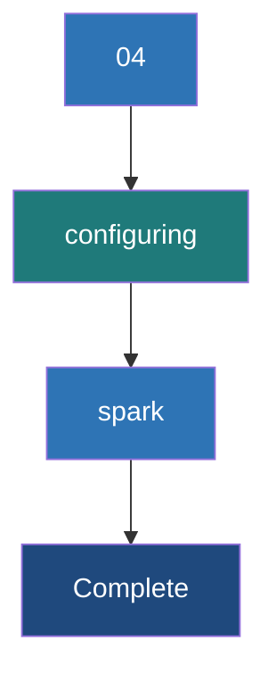

# Configuring Spark

**Spark Configuration controls application behavior, resource usage, and performance tuning through a strict hierarchy of code-level settings, command-line flags, and properties files.**

## Why It Matters
Out of the box, Spark is configured to run on a laptop. If you deploy a job to a 100-node cluster without configuring memory, cores, and parallelism, Spark will likely use a tiny fraction of the available power, or it will crash violently with OutOfMemory (OOM) errors. Properly configuring Spark is the core skill of Spark performance tuning. You must understand not just *what* to configure, but *how* properties are overridden based on precedence.

## How It Works
Spark properties control everything: memory (`spark.executor.memory`), shuffle behavior (`spark.sql.shuffle.partitions`), serialization (`spark.serializer`), and network timeouts.

There are three primary ways to set these configurations, and they follow a strict order of precedence (from highest priority to lowest):
1. **SparkConf/SparkSession in Code**: Hardcoding the config in the application code (e.g., `.config("spark.executor.memory", "4g")`). This overrides everything else and cannot be changed without recompiling/editing the code.
2. **Command-line arguments via `spark-submit`**: Passing flags like `--executor-memory 4g` or `--conf spark.sql.shuffle.partitions=500`. This is the recommended way to set environment-specific configs because it separates code from deployment.
3. **`spark-defaults.conf` file**: A file located in `$SPARK_HOME/conf/`. Properties defined here apply to all applications submitted from that machine unless overridden by methods 1 or 2.

Additionally, some settings are controlled via **Environment Variables** (like `SPARK_HOME`, `JAVA_HOME`, `HADOOP_CONF_DIR`). These are typically defined in `spark-env.sh`. 

When configuring resources, the golden rule of Spark tuning applies: do not allocate massive Executors (e.g., 64GB RAM, 32 cores). Large JVMs suffer from massive Garbage Collection (GC) pauses, and HDFS throughput degrades with too many cores per executor. The sweet spot is usually 4-8 cores and 16-32GB of RAM per Executor.

## Flow Diagram



## Data Visualization

| Property Name | Default | Recommended / Tuning | Description |
|---------------|---------|----------------------|-------------|
| `spark.executor.memory` | 1g | 16g - 32g | Memory per executor. Avoid > 64g due to GC pauses. |
| `spark.executor.cores` | 1 (YARN) / All (Standalone) | 4 - 8 | Cores per executor. Determines concurrent tasks per JVM. |
| `spark.sql.shuffle.partitions` | 200 | 2x - 3x Total Cluster Cores | Number of partitions used for Joins/Aggregations. |
| `spark.serializer` | JavaSerializer | org.apache.spark.serializer.KryoSerializer | Use Kryo for faster, more compact data serialization. |
| `spark.memory.fraction` | 0.6 | 0.6 | Fraction of heap space used for execution and storage. |

## Code Example

```python
from pyspark.sql import SparkSession

# BEST PRACTICE: Do not hardcode cluster resources (memory/cores) in the code.
# Leave those for spark-submit.
# ONLY hardcode application-specific logic configurations here.

spark = SparkSession.builder \
    .appName("ConfigurationPrecedenceDemo") \
    .config("spark.sql.shuffle.partitions", "500") \
    .config("spark.serializer", "org.apache.spark.serializer.KryoSerializer") \
    .getOrCreate()

# To run this script:
# spark-submit \
#   --executor-memory 16G \
#   --executor-cores 5 \
#   --driver-memory 4G \
#   --conf spark.sql.shuffle.partitions=1000 \  <-- This will be IGNORED because the code hardcoded it to 500!
#   my_script.py

print(f"Shuffle Partitions: {spark.conf.get('spark.sql.shuffle.partitions')}")

spark.stop()
```

## Common Pitfalls
* **Hardcoding resources in code**: Writing `.config("spark.executor.memory", "32g")` in the code means this job can only run on a cluster with 32g nodes. It makes the code non-portable between dev, staging, and production.
* **Ignoring `spark.sql.shuffle.partitions`**: Leaving the default of 200 on a massive dataset results in out-of-memory errors (spill to disk) and slow performance. Leaving it at 200 on tiny datasets results in overhead of scheduling too many tiny tasks.
* **Fat Executors**: Assigning all cores and all memory on a node to a single Executor leads to severe Garbage Collection overhead.
* **Driver Memory OOM**: Increasing Executor memory but forgetting to increase `spark.driver.memory` when the job relies heavily on `collect()` or massive Broadcast variables.

## Key Takeaway
Command-line arguments (`spark-submit`) should manage environmental resources (memory, cores), while the code should only hardcode configurations related to internal application logic (serializers, custom formats).


