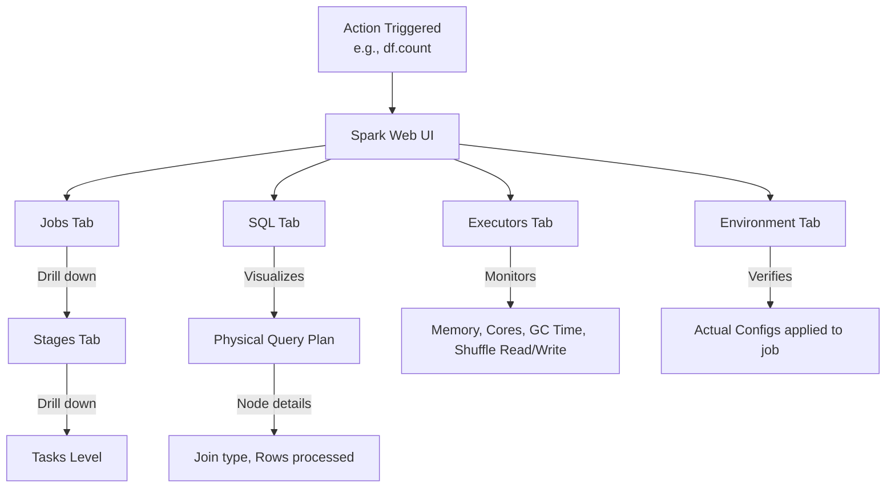

# The Spark Web UI

**The Spark Web UI is a suite of web-based dashboards providing deep visibility into the execution DAG, task metrics, memory usage, and cluster environment of a running or completed Spark application.**

## Why It Matters
Spark operates as a distributed black box. When a job takes 4 hours instead of 10 minutes, or when it crashes halfway through, looking at the command-line logs is often unhelpful, as logs are distributed across dozens of worker nodes. The Spark Web UI aggregates all this telemetry into a visual format. It is the absolute most important tool a Data Engineer has for debugging data skew, identifying long-running Garbage Collection (GC) pauses, finding disk spills during shuffles, and understanding how code translates into a physical execution plan.

## How It Works
When a Spark application starts, the Driver launches a web server, typically available on port `4040` (e.g., `http://localhost:4040`). If multiple apps are running on the same machine, the port increments (4041, 4042). For completed applications, the **Spark History Server** reconstructs this UI from event logs saved to storage (like HDFS or S3).

The UI is divided into several crucial tabs:
1. **Jobs Tab**: Shows a timeline of all Spark Jobs (triggered by actions). You can see which jobs succeeded, failed, or are currently running.
2. **Stages Tab**: A Job is broken down into Stages (separated by shuffles). This is where you find the **DAG Visualization** showing how RDDs/DataFrames are connected. It also shows a summary of Task metrics. This is where you spot **Data Skew** (e.g., if one task takes 30 minutes while the median task takes 2 seconds).
3. **Storage Tab**: Displays any RDDs or DataFrames that have been cached using `.cache()` or `.persist()`. It shows how much data is stored in memory vs. on disk across the cluster.
4. **Environment Tab**: An incredibly useful debugging tool that lists the exact configuration properties (Spark properties, System properties, Classpath) that the application is actually using, helping resolve config precedence issues.
5. **Executors Tab**: Shows resource usage for each Executor JVM. Key metrics here include memory usage, Active Tasks, Failed Tasks, and Total Time spent in Garbage Collection.
6. **SQL Tab**: For DataFrame/SQL operations, this tab shows the physical query plan, detailing exact operations like SortMergeJoin or BroadcastHashJoin, along with execution metrics like "number of output rows".

## Flow Diagram



## Data Visualization

| UI Tab | Best Used For | Metric to Watch |
|--------|---------------|-----------------|
| **Stages** | Identifying Data Skew | Max Task Duration vs Median Task Duration |
| **Stages** | Identifying Memory pressure | "Shuffle Spill (Memory)" and "Shuffle Spill (Disk)" |
| **Executors** | Identifying JVM Heap issues | "Task Time (GC Time)" - if GC is > 10% of Task Time |
| **SQL** | Query Plan optimization | Ensuring a BroadcastJoin happened instead of SortMergeJoin |
| **Storage** | Cache management | Fraction Cached (Memory vs Disk) |

## Code Example

```python
from pyspark.sql import SparkSession
import time

# Start Spark and explicitly enable the UI and Event Logging for the History Server
spark = SparkSession.builder \
    .appName("WebUI_Investigation") \
    .config("spark.ui.port", "4050") \
    .config("spark.eventLog.enabled", "true") \
    .config("spark.eventLog.dir", "/tmp/spark-events") \
    .getOrCreate()

# Create a skewed dataset to observe in the UI
# ID 1 will have 999,900 rows, other IDs will have very few
skewed_data = spark.range(1000000).withColumn("key", 
    org.apache.spark.sql.functions.expr("IF(id < 999900, 1, id)")
)

# Trigger a shuffle. 
# Go to the UI (localhost:4050) -> Stages tab -> Look at Task duration.
# You will clearly see one task taking significantly longer than the rest (Data Skew).
skewed_data.groupBy("key").count().collect()

# Sleep to keep the UI alive so you can inspect it in a browser
print("Go to http://localhost:4050 to view the Spark UI. Sleeping for 10 minutes...")
time.sleep(600)

spark.stop()
```

## Common Pitfalls
* **Closing the app before checking the UI**: Once `spark.stop()` is called, the live UI at port 4040 dies. If you haven't configured the Spark History Server, you lose all telemetry.
* **Ignoring GC Time in the Executors Tab**: If tasks are slow, developers often assume it's a code issue, missing that the Executors spend 60% of their time in Garbage Collection due to low memory.
* **Not checking the SQL Tab for Join Strategies**: Assuming Spark did a fast Broadcast Join when the SQL tab clearly shows it fell back to a slow SortMergeJoin because the broadcast threshold was exceeded.
* **Panic over Task Failures**: Spark is resilient. Seeing a few failed tasks in the Jobs tab is normal in large clusters (due to node preemption or network blips). As long as the Job succeeds, Spark successfully retried the tasks.

## Key Takeaway
The Spark Web UI is not just a monitoring dashboard; it is an active debugging tool essential for diagnosing data skew, physical plan inefficiencies, and memory bottlenecks.


---

## 🎓 Deep Learning Questions

### Q1: Why Was This Concept Introduced?
Before the Spark Web UI existed, debugging distributed applications was incredibly tedious. Developers had to rely on scanning massive, decentralized log files spread across dozens of worker nodes to figure out why a job was failing or performing poorly. There was no unified view of how code translated into execution steps, making it nearly impossible to identify bottlenecks like data skew, inefficient shuffles, or memory leaks.

Spark introduced the Web UI to solve these problems by providing a centralized, visual dashboard. It offers a transparent window into the application’s inner workings. Instead of guessing, developers can see exactly how Spark translates their code into a Directed Acyclic Graph (DAG) of stages and tasks. The UI provides real-time metrics on memory usage, garbage collection times, shuffle reads/writes, and task distribution. This level of observability is essential for diagnosing issues, tuning performance, and understanding resource utilization in complex distributed processing scenarios. It transforms a "black box" execution model into an observable and optimizable process.

### Q2: What Exactly Is This Concept and How Does It Work?
The Spark Web UI is a built-in web server launched by the Spark Driver program (typically accessible on port 4040). It actively monitors the `SparkContext` and collects runtime metrics, metadata, and state information from all active executors and the cluster manager.

When you submit a Spark application, the driver starts the UI server. As the application executes, the driver receives heartbeats and status updates from executors regarding task progress, memory consumption, and I/O operations (like shuffle data sizes). The Web UI aggregates this data and presents it across several specialized tabs:
- **Jobs:** Shows a high-level timeline and status of all Spark jobs triggered by actions.
- **Stages:** Breaks down jobs into stages (separated by shuffles) and displays DAG visualizations.
- **Tasks:** Details individual task execution, including data locality, shuffle metrics, and duration.
- **Storage:** Displays information about cached RDDs and DataFrames.
- **Environment:** Lists Spark configuration properties, system properties, and classpath entries.
- **Executors:** Provides resource usage metrics (memory, disk, cores) for each executor.
- **SQL:** Shows query plans (logical and physical) for Spark SQL queries.

You use these tabs to drill down from a slow job to the specific stage, and finally to the problematic task causing the delay.

### Q3: Where Should This Concept Be Used?
The Spark Web UI is heavily utilized in various stages of the data engineering lifecycle across all industries:
- **Development & Debugging:** When writing new Spark jobs, developers use the UI to ensure their logical transformations translate into efficient physical plans (SQL tab) and that caching is working as intended (Storage tab).
- **Performance Tuning:** Data engineers at companies like Uber and Netflix rely on the UI's Stages and Executors tabs to identify data skew (tasks taking significantly longer than others), excessive garbage collection overhead, or massive shuffle operations that need optimization (e.g., by salting keys or broadcasting joins).
- **Resource Profiling:** Platform teams monitor the Executors tab to understand if a job is over-provisioned (wasting memory/cores) or under-provisioned (thrashing due to memory starvation), helping right-size cluster resources and reduce cloud computing costs.
- **Troubleshooting Failures:** When a job crashes in production, the UI provides immediate clues (e.g., OOM errors in the Executors tab or failed tasks in the Stages tab) without needing to manually aggregate logs.

### Q4: Where Should This Concept NOT Be Used?
While invaluable, there are scenarios where the Spark Web UI is not the primary tool or might be insufficient:
- **Historical Analysis After Driver Shutdown:** By default, the Web UI disappears when the Spark application finishes (or crashes). For historical analysis, you must use the Spark History Server, which reconstructs the UI from event logs saved to stable storage (like HDFS or S3). The live UI is useless for dead jobs.
- **Programmatic Alerting:** The Web UI is a visual, interactive tool. It should not be scraped for programmatic monitoring or alerting. For automated health checks, use Spark's REST API or integrate with metrics systems like Prometheus, Grafana, or Datadog via the Spark Metrics System.
- **Fine-Grained Code Profiling:** The UI shows task-level metrics, but if you need to know exactly which line of your Python or Scala code is slow within a map function, you need dedicated profilers (like JVM profilers or Python cProfile) rather than the Spark UI.

### Q5: How Is This Concept Different from Hadoop?

| Aspect | Hadoop MapReduce (JobTracker/YARN UI) | Apache Spark Web UI |
| :--- | :--- | :--- |
| **Architecture** | Monitors Map and Reduce phases only. | Monitors complex DAGs, stages, and diverse task types. |
| **Execution Visualization** | Basic progress bars for map and reduce tasks. | Detailed DAG visualization (Directed Acyclic Graph) showing exact execution flow. |
| **SQL/Query Plans** | Typically requires separate tools (like Hive/Tez UI) for query plans. | Native **SQL Tab** showing parsed, logical, and physical execution plans. |
| **Storage Monitoring** | Not applicable (MR doesn't cache intermediate data in memory). | **Storage Tab** details exact memory usage for cached RDDs/DataFrames. |
| **Granularity** | Focuses heavily on HDFS read/write metrics. | Highly granular metrics on Shuffle Read/Write, GC time, and Memory overhead. |
| **Ease of Debugging** | Often requires digging through scattered logs. | Centralized, drill-down interface from Job -> Stage -> Task. |

### Q6: How Can This Concept Be Related to a Traditional RDBMS?

| Aspect | Traditional RDBMS | Apache Spark Web UI |
| :--- | :--- | :--- |
| **Query Execution Plan** | `EXPLAIN PLAN` or graphical execution plans in SQL Server Management Studio/pgAdmin. | **SQL Tab** showing logical and physical plans with metrics per node. |
| **Active Queries** | `pg_stat_activity` (PostgreSQL) or `v$session` (Oracle). | **Jobs Tab** showing currently running and completed jobs. |
| **Resource Usage** | Database performance monitors (CPU/Memory usage per session). | **Executors Tab** detailing resource consumption across the distributed cluster. |
| **Buffer Cache Monitoring** | Views showing buffer pool usage/hit ratios. | **Storage Tab** showing which DataFrames are cached and fraction of memory used. |
| **Wait Statistics** | System views detailing wait events (I/O, locks). | **Stages/Tasks Tab** detailing time spent on GC, serialization, and shuffles. |

### Q7: What Happens Behind the Scenes?

When you interact with the Spark Web UI, it visualizes data collected by the Spark Metrics system.

1. **Event Generation:** As the Spark context runs, various components (DAGScheduler, TaskScheduler, BlockManager) generate events (e.g., `SparkListenerTaskStart`, `SparkListenerStageCompleted`).
2. **Event Bus:** These events are pushed onto an asynchronous internal event bus.
3. **Listener Processing:** Registered listeners (like `AppStatusListener` and `SQLAppStatusListener`) consume these events. They aggregate and maintain the application state in memory (or a lightweight embedded store like LevelDB/RocksDB in newer versions).
4. **Web Server:** The embedded Jetty web server hosts the UI endpoints.
5. **Rendering:** When you navigate to `http://driver-node:4040/stages`, the web server queries the in-memory state store and renders the HTML/JSON response, constructing the DAG visualizations and metric tables on the fly.

```text
+-------------------+      +-------------------+      +-------------------+
| Spark Components  |      |  Event Bus        |      | State Listeners   |
| (DAGScheduler,    | ---> | (Asynchronous)    | ---> | (AppStatusListener|
|  TaskScheduler)   |      +-------------------+      |  Store State)     |
+-------------------+                                 +-------------------+
                                                                |
                                                                v
+-------------------+      +-------------------+      +-------------------+
| Developer Browser | <--- | Web UI (Jetty)    | <--- | In-Memory /       |
| (Views port 4040) |      | (Renders HTML)    |      | LevelDB Store     |
+-------------------+      +-------------------+      +-------------------+
```

### Q8: Performance Considerations, Best Practices, and Common Mistakes

| Category | Recommendation | Why It Matters |
| :--- | :--- | :--- |
| **Data Skew** | Check Task duration histograms in the **Stages** tab. If max time is >> median time, you have skew. | A single straggler task will delay the entire stage and job, wasting cluster resources. |
| **Spill to Disk** | Monitor "Spill (Memory)" and "Spill (Disk)" in the Stages tab. | High spill indicates executors lack memory to process partitions, causing severe I/O overhead. |
| **Garbage Collection** | Check GC Time in the Tasks tab. It should be < 10% of total task time. | Excessive GC pauses execution. If high, consider tweaking memory fractions or using G1GC. |
| **Shuffle Optimization** | Review Shuffle Read/Write metrics. Minimize shuffle data. | Shuffles are expensive network operations. High shuffle metrics indicate potential need for broadcast joins or better partitioning. |
| **Event Log Size** | Beware of massive UI state stores for extremely long-running streaming apps. | The driver can run OOM if it holds too much UI history. Use `spark.ui.retainedJobs` and similar configs to limit history. |

### Q9: Interview Questions

**Beginner**
1. **What is the default port for the Spark Web UI?**
   *Port 4040. If it's taken, Spark tries 4041, 4042, etc.*
2. **Which tab would you check to see if your `df.cache()` command worked?**
   *The **Storage** tab. It lists all cached RDDs/DataFrames and their memory/disk usage.*
3. **What happens to the Spark Web UI when the application finishes?**
   *It shuts down and becomes inaccessible. You must use the Spark History Server to view metrics of completed applications.*

**Intermediate**
4. **How do you identify data skew using the Spark UI?**
   *Go to the Stages tab and look at the "Summary Metrics" for tasks. If the "Max" duration or "Max" shuffle read is significantly higher than the "75th percentile" or "Median", data skew is present.*
5. **What does a large "Shuffle Read Blocked Time" indicate?**
   *It indicates that executors are spending a lot of time waiting to fetch shuffle data over the network from other executors, often due to network bottlenecks or slow disks on the source nodes.*
6. **How can you match a line of your PySpark code to the UI?**
   *You can use `spark.sparkContext.setJobGroup("groupId", "Description")` before your action. This description will appear in the Jobs tab, linking your code block to the visual metrics.*

**Advanced**
7. **Explain the difference between the "Jobs" tab and the "Stages" tab.**
   *A Job is triggered by an Action (like `count()`). A Job is broken down into Stages by wide transformations (shuffles). The Jobs tab shows high-level progress per action, while the Stages tab shows the granular DAG and shuffle boundaries.*
8. **If the UI is sluggish or consuming too much driver memory in a long-running Streaming app, what configurations do you tune?**
   *You tune the retention limits, such as `spark.ui.retainedJobs`, `spark.ui.retainedStages`, and `spark.sql.ui.retainedExecutions`, to discard old metadata.*
9. **How does the SQL tab help in query optimization?**
   *It visualizes the Physical Plan. You can check if Spark chose a `BroadcastHashJoin` over a `SortMergeJoin`, verify if partition pruning occurred, and see the exact number of rows flowing between operators.*

**Scenario-Based**
10. **Your Spark job is running unusually slow, but no errors are thrown. Walk me through how you use the Web UI to diagnose the issue.**
    *First, I'd check the **Jobs** tab to identify the running job. Then, I'd click into its active **Stage** in the Stages tab. I would look at the task summary percentiles to check for **skew** (one task taking way longer). If durations are uniform, I'd check **GC Time**—if it's high, the executors need more memory. Next, I'd look at **Shuffle Read/Write**; massive shuffle data implies I need to optimize my joins or `groupBy`. Finally, I'd check for **Spill to Disk**, indicating memory pressure.*
11. **You notice in the SQL tab that Spark is performing a `SortMergeJoin` even though one dataset is only 5MB. How do you fix this, and how will the UI change?**
    *The 5MB dataset should be broadcasted, but Spark might have missed it if statistics weren't updated. I would wrap the small dataframe in `broadcast(df)`. Rerunning the job, the SQL tab will now show a `BroadcastHashJoin` node instead, and the execution time should drop significantly.*

### Q10: Complete Real-World Example

**Business Problem:**
An ad-tech company analyzes clickstream logs to aggregate clicks per campaign. The job is running much slower than expected. We need to use concepts monitored in the Web UI to diagnose and fix it.

**Sample Dataset (`clicks.csv`):**
Contains millions of rows: `user_id`, `campaign_id`, `timestamp`. A few viral campaigns receive 90% of the traffic (causing data skew).

**PySpark Code (Diagnostic & Fixed):**

```python
from pyspark.sql import SparkSession
from pyspark.sql.functions import col, count
import time

# 1. Initialize Spark (UI starts on port 4040)
spark = SparkSession.builder \
    .appName("WebUI_Diagnosis_Example") \
    .getOrCreate()

# Create dummy skewed data
data = [("user1", "campaign_normal")] * 1000 + [("user2", "campaign_viral")] * 99000
df = spark.createDataFrame(data, ["user_id", "campaign_id"])

# --- SCENARIO 1: The Problematic Code ---
spark.sparkContext.setJobGroup("SkewedJob", "Aggregation with Skew")
print("Running skewed aggregation...")
start = time.time()

# This action triggers a Job and a Shuffle.
# In the Web UI (Stages Tab), one task will process 99,000 rows, others will process very few.
skewed_result = df.groupBy("campaign_id").agg(count("user_id").alias("clicks"))
skewed_result.collect() 

print(f"Skewed Job took {time.time() - start:.2f} seconds")


# --- SCENARIO 2: The Optimized Code ---
# Assuming we identified skew in the UI, we can fix it (e.g., using salting or two-phase aggregation).
# Spark 3+ Adaptive Query Execution (AQE) handles skew automatically, but let's simulate a fix.
spark.conf.set("spark.sql.adaptive.enabled", "true")
spark.conf.set("spark.sql.adaptive.skewJoin.enabled", "true")

spark.sparkContext.setJobGroup("OptimizedJob", "Aggregation with AQE/Fix")
print("Running optimized aggregation...")
start = time.time()

optimized_result = df.groupBy("campaign_id").agg(count("user_id").alias("clicks"))
optimized_result.collect()

print(f"Optimized Job took {time.time() - start:.2f} seconds")

# Keep driver alive to view the UI at http://localhost:4040
input("Press Enter to terminate application and close Web UI...")
spark.stop()
```

### 💡 Key Takeaways
- The Spark Web UI is the primary tool for profiling, debugging, and tuning Spark applications.
- It visualizes the execution DAG, breaking jobs down into stages and tasks.
- Data Skew is easily identified by comparing task execution times in the Stages tab.
- The SQL tab provides critical insights into how query plans are executed physically (e.g., identifying join strategies).
- The History Server is required to view the UI of terminated applications.

### ⚠️ Common Misconceptions
- **"The UI is available forever."** False. It dies with the driver. You need the Spark History Server for historical logs.
- **"High GC time always means I need more memory."** Not always. It might mean you are caching too much unnecessarily, creating too many temporary objects (UDFs), or need to switch to G1GC.
- **"The UI can tell me exactly which line of Python code is slow."** False. It profiles at the task/partition level, not the individual line-of-code level inside user-defined functions.

### 🔗 Related Spark Concepts
- Spark History Server
- Directed Acyclic Graph (DAG)
- Spark Metric System
- Adaptive Query Execution (AQE)
- RDD/DataFrame Caching

### 📚 References for Further Reading
- Apache Spark Official Documentation
- Learning Spark (O'Reilly)
- Spark: The Definitive Guide (O'Reilly)


