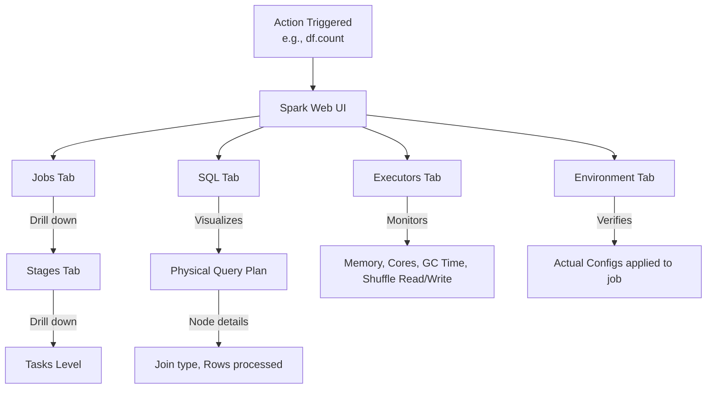

# The Spark Web UI

**The Spark Web UI is a suite of web-based dashboards providing deep visibility into the execution DAG, task metrics, memory usage, and cluster environment of a running or completed Spark application.**

## Why It Matters
Spark operates as a distributed black box. When a job takes 4 hours instead of 10 minutes, or when it crashes halfway through, looking at the command-line logs is often unhelpful, as logs are distributed across dozens of worker nodes. The Spark Web UI aggregates all this telemetry into a visual format. It is the absolute most important tool a Data Engineer has for debugging data skew, identifying long-running Garbage Collection (GC) pauses, finding disk spills during shuffles, and understanding how code translates into a physical execution plan.

## How It Works
When a Spark application starts, the Driver launches a web server, typically available on port `4040` (e.g., `http://localhost:4040`). If multiple apps are running on the same machine, the port increments (4041, 4042). For completed applications, the **Spark History Server** reconstructs this UI from event logs saved to storage (like HDFS or S3).

The UI is divided into several crucial tabs:
1. **Jobs Tab**: Shows a timeline of all Spark Jobs (triggered by actions). You can see which jobs succeeded, failed, or are currently running.
2. **Stages Tab**: A Job is broken down into Stages (separated by shuffles). This is where you find the **DAG Visualization** showing how RDDs/DataFrames are connected. It also shows a summary of Task metrics. This is where you spot **Data Skew** (e.g., if one task takes 30 minutes while the median task takes 2 seconds).
3. **Storage Tab**: Displays any RDDs or DataFrames that have been cached using `.cache()` or `.persist()`. It shows how much data is stored in memory vs. on disk across the cluster.
4. **Environment Tab**: An incredibly useful debugging tool that lists the exact configuration properties (Spark properties, System properties, Classpath) that the application is actually using, helping resolve config precedence issues.
5. **Executors Tab**: Shows resource usage for each Executor JVM. Key metrics here include memory usage, Active Tasks, Failed Tasks, and Total Time spent in Garbage Collection.
6. **SQL Tab**: For DataFrame/SQL operations, this tab shows the physical query plan, detailing exact operations like SortMergeJoin or BroadcastHashJoin, along with execution metrics like "number of output rows".

## Flow Diagram



## Data Visualization

| UI Tab | Best Used For | Metric to Watch |
|--------|---------------|-----------------|
| **Stages** | Identifying Data Skew | Max Task Duration vs Median Task Duration |
| **Stages** | Identifying Memory pressure | "Shuffle Spill (Memory)" and "Shuffle Spill (Disk)" |
| **Executors** | Identifying JVM Heap issues | "Task Time (GC Time)" - if GC is > 10% of Task Time |
| **SQL** | Query Plan optimization | Ensuring a BroadcastJoin happened instead of SortMergeJoin |
| **Storage** | Cache management | Fraction Cached (Memory vs Disk) |

## Code Example

```python
from pyspark.sql import SparkSession
import time

# Start Spark and explicitly enable the UI and Event Logging for the History Server
spark = SparkSession.builder \
    .appName("WebUI_Investigation") \
    .config("spark.ui.port", "4050") \
    .config("spark.eventLog.enabled", "true") \
    .config("spark.eventLog.dir", "/tmp/spark-events") \
    .getOrCreate()

# Create a skewed dataset to observe in the UI
# ID 1 will have 999,900 rows, other IDs will have very few
skewed_data = spark.range(1000000).withColumn("key", 
    org.apache.spark.sql.functions.expr("IF(id < 999900, 1, id)")
)

# Trigger a shuffle. 
# Go to the UI (localhost:4050) -> Stages tab -> Look at Task duration.
# You will clearly see one task taking significantly longer than the rest (Data Skew).
skewed_data.groupBy("key").count().collect()

# Sleep to keep the UI alive so you can inspect it in a browser
print("Go to http://localhost:4050 to view the Spark UI. Sleeping for 10 minutes...")
time.sleep(600)

spark.stop()
```

## Common Pitfalls
* **Closing the app before checking the UI**: Once `spark.stop()` is called, the live UI at port 4040 dies. If you haven't configured the Spark History Server, you lose all telemetry.
* **Ignoring GC Time in the Executors Tab**: If tasks are slow, developers often assume it's a code issue, missing that the Executors spend 60% of their time in Garbage Collection due to low memory.
* **Not checking the SQL Tab for Join Strategies**: Assuming Spark did a fast Broadcast Join when the SQL tab clearly shows it fell back to a slow SortMergeJoin because the broadcast threshold was exceeded.
* **Panic over Task Failures**: Spark is resilient. Seeing a few failed tasks in the Jobs tab is normal in large clusters (due to node preemption or network blips). As long as the Job succeeds, Spark successfully retried the tasks.

## Key Takeaway
The Spark Web UI is not just a monitoring dashboard; it is an active debugging tool essential for diagnosing data skew, physical plan inefficiencies, and memory bottlenecks.


