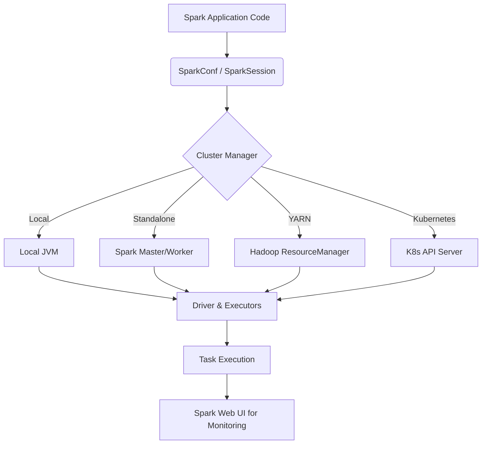

# Chapter 10 Overview: Running Spark

**This chapter focuses on the operational side of Apache Spark, detailing how applications run, how they are configured, and how to monitor them effectively in production environments.**

## Why It Matters
Understanding how Spark runs is the difference between a prototype that works on your laptop and a robust data pipeline that processes terabytes of data daily without failure. Data engineers often spend more time tuning, debugging, and configuring Spark applications than writing the actual transformation logic. By mastering Spark's runtime architecture, resource scheduling, cluster types, configuration precedence, and the Spark Web UI, you can eliminate OutOfMemory errors, resolve data skew, and ensure optimal utilization of cluster resources. In modern enterprises, computing resources are expensive, and an unoptimized Spark job can cost thousands of dollars in wasted cloud compute. This chapter bridges the gap between coding and DevOps for Data Engineering.

## How It Works
The operational side of Spark involves several distinct but interconnected components. At a high level, it starts with the Runtime Architecture, which defines the physical and logical components of a Spark application. The Driver Program acts as the orchestrator, while the Cluster Manager allocates resources, and the Executors perform the actual data processing tasks.

These components can be deployed across various Cluster Types, such as Local Mode (for development), Standalone Mode, YARN, Mesos, or Kubernetes (for production). The choice of cluster manager dictates how resources are requested and isolated. Once resources are acquired, Spark employs Job and Resource Scheduling to determine the order of task execution. Mechanisms like FIFO and Fair Scheduling, along with Dynamic Resource Allocation, ensure that multiple jobs or even multiple applications can share a cluster efficiently.

To tune this complex system, engineers use extensive Spark Configurations. These settings control everything from memory allocation to shuffle partitions and serialization formats. They can be set via configuration files, command-line arguments, or directly in the code. Finally, because distributed systems are inherently opaque, the Spark Web UI serves as the primary diagnostic tool. It provides a visual breakdown of Jobs, Stages, Tasks, Storage, Environment configurations, and Executor metrics, allowing engineers to pinpoint bottlenecks such as excessive Garbage Collection or shuffle spills.

## Flow Diagram



## Data Visualization

| Component | Responsibility | Tuning Lever |
|-----------|----------------|--------------|
| Driver | Orchestration, DAG creation | spark.driver.memory |
| Executor | Task execution, Caching | spark.executor.memory, spark.executor.cores |
| Cluster Manager | Resource Allocation | spark.dynamicAllocation.enabled |
| Web UI | Monitoring | spark.ui.port |

## Code Example

```python
from pyspark.sql import SparkSession

# A typical starting point for any Spark application
spark = SparkSession.builder \
    .appName('Chapter10_Overview') \
    .master('local[*]') \
    .config('spark.executor.memory', '2g') \
    .getOrCreate()

# Example dataframe creation
df = spark.range(1000)

# The action that triggers execution
print(f'Total count: {df.count()}')

spark.stop()
```

## Common Pitfalls
* Focusing only on the code and ignoring the underlying cluster topology.
* Failing to adjust configuration properties for different environments (e.g., using local config in prod).
* Ignoring the Spark Web UI when a job is running slowly.
* Over-allocating resources and wasting cluster capacity.
* Under-allocating driver memory leading to driver OOM on large collect() calls.

## Key Takeaway
Mastering Spark operations—from architecture and configuration to cluster types and monitoring—is essential for building scalable, reliable, and cost-effective data pipelines in production.


