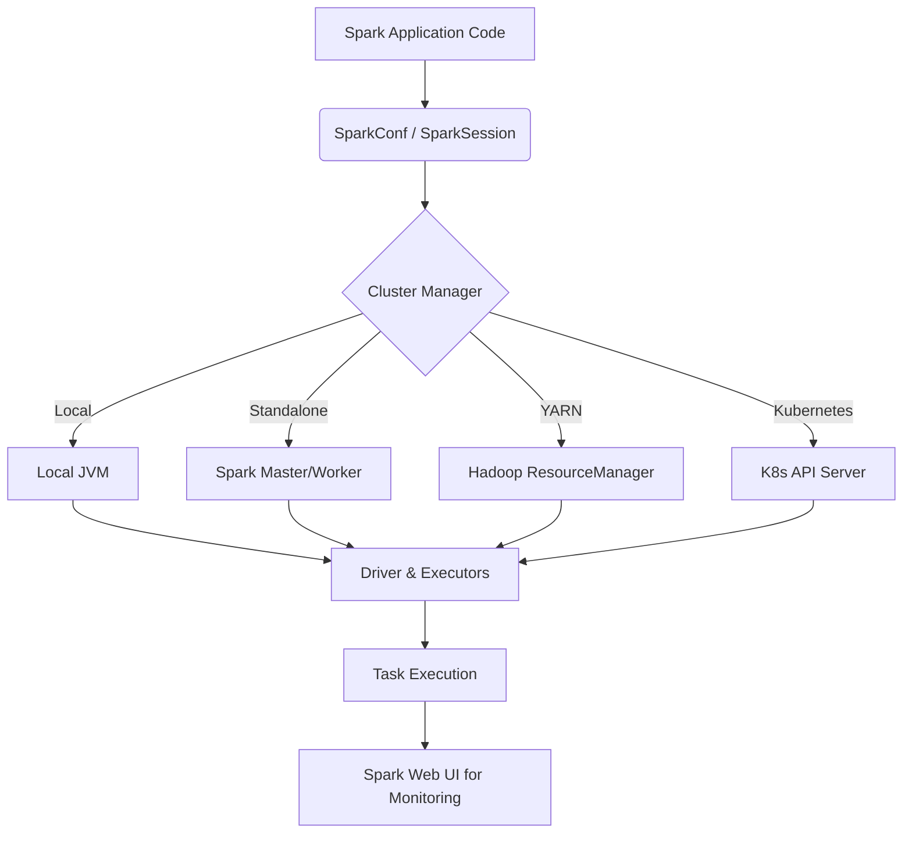

# Chapter 10 Overview: Running Spark

**This chapter focuses on the operational side of Apache Spark, detailing how applications run, how they are configured, and how to monitor them effectively in production environments.**

## Why It Matters
Understanding how Spark runs is the difference between a prototype that works on your laptop and a robust data pipeline that processes terabytes of data daily without failure. Data engineers often spend more time tuning, debugging, and configuring Spark applications than writing the actual transformation logic. By mastering Spark's runtime architecture, resource scheduling, cluster types, configuration precedence, and the Spark Web UI, you can eliminate OutOfMemory errors, resolve data skew, and ensure optimal utilization of cluster resources. In modern enterprises, computing resources are expensive, and an unoptimized Spark job can cost thousands of dollars in wasted cloud compute. This chapter bridges the gap between coding and DevOps for Data Engineering.

## How It Works
The operational side of Spark involves several distinct but interconnected components. At a high level, it starts with the Runtime Architecture, which defines the physical and logical components of a Spark application. The Driver Program acts as the orchestrator, while the Cluster Manager allocates resources, and the Executors perform the actual data processing tasks.

These components can be deployed across various Cluster Types, such as Local Mode (for development), Standalone Mode, YARN, Mesos, or Kubernetes (for production). The choice of cluster manager dictates how resources are requested and isolated. Once resources are acquired, Spark employs Job and Resource Scheduling to determine the order of task execution. Mechanisms like FIFO and Fair Scheduling, along with Dynamic Resource Allocation, ensure that multiple jobs or even multiple applications can share a cluster efficiently.

To tune this complex system, engineers use extensive Spark Configurations. These settings control everything from memory allocation to shuffle partitions and serialization formats. They can be set via configuration files, command-line arguments, or directly in the code. Finally, because distributed systems are inherently opaque, the Spark Web UI serves as the primary diagnostic tool. It provides a visual breakdown of Jobs, Stages, Tasks, Storage, Environment configurations, and Executor metrics, allowing engineers to pinpoint bottlenecks such as excessive Garbage Collection or shuffle spills.

## Flow Diagram



## Data Visualization

| Component | Responsibility | Tuning Lever |
|-----------|----------------|--------------|
| Driver | Orchestration, DAG creation | spark.driver.memory |
| Executor | Task execution, Caching | spark.executor.memory, spark.executor.cores |
| Cluster Manager | Resource Allocation | spark.dynamicAllocation.enabled |
| Web UI | Monitoring | spark.ui.port |

## Code Example

```python
from pyspark.sql import SparkSession

# A typical starting point for any Spark application
spark = SparkSession.builder \
    .appName('Chapter10_Overview') \
    .master('local[*]') \
    .config('spark.executor.memory', '2g') \
    .getOrCreate()

# Example dataframe creation
df = spark.range(1000)

# The action that triggers execution
print(f'Total count: {df.count()}')

spark.stop()
```

## Common Pitfalls
* Focusing only on the code and ignoring the underlying cluster topology.
* Failing to adjust configuration properties for different environments (e.g., using local config in prod).
* Ignoring the Spark Web UI when a job is running slowly.
* Over-allocating resources and wasting cluster capacity.
* Under-allocating driver memory leading to driver OOM on large collect() calls.

## Key Takeaway
Mastering Spark operations—from architecture and configuration to cluster types and monitoring—is essential for building scalable, reliable, and cost-effective data pipelines in production.


---

## 🎓 Deep Learning Questions

### Q1: Why Was This Concept Introduced?
Before Apache Spark, massive data processing primarily relied on Hadoop MapReduce. However, Hadoop lacked an integrated, flexible operational model that could easily span multiple cluster managers while maintaining high performance. Deploying, monitoring, and configuring Hadoop jobs was notoriously complex and tightly coupled with YARN. Spark introduced its own comprehensive operational architecture to decouple the computational engine from the resource manager. This allowed Spark to run interchangeably on Standalone clusters, YARN, Mesos, and later Kubernetes. The unified configuration system and robust Web UI were introduced to provide developers with deeper visibility into distributed execution, solving the "black box" problem of tracking down performance bottlenecks and OOM errors that plagued earlier big data frameworks.

### Q2: What Exactly Is This Concept and How Does It Work?
Running Spark involves a sophisticated orchestration between the application code and the cluster resources. When a Spark application starts, it launches a Driver process that converts your code into a Directed Acyclic Graph (DAG) of transformations and actions. The Driver then communicates with a Cluster Manager (like YARN or Kubernetes) to request compute resources, known as Executors.
Once resources are allocated, the Driver's DAG Scheduler breaks the job into Stages based on shuffle boundaries. The Task Scheduler then distributes Tasks (the smallest unit of work) to the Executors, which process data in memory across the cluster. The entire process is highly configurable via properties (e.g., `spark.executor.memory`), and every execution step, memory usage, and task metric is tracked and visualized in real-time on the Spark Web UI.

### Q3: Where Should This Concept Be Used?
Understanding Spark operations is critical in production environments across various industries:
- **Finance (Banking):** Scheduling fraud detection models where resource contention with nightly batch jobs must be managed using Fair Schedulers and dynamic allocation.
- **Retail (Amazon/Walmart):** Configuring robust YARN or Kubernetes clusters to process peak holiday sales data without crashing due to memory limits.
- **Streaming Services (Netflix):** Tuning Spark configurations to handle massive, continuous telemetry data streams, utilizing the Web UI to pinpoint garbage collection (GC) pauses that cause micro-batch delays.
- **Healthcare:** Securely running isolated analytics pipelines on sensitive patient data using Kubernetes namespaces, while optimizing executor memory for heavy genomic data joins.

### Q4: Where Should This Concept NOT Be Used?
While Spark's robust operational architecture is powerful, it is overkill for small-scale data processing.
- **Single-Node Analytics:** If your dataset fits comfortably in the memory of a single machine (e.g., a few gigabytes), using a distributed Spark cluster manager introduces unnecessary network overhead and serialization costs. Tools like Pandas or Polars are much faster here.
- **Microservices & Transactional Systems:** Spark is designed for OLAP (Online Analytical Processing) and batch/stream processing, not for OLTP (Online Transaction Processing). You should not configure Spark to act as a low-latency web backend responding to single-user clicks.
- **Simple ETLs on Small Data:** Spinning up YARN or Kubernetes clusters just to transform a 50MB CSV file is an anti-pattern.

### Q5: How Is This Concept Different from Hadoop?
| Aspect | Hadoop MapReduce | Apache Spark |
|--------|-----------------|--------------|
| **Architecture** | Strictly tied to YARN for resource management. | Pluggable architecture (YARN, K8s, Mesos, Standalone). |
| **Performance** | Disk I/O bound; intermediate results written to disk. | In-memory processing; heavily relies on executor memory tuning. |
| **Processing Model** | Rigid Map and Reduce phases. | Flexible DAG execution with dynamic stages and tasks. |
| **Memory Usage** | Less sensitive to OOM; heavily relies on disk spills. | Memory-intensive; requires careful configuration of `spark.executor.memory` and GC tuning. |
| **Fault Tolerance** | Recomputes from HDFS blocks. | Recomputes via RDD lineage graph. |
| **Scalability** | Scales well but with high latency. | Highly scalable with low latency, aided by Dynamic Allocation. |
| **Ease of Development** | Complex configuration XMLs, limited UI. | Programmatic configurations (`SparkConf`), comprehensive Web UI. |
| **Typical Use Cases** | Massive batch processing with low memory constraints. | Iterative algorithms, machine learning, fast interactive queries. |
| **Advantages** | Very stable for massive data that exceeds memory. | Unmatched speed and extensive monitoring tools. |
| **Disadvantages** | Slow execution, hard to debug. | Prone to OutOfMemory (OOM) errors if misconfigured. |

### Q6: How Can This Concept Be Related to a Traditional RDBMS?
| Spark Operations Concept | Traditional RDBMS Equivalent | Explanation |
|--------------------------|------------------------------|-------------|
| **Cluster Manager (YARN/K8s)** | OS / Database Instance Server | Manages the physical hardware and allocates memory/CPU to the database process. |
| **Driver Program** | Query Coordinator / Optimizer | Parses the SQL query, creates the execution plan, and distributes work to worker threads. |
| **Executors** | Worker Threads / Background Processes | The actual processes executing the data scans, joins, and aggregations. |
| **SparkConf** | `postgresql.conf` / `my.cnf` | The central configuration defining memory buffers, connection limits, and worker settings. |
| **Spark Web UI** | EXPLAIN PLAN / Database Monitoring Dashboard | The visual tool used to see query bottlenecks, execution times, and memory usage. |
| **Dynamic Allocation** | Auto-scaling Compute | Automatically adjusting the number of worker nodes based on query load. |

### Q7: What Happens Behind the Scenes?
1. **Initialization:** The application code initializes a `SparkSession` with specific configurations.
2. **Resource Request:** The Driver contacts the Cluster Manager to request Executors based on `spark.executor.instances` or dynamic allocation rules.
3. **DAG Generation:** The Driver translates your code into a logical plan, then into a physical execution plan (DAG).
4. **Stage Division:** The DAG Scheduler splits the DAG into Stages at shuffle boundaries (e.g., aggregations, joins).
5. **Task Dispatch:** The Task Scheduler assigns Tasks to the allocated Executors, aiming for data locality.
6. **Execution:** Executors run the tasks, reading data into memory, processing it, and potentially writing shuffle files.
7. **Monitoring:** Throughout execution, Executors send heartbeats and metrics back to the Driver, updating the Spark Web UI in real-time.

```text
[Spark Code] --> (Driver Program)
                     |
                     v
             (DAG Scheduler) --> Creates Stages
                     |
                     v
            (Task Scheduler) --> Creates Tasks
                     |
                     +---------------------------------------+
                     |                                       |
                     v                                       v
        [Cluster Manager (YARN/K8s)]               (Spark Web UI)
                     |                                (Monitoring)
      +--------------+--------------+
      |                             |
      v                             v
 [Executor 1]                  [Executor 2]
 (Tasks in Memory)             (Tasks in Memory)
```

### Q8: Performance Considerations, Best Practices, and Common Mistakes
| Category | Recommendation | Why It Matters |
|----------|----------------|----------------|
| **Memory Allocation** | Don't allocate 100% of node memory to Spark. Leave 10-15% for the OS and Hadoop daemons. | Prevents the OS from killing the Executor process due to system-level OutOfMemory. |
| **Core Allocation** | Keep `spark.executor.cores` between 4 and 6. | Too few cores underutilize broadcast variables; too many lead to heavy HDFS I/O contention and severe GC pauses. |
| **Dynamic Allocation** | Enable `spark.dynamicAllocation.enabled` on shared clusters. | Allows Spark to release idle executors, saving money and freeing resources for other tenants. |
| **Monitoring** | Always check the "SQL" and "Stages" tabs in the Web UI for long-running jobs. | Identifies data skew (where one task takes significantly longer than others) or excessive shuffle spills. |
| **Common Mistake** | Using `master("local[*]")` in production code. | Hardcoding local mode prevents the application from utilizing the actual production cluster manager, running everything on a single node. |

### Q9: Interview Questions

#### Beginner
1. **What is the role of the Driver in a Spark application?**
   It acts as the orchestrator, converting the code into a DAG, scheduling tasks, and coordinating with the cluster manager.
2. **What are the three main types of Cluster Managers supported by Spark?**
   YARN, Kubernetes (K8s), and Standalone (Mesos is also supported but being deprecated).
3. **What is the purpose of the Spark Web UI?**
   It is a diagnostic tool running on port 4040 by default, used to monitor job progress, memory usage, stages, tasks, and configurations.

#### Intermediate
1. **Explain the difference between a Job, a Stage, and a Task.**
   A Job is triggered by an Action. A Stage is a sequence of tasks that don't require shuffling data. A Task is a unit of work applied to a single partition of data on an executor.
2. **How does `spark.dynamicAllocation` work?**
   It allows Spark to dynamically scale the number of executors up and down based on the workload, requesting more when tasks are pending and releasing them when idle.
3. **Why shouldn't you configure an executor with 32 cores?**
   High core counts lead to excessive thread contention for HDFS I/O and massive heap sizes that result in unpredictable, lengthy Garbage Collection (GC) pauses.

#### Advanced
1. **How do you debug an OutOfMemoryError occurring on the Driver versus an Executor?**
   A Driver OOM usually happens when calling `collect()` on a massive dataset, pulling all data to the driver node. Fix by increasing driver memory or avoiding `collect()`. Executor OOM happens during heavy shuffles or joins; fix by increasing shuffle partitions, executor memory, or handling data skew.
2. **How does Spark Configuration precedence work?**
   Properties set directly on the `SparkConf`/`SparkSession` builder in code override arguments passed via `spark-submit`, which in turn override defaults in `spark-defaults.conf`.
3. **In a Kubernetes deployment, how does the driver communicate with executors?**
   Spark uses the K8s API to launch executor pods. The driver creates a headless service to allow executors to route back and communicate heartbeats and task results to it.

#### Scenario-Based
1. **Your production job runs fine most days, but crashes during month-end processing with Executor OOMs. What do you check?**
   I would open the Spark Web UI to look for data skew in the month-end data. If a few tasks are taking vastly more memory/time, I'd address the skew (e.g., salting). I'd also check if spill-to-disk metrics are unusually high and consider increasing `spark.sql.shuffle.partitions`.
2. **You are migrating from a dedicated Hadoop/YARN cluster to a shared cloud Kubernetes environment. What operational changes are required?**
   You must change the master URL from `yarn` to `k8s://...`, package the application and dependencies into Docker images instead of relying on cluster-wide installations, and utilize Kubernetes-specific configurations like namespaces, service accounts, and pod templates for resource isolation.

### Q10: Complete Real-World Example
**Business Problem:**
An e-commerce giant needs to process millions of daily transaction logs to calculate total revenue per region. They run this on a shared YARN cluster and need to ensure the job runs efficiently without hogging resources unnecessarily.

**Sample Dataset:**
A large CSV dataset (`transactions.csv`) with columns: `transaction_id`, `region`, `amount`, `timestamp`.

**PySpark Code:**
```python
from pyspark.sql import SparkSession
from pyspark.sql.functions import sum, col

# 1. Configuration for Production YARN Environment
spark = SparkSession.builder \
    .appName("Daily_Revenue_Aggregation") \
    .config("spark.master", "yarn") \
    .config("spark.submit.deployMode", "cluster") \
    .config("spark.executor.memory", "4g") \
    .config("spark.executor.cores", "4") \
    .config("spark.dynamicAllocation.enabled", "true") \
    .config("spark.dynamicAllocation.minExecutors", "2") \
    .config("spark.dynamicAllocation.maxExecutors", "20") \
    .config("spark.sql.shuffle.partitions", "200") \
    .getOrCreate()

# 2. Read massive dataset
# In production, this would likely be Parquet from S3/HDFS
df = spark.read.csv("hdfs:///data/transactions.csv", header=True, inferSchema=True)

# 3. Perform the aggregation (triggers a shuffle Stage)
revenue_df = df.groupBy("region") \
               .agg(sum("amount").alias("total_revenue"))

# 4. Action: Write the output back to distributed storage
# This action triggers the Job, Stages, and Tasks visible in Web UI
revenue_df.write.mode("overwrite").parquet("hdfs:///data/output/daily_revenue")

# 5. Stop the session to release YARN resources
spark.stop()
```

**Step-by-step execution walkthrough:**
1. **Submit:** The job is submitted via `spark-submit`. The YARN ResourceManager allocates a container for the Driver.
2. **Dynamic Allocation:** The Driver sees a massive CSV file and requests executors from YARN, scaling up to 20 if needed.
3. **Stage 1 (Map):** Executors read partitions of the CSV and perform a local partial aggregation (combining amounts per region locally).
4. **Shuffle:** Data is shuffled across the network so all records for a specific region end up on the same executor. `spark.sql.shuffle.partitions=200` dictates exactly 200 tasks will process this shuffle.
5. **Stage 2 (Reduce):** The final sum is calculated and written out as Parquet files to HDFS.

**Performance notes:**
- `dynamicAllocation` ensures we only use 20 executors during the heavy processing phase and release them if idle.
- Using 4 cores per executor strikes a balance between HDFS throughput and preventing GC overhead.

**When this approach is best:**
This setup is ideal for enterprise, multi-tenant clusters where resource efficiency and job isolation are critical.

### 💡 Key Takeaways
- The Driver manages logic and scheduling; the Cluster Manager allocates resources; Executors process data.
- Spark configurations have a strict precedence: Code > `spark-submit` > `spark-defaults.conf`.
- `spark.dynamicAllocation` is crucial for optimizing costs on shared clusters like YARN or Kubernetes.
- The Spark Web UI is the ultimate source of truth for diagnosing performance issues, skew, and memory bottlenecks.
- Never allocate too many cores (keep between 4-6) or all node memory to a single executor.

### ⚠️ Common Misconceptions
- **"Spark handles resource allocation itself."** No, Spark relies on a Cluster Manager (YARN, K8s, Mesos) to negotiate and acquire physical CPU and memory.
- **"More executors and cores always mean faster execution."** False. Too many cores can cause severe network contention and Garbage Collection pauses, slowing down the job.
- **"The Web UI is only for checking if the job finished."** False. The Web UI is essential for deep-dive profiling, identifying slow stages, shuffle spills, and data skew.

### 🔗 Related Spark Concepts
- Memory Management & Garbage Collection Tuning
- Directed Acyclic Graph (DAG) and Lineage
- Data Skew and Salting Techniques
- Broadcast Variables and Accumulators

### 📚 References for Further Reading
- Apache Spark Official Documentation
- Learning Spark (O'Reilly)
- Spark: The Definitive Guide (O'Reilly)

