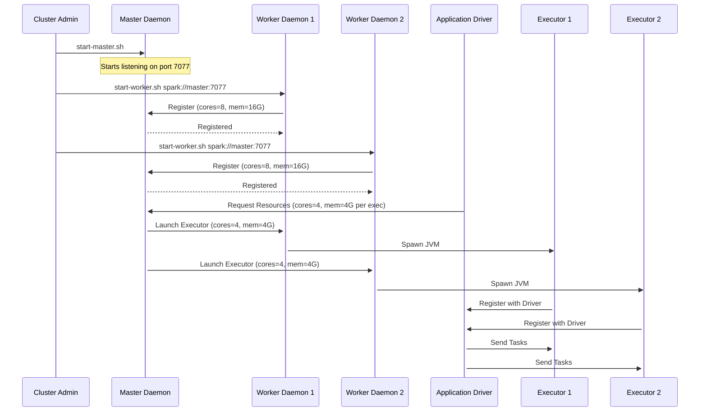

# Standalone Cluster Components

**The foundational daemons—Master and Worker—that orchestrate resources and execution in a standalone Apache Spark deployment.**

## Why It Matters

When scaling Spark from local development to a distributed environment, you need a mechanism to manage hardware resources across multiple machines. The Standalone cluster manager is Spark’s built-in solution for this. Understanding its components—the Master, Workers, Executors, and Driver—is critical because it forms the basis of how Spark applications are distributed and executed. Without a firm grasp of these daemons, debugging out-of-memory errors, stuck jobs, or failed task executions becomes a guessing game. By mastering the standalone architecture, you gain a deep understanding of Spark’s internals, which seamlessly translates to more complex cluster managers like YARN or Kubernetes.

## How It Works

The Standalone cluster manager uses a classical Master-Worker architecture, consisting of a single centralized Master daemon and multiple distributed Worker daemons. 

**The Master Daemon**
The Master acts as the central resource manager and scheduler for the cluster. It typically listens on port `7077`. Its primary responsibility is to keep track of the available resources (CPU cores and RAM) across all registered worker nodes and to allocate these resources to Spark applications when they are submitted. The Master does not run actual Spark tasks or process data; it purely handles resource negotiation and scheduling. For high availability, you can configure standby Masters using Apache ZooKeeper, ensuring that if the primary Master fails, a standby takes over without killing running applications.

**The Worker Daemons**
Worker daemons run on the individual compute nodes within the cluster. When a Worker starts, it registers itself with the Master, advertising its total available CPU cores and memory. The Master then uses this inventory to make allocation decisions. Upon receiving a command from the Master, the Worker daemon is responsible for spawning and managing Executor processes on its host machine. It also monitors the health of these Executors, reporting their status back to the Master. If an Executor crashes, the Worker detects this and notifies the Master so the resources can be reallocated or the Executor restarted.

**Executors**
Executors are JVM processes launched by the Worker daemons specifically for a given Spark application. They have two main duties: running the individual tasks (data processing logic) assigned to them by the Driver program, and caching data in memory or on disk for faster subsequent access. Executors are isolated per application; an Executor runs tasks for exactly one application and terminates when the application finishes (unless Dynamic Allocation is enabled).

**The Driver**
The Driver is the JVM process running the `main()` function of your Spark application and maintaining the `SparkContext`. It converts your RDD/DataFrame transformations into a Directed Acyclic Graph (DAG) of stages and tasks. The Driver negotiates with the Master for Executors, and once Executors are launched, it communicates *directly* with them to schedule tasks. The Driver can run either on the machine where you run `spark-submit` (client mode) or inside a Worker node within the cluster (cluster mode).

**Cluster Startup Sequence**
To start a standalone cluster, you first run `sbin/start-master.sh` on the master node. Then, on each worker node, you run `sbin/start-worker.sh <master-url>`. Alternatively, you can list the hostnames of your worker nodes in the `conf/workers` file on the master node and simply run `sbin/start-all.sh`, which uses SSH to automatically start the Master and all Workers.

## Flow Diagram



## Data Visualization

Below is a tabular representation of the typical resource footprint of cluster components:

| Component | Number per Cluster | Typical CPU Config | Typical Memory Config | Primary Role |
| :--- | :--- | :--- | :--- | :--- |
| **Master** | 1 (or 2+ with ZK) | 2 - 4 cores | 2GB - 4GB | Resource tracking, scheduling |
| **Worker** | Many (1 per node) | 1 - 2 cores | 1GB - 2GB | Process management, health checks |
| **Executor** | Many per App | 2 - 5 cores | 4GB - 32GB+ | Task execution, data caching |
| **Driver** | 1 per App | 2 - 4 cores | 4GB - 16GB+ | DAG scheduling, task dispatching |

## Code Example

```bash
# 1. Start the Master node manually
# Navigate to the Spark installation directory on the master machine
$SPARK_HOME/sbin/start-master.sh --host master.internal.net --port 7077 --webui-port 8080

# 2. Start Worker nodes manually (run this on each worker machine)
# Point them to the master's URL
$SPARK_HOME/sbin/start-worker.sh spark://master.internal.net:7077 --cores 4 --memory 16G

# 3. Alternatively, use the automated startup scripts
# First, edit conf/workers on the master node to include worker hostnames:
# worker1.internal.net
# worker2.internal.net
# worker3.internal.net

# Then, run the start-all script from the master node (requires passwordless SSH setup)
$SPARK_HOME/sbin/start-all.sh

# 4. To stop the cluster cleanly
$SPARK_HOME/sbin/stop-all.sh
```

## Common Pitfalls

*   **SSH Configuration:** When using `start-all.sh`, the master node must have passwordless SSH access to all worker nodes defined in `conf/workers`. If SSH keys are not properly distributed, the script will prompt for passwords or simply fail to launch the workers.
*   **Binding to localhost:** By default, if you don't specify the `--host` flag, the Master or Worker might bind to `127.0.0.1`. This prevents nodes on different machines from communicating. Always bind to a resolvable hostname or public/internal IP address.
*   **Over-promising Resources:** A Worker daemon does not strictly enforce memory limits on the OS level (unless Cgroups are configured). If you start a Worker with `--memory 32G` on a machine that only has 16GB of physical RAM, Spark will happily try to allocate 32GB to Executors, leading to immediate Linux OOM (Out Of Memory) killer interventions.
*   **Ignoring Daemon Logs:** The Master and Worker daemons write logs to the `$SPARK_HOME/logs/` directory. When a worker fails to register, these logs are the only place to find the `java.net.ConnectException` or heartbeat timeouts.

## Key Takeaway

The Spark Standalone cluster manager separates resource allocation (Master/Worker) from application execution (Driver/Executor), providing a simple yet powerful model for distributed data processing.
