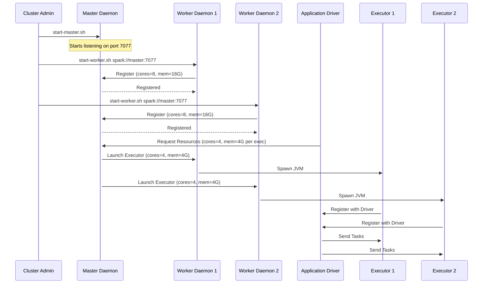

# Standalone Cluster Components

**The foundational daemons—Master and Worker—that orchestrate resources and execution in a standalone Apache Spark deployment.**

## Why It Matters

When scaling Spark from local development to a distributed environment, you need a mechanism to manage hardware resources across multiple machines. The Standalone cluster manager is Spark’s built-in solution for this. Understanding its components—the Master, Workers, Executors, and Driver—is critical because it forms the basis of how Spark applications are distributed and executed. Without a firm grasp of these daemons, debugging out-of-memory errors, stuck jobs, or failed task executions becomes a guessing game. By mastering the standalone architecture, you gain a deep understanding of Spark’s internals, which seamlessly translates to more complex cluster managers like YARN or Kubernetes.

## How It Works

The Standalone cluster manager uses a classical Master-Worker architecture, consisting of a single centralized Master daemon and multiple distributed Worker daemons. 

**The Master Daemon**
The Master acts as the central resource manager and scheduler for the cluster. It typically listens on port `7077`. Its primary responsibility is to keep track of the available resources (CPU cores and RAM) across all registered worker nodes and to allocate these resources to Spark applications when they are submitted. The Master does not run actual Spark tasks or process data; it purely handles resource negotiation and scheduling. For high availability, you can configure standby Masters using Apache ZooKeeper, ensuring that if the primary Master fails, a standby takes over without killing running applications.

**The Worker Daemons**
Worker daemons run on the individual compute nodes within the cluster. When a Worker starts, it registers itself with the Master, advertising its total available CPU cores and memory. The Master then uses this inventory to make allocation decisions. Upon receiving a command from the Master, the Worker daemon is responsible for spawning and managing Executor processes on its host machine. It also monitors the health of these Executors, reporting their status back to the Master. If an Executor crashes, the Worker detects this and notifies the Master so the resources can be reallocated or the Executor restarted.

**Executors**
Executors are JVM processes launched by the Worker daemons specifically for a given Spark application. They have two main duties: running the individual tasks (data processing logic) assigned to them by the Driver program, and caching data in memory or on disk for faster subsequent access. Executors are isolated per application; an Executor runs tasks for exactly one application and terminates when the application finishes (unless Dynamic Allocation is enabled).

**The Driver**
The Driver is the JVM process running the `main()` function of your Spark application and maintaining the `SparkContext`. It converts your RDD/DataFrame transformations into a Directed Acyclic Graph (DAG) of stages and tasks. The Driver negotiates with the Master for Executors, and once Executors are launched, it communicates *directly* with them to schedule tasks. The Driver can run either on the machine where you run `spark-submit` (client mode) or inside a Worker node within the cluster (cluster mode).

**Cluster Startup Sequence**
To start a standalone cluster, you first run `sbin/start-master.sh` on the master node. Then, on each worker node, you run `sbin/start-worker.sh <master-url>`. Alternatively, you can list the hostnames of your worker nodes in the `conf/workers` file on the master node and simply run `sbin/start-all.sh`, which uses SSH to automatically start the Master and all Workers.

## Flow Diagram



## Data Visualization

Below is a tabular representation of the typical resource footprint of cluster components:

| Component | Number per Cluster | Typical CPU Config | Typical Memory Config | Primary Role |
| :--- | :--- | :--- | :--- | :--- |
| **Master** | 1 (or 2+ with ZK) | 2 - 4 cores | 2GB - 4GB | Resource tracking, scheduling |
| **Worker** | Many (1 per node) | 1 - 2 cores | 1GB - 2GB | Process management, health checks |
| **Executor** | Many per App | 2 - 5 cores | 4GB - 32GB+ | Task execution, data caching |
| **Driver** | 1 per App | 2 - 4 cores | 4GB - 16GB+ | DAG scheduling, task dispatching |

## Code Example

```bash
# 1. Start the Master node manually
# Navigate to the Spark installation directory on the master machine
$SPARK_HOME/sbin/start-master.sh --host master.internal.net --port 7077 --webui-port 8080

# 2. Start Worker nodes manually (run this on each worker machine)
# Point them to the master's URL
$SPARK_HOME/sbin/start-worker.sh spark://master.internal.net:7077 --cores 4 --memory 16G

# 3. Alternatively, use the automated startup scripts
# First, edit conf/workers on the master node to include worker hostnames:
# worker1.internal.net
# worker2.internal.net
# worker3.internal.net

# Then, run the start-all script from the master node (requires passwordless SSH setup)
$SPARK_HOME/sbin/start-all.sh

# 4. To stop the cluster cleanly
$SPARK_HOME/sbin/stop-all.sh
```

## Common Pitfalls

*   **SSH Configuration:** When using `start-all.sh`, the master node must have passwordless SSH access to all worker nodes defined in `conf/workers`. If SSH keys are not properly distributed, the script will prompt for passwords or simply fail to launch the workers.
*   **Binding to localhost:** By default, if you don't specify the `--host` flag, the Master or Worker might bind to `127.0.0.1`. This prevents nodes on different machines from communicating. Always bind to a resolvable hostname or public/internal IP address.
*   **Over-promising Resources:** A Worker daemon does not strictly enforce memory limits on the OS level (unless Cgroups are configured). If you start a Worker with `--memory 32G` on a machine that only has 16GB of physical RAM, Spark will happily try to allocate 32GB to Executors, leading to immediate Linux OOM (Out Of Memory) killer interventions.
*   **Ignoring Daemon Logs:** The Master and Worker daemons write logs to the `$SPARK_HOME/logs/` directory. When a worker fails to register, these logs are the only place to find the `java.net.ConnectException` or heartbeat timeouts.

## Key Takeaway

The Spark Standalone cluster manager separates resource allocation (Master/Worker) from application execution (Driver/Executor), providing a simple yet powerful model for distributed data processing.


---

## 🎓 Deep Learning Questions

### Q1: Why Was This Concept Introduced?
Before the Standalone cluster manager was introduced, setting up a distributed execution environment for data processing frameworks like Hadoop required deploying and managing heavy resource managers such as YARN or Mesos. This added significant overhead, complexity, and steep learning curves for developers who simply wanted to run distributed Spark jobs. Spark introduced the Standalone cluster manager to provide an out-of-the-box, lightweight, and easy-to-configure resource management solution. It overcomes the limitation of relying solely on external cluster managers, allowing developers to spin up a fully functional distributed Spark cluster in minutes with zero external dependencies, making it ideal for testing, development, and moderately sized production workloads.

### Q2: What Exactly Is This Concept and How Does It Work?
The Standalone Cluster is Spark's native resource management framework built using a Master-Worker architecture. At its core, the Master daemon tracks resource availability across the cluster, while Worker daemons manage physical compute resources on individual nodes. When an application is submitted, the Driver requests resources from the Master. The Master then instructs the Workers to spawn Executor processes with specific CPU and memory configurations. Once spawned, these Executors communicate directly with the Driver to execute tasks in parallel. The Master doesn't execute tasks; it simply orchestrates resource allocation, relying on heartbeat signals from Workers to maintain cluster health and handle node failures.

### Q3: Where Should This Concept Be Used?
The Standalone cluster manager is widely used in environments where simplicity and ease of deployment are prioritized over advanced multitenancy. It is perfect for:
- Data science teams needing dedicated ephemeral clusters for training machine learning models on AWS EC2 or on-premise hardware.
- Startups and mid-sized companies that run Spark exclusively and do not need to share hardware with other distributed systems like Hadoop MapReduce or Flink.
- CI/CD pipelines where a clean Spark cluster needs to be spun up, run a test suite, and torn down quickly.
- Edge computing scenarios or edge clusters in retail where lightweight resource management is required without the overhead of YARN or Kubernetes.

### Q4: Where Should This Concept NOT Be Used?
You should avoid the Standalone cluster manager in highly heterogeneous, multi-tenant enterprise environments. It lacks advanced features like fine-grained resource sharing, robust user isolation, and dynamic queue management that YARN or Kubernetes excel at. It should not be used if your cluster already runs other distributed systems (e.g., Hive, HBase, MapReduce) because the Standalone Master cannot coordinate resources with non-Spark applications, leading to resource contention. Furthermore, its built-in security features are less comprehensive than Kerberos-integrated YARN, making it unsuitable for highly regulated industries like banking or healthcare unless tightly isolated at the network level.

### Q5: How Is This Concept Different from Hadoop?

| Aspect | Hadoop MapReduce (YARN) | Apache Spark (Standalone) |
| :--- | :--- | :--- |
| **Architecture** | ResourceManager & NodeManager | Master & Worker |
| **Performance** | Slower (Disk IO bound) | Faster (In-memory execution) |
| **Processing Model** | Strict Map and Reduce phases | Flexible DAG-based transformations |
| **Memory Usage** | Writes intermediate data to disk | Caches intermediate data in RAM |
| **Fault Tolerance** | Recomputes from HDFS | Recomputes using RDD Lineage |
| **Scalability** | Massively scalable (10,000+ nodes) | Highly scalable (up to 1,000+ nodes) |
| **Ease of Development** | Complex configuration, external dependencies | Native, zero-dependency, easy to start |
| **Typical Use Cases** | Multi-tenant data lakes, heavy batch ETL | Dedicated Spark workloads, fast analytics |
| **Advantages** | Robust multitenancy, queue management | Extremely lightweight, fast setup |
| **Disadvantages** | Heavyweight, complex to tune | Lacks advanced queueing/isolation |

### Q6: How Can This Concept Be Related to a Traditional RDBMS?

| RDBMS Concept | Spark Standalone Equivalent | Explanation |
| :--- | :--- | :--- |
| **Database Server (Instance)** | **Spark Cluster** | The overall distributed system processing the data. |
| **Connection Broker / Coordinator** | **Master Node** | Manages resources and accepts client connections/jobs. |
| **Compute Nodes / Background Workers** | **Worker Nodes** | The physical machines providing CPU and RAM. |
| **Query Execution Threads** | **Executors** | The specific processes spawned to run the actual data operations. |
| **Query Planner/Optimizer** | **Driver** | Analyzes the SQL/code and creates the execution plan (DAG). |
| **System Catalog / Metastore** | **Master Web UI / State** | Tracks what is currently running and what resources exist. |

### Q7: What Happens Behind the Scenes?
When you submit a job to a Standalone cluster, a specific sequence unfolds:
1. **Application Submission:** You run `spark-submit`, launching the Driver process.
2. **Resource Request:** The Driver connects to the Master (`spark://master:7077`) and requests Executors.
3. **Allocation:** The Master reviews available Workers and sends instructions to launch Executors.
4. **Executor Spawning:** Workers spawn JVM Executor processes, allocating the requested cores and memory.
5. **Registration:** Executors register back directly with the Driver.
6. **Task Execution:** The Driver breaks the DAG into Stages and Tasks, sending Tasks directly to the Executors.
7. **Completion:** Executors process data (reading/writing to storage). Upon job completion, the Driver exits, and the Master instructs Workers to kill the Executors.

```text
[Driver] 
   | (1. Request Resources)
   v
[Master] ----> (2. Launch Command) ----> [Worker Node]
   ^                                          |
   | (Heartbeats)                             v (3. Spawns JVM)
   |                                     [Executor]
   |                                          |
   +------------------------------------------+ (4. Registers directly to Driver & gets Tasks)
```

### Q8: Performance Considerations, Best Practices, and Common Mistakes

| Category | Recommendation | Why It Matters |
| :--- | :--- | :--- |
| **Configuration** | Explicitly set `--memory` and `--cores` for Workers. | Prevents OS-level Out-Of-Memory (OOM) kills by stopping Spark from over-allocating physical RAM. |
| **High Availability** | Setup standby Masters using ZooKeeper. | If the Master node crashes, no new applications can be scheduled. ZK ensures automatic failover. |
| **Networking** | Bind daemons to specific IP addresses (not localhost). | Ensures Workers and Master can communicate across the physical network. |
| **Log Management** | Periodically clean up `$SPARK_HOME/work/` and `/logs/`. | Worker nodes store executor stdout/stderr logs here, which can rapidly fill up the disk and crash the node. |
| **Executor Sizing** | Don't allocate all cores to a single large Executor. | Large garbage collection pauses in massive JVMs kill performance. Better to have multiple mid-sized Executors (e.g., 5 cores each). |
| **Common Mistake** | Submitting Driver in `client` mode on a weak laptop. | The Driver handles task distribution. If your laptop disconnects or is slow, the entire cluster job fails or stalls. |

### Q9: Interview Questions

**Beginner**
1. **What is the difference between a Master and a Worker in Spark Standalone?**
   The Master handles cluster resource scheduling and tracks available nodes, while the Worker resides on physical nodes to manage resources and launch Executor processes on command.
2. **Does the Master node run data processing tasks?**
   No. The Master only negotiates resources. Data processing is done exclusively by Executors on Worker nodes.
3. **What happens to running jobs if the Standalone Master crashes?**
   Currently running applications will continue to execute because Executors communicate directly with the Driver. However, no new applications can be submitted until the Master is restored.

**Intermediate**
1. **How do you enable High Availability (HA) for the Spark Standalone Master?**
   You configure multiple Master nodes and use Apache ZooKeeper for leader election. ZK tracks the active Master and automatically promotes a standby if the leader fails.
2. **What is the difference between `cluster` mode and `client` mode in Standalone?**
   In `client` mode, the Driver runs on the machine where `spark-submit` was executed. In `cluster` mode, the Driver runs inside a process managed by one of the Worker nodes in the cluster.
3. **Why might a Worker fail to register with the Master?**
   Common causes include network firewall blocking port 7077, the Master being bound to `localhost` (127.0.0.1) instead of a public/internal IP, or DNS resolution issues between nodes.

**Advanced**
1. **Explain the impact of Spark's `spark.cores.max` setting in a Standalone cluster.**
   It limits the total number of CPU cores an application can claim across the entire cluster. Without it, a single application might consume all available cores on all Workers, starving other applications.
2. **How does the Standalone manager handle Executor failures versus Worker node failures?**
   If an Executor fails, the Worker restarts it or the Master launches a new one elsewhere. If an entire Worker fails, the Master detects the missed heartbeats, marks the node as dead, and reschedules the lost Executors onto remaining healthy Workers.
3. **Can you run multiple Spark Workers on a single physical machine?**
   Yes. By running `start-worker.sh` multiple times with different port configurations, you can run multiple Worker daemons, though this is mostly used for local testing rather than production.

**Scenario-Based**
1. **Your Spark job is running very slowly. You check the Standalone UI and see only 1 Executor is active, despite having 10 Worker nodes. What is wrong?**
   The job was likely submitted without specifying executor instances or memory constraints, and the single Executor requested too much memory, fitting on only one node. Alternatively, dynamic allocation is enabled but failing to scale up due to a missing shuffle service.
2. **You start the Master and Workers, but the Master Web UI shows 0 Alive Workers. How do you debug this?**
   First, verify the Worker logs (`$SPARK_HOME/logs/`) for connection exceptions. Check if the Master is bound to `0.0.0.0` or its real IP, not `127.0.0.1`. Finally, ensure port 7077 is open in the firewall between the Workers and the Master.

### Q10: Complete Real-World Example

**Business Problem:** 
A retail company (e.g., Target) wants to aggregate daily sales data across hundreds of stores to compute total revenue per category. They spin up an ephemeral Spark Standalone cluster on AWS EC2 just for this nightly batch job to save costs.

**Sample Dataset:**
CSV files containing transaction data: `transaction_id, store_id, category, amount, timestamp`

**PySpark Code:**
```python
from pyspark.sql import SparkSession
from pyspark.sql.functions import sum, col

# Initialize SparkSession connecting to the Standalone Master
# In production, this URL is passed via spark-submit, not hardcoded.
spark = SparkSession.builder \
    .appName("NightlySalesAggregation") \
    .master("spark://master.internal.net:7077") \
    .config("spark.executor.memory", "4g") \
    .config("spark.executor.cores", "2") \
    .config("spark.cores.max", "20") \
    .getOrCreate()

# 1. Read data from a shared distributed storage (e.g., S3 or HDFS)
# The Driver plans this, Executors execute the read.
df_sales = spark.read.csv("s3a://retail-bucket/daily_sales/*.csv", header=True, inferSchema=True)

# 2. Perform the aggregation transformation
# This requires a shuffle across the cluster.
df_aggregated = df_sales.groupBy("category") \
    .agg(sum("amount").alias("total_revenue")) \
    .orderBy(col("total_revenue").desc())

# 3. Write results back to storage
# Executors write data in parallel.
df_aggregated.write.mode("overwrite").parquet("s3a://retail-bucket/aggregated_output/daily_revenue/")

# Clean shutdown
spark.stop()
```

**Step-by-Step Execution Walkthrough:**
1. The script is run via `spark-submit`. The Driver starts and connects to `spark://master.internal.net:7077`.
2. The Driver requests a total of 20 cores (max) with 4GB RAM and 2 cores per Executor.
3. The Master instructs available Workers to launch up to 10 Executors.
4. The Driver instructs Executors to read partitions of the CSV data from S3.
5. A shuffle occurs during `groupBy`. Executors exchange data over the network so all records for a specific 'category' end up on the same Executor.
6. The Executors calculate the sum and write the final Parquet files to S3.
7. `spark.stop()` is called, and the Master kills the Executors.

**Expected Output:**
A directory of Parquet files in S3 containing the aggregated categories and their total revenue, ready for reporting dashboards.

**Performance Notes:**
Using a Standalone cluster on EC2 means network speed between nodes dictates shuffle performance. Placing all EC2 instances in the same AWS Placement Group will drastically reduce latency during the `groupBy` phase.

### 💡 Key Takeaways
- The Standalone cluster manager is Spark’s built-in, lightweight resource manager.
- The Master handles scheduling and resource tracking; it does not process data.
- Workers manage physical node resources and spawn Executors on behalf of the Master.
- Executors run the actual tasks and communicate directly with the Driver.
- Standalone is excellent for dedicated Spark workloads but lacks the multitenancy features of YARN or Kubernetes.

### ⚠️ Common Misconceptions
- **Misconception:** The Master executes the driver program. **Reality:** The Master only manages resources; the Driver can run anywhere (client or cluster mode).
- **Misconception:** Standalone mode requires HDFS. **Reality:** Standalone mode only manages compute; you can use S3, Azure Blob, or local files for storage.
- **Misconception:** Workers enforce memory limits. **Reality:** Unless configured with cgroups, a Worker just trusts the memory limits you provide; overcommitting leads to OS crashes.

### 🔗 Related Spark Concepts
- High Availability with ZooKeeper
- Spark on YARN / Kubernetes
- Driver vs. Executor Architecture
- Job Scheduling and Resource Allocation
- Dynamic Allocation

### 📚 References for Further Reading
- Apache Spark Official Documentation
- Learning Spark (O'Reilly)
- Spark: The Definitive Guide (O'Reilly)
