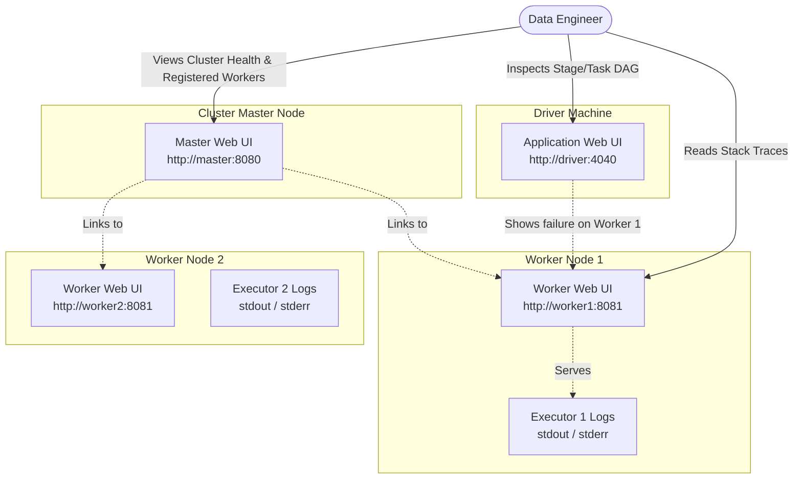

# Standalone Cluster Web UI

**Spark's built-in web interfaces that provide real-time visibility into cluster health, application progress, and executor logs.**

## Why It Matters

In a distributed environment, visibility is everything. When a Spark application spans tens or hundreds of machines, relying solely on terminal output or raw log files becomes impossible. Spark provides a suite of Web User Interfaces (UIs) that expose the internal state of the cluster and running applications. Knowing how to navigate these interfaces is an essential skill for any data engineer. The Web UI allows you to identify resource bottlenecks, find out exactly why an application is pending, analyze task execution skew, and locate the exact log files for a failed executor. Without the UI, tuning and debugging Spark jobs is akin to flying blind.

## How It Works

The Standalone cluster exposes three distinct but interconnected Web UIs:

**1. The Master Web UI (Port 8080)**
The Master UI is the dashboard for the entire cluster's health and resource allocation. By default, it runs on port `8080` (or `8081` if 8080 is taken). 
*   **Workers List:** It displays all registered Worker nodes, their IP addresses, total cores, used cores, total memory, and used memory. If a worker dies, its state changes to `DEAD` here.
*   **Running Applications:** Shows applications currently executing, including how many cores and memory they have been granted versus what they requested.
*   **Completed Applications:** A historical view of recently finished applications and their final state (FINISHED, FAILED, KILLED).

**2. The Worker Web UI (Port 8081)**
Each Worker node runs its own UI, typically on port `8081`. You can access it directly or by clicking a worker's link in the Master UI.
*   **Running Executors:** Shows the specific Executor JVMs currently running on this physical node, which application they belong to, and their resource consumption.
*   **Logs Access:** This is perhaps the most critical feature of the Worker UI. It provides direct hyperlinks to the `stdout` and `stderr` logs for every Executor. When a task throws an exception, the stack trace is written to the Executor's `stderr` log, which you can view directly through this web interface without SSHing into the node.

**3. The Application Web UI (Port 4040)**
The Application UI is bound to the Driver program and runs on port `4040` (incrementing to 4041, 4042 if multiple drivers run on the same host). This UI is arguably the most complex and important for performance tuning.
*   **Jobs Tab:** Shows a timeline of Spark Jobs, broken down into Stages.
*   **Stages Tab:** Displays the Directed Acyclic Graph (DAG) of the execution plan. It highlights task execution times, data shuffled, and data read/written. It is vital for spotting "straggler" tasks (data skew).
*   **Executors Tab:** Shows granular details about each executor assigned to the application, including GC (Garbage Collection) time, active tasks, and memory usage.
*   **SQL Tab:** If using Spark SQL or DataFrames, this tab shows the physical query plans and logical query trees.

When a task fails, you first use the Application UI (port 4040) to identify *which* task failed and on *which* Executor/Worker it was running. You then navigate to the Worker UI (port 8081) for that specific node to inspect the `stderr` logs and find the actual Java/Python exception.

## Flow Diagram



## Data Visualization

| UI Component | Default Port | Lifecycle | Primary Purpose | Key Metrics Shown |
| :--- | :--- | :--- | :--- | :--- |
| **Master UI** | `8080` | Continuous (Daemon) | Cluster-wide resource overview | Total/Used Cores & Memory, Worker Status |
| **Worker UI** | `8081` | Continuous (Daemon) | Node-level execution details | Local Executors, `stdout`/`stderr` logs |
| **Application UI**| `4040` | Tied to App Runtime | Job/Task execution monitoring | DAGs, Shuffle Read/Write, GC Time, Skew |
| **History Server**| `18080` | Continuous (Daemon) | Post-execution analysis | Reconstructs App UI from persisted event logs |

## Code Example

```bash
# Spark automatically assigns ports, but you can override them using environment variables
# or configuration properties in spark-defaults.conf

# 1. Starting a Master with a custom Web UI port (e.g., 9090 instead of 8080)
SPARK_MASTER_WEBUI_PORT=9090 ./sbin/start-master.sh

# 2. Starting a Worker with a custom Web UI port (e.g., 9091 instead of 8081)
SPARK_WORKER_WEBUI_PORT=9091 ./sbin/start-worker.sh spark://master:7077

# 3. Configuring the Application UI port in a PySpark script
```
```python
from pyspark.sql import SparkSession

# By default, the UI binds to 4040. If running multiple jobs on one machine, 
# you can force a specific port or let it auto-increment.
spark = SparkSession.builder \
    .appName("UI-Config-App") \
    .master("spark://master:7077") \
    .config("spark.ui.port", "4050") \
    .config("spark.ui.killEnabled", "true") \
    .getOrCreate()

# The UI is now accessible at http://<driver-ip>:4050
# The spark.ui.killEnabled flag allows users to kill stages directly from the UI.
```

## Common Pitfalls

*   **UI Disappears on Completion:** The Application UI (port 4040) is hosted by the Driver JVM. When the application completes (successfully or fails), the Driver JVM shuts down, and the UI immediately becomes inaccessible. You must use the Spark History Server to view UIs of completed jobs.
*   **Port Collisions:** If port 4040 is in use, Spark will attempt 4041, 4042, etc., up to `spark.port.maxRetries`. If you launch many concurrent `spark-shell` sessions on a single machine, you might exceed the retries and the application will fail to start.
*   **Reverse Proxy Issues:** In cloud environments or behind corporate firewalls, the links provided in the Master UI to the Worker UIs might point to internal IP addresses (e.g., `10.0.x.x`) that your local browser cannot reach. You often need to set `SPARK_PUBLIC_DNS` on the workers to ensure the UI generates resolvable URLs.
*   **Heavy UI Overhead:** By default, the Application UI retains information for the last 1000 jobs/stages. For massive, long-running streaming applications, retaining too much UI data can cause the Driver to run out of memory. This can be tuned via `spark.ui.retainedJobs` and similar configs.

## Key Takeaway

The Spark Web UIs form a triage hierarchy: use the Master UI for resource issues, the Application UI for logical execution and performance bottlenecks, and the Worker UI for low-level stack traces and error logs.


---

## 🎓 Deep Learning Questions

### Q1: Why Was This Concept Introduced?
Before the Spark Web UI, debugging distributed Hadoop MapReduce applications was notoriously difficult. Developers had to manually SSH into worker nodes, parse gigabytes of raw text logs, and stitch together execution timelines by hand. Spark introduced the built-in Web UIs to provide immediate, graphical visibility into the cluster’s state and the application's execution DAG (Directed Acyclic Graph). This visual dashboard overcomes the limitation of "blind execution," allowing developers to instantly identify stalled tasks, out-of-memory errors, and resource allocation bottlenecks without writing custom monitoring scripts.

### Q2: What Exactly Is This Concept and How Does It Work?
The Spark Web UI is a suite of embedded HTTP servers hosted by the different components of a Spark cluster. 
- The **Master UI (port 8080)** runs on the master node, aggregating heartbeat signals from workers to display cluster capacity.
- The **Worker UI (port 8081)** runs on each worker node, serving logs and tracking local executor processes.
- The **Application UI (port 4040)** is spun up by the Driver program when a SparkContext is initialized. It intercepts events from the DAGScheduler and TaskScheduler, rendering visual representations of Stages, Tasks, memory usage, and shuffle metrics in real-time.

### Q3: Where Should This Concept Be Used?
The Web UI is universally used across all industries utilizing Spark:
- **Streaming at Netflix:** Monitoring the processing delay and batch times in Spark Structured Streaming applications to ensure real-time recommendations.
- **Retail & E-Commerce:** Diagnosing "straggler tasks" (data skew) during massive ETL jobs that prepare daily sales reports.
- **Financial Services:** Verifying that a fraud-detection Spark job is properly utilizing all requested cores and memory across a massive on-premise cluster.
The UI is the first line of defense whenever a job runs slower than expected or fails unexpectedly.

### Q4: Where Should This Concept NOT Be Used?
The live Application UI (port 4040) should not be relied upon for post-mortem analysis of *completed* jobs, as the UI dies the moment the job finishes; for that, use the Spark History Server. Furthermore, in highly secure production environments, directly exposing these ports to the public internet is a massive anti-pattern. Access should be restricted via VPNs, SSH tunnels, or reverse proxies with authentication, as the UI can expose sensitive configuration parameters and environment variables.

### Q5: How Is This Concept Different from Hadoop?
| Aspect | Hadoop MapReduce | Apache Spark Web UI |
| :--- | :--- | :--- |
| **Architecture** | Relies on YARN ResourceManager and JobHistory Server. | Embedded Jetty servers in Master, Worker, and Driver. |
| **Performance Visibility** | Coarse-grained (Map and Reduce phases). | Fine-grained DAG visualization, GC time, and Shuffle metrics. |
| **Log Access** | Often requires aggregating logs via `yarn logs -applicationId`. | Direct hyperlinks to executor `stdout`/`stderr` from the UI. |
| **Real-time Query Plans**| Not applicable. | The SQL tab shows physical and logical execution plans. |
| **Ease of Debugging** | Tedious, requires CLI tooling and log parsing. | Highly visual, interactive drill-down from Stage to Task level. |

### Q6: How Can This Concept Be Related to a Traditional RDBMS?
| RDBMS Concept | Spark Web UI Equivalent | Explanation |
| :--- | :--- | :--- |
| **EXPLAIN / Execution Plan** | **SQL Tab DAG** | Both show how the engine plans to execute the query (e.g., Joins, Scans). |
| **Active Sessions/Processes View (e.g., `pg_stat_activity`)** | **Executors Tab** | Shows active connections/executors, memory consumed, and current state. |
| **Database Server Dashboard** | **Master Web UI** | Shows overall hardware resource utilization (CPU/Memory). |
| **Slow Query Log** | **Stages Tab (Sorting by Duration)** | Identifies specific parts of the workload that are taking the longest. |

### Q7: What Happens Behind the Scenes?
When you submit a Spark application:
1. The **Driver** starts a Jetty web server (default port 4040).
2. The `SparkListener` bus intercepts events from the Spark engine (e.g., `SparkListenerTaskStart`, `SparkListenerJobEnd`).
3. These events populate internal UI data structures.
4. When a user requests a page via HTTP, the UI renders HTML using these live data structures.
5. If an executor fails, the **Worker** (via port 8081) exposes the physical file system logs through its own HTTP endpoints.

```text
[Spark Engine Events] --> (SparkListener Bus) --> [UI Data Store]
                                                       |
[Web Browser] --HTTP GET--> [Jetty Server (Port 4040)]-+
```

### Q8: Performance Considerations, Best Practices, and Common Mistakes
| Category | Recommendation | Why It Matters |
| :--- | :--- | :--- |
| **Best Practice** | Use the History Server for production. | The live UI disappears when jobs finish; History Server reconstructs the UI from event logs. |
| **Common Mistake** | Ignoring the "GC Time" metric in the Executors tab. | High GC time indicates memory pressure and requires tuning executor memory or data serialization. |
| **Optimization** | Limit UI retained stages (`spark.ui.retainedStages`). | A Driver tracking hundreds of thousands of tasks can run out of memory (OOM) just maintaining the UI state. |
| **Production Tip** | Set `SPARK_PUBLIC_DNS`. | Ensures worker log URLs are resolvable on your local machine rather than pointing to internal network IPs. |

### Q9: Interview Questions
**Beginner**
1. **What is the default port for the Spark Application UI?** Port 4040.
2. **Where would you look to see how much memory the total cluster has available?** The Master Web UI (default port 8080).
3. **If a specific task fails, how do you find the error message?** Find the Executor ID in the App UI (4040), then navigate to the Worker UI (8081) for that executor's `stderr` log.

**Intermediate**
4. **Why might the Spark UI start on port 4041 or 4042?** Because port 4040 is already in use by another Spark application running on the same machine.
5. **How does the History Server differ from the Application UI?** The Application UI is live and hosted by the running Driver; the History Server reads persisted event logs to recreate the UI for finished jobs.
6. **What does the SQL tab provide that the Jobs tab doesn't?** It shows the Catalyst Optimizer's logical and physical query plans, including metrics for specific relational operators like Joins and Aggregations.

**Advanced**
7. **How can a long-running streaming application crash because of the Web UI, and how do you fix it?** The Driver keeps a history of stages and jobs in memory. If not bounded, it causes a Driver OOM. Fix by tuning `spark.sql.ui.retainedExecutions` and `spark.ui.retainedStages`.
8. **Explain how data skew is identified using the Web UI.** In the Stages tab, look at the task duration percentiles (Min, 25th, Median, 75th, Max). If the Max duration is vastly larger than the Median, you have data skew.

**Scenario-Based**
9. **You click on an executor log link in the UI and your browser says "Site cannot be reached." What is the problem?** The worker node registered with the master using an internal IP address. You need to configure `SPARK_PUBLIC_DNS` on the worker so the UI generates external-facing URLs.
10. **Your job is taking forever, but CPU utilization is low. What tab do you check first?** The Executors tab to check "GC Time" (Garbage Collection). If JVMs are constantly pausing for GC, CPU isn't doing actual work.

### Q10: Complete Real-World Example
**Business Problem:** A retail company is processing daily transaction logs. The job randomly fails, and engineers need to programmatically configure the UI to track it down without port collisions on a shared jump-host.

**Sample Dataset:** Transaction events mapping stores to purchase amounts.

**Full Working PySpark Code:**
```python
from pyspark.sql import SparkSession
import time

# 1. Initialize Spark with custom UI configurations
spark = SparkSession.builder \
    .appName("Retail-Transaction-Analyzer") \
    .master("local[*]") \
    .config("spark.ui.port", "4050") \
    .config("spark.ui.retainedJobs", "100") \
    .config("spark.eventLog.enabled", "true") \
    .config("spark.eventLog.dir", "/tmp/spark-events") \
    .getOrCreate()

print(f"Tracking UI available at: {spark.sparkContext.uiWebUrl}")

# 2. Create sample retail data
data = [("Store_A", 150.0), ("Store_B", 200.0), ("Store_A", 50.0)] * 1000000
df = spark.createDataFrame(data, ["store", "amount"])

# 3. Force a shuffle operation to visualize in the UI
# Check the 'SQL' and 'Stages' tabs in the UI at port 4050 while this runs
summary_df = df.groupBy("store").sum("amount")
summary_df.write.mode("overwrite").parquet("/tmp/retail_summary")

# Pause to allow user to view the UI before the application terminates
print("Job finished. Pausing for 60 seconds so you can view the UI...")
time.sleep(60)
spark.stop()
```
**Step-by-step execution walkthrough:**
1. The script initializes and binds the UI explicitly to port 4050.
2. It enables event logging to `/tmp/spark-events` so the History Server can view it later.
3. It performs a massive group-by operation, triggering a Shuffle.
4. It pauses for 60 seconds, allowing the developer to open `http://localhost:4050` to inspect the DAG and Shuffle Read/Write metrics before the Driver exits.

**Expected output:**
The console will print `Tracking UI available at: http://<ip>:4050` and create Parquet files in `/tmp/retail_summary`. The UI will reflect the stages generated by the `groupBy`.

**Performance notes:**
Configuring `spark.ui.retainedJobs` limits memory usage on the Driver, preventing Out-Of-Memory errors in long-running jobs.

**When this approach is best:**
When automating Spark submissions in a shared environment where default ports may clash, or when building custom debug scripts.

### 💡 Key Takeaways
- The Spark UI is divided into Master (8080), Worker (8081), and Application (4040) interfaces.
- The Application UI is hosted by the Driver and dies when the job completes.
- Use the History Server to view metrics for completed jobs.
- The UI is crucial for identifying data skew (Tasks taking disproportionately long).
- Logs (`stdout`/`stderr`) for failed tasks are accessed via the Worker UI.

### ⚠️ Common Misconceptions
- **Misconception:** The Web UI stores data indefinitely. **Reality:** It only retains a limited history in memory (e.g., last 1000 stages) to prevent Driver OOM.
- **Misconception:** You can use port 4040 to check yesterday's job. **Reality:** 4040 is only for *running* jobs.
- **Misconception:** High CPU in the Master UI means tasks are running fast. **Reality:** If the Application UI shows high "GC Time", the CPU is busy doing garbage collection, not data processing.

### 🔗 Related Spark Concepts
- Spark History Server
- Spark DAG (Directed Acyclic Graph)
- Data Skew and Partitioning
- Spark Memory Management

### 📚 References for Further Reading
- Apache Spark Official Documentation
- Learning Spark (O'Reilly)
- Spark: The Definitive Guide (O'Reilly)
