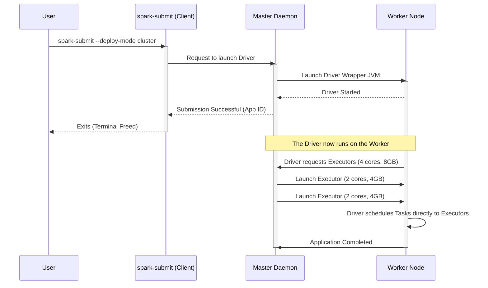

# Running Applications on the Standalone Cluster

**The mechanisms and configurations for submitting, scheduling, and executing Spark applications using `spark-submit`.**

## Why It Matters

Writing Spark code is only half the battle; deploying it efficiently is the other half. The `spark-submit` script is the universal entry point for launching applications across all cluster managers. However, deploying to a Standalone cluster introduces specific configuration nuances, particularly regarding how resources (cores and memory) are requested and how the Driver program is positioned within the network. Understanding how to properly configure `--executor-memory`, `--executor-cores`, and `--total-executor-cores` prevents resource starvation, ensures maximum cluster utilization, and avoids common failures like network timeouts between the Driver and the Executors.

## How It Works

Submitting an application to a Standalone cluster involves using `spark-submit` and pointing the `--master` argument to the Standalone Master's URL (e.g., `spark://master-ip:7077`). 

**Deploy Modes: Client vs. Cluster**
The most critical architectural decision when submitting a job is selecting the `--deploy-mode`.
*   **Client Mode (`--deploy-mode client`):** This is the default. The Driver JVM is launched on the machine where you execute the `spark-submit` command (e.g., an edge node or your local laptop). The Driver connects to the remote cluster Master to request Executors. This mode is excellent for interactive shells (`spark-shell`, `pyspark`) because the Driver output (print statements, REPL output) is printed directly to your terminal. However, it requires a persistent, low-latency network connection between your machine and the cluster. If you close your laptop, the Driver dies, and the job fails.
*   **Cluster Mode (`--deploy-mode cluster`):** The `spark-submit` script acts simply as a REST client that requests the Master to launch the Driver on one of the worker nodes. Once submitted, `spark-submit` can exit, and the application will continue running autonomously on the cluster. This is the recommended mode for production jobs, as the Driver resides on the same high-speed network as the Executors.

**Resource Configuration**
In a Standalone cluster, you must explicitly manage how your application consumes resources:
*   `--executor-memory`: The amount of RAM requested for each Executor (e.g., `4G`).
*   `--executor-cores`: The number of CPU cores assigned to each Executor. If omitted in Standalone mode, Spark will greedily assign *all* available cores on a worker to a single Executor.
*   `--total-executor-cores`: A Standalone-specific flag. It limits the total number of CPU cores the application can request across the entire cluster. If not set, the application will try to grab every available core on every registered worker, effectively blocking other applications from running.

**Application Scheduling**
The Standalone Master uses a FIFO (First-In, First-Out) scheduling policy by default. If Application A is submitted without `--total-executor-cores`, it will take all cluster resources. Application B will be queued in a `WAITING` state until Application A finishes and releases the resources. To run multiple applications concurrently, you must restrict the resources requested by each app.

## Flow Diagram



## Data Visualization

| Configuration Flag | Meaning | Default (Standalone) | Best Practice |
| :--- | :--- | :--- | :--- |
| `--deploy-mode` | Where the Driver runs | `client` | `cluster` for production, `client` for dev/REPL |
| `--executor-memory`| RAM per Executor process | `1G` | 4G - 8G (Keep below 32G to avoid huge GC pauses) |
| `--executor-cores` | CPU Cores per Executor process | All available on worker | 2 - 5 cores (Balances concurrency vs. HDFS throughput) |
| `--total-executor-cores` | Max cores for the whole app | Infinite (Grabs all) | Must set to share cluster among multiple apps |
| `--driver-memory` | RAM for the Driver process | `1G` | Increase to 4G+ if collecting large datasets via `collect()` |

## Code Example

```bash
# 1. Submitting a Python application in CLIENT mode
# Useful for development. The terminal will stream application logs.
./bin/spark-submit \
  --master spark://192.168.1.10:7077 \
  --deploy-mode client \
  --name "Interactive Data Exploration" \
  --executor-memory 4G \
  --total-executor-cores 4 \
  /home/user/scripts/data_analysis.py

# 2. Submitting a Scala/Java application in CLUSTER mode
# Useful for production. The terminal returns immediately.
./bin/spark-submit \
  --class com.example.analytics.DailyReport \
  --master spark://192.168.1.10:7077 \
  --deploy-mode cluster \
  --driver-memory 2G \
  --executor-memory 8G \
  --executor-cores 4 \
  --total-executor-cores 20 \
  hdfs://namenode:8020/apps/analytics-1.0.jar \
  --date 2023-10-27

# 3. Supplying external dependencies (jars or python files)
# The --jars argument distributes the libraries to all worker nodes.
./bin/spark-submit \
  --master spark://192.168.1.10:7077 \
  --packages org.postgresql:postgresql:42.2.18 \
  --py-files /home/user/utils.zip \
  /home/user/scripts/etl_job.py
```

## Common Pitfalls

*   **Greedy Resource Allocation:** By default, submitting without `--total-executor-cores` causes the app to hoard all cluster cores, preventing any other job from running. Always specify total cores if you intend to share the cluster.
*   **Driver Out Of Memory:** In `client` mode, if your code calls `df.collect()` on a massive DataFrame, the driver JVM will run out of memory and crash. Ensure `--driver-memory` is appropriately sized, but prefer writing results to storage rather than collecting to the driver.
*   **Lost Python Dependencies:** If your PySpark script imports local custom modules (e.g., `import my_utils`), the worker nodes won't have those files. You must package them into a `.zip` file and pass them using the `--py-files` flag.
*   **Client Mode Disconnection:** Running a 10-hour job in `client` mode from an edge node over SSH is risky. If the SSH session drops or the edge node reboots, the Driver dies, terminating the entire application on the cluster.

## Key Takeaway

Mastering `spark-submit` on a Standalone cluster requires a careful balancing act between configuring execution resources (`cores` and `memory`) and understanding the networking implications of where the Driver program is instantiated (`client` vs. `cluster` mode).


---

## 🎓 Deep Learning Questions

### Q1: Why Was This Concept Introduced?
Before Apache Spark introduced its Standalone cluster manager and flexible deployment modes via `spark-submit`, big data applications were tightly coupled with Hadoop YARN or Mesos. This created a high barrier to entry for developers who just wanted to test Spark code or run a small-to-medium cluster without the massive administrative overhead of configuring a full Hadoop ecosystem. Spark Standalone was introduced as a lightweight, built-in cluster manager that comes out-of-the-box with Spark. It overcomes the complexity limitation by providing a simple Master-Worker architecture, allowing organizations to easily spin up a distributed processing environment, submit jobs with configurable resource constraints (memory/cores), and choose where the Driver runs (client vs. cluster mode) without relying on heavy external resource managers.

### Q2: What Exactly Is This Concept and How Does It Work?
Running an application on a Standalone cluster involves packaging your Spark code and submitting it to the cluster's Master node using the `spark-submit` script. 

When you submit an application, you define how much memory and how many CPU cores it requires. The Master daemon evaluates the available resources across all registered Worker nodes and provisions Executors for your application. 

The execution flow relies heavily on the `--deploy-mode`. In **client mode**, your local machine runs the Driver program, and the Driver communicates directly with the cluster to request resources and send tasks. In **cluster mode**, the Master schedules the Driver itself to run inside a special JVM on one of the Worker nodes. Once the Driver is active, it requests Executors from the Master, creates the SparkContext, converts your code into a physical execution plan, and distributes tasks to the Executors across the cluster.

### Q3: Where Should This Concept Be Used?
The Standalone cluster manager and its application submission framework are best suited for environments where simplicity and rapid setup are prioritized over multi-tenant resource fairness. 
- **Startups and Small/Medium Enterprises:** Companies processing terabytes of data but lacking dedicated Hadoop administrators often use Standalone mode on cloud VMs (e.g., AWS EC2) for daily ETL jobs.
- **Dedicated Workloads:** Retailers generating daily inventory reports on an isolated cluster where only Spark workloads run.
- **Development & Testing:** Data science teams testing machine learning models using interactive `client` mode on a shared internal cluster before pushing to a production YARN or Kubernetes environment.
- **IoT Data Aggregation:** Aggregating sensor data on an on-premise edge computing cluster without the overhead of enterprise Hadoop.

### Q4: Where Should This Concept NOT Be Used?
Spark Standalone should NOT be used in highly complex, multi-tenant enterprise environments that run heterogeneous workloads.
- **Mixed Big Data Stacks:** If you are running Hive, Flink, and Spark on the same cluster, you should use YARN or Kubernetes to enforce strict resource quotas and queueing. Standalone only manages Spark jobs.
- **Strict Security Requirements:** Standalone lacks the robust enterprise security features (like Kerberos integration at the container level) found in YARN.
- **Dynamic Scaling on Cloud:** While Standalone can dynamically allocate executors, it is not as native or efficient at auto-scaling underlying cloud nodes as Kubernetes or managed services like Databricks/EMR.
- **Avoid greedy allocation:** Do not use default settings in production, as an app without `--total-executor-cores` will hoard all cluster resources, starving other applications.

### Q5: How Is This Concept Different from Hadoop?
| Aspect | Hadoop MapReduce | Apache Spark (Standalone) |
| :--- | :--- | :--- |
| **Architecture** | JobTracker and TaskTracker (MRv1) or YARN (MRv2). | Built-in Master and Worker daemons. |
| **Performance** | Disk-heavy; writes intermediate results to disk between phases. | In-memory processing; keeps intermediate data in RAM. |
| **Processing Model** | Strictly Map followed by Reduce. | Flexible DAG (Directed Acyclic Graph) of operations. |
| **Memory Usage** | Minimal caching; heavily reliant on HDFS. | Maximizes RAM usage for caching DataFrames/RDDs. |
| **Fault Tolerance** | Re-executes map or reduce tasks from disk blocks. | Recomputes lost partitions using RDD lineage graphs. |
| **Scalability** | Designed for massive clusters (thousands of nodes). | Great for small-to-medium clusters (hundreds of nodes). |
| **Ease of Development** | Verbose Java code. Complex submission scripts. | Unified APIs (SQL, Python, Scala). Easy `spark-submit`. |
| **Typical Use Cases** | Massive batch processing, log parsing. | Real-time analytics, machine learning, iterative processing. |
| **Advantages** | Extremely robust on commodity hardware. | Fast, easy to set up, highly interactive. |
| **Disadvantages** | Slow, rigid programming model. | Can suffer from Out-Of-Memory (OOM) errors if misconfigured. |

### Q6: How Can This Concept Be Related to a Traditional RDBMS?
| Spark Standalone Concept | Traditional RDBMS Equivalent | Explanation |
| :--- | :--- | :--- |
| **`spark-submit`** | Running a SQL Script via CLI (`psql`, `sqlcmd`) | Both are entry points to submit work to the database/cluster engine. |
| **Master Node** | Database Server/Query Optimizer | The central coordinator that accepts queries and manages resources. |
| **Worker Nodes / Executors** | Background Worker Processes | The actual compute threads that perform table scans and aggregations. |
| **Client Mode** | Interactive SQL IDE (e.g., DBeaver, SSMS) | Your local machine holds the connection open and displays results. |
| **Cluster Mode** | Stored Procedure / Scheduled SQL Agent Job | The script runs entirely on the server; the client can disconnect. |
| **`--executor-memory`** | `work_mem` / Buffer Pool Size | Defines how much RAM is allocated for processing data in memory. |

### Q7: What Happens Behind the Scenes?
When you submit an application to a Standalone cluster, a highly orchestrated sequence of events occurs:

1. **Submission:** `spark-submit` connects to the Master daemon. In cluster mode, it requests to launch the Driver.
2. **Driver Initialization:** The Master assigns a Worker to launch a JVM wrapper containing your Driver code.
3. **Resource Request:** The Driver's `SparkContext` asks the Master for Executors based on your `--executor-cores` and `--executor-memory` settings.
4. **Executor Launch:** The Master commands Worker nodes to spawn Executor JVMs.
5. **DAG Generation:** Your Spark code is translated into a logical plan, then a physical DAG (Directed Acyclic Graph) of Stages.
6. **Task Scheduling:** The DAG Scheduler splits Stages into Tasks (one per partition of data). The Task Scheduler sends these Tasks directly to the Executors.
7. **Execution & Shuffle:** Executors process data in memory. When a wide transformation occurs (e.g., `groupBy`), Executors shuffle data across the network.
8. **Completion:** Results are saved to storage, the Driver exits, and the Master tears down the Executors.

```text
[User CLI] --(spark-submit)--> [Standalone Master]
                                      | (Assigns Driver)
                                      v
                             [Worker Node A] --> Runs [Driver JVM]
                                      | (Requests Resources)
                                      v
             +-------------------------------------------------+
             |                 Master Daemon                   |
             +-------------------------------------------------+
                /                     |                     \
    [Worker Node A]           [Worker Node B]           [Worker Node C]
    [Executor (4 cores)]      [Executor (4 cores)]      [Executor (4 cores)]
            ^                         ^                         ^
            | (Tasks)                 | (Tasks)                 | (Tasks)
            +------------------- [Driver JVM] ------------------+
```

### Q8: Performance Considerations, Best Practices, and Common Mistakes
| Category | Recommendation | Why It Matters |
| :--- | :--- | :--- |
| **Resource Allocation** | Always set `--total-executor-cores`. | Prevents a single application from hoarding the entire cluster, allowing for multi-tenancy. |
| **Executor Sizing** | Use 4-5 cores per Executor (e.g., `--executor-cores 5`). | 1 core is inefficient; 6+ cores can cause HDFS I/O bottlenecks and severe Garbage Collection (GC) pauses. |
| **Deploy Mode** | Use `--deploy-mode cluster` for production jobs. | Prevents application failure if the submitting machine disconnects or experiences network latency. |
| **Memory Config** | Keep `--executor-memory` under 32GB. | JVM Heap sizes above 32GB lose Compressed OOPs optimization, requiring significantly more RAM for pointers and increasing GC times. |
| **Dependency Mgmt** | Use `--py-files` or `--jars` for custom libraries. | Ensures all Worker nodes have the necessary code to execute tasks; otherwise, `ModuleNotFoundError` will occur. |
| **Driver Memory** | Increase `--driver-memory` if calling `.collect()`. | Prevents the Driver from crashing with OOM errors when gathering large result sets from Executors. |

### Q9: Interview Questions

**Beginner**
1. **What is the default deploy mode when using `spark-submit`?**
   *Answer:* The default is `client` mode, where the Driver runs on the machine where the command was executed.
2. **What does `--executor-memory` do?**
   *Answer:* It defines the amount of RAM allocated to each individual Executor process running on the Worker nodes.
3. **If I don't specify `--total-executor-cores` on a Standalone cluster, what happens?**
   *Answer:* The application will greedily request all available CPU cores across all Worker nodes, blocking other applications.

**Intermediate**
1. **Why is it recommended to use `--deploy-mode cluster` for production workloads?**
   *Answer:* In cluster mode, the Driver runs on a node inside the cluster. This isolates the application from client-side network issues, SSH timeouts, or the user closing their laptop, ensuring the job runs to completion.
2. **Explain the relationship between `--executor-cores` and Garbage Collection.**
   *Answer:* Allocating too many cores (e.g., 10+) to a single Executor means many tasks run concurrently sharing the same JVM memory heap. This rapid object creation can overwhelm the Garbage Collector, causing massive pause times. 4-5 cores is the sweet spot.
3. **How do you pass a custom Python utility file to a Spark job in a cluster?**
   *Answer:* By zipping the Python files and passing them to `spark-submit` using the `--py-files custom_utils.zip` argument, which distributes them to all Worker nodes.

**Advanced**
1. **If a Worker node fails while executing tasks, how does Spark Standalone recover?**
   *Answer:* The Master detects the lost Worker/Executors. The Driver's Task Scheduler marks the tasks as failed and reschedules them on healthy Executors. The RDD lineage ensures any lost partitions are recomputed from the source data.
2. **How does Standalone Master's scheduling differ from YARN's Fair Scheduler?**
   *Answer:* Standalone uses a simple FIFO (First-In, First-Out) scheduling model. Without capping resources, the first app takes everything. YARN supports complex Fair and Capacity scheduling, guaranteeing resource pools for different teams and queues.
3. **Can you run a `spark-shell` in `cluster` mode? Why or why not?**
   *Answer:* No. Interactive shells require standard input/output to be tethered to your terminal. In `cluster` mode, the Driver is detached and runs on a remote node, making interactive REPL communication impossible.

**Scenario-Based**
1. **Your nightly ETL job fails with `java.lang.OutOfMemoryError: Java heap space` on the Driver, but the Executors are fine. What is likely wrong?**
   *Answer:* The code is likely executing a `.collect()` on a massive DataFrame, pulling all distributed data back to the Driver. You must either increase `--driver-memory`, or better, rewrite the code to save the output to distributed storage (e.g., S3/HDFS) instead of collecting it.
2. **You submit two jobs simultaneously to a 20-core Standalone cluster. Job A takes all 20 cores, and Job B sits in `WAITING` state indefinitely. How do you fix this?**
   *Answer:* Kill Job A, and resubmit both jobs using the `--total-executor-cores` flag. For example, assign `--total-executor-cores 10` to each job so they can share the cluster dynamically.

### Q10: Complete Real-World Example

**Business Problem:** A streaming platform (like Netflix) needs to run a nightly batch job to process user viewing logs. They need to calculate the total watch time per movie to update their trending algorithms. They are using a Spark Standalone cluster on AWS EC2.

**Sample Dataset (`viewing_logs.csv`):**
```csv
user_id,movie_id,watch_duration_minutes,timestamp
u123,m991,45,2023-10-27T10:00:00Z
u456,m991,120,2023-10-27T10:05:00Z
u123,m442,30,2023-10-27T11:00:00Z
u789,m442,15,2023-10-27T11:30:00Z
```

**PySpark Code (`calculate_trending.py`):**
```python
import sys
from pyspark.sql import SparkSession
from pyspark.sql.functions import sum, col, desc

def main():
    # 1. Initialize SparkSession
    # Note: We don't hardcode .master() here; we provide it via spark-submit
    spark = SparkSession.builder \
        .appName("Nightly Trending Movies Calculation") \
        .getOrCreate()

    # Get input and output paths from command line args
    if len(sys.argv) != 3:
        print("Usage: calculate_trending.py <input_path> <output_path>")
        sys.exit(1)
        
    input_path = sys.argv[1]
    output_path = sys.argv[2]

    # 2. Read the raw CSV data
    logs_df = spark.read.csv(input_path, header=True, inferSchema=True)

    # 3. Perform the aggregation: Total watch time per movie
    trending_df = logs_df.groupBy("movie_id") \
        .agg(sum("watch_duration_minutes").alias("total_watch_time")) \
        .orderBy(desc("total_watch_time"))

    # 4. Write the results back out to storage (Parquet format)
    # Using coalesce(1) just for this small example to output a single file
    trending_df.coalesce(1).write.mode("overwrite").parquet(output_path)

    print(f"Successfully processed viewing logs and saved to {output_path}")
    spark.stop()

if __name__ == "__main__":
    main()
```

**Submission Command:**
```bash
# Executing this from an edge node to deploy to the Standalone cluster
./bin/spark-submit \
  --master spark://10.0.0.50:7077 \
  --deploy-mode cluster \
  --executor-memory 8G \
  --executor-cores 4 \
  --total-executor-cores 16 \
  --driver-memory 4G \
  /opt/scripts/calculate_trending.py \
  hdfs://namenode:8020/data/viewing_logs.csv \
  hdfs://namenode:8020/output/trending_movies
```

**Step-by-Step Execution Walkthrough:**
1. The user runs the `spark-submit` command on their edge node.
2. `spark-submit` contacts the Master (`10.0.0.50:7077`) and requests to run the Driver in `cluster` mode.
3. The Master chooses a Worker and launches the Driver JVM (allocating 4GB RAM). `spark-submit` on the edge node successfully exits.
4. The Driver starts, initializes the `SparkSession`, and requests Executors. Based on the config, it gets 4 Executors (each with 4 cores and 8GB RAM, totaling 16 cores).
5. The Driver translates the script: reads the CSV, triggers a Shuffle for the `groupBy("movie_id")` and `orderBy()`, and writes Parquet.
6. The Tasks are distributed to the Executors.
7. Executors process the data, write the output file to HDFS, and report success back to the Driver.
8. The Driver shuts down, and the Master reclaims the cluster resources.

**Expected Output (Inside HDFS output directory):**
A Parquet file containing:
| movie_id | total_watch_time |
| :--- | :--- |
| m991 | 165 |
| m442 | 45 |

**Performance Notes:**
By capping `--total-executor-cores 16`, we leave room on a larger cluster for other batch jobs to run simultaneously. By using `--deploy-mode cluster`, the job is completely resilient to network drops between the engineer's laptop and the AWS VPC.

**When this approach is best:**
This approach is ideal for scheduled, automated batch ETL pipelines running in production environments where the cluster architecture is simple and doesn't require complex resource queueing mechanisms like YARN.

### 💡 Key Takeaways
- `spark-submit` is the universal entry point for launching Spark applications across all resource managers.
- `client` deploy mode is for interactive development; `cluster` deploy mode is for production reliability.
- In Standalone mode, you must explicitly set `--total-executor-cores` to prevent a single job from starving the cluster.
- The Master node handles resource allocation (Executors), while the Driver node handles application logic and task scheduling.
- Setting `--executor-cores` between 4 and 5 balances concurrency with JVM Garbage Collection efficiency.

### ⚠️ Common Misconceptions
- **"Standalone mode is only for local testing."** False. A Standalone cluster can span hundreds of nodes and process terabytes of data efficiently in production.
- **"Deploy mode 'cluster' makes my job run faster."** False. It changes *where* the Driver runs, improving network reliability and decoupling it from the client machine, but it doesn't inherently speed up task execution.
- **"More cores per executor always means better performance."** False. More than 5 cores can cause severe JVM Garbage Collection pauses and I/O bottlenecks.
- **"Client mode means the code runs on my laptop."** False. Only the Driver runs on your laptop; the heavy data processing still happens on the remote cluster Executors.

### 🔗 Related Spark Concepts
- Spark Architecture (Driver, Executor, Master, Worker)
- YARN and Kubernetes Cluster Managers
- Spark Memory Management (Execution vs. Storage Memory)
- PySpark vs. Scala Job Submission
- Directed Acyclic Graph (DAG) and Stages

### 📚 References for Further Reading
- Apache Spark Official Documentation: Submitting Applications
- Apache Spark Official Documentation: Spark Standalone Mode
- Learning Spark (O'Reilly), Chapter 2: Downloading Spark and Getting Started
- Spark: The Definitive Guide (O'Reilly), Chapter 15: How Spark Runs on a Cluster
