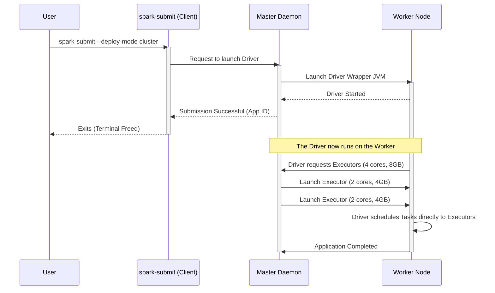

# Running Applications on the Standalone Cluster

**The mechanisms and configurations for submitting, scheduling, and executing Spark applications using `spark-submit`.**

## Why It Matters

Writing Spark code is only half the battle; deploying it efficiently is the other half. The `spark-submit` script is the universal entry point for launching applications across all cluster managers. However, deploying to a Standalone cluster introduces specific configuration nuances, particularly regarding how resources (cores and memory) are requested and how the Driver program is positioned within the network. Understanding how to properly configure `--executor-memory`, `--executor-cores`, and `--total-executor-cores` prevents resource starvation, ensures maximum cluster utilization, and avoids common failures like network timeouts between the Driver and the Executors.

## How It Works

Submitting an application to a Standalone cluster involves using `spark-submit` and pointing the `--master` argument to the Standalone Master's URL (e.g., `spark://master-ip:7077`). 

**Deploy Modes: Client vs. Cluster**
The most critical architectural decision when submitting a job is selecting the `--deploy-mode`.
*   **Client Mode (`--deploy-mode client`):** This is the default. The Driver JVM is launched on the machine where you execute the `spark-submit` command (e.g., an edge node or your local laptop). The Driver connects to the remote cluster Master to request Executors. This mode is excellent for interactive shells (`spark-shell`, `pyspark`) because the Driver output (print statements, REPL output) is printed directly to your terminal. However, it requires a persistent, low-latency network connection between your machine and the cluster. If you close your laptop, the Driver dies, and the job fails.
*   **Cluster Mode (`--deploy-mode cluster`):** The `spark-submit` script acts simply as a REST client that requests the Master to launch the Driver on one of the worker nodes. Once submitted, `spark-submit` can exit, and the application will continue running autonomously on the cluster. This is the recommended mode for production jobs, as the Driver resides on the same high-speed network as the Executors.

**Resource Configuration**
In a Standalone cluster, you must explicitly manage how your application consumes resources:
*   `--executor-memory`: The amount of RAM requested for each Executor (e.g., `4G`).
*   `--executor-cores`: The number of CPU cores assigned to each Executor. If omitted in Standalone mode, Spark will greedily assign *all* available cores on a worker to a single Executor.
*   `--total-executor-cores`: A Standalone-specific flag. It limits the total number of CPU cores the application can request across the entire cluster. If not set, the application will try to grab every available core on every registered worker, effectively blocking other applications from running.

**Application Scheduling**
The Standalone Master uses a FIFO (First-In, First-Out) scheduling policy by default. If Application A is submitted without `--total-executor-cores`, it will take all cluster resources. Application B will be queued in a `WAITING` state until Application A finishes and releases the resources. To run multiple applications concurrently, you must restrict the resources requested by each app.

## Flow Diagram



## Data Visualization

| Configuration Flag | Meaning | Default (Standalone) | Best Practice |
| :--- | :--- | :--- | :--- |
| `--deploy-mode` | Where the Driver runs | `client` | `cluster` for production, `client` for dev/REPL |
| `--executor-memory`| RAM per Executor process | `1G` | 4G - 8G (Keep below 32G to avoid huge GC pauses) |
| `--executor-cores` | CPU Cores per Executor process | All available on worker | 2 - 5 cores (Balances concurrency vs. HDFS throughput) |
| `--total-executor-cores` | Max cores for the whole app | Infinite (Grabs all) | Must set to share cluster among multiple apps |
| `--driver-memory` | RAM for the Driver process | `1G` | Increase to 4G+ if collecting large datasets via `collect()` |

## Code Example

```bash
# 1. Submitting a Python application in CLIENT mode
# Useful for development. The terminal will stream application logs.
./bin/spark-submit \
  --master spark://192.168.1.10:7077 \
  --deploy-mode client \
  --name "Interactive Data Exploration" \
  --executor-memory 4G \
  --total-executor-cores 4 \
  /home/user/scripts/data_analysis.py

# 2. Submitting a Scala/Java application in CLUSTER mode
# Useful for production. The terminal returns immediately.
./bin/spark-submit \
  --class com.example.analytics.DailyReport \
  --master spark://192.168.1.10:7077 \
  --deploy-mode cluster \
  --driver-memory 2G \
  --executor-memory 8G \
  --executor-cores 4 \
  --total-executor-cores 20 \
  hdfs://namenode:8020/apps/analytics-1.0.jar \
  --date 2023-10-27

# 3. Supplying external dependencies (jars or python files)
# The --jars argument distributes the libraries to all worker nodes.
./bin/spark-submit \
  --master spark://192.168.1.10:7077 \
  --packages org.postgresql:postgresql:42.2.18 \
  --py-files /home/user/utils.zip \
  /home/user/scripts/etl_job.py
```

## Common Pitfalls

*   **Greedy Resource Allocation:** By default, submitting without `--total-executor-cores` causes the app to hoard all cluster cores, preventing any other job from running. Always specify total cores if you intend to share the cluster.
*   **Driver Out Of Memory:** In `client` mode, if your code calls `df.collect()` on a massive DataFrame, the driver JVM will run out of memory and crash. Ensure `--driver-memory` is appropriately sized, but prefer writing results to storage rather than collecting to the driver.
*   **Lost Python Dependencies:** If your PySpark script imports local custom modules (e.g., `import my_utils`), the worker nodes won't have those files. You must package them into a `.zip` file and pass them using the `--py-files` flag.
*   **Client Mode Disconnection:** Running a 10-hour job in `client` mode from an edge node over SSH is risky. If the SSH session drops or the edge node reboots, the Driver dies, terminating the entire application on the cluster.

## Key Takeaway

Mastering `spark-submit` on a Standalone cluster requires a careful balancing act between configuring execution resources (`cores` and `memory`) and understanding the networking implications of where the Driver program is instantiated (`client` vs. `cluster` mode).
