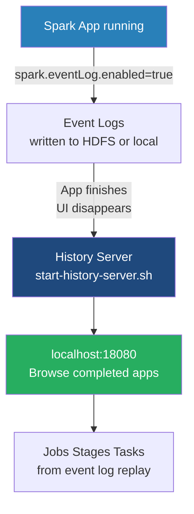

# The Spark History Server

**A standalone daemon that reconstructs the Spark Application Web UI for completed or crashed jobs using persisted event logs.**

## Why It Matters

By design, the Spark Application Web UI (typically found on port 4040) is served directly by the Driver program's JVM. When an application finishes executing—whether it succeeds, fails due to an error, or crashes due to an Out-Of-Memory exception—the Driver JVM terminates. Consequently, the Application UI vanishes immediately. This creates a massive problem for data engineers: how do you debug a batch job that ran at 2:00 AM and failed at 3:30 AM if the UI is gone? The Spark History Server solves this by reading JSON-formatted event logs generated during the application's runtime and reconstructing the exact UI retroactively. Without it, post-mortem performance tuning and failure analysis are virtually impossible.

## How It Works

To use the History Server, you must enable event logging within your Spark applications. This is a two-part process.

**1. Generating Event Logs**
You must instruct the Spark Driver to write internal Spark events (like TaskStart, TaskEnd, StageCompleted, EnvironmentUpdate) to a persistent storage system. This is done by setting `spark.eventLog.enabled=true` and specifying a directory via `spark.eventLog.dir`. The directory must be a globally accessible distributed file system (like HDFS, Amazon S3, or a shared NFS drive) so that regardless of which node the Driver runs on, it can write to this central location.

**2. Running the History Server**
The History Server is a separate daemon process provided by Spark. You start it using the `sbin/start-history-server.sh` script. You configure the server by pointing `spark.history.fs.logDirectory` to the exact same distributed directory where your applications are writing their event logs.
Once started, the History Server continually polls that directory. When it detects a new or updated event log, it parses the JSON events and rebuilds the state of the application in memory. It then exposes a Web UI (by default on port `18080`).

When a user visits the History Server UI, they see a list of all completed (and optionally, incomplete) applications. Clicking on an application ID opens a reconstructed version of the Application UI. It looks and functions exactly like the live UI on port 4040, displaying DAGs, executor metrics, shuffle statistics, and SQL query plans.

**Incomplete Applications**
The History Server can also track "incomplete" applications (jobs that are currently running). This is useful in `cluster` deploy mode, where finding the live UI port on a random worker node can be tedious. The History Server can act as a central hub to monitor both running and finished jobs.

## Flow Diagram



## Data Visualization

| Property | Default Value | Description |
| :--- | :--- | :--- |
| `spark.eventLog.enabled` | `false` | Must be set to `true` to generate logs. |
| `spark.eventLog.dir` | `file:///tmp/spark-events` | Where the Driver writes logs. Must be HDFS/S3 in a cluster. |
| `spark.history.fs.logDirectory`| `file:///tmp/spark-events` | Where the History Server reads logs from. Must match above. |
| `spark.history.ui.port` | `18080` | The port the History Server web interface binds to. |
| `spark.history.fs.cleaner.enabled`| `false` | Whether to automatically delete old event logs to save disk space. |

## Code Example

```bash
# 1. Configure spark-defaults.conf (applies to all jobs submitted)
# This file should exist on the machine where you run spark-submit AND
# on the machine running the History Server.
echo "spark.eventLog.enabled           true" >> $SPARK_HOME/conf/spark-defaults.conf
echo "spark.eventLog.dir               hdfs://namenode:8020/spark-logs" >> $SPARK_HOME/conf/spark-defaults.conf
echo "spark.history.fs.logDirectory    hdfs://namenode:8020/spark-logs" >> $SPARK_HOME/conf/spark-defaults.conf
echo "spark.history.fs.cleaner.enabled true" >> $SPARK_HOME/conf/spark-defaults.conf
echo "spark.history.fs.cleaner.maxAge  7d" >> $SPARK_HOME/conf/spark-defaults.conf

# 2. Create the HDFS directory
hdfs dfs -mkdir /spark-logs

# 3. Start the History Server daemon
$SPARK_HOME/sbin/start-history-server.sh

# 4. Submit an application. 
# It will automatically pick up the eventLog configurations.
./bin/spark-submit \
  --master spark://master:7077 \
  --deploy-mode cluster \
  --class com.example.MyApp \
  my-app.jar

# 5. Access the History Server
# Open a browser and navigate to http://<history-server-ip>:18080
```

## Common Pitfalls

*   **Local Filesystem in Clusters:** The most common mistake is leaving `spark.eventLog.dir` as a local `file:///` path. If the Driver runs on Worker Node 3 in `cluster` mode, it writes logs to Worker 3's local disk. The History Server running on the Master node cannot see those files. You must use a distributed filesystem (HDFS/S3).
*   **Missing Directory:** The directory specified in `spark.eventLog.dir` must exist before the application starts. Spark will not create it for you, and the application will crash on startup if it's missing.
*   **Disk Space Exhaustion:** Event logs for massive, long-running streaming applications can grow to hundreds of gigabytes. If `spark.history.fs.cleaner.enabled` is not turned on, your HDFS/S3 will fill up, eventually crashing the cluster.
*   **Memory Issues on History Server:** The History Server parses JSON logs into memory to serve the UI. If you have thousands of large event logs, the History Server JVM will experience Out-Of-Memory errors. You may need to increase `SPARK_DAEMON_MEMORY` prior to starting it.

## Key Takeaway

The Spark History Server is an essential operational tool that persists the ephemeral Application UI, transforming transient runtime metrics into persistent, analyzable data for post-execution debugging and optimization.


---

## 🎓 Deep Learning Questions

### Q1: Why Was This Concept Introduced?
Before the introduction of the Spark History Server, data engineers faced a major observability challenge. The standard Spark Application Web UI is served directly by the Driver's JVM and is only available while the application is running. Once a job finishes, whether successfully or due to a crash (like an Out-Of-Memory error), the Driver terminates and the UI vanishes instantly. 

This made debugging long-running night batch jobs practically impossible. If a job crashed at 3:00 AM, engineers waking up at 9:00 AM had no DAGs, executor metrics, or execution plans to analyze. The Spark History Server was introduced to decouple the Web UI from the application's lifecycle, allowing developers to perform post-mortem debugging and performance tuning by reviewing exactly what happened during the run.

### Q2: What Exactly Is This Concept and How Does It Work?
The Spark History Server is a standalone daemon process that retroactively reconstructs a Spark application's Web UI. 

**How it works:**
1. **Event Interception:** During execution, a Spark application emits internal events (e.g., `SparkListenerTaskStart`, `SparkListenerJobEnd`).
2. **Log Persistence:** If `spark.eventLog.enabled` is true, the Driver writes these events sequentially as JSON strings into a designated distributed storage location (HDFS, S3).
3. **Log Polling:** The History Server continuously polls this storage directory for new or updated log files.
4. **State Reconstruction:** When requested by a user, it parses the JSON file, rebuilds the internal state of the application in its own memory, and renders the familiar Spark Web UI on port 18080.

### Q3: Where Should This Concept Be Used?
The Spark History Server is an absolute necessity in virtually all production environments. 
- **Banking/Finance:** To audit daily regulatory reporting jobs and analyze why yesterday's ETL took 2 hours longer than normal.
- **E-Commerce (Amazon, Retail):** To perform root-cause analysis on Black Friday batch pipelines that failed due to data skew.
- **Data Platform Teams:** To monitor long-term trends in executor utilization across hundreds of applications to optimize cluster resource allocation.
It should be used whenever jobs are scheduled automatically (e.g., via Airflow or Oozie) rather than run interactively.

### Q4: Where Should This Concept NOT Be Used?
- **Real-Time Monitoring:** If you need to monitor a job *while* it is running, use the live UI on port 4040. The History Server can track incomplete jobs, but there is a lag due to polling and file writing delays.
- **Long-Running Structured Streaming:** Without proper log compaction, streaming apps running for months will generate terabytes of event logs. Parsing these will crash the History Server. You must configure rolling event logs (`spark.eventLog.rolling.enabled`) for such jobs.
- **Local Development:** When testing on your local laptop in `local[*]` mode, setting up a History Server is usually overkill unless you specifically want to study the DAG after completion.

### Q5: How Is This Concept Different from Hadoop?
| Aspect | Hadoop MapReduce | Apache Spark |
| :--- | :--- | :--- |
| **Architecture** | JobHistory Server | Spark History Server |
| **Performance** | Basic parsing of XML/text | High memory usage to reconstruct complex DAGs |
| **Processing Model** | Basic Map/Reduce phases | Complex Physical and Logical Query Plans (Catalyst) |
| **Memory Usage** | Relatively low footprint | High memory footprint in JVM |
| **Fault Tolerance** | Reads reliable HDFS files | Reads reliable HDFS/S3 JSON event logs |
| **Scalability** | Standard log aggregation | Supports rolling logs for continuous streaming apps |
| **Ease of Development**| N/A | Extremely useful for debugging distributed data flows |
| **Typical Use Cases** | Debugging long MapReduce jobs | Post-mortem root-cause analysis of Spark OOMs |
| **Advantages** | Simple and stable | Highly detailed (Shuffle metrics, task durations) |
| **Disadvantages** | Limited metric granularity | Can crash if event logs become massive |

### Q6: How Can This Concept Be Related to a Traditional RDBMS?
| Spark History Server Concept | Traditional RDBMS Equivalent | Explanation |
| :--- | :--- | :--- |
| **Event Logs** | Query Execution Logs / Audit Trails | Persisted records of what operations ran and when. |
| **Spark History Server UI** | Oracle AWR (Automatic Workload Repository) or SQL Server Query Store | A centralized dashboard to view historical execution plans and performance metrics. |
| **SQL Tab in UI** | `EXPLAIN ANALYZE` Output History | Shows the physical execution plan and the time taken at each step. |
| **Log Cleaner** | Log Rotation / Retention Policies | Prevents storage exhaustion by deleting old historical data. |

### Q7: What Happens Behind the Scenes?
```text
[Spark Application]
       |
       v (Internal Event Bus)
+--------------------+
| EventLogListener   |  --> Serializes SparkListener events to JSON
+--------------------+
       |
       v (Writes to HDFS/S3)
[ spark-application-123.lz4 ] 
       |
       v (Directory Polling)
+--------------------+
|  History Server    |  --> Reconstructs Application State in JVM Memory
|  (FsHistoryProvider)|
+--------------------+
       |
       v (Serves via Jetty Web Server)
[ HTTP /localhost:18080 ]
```
Behind the scenes, Spark uses an internal event bus. The `EventLogListener` subscribes to this bus. Every time a task starts or ends, the listener captures it and writes a JSON line to the log file (often compressed using LZ4 or Snappy). The History Server uses an `FsHistoryProvider` to scan the storage directory, checking for new files or size changes in existing files. When you click an application in the UI, the server reads the JSON file, replays the events to populate its internal data structures, and then serves the UI pages just like a live Spark Driver would.

### Q8: Performance Considerations, Best Practices, and Common Mistakes
| Category | Recommendation | Why It Matters |
| :--- | :--- | :--- |
| **Storage Cost** | Set `spark.eventLog.compress=true`. | Reduces HDFS/S3 storage costs and decreases I/O time when writing/reading logs. |
| **Storage Exhaustion** | Enable `spark.history.fs.cleaner.enabled` and set `maxAge`. | Prevents cluster crashes caused by running out of disk space due to accumulated event logs. |
| **Memory Limits** | Increase `SPARK_DAEMON_MEMORY` (e.g., to 4g or 8g). | Reconstructing massive DAGs with 100,000+ tasks takes heavy RAM. The History Server will OOM otherwise. |
| **Configuration** | Always use HDFS, S3, or NFS; never `file:///tmp`. | In a distributed cluster, the History Server must be able to read logs written by drivers running on *any* node. |

### Q9: Interview Questions

**Beginner**
1. **What is the default port for the Spark History Server?**
   - 18080.
2. **How do you enable event logging in a Spark application?**
   - By setting `spark.eventLog.enabled=true` and providing a valid `spark.eventLog.dir`.
3. **Why can't I just use the UI on port 4040 to debug a crashed job?**
   - Port 4040 is served by the Driver. If the job crashes, the Driver dies, and the UI is instantly terminated.

**Intermediate**
4. **My History Server is running, but it doesn't show any apps. What is the most likely cause?**
   - The `spark.eventLog.dir` configured in the application does not match the `spark.history.fs.logDirectory` configured for the History Server, or it's pointing to a local filesystem instead of HDFS/S3.
5. **How does Spark prevent event logs from filling up all available disk space?**
   - By configuring the History Server cleaner (`spark.history.fs.cleaner.enabled=true`) which deletes logs older than a specified duration.
6. **Can the History Server show jobs that are currently running?**
   - Yes, if configured to show incomplete applications, it polls the active log file as it's being written.

**Advanced**
7. **How does event log compression impact the History Server?**
   - While it saves disk space and network I/O, it increases CPU load on the History Server, which must decompress the files before parsing the JSON strings to rebuild the UI.
8. **Explain the challenge of using the History Server with long-running Structured Streaming applications.**
   - A streaming app running for months creates a single, massive event log file. Parsing this gigantic file will cause the History Server to run out of memory. This requires enabling rolling event logs.
9. **How does Spark reconstruct the DAG from a text file?**
   - The log file contains serialized `SparkListener` events. The History Server replays these events in order, passing them to standard Spark UI components that rebuild the internal state.

**Scenario-Based**
10. **A nightly batch job failed with an OOM error at 4 AM. Walk me through exactly how you would use the History Server to debug it.**
    - I would open the History Server, find the failed application, and navigate to the "Executors" tab to see which executor crashed. Then, I would check the "Stages" tab to identify the specific stage that failed. I would analyze the "Shuffle Read" metrics for data skew, and check the "SQL" tab to see if a specific broadcast join or Cartesian product caused the memory spike.
11. **You notice the History Server is taking 5 minutes to load an application's UI. How do you troubleshoot?**
    - I would check the size of the event log file. If it's gigabytes in size, the History Server's JVM is likely struggling to parse it. I would check GC logs and increase `SPARK_DAEMON_MEMORY` or implement log rolling to fix it.

### Q10: Complete Real-World Example

**Business Problem:** A retail company runs an automated nightly PySpark pipeline to calculate daily revenue. It usually takes 10 minutes but occasionally fails after 45 minutes. Because it runs at 2 AM, engineers are never awake to see the live UI.

**Sample Dataset:** `s3://data/sales/daily_transactions.parquet` containing billions of rows of checkout data.

**PySpark Code:**
```python
from pyspark.sql import SparkSession

# The History Server requires event logging to be enabled.
# In production, this is usually set in spark-defaults.conf, 
# but can be forced programmatically.
spark = SparkSession.builder \
    .appName("NightlyRevenueAggregation") \
    .config("spark.eventLog.enabled", "true") \
    .config("spark.eventLog.dir", "hdfs://namenode:8020/spark-logs") \
    .config("spark.eventLog.compress", "true") \
    .getOrCreate()

# Load dataset
df_sales = spark.read.parquet("hdfs://namenode:8020/data/sales_data")

# Aggregate revenue by store
revenue_df = df_sales.groupBy("store_id") \
    .sum("transaction_amount") \
    .withColumnRenamed("sum(transaction_amount)", "total_revenue")

# Write results
revenue_df.write.mode("overwrite").parquet("hdfs://namenode:8020/data/daily_revenue")

spark.stop()
```

**Step-by-Step Execution Walkthrough:**
1. The script is triggered by Airflow at 2:00 AM.
2. Spark initializes. Because `spark.eventLog.enabled` is true, an `EventLogListener` starts writing a compressed `.lz4` file to `hdfs://namenode:8020/spark-logs`.
3. The job processes the data, but encounters massive data skew on a specific `store_id`, causing an OOM crash at 2:45 AM. The Driver dies.
4. At 9:00 AM, the engineer logs into the History Server UI at `http://history-node:18080`.
5. The History Server has already found the `.lz4` file in HDFS, decompressed it, and rebuilt the failed application's state.
6. The engineer views the DAG, identifies the skewed task in the final stage, and modifies the code to handle the skew.

**Expected Output:**
No console output. The output is a reconstructed Spark Application UI populated with Historical Execution Data.

**Performance Notes:**
Compressing the event logs drastically reduced the space consumed in HDFS from 10 GB to 1.5 GB.

**When this approach is best:**
This approach is strictly for all production workloads where you are not actively babysitting the job execution.

### 💡 Key Takeaways
- The Spark History Server makes post-mortem debugging possible by reconstructing the Web UI from persisted JSON event logs.
- It requires `spark.eventLog.enabled=true` and a globally accessible storage path (HDFS/S3).
- It is an independent daemon process (`start-history-server.sh`) separate from your Spark applications.
- Always enable log compression and the log cleaner to prevent storage exhaustion.
- The History Server requires substantial memory (`SPARK_DAEMON_MEMORY`) to reconstruct complex DAGs from large event logs.

### ⚠️ Common Misconceptions
- **"The History Server runs on port 4040."** No, port 4040 is the live Driver UI. The History Server runs on 18080 by default.
- **"Spark automatically deletes old logs."** It does not, unless you explicitly set `spark.history.fs.cleaner.enabled=true`.
- **"It can monitor real-time performance better than the live UI."** False; there is a slight polling delay when viewing running apps in the History Server compared to the live port 4040.

### 🔗 Related Spark Concepts
- Spark Web UI (Port 4040)
- Spark Listeners (`SparkListener`)
- Spark Configurations (`spark-defaults.conf`)
- Structured Streaming (Rolling Event Logs)

### 📚 References for Further Reading
- Apache Spark Official Documentation: Monitoring and Instrumentation
- Learning Spark (O'Reilly)
- Spark: The Definitive Guide (O'Reilly)
