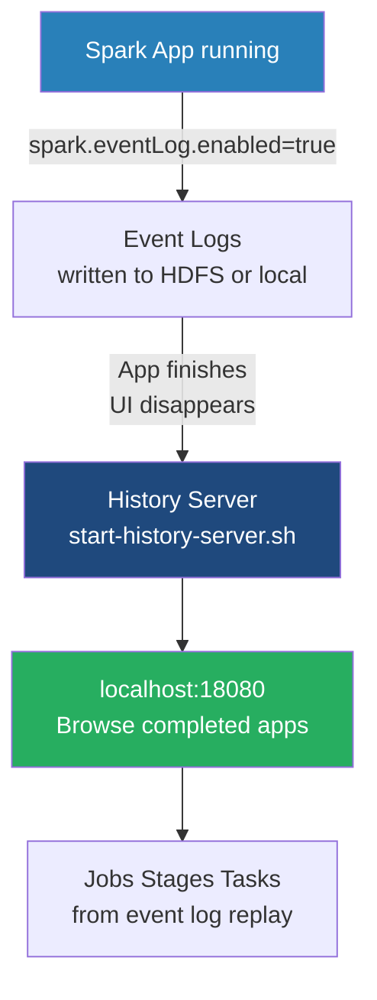

# The Spark History Server

**A standalone daemon that reconstructs the Spark Application Web UI for completed or crashed jobs using persisted event logs.**

## Why It Matters

By design, the Spark Application Web UI (typically found on port 4040) is served directly by the Driver program's JVM. When an application finishes executing—whether it succeeds, fails due to an error, or crashes due to an Out-Of-Memory exception—the Driver JVM terminates. Consequently, the Application UI vanishes immediately. This creates a massive problem for data engineers: how do you debug a batch job that ran at 2:00 AM and failed at 3:30 AM if the UI is gone? The Spark History Server solves this by reading JSON-formatted event logs generated during the application's runtime and reconstructing the exact UI retroactively. Without it, post-mortem performance tuning and failure analysis are virtually impossible.

## How It Works

To use the History Server, you must enable event logging within your Spark applications. This is a two-part process.

**1. Generating Event Logs**
You must instruct the Spark Driver to write internal Spark events (like TaskStart, TaskEnd, StageCompleted, EnvironmentUpdate) to a persistent storage system. This is done by setting `spark.eventLog.enabled=true` and specifying a directory via `spark.eventLog.dir`. The directory must be a globally accessible distributed file system (like HDFS, Amazon S3, or a shared NFS drive) so that regardless of which node the Driver runs on, it can write to this central location.

**2. Running the History Server**
The History Server is a separate daemon process provided by Spark. You start it using the `sbin/start-history-server.sh` script. You configure the server by pointing `spark.history.fs.logDirectory` to the exact same distributed directory where your applications are writing their event logs.
Once started, the History Server continually polls that directory. When it detects a new or updated event log, it parses the JSON events and rebuilds the state of the application in memory. It then exposes a Web UI (by default on port `18080`).

When a user visits the History Server UI, they see a list of all completed (and optionally, incomplete) applications. Clicking on an application ID opens a reconstructed version of the Application UI. It looks and functions exactly like the live UI on port 4040, displaying DAGs, executor metrics, shuffle statistics, and SQL query plans.

**Incomplete Applications**
The History Server can also track "incomplete" applications (jobs that are currently running). This is useful in `cluster` deploy mode, where finding the live UI port on a random worker node can be tedious. The History Server can act as a central hub to monitor both running and finished jobs.

## Flow Diagram



## Data Visualization

| Property | Default Value | Description |
| :--- | :--- | :--- |
| `spark.eventLog.enabled` | `false` | Must be set to `true` to generate logs. |
| `spark.eventLog.dir` | `file:///tmp/spark-events` | Where the Driver writes logs. Must be HDFS/S3 in a cluster. |
| `spark.history.fs.logDirectory`| `file:///tmp/spark-events` | Where the History Server reads logs from. Must match above. |
| `spark.history.ui.port` | `18080` | The port the History Server web interface binds to. |
| `spark.history.fs.cleaner.enabled`| `false` | Whether to automatically delete old event logs to save disk space. |

## Code Example

```bash
# 1. Configure spark-defaults.conf (applies to all jobs submitted)
# This file should exist on the machine where you run spark-submit AND
# on the machine running the History Server.
echo "spark.eventLog.enabled           true" >> $SPARK_HOME/conf/spark-defaults.conf
echo "spark.eventLog.dir               hdfs://namenode:8020/spark-logs" >> $SPARK_HOME/conf/spark-defaults.conf
echo "spark.history.fs.logDirectory    hdfs://namenode:8020/spark-logs" >> $SPARK_HOME/conf/spark-defaults.conf
echo "spark.history.fs.cleaner.enabled true" >> $SPARK_HOME/conf/spark-defaults.conf
echo "spark.history.fs.cleaner.maxAge  7d" >> $SPARK_HOME/conf/spark-defaults.conf

# 2. Create the HDFS directory
hdfs dfs -mkdir /spark-logs

# 3. Start the History Server daemon
$SPARK_HOME/sbin/start-history-server.sh

# 4. Submit an application. 
# It will automatically pick up the eventLog configurations.
./bin/spark-submit \
  --master spark://master:7077 \
  --deploy-mode cluster \
  --class com.example.MyApp \
  my-app.jar

# 5. Access the History Server
# Open a browser and navigate to http://<history-server-ip>:18080
```

## Common Pitfalls

*   **Local Filesystem in Clusters:** The most common mistake is leaving `spark.eventLog.dir` as a local `file:///` path. If the Driver runs on Worker Node 3 in `cluster` mode, it writes logs to Worker 3's local disk. The History Server running on the Master node cannot see those files. You must use a distributed filesystem (HDFS/S3).
*   **Missing Directory:** The directory specified in `spark.eventLog.dir` must exist before the application starts. Spark will not create it for you, and the application will crash on startup if it's missing.
*   **Disk Space Exhaustion:** Event logs for massive, long-running streaming applications can grow to hundreds of gigabytes. If `spark.history.fs.cleaner.enabled` is not turned on, your HDFS/S3 will fill up, eventually crashing the cluster.
*   **Memory Issues on History Server:** The History Server parses JSON logs into memory to serve the UI. If you have thousands of large event logs, the History Server JVM will experience Out-Of-Memory errors. You may need to increase `SPARK_DAEMON_MEMORY` prior to starting it.

## Key Takeaway

The Spark History Server is an essential operational tool that persists the ephemeral Application UI, transforming transient runtime metrics into persistent, analyzable data for post-execution debugging and optimization.
