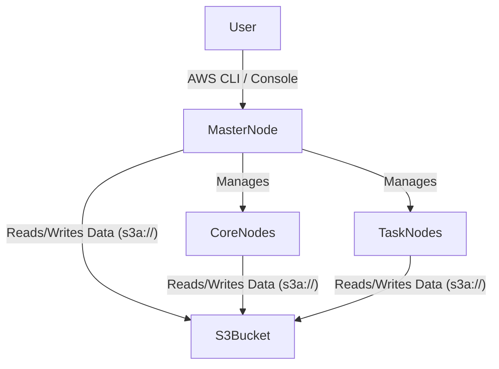

# Amazon EC2 Deployment

**Deploying Spark on cloud infrastructure using manual EC2 provisioning or managed services like Amazon EMR.**

## Why It Matters

While running a Spark Standalone cluster on bare-metal hardware or local virtual machines is excellent for learning, modern data engineering predominantly takes place in the cloud. Cloud environments provide elasticity—the ability to spin up a 100-node cluster in minutes, process a massive dataset, and shut it down to stop billing. Amazon Web Services (AWS) is the most popular cloud provider. Understanding how to deploy Spark on AWS Elastic Compute Cloud (EC2), deal with cloud networking (Security Groups), and leverage managed Hadoop ecosystems like Elastic MapReduce (EMR) is a mandatory skill for taking Spark applications into production at scale.

## How It Works

Deploying Spark to AWS generally falls into two categories: Self-Managed EC2 Clusters and Fully Managed Services (EMR).

**1. Self-Managed EC2 Deployments**
Historically, Spark provided a script called `spark-ec2` to automatically provision EC2 instances, configure SSH, and start a Standalone cluster. However, this tool is now deprecated. Today, managing your own EC2 cluster involves:
*   **Provisioning:** Launching an AMI (Amazon Machine Image) via the AWS Console or Terraform. You typically need one instance for the Master and multiple for Workers.
*   **Networking:** Configuring Security Groups (virtual firewalls). You must open port `22` (SSH) for access, port `7077` (Master), `8080`/`8081` (Web UIs), and crucially, allow all internal TCP traffic between the nodes so Drivers and Executors can communicate.
*   **Configuration:** Manually installing Java, downloading Spark binaries, and configuring the `conf/workers` file and `spark-env.sh`.

**2. Amazon EMR (Elastic MapReduce)**
Because managing raw EC2 clusters is tedious, AWS provides EMR. EMR is a managed cluster platform that simplifies running big data frameworks, including Spark, Hadoop, and Presto.
*   **Provisioning:** You specify the instance types, the number of nodes, and select "Spark" from the software configuration menu. AWS handles all installation, networking, and daemon management.
*   **Storage (S3):** Unlike on-premise clusters that rely heavily on HDFS, EMR clusters use Amazon S3 as the primary data lake via the `s3a://` file system prefix. S3 separates compute from storage, allowing you to terminate the EMR cluster without losing your data.
*   **Cost Optimization:** EMR allows you to use Spot Instances for Worker nodes. Spot instances are spare AWS compute capacity offered at steep discounts (up to 90%). Because Spark is resilient to node failures (it just recomputes lost partitions), using Spot instances for Executors is highly cost-effective.

## Flow Diagram



## Data Visualization

| Deployment Model | Setup Effort | Maintenance | Primary Storage | Cost Efficiency | Best For |
| :--- | :--- | :--- | :--- | :--- | :--- |
| **Manual EC2 (Standalone)**| High | High | EBS / Local Disk | Low (Always running) | Custom security/OS requirements |
| **Amazon EMR** | Low | Low | Amazon S3 | High (Spot Instances, Auto-scaling)| Standard production data pipelines |
| **AWS Glue** | None | None | Amazon S3 | Varies (Serverless premium) | Fully serverless ETL |

## Code Example

```bash
# Example 1: Creating an EMR Cluster with Spark using the AWS CLI
# This spins up 1 Master node and 2 Core nodes using m5.xlarge instances.
aws emr create-cluster \
    --name "Spark-Data-Pipeline" \
    --release-label emr-6.5.0 \
    --applications Name=Spark Name=Hadoop \
    --ec2-attributes KeyName=my-aws-ssh-key,InstanceProfile=EMR_EC2_DefaultRole \
    --instance-type m5.xlarge \
    --instance-count 3 \
    --use-default-roles \
    --region us-east-1

# Example 2: Submitting a Spark Job via EMR Step
# EMR allows you to submit jobs as "Steps" without needing to SSH into the master node.
aws emr add-steps \
    --cluster-id j-2AXXXXXX \
    --steps Type=Spark,Name="AnalyticsJob",ActionOnFailure=CONTINUE,Args=[--class,com.example.Main,--deploy-mode,cluster,s3://my-bucket/jars/analytics.jar,s3://my-bucket/input/,s3://my-bucket/output/]

# Example 3: PySpark reading from S3
```
```python
# Within your Spark code, reading from S3 is identical to reading from HDFS,
# using the s3a:// URI scheme provided by the Hadoop-AWS module.
from pyspark.sql import SparkSession

spark = SparkSession.builder.appName("S3-Analytics").getOrCreate()

# Read data directly from S3
df = spark.read.parquet("s3a://company-datalake/raw/sales/2023/")

# Perform transformations
aggregated = df.groupBy("region").sum("revenue")

# Write results back to S3
aggregated.write.mode("overwrite").csv("s3a://company-datalake/processed/sales_summary/")
```

## Common Pitfalls

*   **Security Group Misconfiguration:** When setting up manual EC2 clusters, engineers often only open port 7077. Spark Executors and Drivers communicate over randomly assigned ephemeral ports. You must allow all TCP traffic *internally* within the Security Group attached to the nodes.
*   **S3 Eventual Consistency (Historically):** While modern S3 provides read-after-write consistency, historically, writing temporary files to S3 via Spark caused `FileNotFoundExceptions`. Understanding how the S3A committer works (e.g., configuring `spark.hadoop.fs.s3a.committer.name=magic`) is still critical for performance on EMR.
*   **Using Spot Instances for the Master:** Never use a Spot instance for the EMR Master Node. If AWS reclaims the instance, the entire cluster dies, and all running applications fail immediately.
*   **Leaving Clusters Running:** The most common mistake in cloud deployments is forgetting to terminate the cluster. EMR supports auto-termination (Transient Clusters) where the cluster terminates itself as soon as the Spark job finishes.

## Key Takeaway

Deploying Spark on AWS transitions the architectural focus from hardware management to cloud orchestration; leveraging Amazon EMR with S3 storage and Spot instances provides a scalable, cost-effective, and fully managed environment for production workloads.
