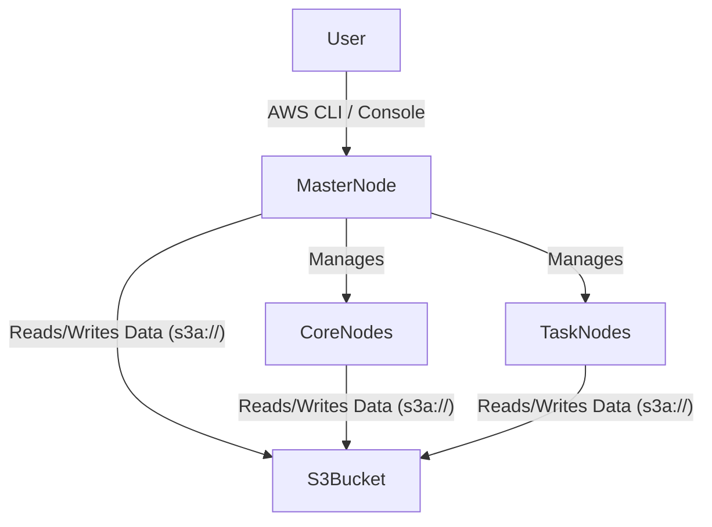

# Amazon EC2 Deployment

**Deploying Spark on cloud infrastructure using manual EC2 provisioning or managed services like Amazon EMR.**

## Why It Matters

While running a Spark Standalone cluster on bare-metal hardware or local virtual machines is excellent for learning, modern data engineering predominantly takes place in the cloud. Cloud environments provide elasticity—the ability to spin up a 100-node cluster in minutes, process a massive dataset, and shut it down to stop billing. Amazon Web Services (AWS) is the most popular cloud provider. Understanding how to deploy Spark on AWS Elastic Compute Cloud (EC2), deal with cloud networking (Security Groups), and leverage managed Hadoop ecosystems like Elastic MapReduce (EMR) is a mandatory skill for taking Spark applications into production at scale.

## How It Works

Deploying Spark to AWS generally falls into two categories: Self-Managed EC2 Clusters and Fully Managed Services (EMR).

**1. Self-Managed EC2 Deployments**
Historically, Spark provided a script called `spark-ec2` to automatically provision EC2 instances, configure SSH, and start a Standalone cluster. However, this tool is now deprecated. Today, managing your own EC2 cluster involves:
*   **Provisioning:** Launching an AMI (Amazon Machine Image) via the AWS Console or Terraform. You typically need one instance for the Master and multiple for Workers.
*   **Networking:** Configuring Security Groups (virtual firewalls). You must open port `22` (SSH) for access, port `7077` (Master), `8080`/`8081` (Web UIs), and crucially, allow all internal TCP traffic between the nodes so Drivers and Executors can communicate.
*   **Configuration:** Manually installing Java, downloading Spark binaries, and configuring the `conf/workers` file and `spark-env.sh`.

**2. Amazon EMR (Elastic MapReduce)**
Because managing raw EC2 clusters is tedious, AWS provides EMR. EMR is a managed cluster platform that simplifies running big data frameworks, including Spark, Hadoop, and Presto.
*   **Provisioning:** You specify the instance types, the number of nodes, and select "Spark" from the software configuration menu. AWS handles all installation, networking, and daemon management.
*   **Storage (S3):** Unlike on-premise clusters that rely heavily on HDFS, EMR clusters use Amazon S3 as the primary data lake via the `s3a://` file system prefix. S3 separates compute from storage, allowing you to terminate the EMR cluster without losing your data.
*   **Cost Optimization:** EMR allows you to use Spot Instances for Worker nodes. Spot instances are spare AWS compute capacity offered at steep discounts (up to 90%). Because Spark is resilient to node failures (it just recomputes lost partitions), using Spot instances for Executors is highly cost-effective.

## Flow Diagram



## Data Visualization

| Deployment Model | Setup Effort | Maintenance | Primary Storage | Cost Efficiency | Best For |
| :--- | :--- | :--- | :--- | :--- | :--- |
| **Manual EC2 (Standalone)**| High | High | EBS / Local Disk | Low (Always running) | Custom security/OS requirements |
| **Amazon EMR** | Low | Low | Amazon S3 | High (Spot Instances, Auto-scaling)| Standard production data pipelines |
| **AWS Glue** | None | None | Amazon S3 | Varies (Serverless premium) | Fully serverless ETL |

## Code Example

```bash
# Example 1: Creating an EMR Cluster with Spark using the AWS CLI
# This spins up 1 Master node and 2 Core nodes using m5.xlarge instances.
aws emr create-cluster \
    --name "Spark-Data-Pipeline" \
    --release-label emr-6.5.0 \
    --applications Name=Spark Name=Hadoop \
    --ec2-attributes KeyName=my-aws-ssh-key,InstanceProfile=EMR_EC2_DefaultRole \
    --instance-type m5.xlarge \
    --instance-count 3 \
    --use-default-roles \
    --region us-east-1

# Example 2: Submitting a Spark Job via EMR Step
# EMR allows you to submit jobs as "Steps" without needing to SSH into the master node.
aws emr add-steps \
    --cluster-id j-2AXXXXXX \
    --steps Type=Spark,Name="AnalyticsJob",ActionOnFailure=CONTINUE,Args=[--class,com.example.Main,--deploy-mode,cluster,s3://my-bucket/jars/analytics.jar,s3://my-bucket/input/,s3://my-bucket/output/]

# Example 3: PySpark reading from S3
```
```python
# Within your Spark code, reading from S3 is identical to reading from HDFS,
# using the s3a:// URI scheme provided by the Hadoop-AWS module.
from pyspark.sql import SparkSession

spark = SparkSession.builder.appName("S3-Analytics").getOrCreate()

# Read data directly from S3
df = spark.read.parquet("s3a://company-datalake/raw/sales/2023/")

# Perform transformations
aggregated = df.groupBy("region").sum("revenue")

# Write results back to S3
aggregated.write.mode("overwrite").csv("s3a://company-datalake/processed/sales_summary/")
```

## Common Pitfalls

*   **Security Group Misconfiguration:** When setting up manual EC2 clusters, engineers often only open port 7077. Spark Executors and Drivers communicate over randomly assigned ephemeral ports. You must allow all TCP traffic *internally* within the Security Group attached to the nodes.
*   **S3 Eventual Consistency (Historically):** While modern S3 provides read-after-write consistency, historically, writing temporary files to S3 via Spark caused `FileNotFoundExceptions`. Understanding how the S3A committer works (e.g., configuring `spark.hadoop.fs.s3a.committer.name=magic`) is still critical for performance on EMR.
*   **Using Spot Instances for the Master:** Never use a Spot instance for the EMR Master Node. If AWS reclaims the instance, the entire cluster dies, and all running applications fail immediately.
*   **Leaving Clusters Running:** The most common mistake in cloud deployments is forgetting to terminate the cluster. EMR supports auto-termination (Transient Clusters) where the cluster terminates itself as soon as the Spark job finishes.

## Key Takeaway

Deploying Spark on AWS transitions the architectural focus from hardware management to cloud orchestration; leveraging Amazon EMR with S3 storage and Spot instances provides a scalable, cost-effective, and fully managed environment for production workloads.


---

## 🎓 Deep Learning Questions

### Q1: Why Was This Concept Introduced?
Before cloud computing, big data systems required expensive on-premise data centers. Companies had to buy physical servers, configure networking, and install software manually. If the workload suddenly increased, buying and setting up new hardware took weeks or months. This created a massive bottleneck for scaling applications. 
Spark introduced deployment capabilities for Amazon EC2 to overcome these limitations. By deploying Spark on AWS (either manually or via Amazon EMR), organizations gain elasticity—the ability to provision hundreds of nodes in minutes and shut them down when finished. It eliminates upfront capital expenditure and replaces it with a pay-as-you-go model. Furthermore, separating compute (EC2/EMR) from storage (Amazon S3) allows clusters to be ephemeral, meaning data is safe even if the cluster is terminated.

### Q2: What Exactly Is This Concept and How Does It Work?
Deploying Spark on Amazon EC2 means running your Spark Master and Worker daemons on virtual servers hosted by AWS. 
When doing this manually, you launch EC2 instances, configure security groups (firewalls) to allow internal communication, install Java/Spark, and manually edit `spark-env.sh` and `workers` files to link the nodes together. The Master instance manages cluster resources, while Worker instances execute the actual data processing tasks.
Alternatively, Amazon EMR automates this. You request a cluster via the AWS console or CLI, and AWS automatically provisions the instances, installs Hadoop and Spark, configures the network, and optimizes the connections to Amazon S3. The Spark Driver runs on the EMR Master node, requesting resources from the cluster manager (usually YARN in EMR, but can be Standalone), and the Executors run on Core/Task nodes.

### Q3: Where Should This Concept Be Used?
Deploying Spark on EC2/EMR is ideal for dynamic, large-scale data processing workloads in the cloud.
- **Retail (e.g., Amazon):** Processing daily sales data in an ephemeral cluster that spins up at midnight, runs ETL jobs to build dashboards, and terminates to save costs.
- **Streaming Media (e.g., Netflix):** Using large, long-running EMR clusters to ingest and analyze user viewing habits for real-time recommendation engines.
- **Healthcare & Bioinformatics:** Spinning up massive compute clusters for short bursts to sequence DNA or analyze medical imaging datasets, using Spot instances to keep costs low.
- **Banking:** Fraud detection batch jobs that require immense compute power for a few hours a day, reading historical transaction data directly from an S3 data lake.

### Q4: Where Should This Concept NOT Be Used?
- **Strict On-Premise Data Regulations:** If government compliance (like certain defense or healthcare regulations) mandates that data cannot leave physical premises, public cloud deployment is not an option.
- **Continuous Small Workloads:** If you are running small, predictable jobs 24/7, an always-on EC2 cluster might be more expensive than maintaining a small on-premise server.
- **Fully Serverless Architectures:** If your organization wants zero infrastructure management, AWS Glue (a serverless Spark service) is better than managing an EMR or EC2 cluster.
- **Single-Node Analytics:** For datasets under 50GB that can fit in memory, spinning up an EMR cluster is overkill; a single large EC2 instance running Pandas or local Spark is faster and cheaper.

### Q5: How Is This Concept Different from Hadoop?
| Aspect | Hadoop MapReduce (On-Prem) | Apache Spark on Amazon EC2/EMR |
| :--- | :--- | :--- |
| **Architecture** | Relies heavily on co-located HDFS storage. | Separates compute (EC2) from storage (S3). |
| **Performance** | High disk I/O, slower processing. | In-memory processing, significantly faster. |
| **Processing Model** | Map and Reduce steps strictly on disk. | DAG execution, combining multiple steps in memory. |
| **Memory Usage** | Minimal caching. | Aggressive in-memory caching (RDDs/DataFrames). |
| **Fault Tolerance** | Replicates data blocks in HDFS. | Recomputes lost partitions; highly resilient to Spot instance loss. |
| **Scalability** | Hard to scale physically. | Elastic; scale up/down via AWS API in minutes. |
| **Ease of Development** | Complex Java APIs. | Rich APIs in Python, Scala, Java, and SQL. |
| **Typical Use Cases** | Legacy batch processing. | Modern ETL, Machine Learning, real-time analytics. |
| **Advantages** | Deep integration with legacy on-prem systems. | Ephemeral clusters, cost optimization, massive scale. |
| **Disadvantages** | Rigid, expensive to maintain hardware. | Cloud lock-in, complex networking/security groups. |

### Q6: How Can This Concept Be Related to a Traditional RDBMS?
| Spark on EC2 Concept | Traditional RDBMS Equivalent | Explanation |
| :--- | :--- | :--- |
| **Amazon S3 (Data Lake)** | Database Storage Engine / Disks | Where the raw and processed data persistently resides. |
| **EC2 / EMR Master Node** | Query Optimizer / Coordinator | Plans the query execution and manages resources. |
| **EC2 / EMR Worker Nodes** | CPU Cores processing parallel queries | The actual hardware executing the computations. |
| **Security Groups** | Database Firewalls / `pg_hba.conf` | Controls who can access the cluster and internal node communication. |
| **Transient Cluster** | Spinning up a DB replica for a report | Creating compute capacity just for a specific task and tearing it down. |

### Q7: What Happens Behind the Scenes?
When a Spark job is submitted to an EC2/EMR cluster:
1. **Request:** The user submits a job to the Master Node via `spark-submit`.
2. **Allocation:** The Cluster Manager allocates Executors on the Worker (Core/Task) EC2 instances.
3. **Data Read:** Executors pull data directly from Amazon S3 (`s3a://`) into memory.
4. **Execution:** The Driver sends tasks to the Executors. They perform transformations (map, filter) in memory.
5. **Shuffle:** If wide transformations occur, Executors exchange data over the internal AWS network.
6. **Write:** Results are pushed back to Amazon S3.
7. **Termination (Optional):** If configured as a transient cluster, AWS automatically terminates all EC2 instances to stop billing.

```text
[AWS Cloud Environment]
       |
       v
+------------------+         [Security Group: Allow TCP All Internal]
|  Master Node     | ----------------------+
| (Spark Driver)   |                       |
+------------------+                       v
       |                          +------------------+
       | Orchestrates             |  Worker Node 1   | ---> Reads/Writes
       |                          |  (Executor)      |      (s3a://bucket)
       v                          +------------------+           |
+------------------+                       |                     v
| Cluster Manager  | ----------------------+               [ Amazon S3 ]
| (Standalone/YARN)|                       v                     ^
+------------------+              +------------------+           |
                                  |  Worker Node 2   | ---> Reads/Writes
                                  |  (Executor)      |      (s3a://bucket)
                                  +------------------+
```

### Q8: Performance Considerations, Best Practices, and Common Mistakes
| Category | Recommendation | Why It Matters |
| :--- | :--- | :--- |
| **Cost Optimization** | Use Spot Instances for Task nodes. | Saves up to 90% on compute costs. Spark recovers automatically if instances are reclaimed. |
| **Storage** | Use Amazon S3, not HDFS. | Decouples storage from compute, allowing clusters to be ephemeral and saving persistent storage costs. |
| **Networking** | Use VPC Endpoints for S3. | Keeps data traffic within the AWS network, improving read/write speed and reducing data transfer costs. |
| **Data Format** | Store data in Parquet or ORC on S3. | Columnar formats minimize the amount of data transferred over the network from S3 to EC2. |
| **Common Mistake** | Spot Instance for Master node. | If the Master is reclaimed, the entire cluster fails and jobs are lost. Always use On-Demand for Master. |
| **Common Mistake** | Forgetting to terminate. | Leaving idle EC2 instances running generates massive unnecessary AWS bills. |

### Q9: Interview Questions
#### Beginner
1. **What is the primary advantage of deploying Spark on cloud services like Amazon EC2?** 
   Elasticity and cost-efficiency. You can spin up large clusters on demand and pay only for what you use, rather than maintaining expensive on-premise hardware.
2. **What AWS storage service is typically used as the data lake for EMR Spark clusters?** 
   Amazon S3 (Simple Storage Service), usually accessed via the `s3a://` prefix.
3. **What is a transient cluster?** 
   A cluster configured to automatically terminate as soon as its designated job finishes, ensuring you don't pay for idle compute time.

#### Intermediate
4. **Why is it safe to use AWS Spot Instances for Spark Worker nodes?** 
   Spark is fault-tolerant by design. If a Spot Instance is reclaimed by AWS, the Cluster Manager detects the lost Executor and assigns the failed tasks to other remaining nodes to recompute the lost data.
5. **How does S3 storage differ from HDFS in a Spark deployment?** 
   HDFS stores data on the same physical disks as the compute nodes (data locality). S3 is an external object store accessed over the network. S3 enables the separation of compute and storage.
6. **What security group configurations are critical for a standalone Spark cluster on EC2?** 
   Besides opening port 22 (SSH) for the user, you must open all internal TCP ports between the nodes in the cluster so Drivers, Masters, and Executors can communicate freely.

#### Advanced
7. **Explain the challenge of "Eventual Consistency" when writing from Spark to S3 and how it is solved.** 
   Historically, S3 was eventually consistent, causing job failures when Spark renamed temporary files (it couldn't find them instantly). This is solved using optimized committer algorithms (like the Magic S3A committer or EMRFS optimized committer) which handle multi-part uploads safely without reliance on renaming.
8. **If your PySpark job on EMR is failing with `java.net.SocketTimeoutException` while reading from S3, what is likely wrong?** 
   This usually indicates network bottlenecking, throttling, or a misconfigured VPC NAT Gateway. Increasing S3 maximum connections or using a VPC Gateway Endpoint for S3 can resolve this.
9. **How would you architect a Spark streaming application on AWS?** 
   I would use Amazon MSK (Managed Kafka) or Kinesis as the source, read the stream using a long-running EMR cluster (with On-Demand core nodes for stability), and write the aggregated outputs to S3 or DynamoDB.

#### Scenario-Based
10. **Your manager complains that the monthly AWS bill for the Spark cluster is $50,000. How do you reduce it?** 
    First, check if clusters are left running idle. Implement transient clusters. Second, switch Worker (Task) nodes to use Spot Instances instead of On-Demand. Finally, ensure data on S3 is in an optimized format (Parquet) to reduce I/O time, allowing jobs to finish faster.
11. **You are manually setting up a Spark Standalone cluster on 5 EC2 instances. The Master starts, but Workers cannot register. What is the issue?** 
    It is almost certainly a Security Group issue. The Worker nodes are trying to reach the Master on port 7077 (or a random ephemeral port), but the AWS Security Group firewall is blocking the internal traffic. I would edit the Security Group to allow "All TCP" where the source is the Security Group itself.

### Q10: Complete Real-World Example
**Business Problem:** 
A retail company, "CloudMart," needs to process its daily transaction logs stored in Amazon S3 to calculate total daily revenue per store. They want to spin up a Spark cluster on EMR, process the data, and shut it down.

**Sample Dataset:** 
A Parquet dataset in S3 (`s3a://cloudmart-data/raw/transactions/2023-10-01/`) containing: `transaction_id`, `store_id`, `amount`, `timestamp`.

**PySpark Code:**
```python
# S3_analytics.py
from pyspark.sql import SparkSession
from pyspark.sql.functions import sum, col

def process_daily_sales():
    # Initialize SparkSession on EMR
    # Note: AWS EMR automatically configures the Hadoop S3A file system
    spark = SparkSession.builder \
        .appName("CloudMart-Daily-Sales") \
        .getOrCreate()

    # 1. Read raw transaction data from Amazon S3
    print("Reading data from S3...")
    input_path = "s3a://cloudmart-data/raw/transactions/2023-10-01/"
    df = spark.read.parquet(input_path)

    # 2. Perform Transformations: Group by store_id and sum the amount
    print("Aggregating sales data...")
    daily_sales = df.groupBy("store_id") \
        .agg(sum("amount").alias("total_revenue")) \
        .orderBy(col("total_revenue").desc())

    # 3. Write processed results back to S3
    output_path = "s3a://cloudmart-data/processed/daily_sales/2023-10-01/"
    print(f"Writing results to {output_path}...")
    
    # Use overwrite mode to safely handle reruns
    daily_sales.write.mode("overwrite").parquet(output_path)

    print("Job completed successfully.")
    spark.stop()

if __name__ == "__main__":
    process_daily_sales()
```

**Step-by-step Execution Walkthrough:**
1. The DevOps engineer uses the AWS CLI to launch an EMR cluster as a "Step" execution, pointing to this Python file in S3.
2. EMR provisions the EC2 instances, installs Spark, and starts the job.
3. Spark reads the Parquet partitions directly from the S3 bucket into the distributed memory of the EC2 Worker nodes.
4. A shuffle occurs across the internal AWS network as data is grouped by `store_id`.
5. The executors write the final aggregated data back to S3.
6. Because it's a Step execution with auto-terminate enabled, AWS shuts down all EC2 instances once the script completes.

**Expected Output:**
In the terminal/logs:
```text
Reading data from S3...
Aggregating sales data...
Writing results to s3a://cloudmart-data/processed/daily_sales/2023-10-01/...
Job completed successfully.
```
In S3, new `.parquet` files will appear in the output path containing the aggregated `store_id` and `total_revenue`.

**Performance Notes:**
Because the data is already in Parquet, reading from S3 is highly efficient. Network latency is minimized if the EMR cluster and S3 bucket are in the same AWS Region.

**When this approach is best:**
This approach is best for heavy, scheduled batch ETL processes where you need massive computing power for a short duration and want to optimize costs by only paying for the execution time.

### 💡 Key Takeaways
- Cloud deployments shift focus from hardware maintenance to workflow orchestration and cost management.
- Amazon EMR simplifies Spark deployments by handling provisioning, networking, and Hadoop ecosystem configurations automatically.
- Separating compute (EC2) from storage (S3) allows clusters to be ephemeral, turning them on and off as needed.
- AWS Spot Instances are perfect for Spark Worker nodes due to Spark's built-in fault tolerance.
- Security Group configuration is the most common hurdle when managing manual EC2 Spark clusters.

### ⚠️ Common Misconceptions
- **"Spark needs HDFS to run fast."** False. S3 with optimized committers and columnar formats (Parquet) is heavily used in modern Spark and performs exceptionally well.
- **"The Master node does the heavy processing."** False. The Master only coordinates resources; the Worker nodes (Executors) process the data.
- **"You should use Spot instances for the whole cluster to save money."** False. Never put the Master node on a Spot instance, or you risk losing the entire job instantly.

### 🔗 Related Spark Concepts
- Spark Standalone Cluster Architecture
- Spark Web UI and History Server
- Resilient Distributed Datasets (RDDs) and Fault Tolerance
- Cluster Managers (YARN vs. Standalone)

### 📚 References for Further Reading
- Apache Spark Official Documentation
- Learning Spark (O'Reilly)
- Spark: The Definitive Guide (O'Reilly)
