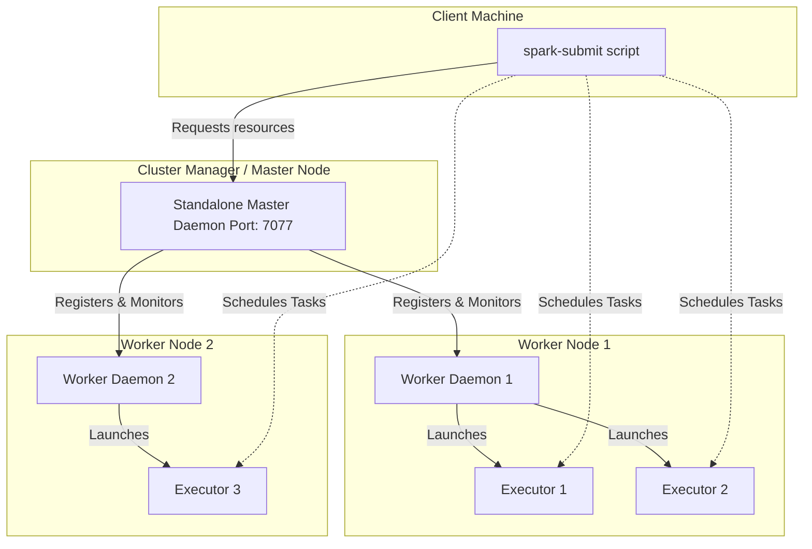

# Chapter 11: Running on a Spark Standalone Cluster

**A comprehensive guide to deploying, managing, and monitoring Apache Spark applications natively without external resource managers.**

## Why It Matters

Running Apache Spark in local mode is excellent for development and testing, but real-world big data processing requires distributed execution across multiple machines. Spark's Standalone cluster manager provides the simplest path to a fully distributed, multi-node Spark environment. It requires no additional third-party tools like YARN or Kubernetes, making it the perfect stepping stone for understanding how Spark operates at scale. Mastering the Standalone cluster architecture is essential because the concepts—resource allocation, driver/executor interactions, network configurations, and distributed execution—translate directly to all other deployment modes. When you understand the Standalone manager, you understand the core of Spark's distributed runtime.

## How It Works

This chapter bridges the gap between local Spark development and distributed production environments. We cover the entire lifecycle of a Standalone cluster, starting from its architectural components to cloud deployment. The chapter is broken down into five core topics:

1.  **Standalone Cluster Components**: Learn about the Master daemon, which orchestrates resources, and the Worker daemons, which manage resources on individual nodes and launch Executors. We explore the startup sequence and node configuration.
2.  **Cluster Web UI**: Discover how to monitor your cluster's health and application progress using Spark's built-in web interfaces. We cover the Master UI (port 8080), Worker UI (port 8081), and Application UI (port 4040).
3.  **Running Applications**: Understand how to submit jobs using `spark-submit`. We dive deep into the differences between `client` and `cluster` deploy modes, resource configuration (`--executor-memory`, `--total-executor-cores`), and handling failure scenarios.
4.  **Spark History Server**: Since the Application UI vanishes when a job finishes, the History Server reconstructs the UI from event logs. You will learn how to configure event logging and run the History Server for retrospective debugging.
5.  **Amazon EC2 & EMR Deployment**: Move from on-premise to the cloud. We explore launching Spark clusters on AWS EC2 and migrating to managed services like Amazon EMR, covering security groups, S3 integration, and cost optimization.

Each topic builds upon the previous one. By starting with the bare-metal daemons and ending with a cloud-managed service, you develop a holistic understanding of Spark operations.

The standalone cluster manager operates on a master-worker architecture. The master node runs the Standalone Master process, which listens on a specific port (default 7077) for worker registrations and application submissions. The worker nodes run the Standalone Worker process. Upon startup, each worker reports its available CPU cores and memory to the master. When you submit an application, the driver program negotiates with the master for resources. The master then instructs the workers to launch executor processes on behalf of the application. The driver then communicates directly with the executors to schedule tasks.

Understanding this flow is crucial because it highlights where things can go wrong: network partitions between driver and master, master and workers, or driver and executors.

## Flow Diagram



## Data Visualization

| Concept | Local Mode | Standalone Cluster | YARN / Mesos | Kubernetes |
| :--- | :--- | :--- | :--- | :--- |
| **Resource Manager** | None (In-process JVM) | Spark Master Daemon | ResourceManager / Master | Kubernetes API Server |
| **Worker Process** | None | Spark Worker Daemon | NodeManager / Slave | Kubelet (Pods) |
| **Driver Location** | Local JVM | Local (`client`) or Cluster node (`cluster`) | Client or ApplicationMaster | Client or Driver Pod |
| **Executor Isolation**| Threads | Processes on Workers | Containers | Containers/Pods |
| **Best For** | Dev/Testing | Small to Medium Clusters | Large Enterprise Clusters | Cloud-Native Deployments |

## Code Example

```bash
# A typical sequence to start a standalone cluster and submit an application

# 1. Start the Master (on the master node)
./sbin/start-master.sh --host 192.168.1.100 --port 7077 --webui-port 8080
# Output will indicate the master URL, e.g., spark://192.168.1.100:7077

# 2. Start a Worker (on a worker node)
./sbin/start-worker.sh spark://192.168.1.100:7077 --cores 4 --memory 8G --webui-port 8081
# The worker connects to the master and offers 4 cores and 8GB of memory.

# 3. Submit an application in client mode
./bin/spark-submit \
  --class org.apache.spark.examples.SparkPi \
  --master spark://192.168.1.100:7077 \
  --deploy-mode client \
  --executor-memory 2G \
  --total-executor-cores 2 \
  examples/jars/spark-examples_2.12-3.1.2.jar \
  1000

# 4. View the UI at http://192.168.1.100:8080

# 5. Stop the cluster
./sbin/stop-worker.sh
./sbin/stop-master.sh
```

## Common Pitfalls

*   **Port Conflicts:** Running multiple Spark daemons on a single machine for testing often leads to port collisions (e.g., ports 8080, 8081, 7077). Always override default web UI ports.
*   **Version Mismatch:** The Spark version on the machine running `spark-submit` must exactly match the Spark version running on the Master and Worker nodes.
*   **Missing Dependencies:** Jars provided locally to `spark-submit` must be accessible to all worker nodes if they are not explicitly distributed using the `--jars` flag or a shared filesystem.
*   **Firewall Blocking:** The driver program needs to communicate with executors directly. If the driver is on a laptop and executors are on a cloud cluster, firewalls will block the reverse connection, causing the job to hang.
*   **Over-allocating Resources:** Requesting more cores or memory per executor than a single worker has available will result in the application waiting indefinitely in the `WAITING` state.

## Key Takeaway

The Spark Standalone Cluster provides a robust, native environment for distributed processing, teaching the fundamental mechanics of resource allocation and task scheduling that apply to all Spark deployments.
