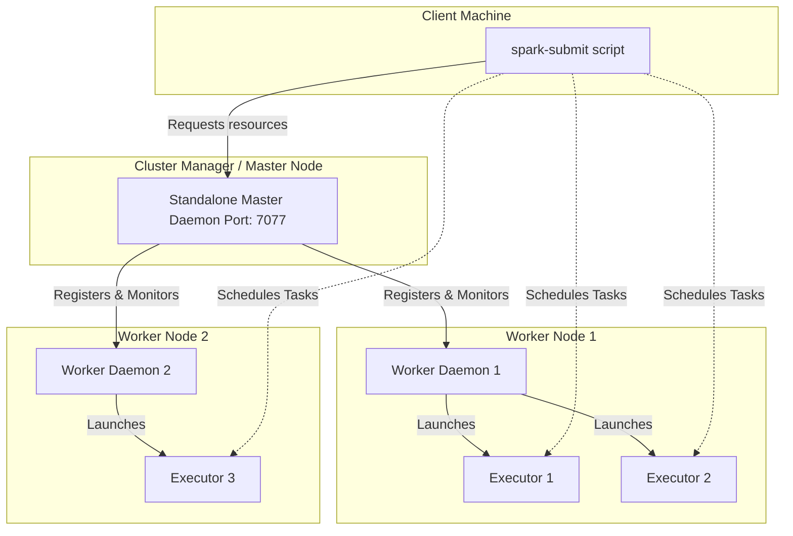

# Chapter 11: Running on a Spark Standalone Cluster

**A comprehensive guide to deploying, managing, and monitoring Apache Spark applications natively without external resource managers.**

## Why It Matters

Running Apache Spark in local mode is excellent for development and testing, but real-world big data processing requires distributed execution across multiple machines. Spark's Standalone cluster manager provides the simplest path to a fully distributed, multi-node Spark environment. It requires no additional third-party tools like YARN or Kubernetes, making it the perfect stepping stone for understanding how Spark operates at scale. Mastering the Standalone cluster architecture is essential because the concepts—resource allocation, driver/executor interactions, network configurations, and distributed execution—translate directly to all other deployment modes. When you understand the Standalone manager, you understand the core of Spark's distributed runtime.

## How It Works

This chapter bridges the gap between local Spark development and distributed production environments. We cover the entire lifecycle of a Standalone cluster, starting from its architectural components to cloud deployment. The chapter is broken down into five core topics:

1.  **Standalone Cluster Components**: Learn about the Master daemon, which orchestrates resources, and the Worker daemons, which manage resources on individual nodes and launch Executors. We explore the startup sequence and node configuration.
2.  **Cluster Web UI**: Discover how to monitor your cluster's health and application progress using Spark's built-in web interfaces. We cover the Master UI (port 8080), Worker UI (port 8081), and Application UI (port 4040).
3.  **Running Applications**: Understand how to submit jobs using `spark-submit`. We dive deep into the differences between `client` and `cluster` deploy modes, resource configuration (`--executor-memory`, `--total-executor-cores`), and handling failure scenarios.
4.  **Spark History Server**: Since the Application UI vanishes when a job finishes, the History Server reconstructs the UI from event logs. You will learn how to configure event logging and run the History Server for retrospective debugging.
5.  **Amazon EC2 & EMR Deployment**: Move from on-premise to the cloud. We explore launching Spark clusters on AWS EC2 and migrating to managed services like Amazon EMR, covering security groups, S3 integration, and cost optimization.

Each topic builds upon the previous one. By starting with the bare-metal daemons and ending with a cloud-managed service, you develop a holistic understanding of Spark operations.

The standalone cluster manager operates on a master-worker architecture. The master node runs the Standalone Master process, which listens on a specific port (default 7077) for worker registrations and application submissions. The worker nodes run the Standalone Worker process. Upon startup, each worker reports its available CPU cores and memory to the master. When you submit an application, the driver program negotiates with the master for resources. The master then instructs the workers to launch executor processes on behalf of the application. The driver then communicates directly with the executors to schedule tasks.

Understanding this flow is crucial because it highlights where things can go wrong: network partitions between driver and master, master and workers, or driver and executors.

## Flow Diagram



## Data Visualization

| Concept | Local Mode | Standalone Cluster | YARN / Mesos | Kubernetes |
| :--- | :--- | :--- | :--- | :--- |
| **Resource Manager** | None (In-process JVM) | Spark Master Daemon | ResourceManager / Master | Kubernetes API Server |
| **Worker Process** | None | Spark Worker Daemon | NodeManager / Slave | Kubelet (Pods) |
| **Driver Location** | Local JVM | Local (`client`) or Cluster node (`cluster`) | Client or ApplicationMaster | Client or Driver Pod |
| **Executor Isolation**| Threads | Processes on Workers | Containers | Containers/Pods |
| **Best For** | Dev/Testing | Small to Medium Clusters | Large Enterprise Clusters | Cloud-Native Deployments |

## Code Example

```bash
# A typical sequence to start a standalone cluster and submit an application

# 1. Start the Master (on the master node)
./sbin/start-master.sh --host 192.168.1.100 --port 7077 --webui-port 8080
# Output will indicate the master URL, e.g., spark://192.168.1.100:7077

# 2. Start a Worker (on a worker node)
./sbin/start-worker.sh spark://192.168.1.100:7077 --cores 4 --memory 8G --webui-port 8081
# The worker connects to the master and offers 4 cores and 8GB of memory.

# 3. Submit an application in client mode
./bin/spark-submit \
  --class org.apache.spark.examples.SparkPi \
  --master spark://192.168.1.100:7077 \
  --deploy-mode client \
  --executor-memory 2G \
  --total-executor-cores 2 \
  examples/jars/spark-examples_2.12-3.1.2.jar \
  1000

# 4. View the UI at http://192.168.1.100:8080

# 5. Stop the cluster
./sbin/stop-worker.sh
./sbin/stop-master.sh
```

## Common Pitfalls

*   **Port Conflicts:** Running multiple Spark daemons on a single machine for testing often leads to port collisions (e.g., ports 8080, 8081, 7077). Always override default web UI ports.
*   **Version Mismatch:** The Spark version on the machine running `spark-submit` must exactly match the Spark version running on the Master and Worker nodes.
*   **Missing Dependencies:** Jars provided locally to `spark-submit` must be accessible to all worker nodes if they are not explicitly distributed using the `--jars` flag or a shared filesystem.
*   **Firewall Blocking:** The driver program needs to communicate with executors directly. If the driver is on a laptop and executors are on a cloud cluster, firewalls will block the reverse connection, causing the job to hang.
*   **Over-allocating Resources:** Requesting more cores or memory per executor than a single worker has available will result in the application waiting indefinitely in the `WAITING` state.

## Key Takeaway

The Spark Standalone Cluster provides a robust, native environment for distributed processing, teaching the fundamental mechanics of resource allocation and task scheduling that apply to all Spark deployments.

---

## 🎓 Deep Learning Questions

### Q1: Why Was This Concept Introduced?
Before the Standalone cluster manager was introduced, deploying distributed big data systems was incredibly complex, often requiring a deep understanding of Hadoop YARN or Apache Mesos. Setting up YARN meant deploying an entire Hadoop ecosystem, complete with HDFS, ZooKeeper, and numerous configuration files, just to get a cluster manager for Spark. This created a massive barrier to entry for teams that only needed to run Spark and did not want the overhead of Hadoop. 

Spark introduced the Standalone cluster manager to solve this problem. It was designed to be lightweight, simple to configure, and strictly focused on running Spark applications. By providing a built-in resource manager, Spark empowered teams to spin up a distributed cluster in minutes using basic bash scripts (`start-master.sh` and `start-worker.sh`). It overcomes the limitation of heavy operational overhead, allowing organizations to achieve scalable, multi-node Spark deployments on bare-metal servers or cloud instances (like AWS EC2) without relying on external orchestration tools.

### Q2: What Exactly Is This Concept and How Does It Work?
The Spark Standalone Cluster is Spark's native resource manager. It is a lightweight framework responsible for managing CPU and memory across a cluster of machines. It operates on a master-slave architecture consisting of one Master daemon and multiple Worker daemons.

When you start the cluster, the Master daemon launches and listens on a designated port (e.g., 7077). The Worker daemons are started on other nodes and register themselves with the Master, advertising their available cores and memory. 

When you submit a Spark application via `spark-submit`, the Driver program connects to the Master to request resources. The Master evaluates the requested cores and memory, then commands the appropriate Worker nodes to launch Executor processes. Once the Executors are running, they connect directly back to the Driver. The Master steps out of the data path, and the Driver begins assigning tasks directly to the Executors. If an Executor fails, the Worker restarts it. If a node fails, the Master redirects the work to other healthy Workers.

### Q3: Where Should This Concept Be Used?
The Standalone cluster manager is ideal for organizations that want to run distributed Spark applications without the complexity of managing a Hadoop or Kubernetes infrastructure.

*   **Cloud Deployments (EC2/GCE):** Tech companies running data processing on plain AWS EC2 instances often use Standalone clusters. Scripts can easily spin up 50 EC2 instances, start the Master and Workers, process the data, and terminate the instances to save costs.
*   **Startups and Mid-Sized Businesses:** Companies without dedicated DevOps teams often prefer Standalone Spark because it is easier to maintain than YARN.
*   **Development and Staging Environments:** Even organizations using YARN in production often use Standalone clusters in their QA environments because it provides a realistic distributed environment with minimal setup.
*   **IoT and Edge Computing:** In scenarios where compute resources are decentralized and Hadoop is too heavy, Standalone Spark can process sensor data on lightweight edge servers.

### Q4: Where Should This Concept NOT Be Used?
While powerful, the Standalone cluster lacks the advanced multi-tenancy and security features required for large enterprise data lakes.

*   **Multi-Tenant Environments:** Do not use Standalone if hundreds of users across different departments need to share the same cluster. YARN and Kubernetes offer superior resource queues, quota management, and user isolation.
*   **Complex Security Requirements:** Standalone lacks fine-grained security integrations like Kerberos authentication, which is standard in Hadoop YARN environments used by banks and healthcare companies.
*   **Docker/Containerized Architectures:** If your organization is already heavily invested in Docker and Kubernetes (K8s), do not deploy Standalone Spark inside K8s. Use Spark's native Kubernetes scheduler instead.
*   **Heterogeneous Workloads:** If your cluster needs to run non-Spark applications (like Flink, Hive, or Presto) alongside Spark, YARN or Mesos are better as they manage resources across different frameworks.

### Q5: How Is This Concept Different from Hadoop?

| Aspect | Hadoop MapReduce (YARN) | Apache Spark (Standalone) |
| :--- | :--- | :--- |
| **Architecture** | Relies on YARN ResourceManager and NodeManager daemons. | Uses native Spark Master and Worker daemons. |
| **Performance** | High disk I/O; writes intermediate data to disk between jobs. | Highly optimized in-memory processing; keeps data in RAM. |
| **Processing Model** | Strictly batch-oriented Map and Reduce phases. | General-purpose DAG execution engine (Batch, Streaming, SQL). |
| **Memory Usage** | JVMs are spun up and torn down for every single Map/Reduce task. | Long-running Executor JVMs cache data and run tasks as fast threads. |
| **Fault Tolerance** | Achieved through data replication in HDFS. | Achieved via RDD lineage; lost data is recomputed dynamically. |
| **Scalability** | Designed for massive clusters (10,000+ nodes). | Great for small to medium clusters (typically up to 1,000 nodes). |
| **Ease of Development** | Very verbose Java API; complex cluster configuration. | Intuitive APIs (Python, Scala, SQL); highly simplified cluster setup. |
| **Typical Use Cases** | Legacy enterprise batch processing, log archiving. | Real-time analytics, machine learning, modern ETL pipelines. |
| **Advantages** | Robust multi-tenancy, Kerberos security, resource queues. | Extremely fast setup, zero external dependencies, low overhead. |
| **Disadvantages** | Heavy, complex, slow for iterative algorithms. | No native queues, basic security, lacks advanced resource isolation. |

### Q6: How Can This Concept Be Related to a Traditional RDBMS?

| RDBMS Concept | Spark Standalone Equivalent | Explanation |
| :--- | :--- | :--- |
| **Database Server (Instance)** | **Spark Cluster** | The overall computational environment processing the data. |
| **Query Optimizer / Engine** | **Driver Program** | Plans the execution, translates queries into physical tasks (DAG), and orchestrates execution. |
| **Worker Threads** | **Executors** | The actual processes executing the data transformations and holding cached data in memory. |
| **System Monitor (e.g., pg_stat)** | **Spark Web UI & History Server** | Dashboards to track query performance, resource utilization, and historical execution logs. |
| **Resource Governor** | **Spark Master** | Allocates memory and CPU cores to different applications running on the cluster. |
| **Table Partitions** | **RDD / DataFrame Partitions** | Chunks of data distributed across the cluster nodes for parallel processing. |

### Q7: What Happens Behind the Scenes?
When you submit an application to a Standalone cluster, a precise sequence of events unfolds to distribute the workload:

1.  **Driver Initialization:** The `spark-submit` script launches the Driver program (either locally or on a worker node depending on the deploy mode).
2.  **Resource Negotiation:** The Driver connects to the Spark Master (e.g., `spark://master:7077`) and requests resources (CPU cores and memory).
3.  **Executor Launch:** The Master evaluates available cluster resources and commands specific Workers to spawn Executor JVMs.
4.  **Registration:** The newly launched Executors connect back to the Driver to announce they are ready for work.
5.  **DAG Generation:** The Driver's SparkContext parses your code and generates a Directed Acyclic Graph (DAG) of logical operations.
6.  **Stage & Task Scheduling:** The DAG Scheduler splits the graph into Stages (separated by Shuffle operations). The Task Scheduler breaks these Stages into Tasks based on the number of data Partitions.
7.  **Task Execution:** The Driver sends Tasks directly to the Executors. Executors run the tasks in parallel threads, processing the data in memory.
8.  **Shuffle:** If a wide dependency occurs (e.g., `groupByKey`), Executors exchange data across the network (Shuffle).
9.  **Result Collection:** Executors send the final results back to the Driver, or write them directly to a distributed storage system (like S3 or HDFS).

```text
[Spark-Submit] --> (Launches Driver)
                      |
                      v
             [Driver Program] ------------> [Spark Master]
             (DAG & Scheduler)                 (Resource Manager)
                      |                               |
                      | (Assigns Tasks)               | (Commands Launch)
                      v                               v
             +-----------------+             +-----------------+
             |   Worker Node   |             |   Worker Node   |
             |  [ Executor ]   |             |  [ Executor ]   |
             |   - Task 1      |             |   - Task 3      |
             |   - Task 2      |             |   - Task 4      |
             +-----------------+             +-----------------+
```

### Q8: Performance Considerations, Best Practices, and Common Mistakes

| Category | Recommendation | Why It Matters |
| :--- | :--- | :--- |
| **Memory Allocation** | Leave overhead memory for the OS. Don't allocate 100% of RAM to Executors. | The OS and background processes need memory. Over-allocating causes OOM errors and node crashes. |
| **Core Distribution** | Keep `--executor-cores` between 4 and 6. | Too few cores means unused resources; too many (e.g., 16+) leads to JVM garbage collection bottlenecks and thread contention. |
| **Deploy Mode** | Use `cluster` mode for production, `client` mode for interactive debugging. | `cluster` mode runs the Driver on a Worker, ensuring it stays alive if your local laptop disconnects. |
| **Log Management** | Configure and run the Spark History Server. | The standard Spark UI dies when the app finishes. The History Server allows you to debug failed jobs retrospectively. |
| **Network & Firewalls** | Ensure all ports (Driver, Master, Worker, BlockManager) are open between nodes. | Spark requires bi-directional communication. Blocked ports cause applications to hang indefinitely in a "WAITING" state. |
| **Data Locality** | Co-locate Spark Workers with data storage if possible (e.g., HDFS DataNodes). | Processing data locally reduces network I/O. If using S3, ensure EC2 instances are in the same region. |

### Q9: Interview Questions

#### Beginner
1.  **What is the role of the Spark Master in a Standalone cluster?**
    *Answer:* The Master acts as a resource manager. It keeps track of available CPU and memory on Worker nodes and allocates these resources to Spark applications. It does not process data or schedule individual tasks.
2.  **What is a Worker node?**
    *Answer:* A Worker is a daemon running on a cluster node that manages the local resources. It listens to the Master, launches Executor processes on demand, and monitors their health.
3.  **What is the difference between `client` and `cluster` deploy mode?**
    *Answer:* In `client` mode, the Driver runs on the machine where `spark-submit` is executed. In `cluster` mode, the Driver is shipped to and runs inside one of the Worker nodes in the cluster.

#### Intermediate
1.  **If a Worker node crashes during execution, what happens?**
    *Answer:* The Master detects the loss of the Worker. The Driver realizes the Executors on that Worker are gone and reschedules the failed tasks onto Executors running on healthy Worker nodes, utilizing RDD lineage to recompute lost data.
2.  **Why would an application get stuck in the `WAITING` state upon submission?**
    *Answer:* This happens when the application requests more resources (e.g., memory or cores per executor) than any single Worker in the cluster can provide. The Master waits indefinitely for a suitable Worker to become available.
3.  **How do you access the Spark Web UI after an application has finished?**
    *Answer:* The Application UI (port 4040) shuts down when the app finishes. To view past jobs, you must configure Spark to log events to a directory (`spark.eventLog.enabled=true`) and start the Spark History Server to parse and display those logs.

#### Advanced
1.  **Explain how the Driver communicates with Executors in Standalone mode.**
    *Answer:* The Driver acts as a server. When the Master tells Workers to launch Executors, the Executors are given the Driver's IP and port. The Executors initiate a direct connection back to the Driver. Once connected, they bypass the Master entirely, and the Driver sends tasks directly to the Executors using RPC.
2.  **How can you run multiple Spark applications concurrently on a Standalone cluster?**
    *Answer:* You must manage resource allocation. By default, a single app might grab all available cores. You should limit the cores per app using `--total-executor-cores` or `spark.cores.max` during submission, leaving resources available for other applications to use simultaneously.
3.  **How does Standalone cluster High Availability (HA) work?**
    *Answer:* Standalone HA is achieved using Apache ZooKeeper. You run multiple Master daemons (one active, others standby). ZooKeeper maintains the cluster state. If the active Master fails, ZooKeeper promotes a standby Master, which recovers state from ZooKeeper and reconnects to Workers without interrupting running applications.

#### Scenario-Based
1.  **Scenario:** You submit a job from your laptop to a Standalone cluster in AWS EC2 in `client` mode. The job submits successfully, but no tasks execute. Why?
    *Answer:* The Executors on AWS EC2 are trying to connect back to the Driver running on your laptop. Your laptop is likely behind a NAT/firewall or has a private IP that the AWS nodes cannot route to. The solution is to use `cluster` mode so the Driver runs on AWS, or run `spark-submit` from an EC2 bastion host.
2.  **Scenario:** Your Standalone cluster has 10 Workers, each with 16 cores and 64GB RAM. You submit an app with `--executor-memory 10G`. You notice it only utilizes a fraction of the cluster. How do you optimize this?
    *Answer:* By default, Standalone launches only *one* Executor per Worker per application. With 10G memory, you are only using 10G out of 64G per node. To utilize more, you should configure `spark.executor.cores` (e.g., to 5). This forces Spark to launch multiple Executors per Worker (e.g., 3 Executors per worker, each with 5 cores and 10G RAM), fully utilizing the cluster.

### Q10: Complete Real-World Example

**Business Problem:**
A ride-sharing company (like Uber) operates a fleet of vehicles in multiple cities. They dump millions of GPS ping records every hour into Amazon S3. The data engineering team needs to process this data on a self-managed AWS EC2 Spark Standalone cluster to calculate the total distance driven per vehicle and flag any vehicles exceeding a speed threshold.

**Sample Dataset (`rides.csv` in S3):**
```csv
vehicle_id,timestamp,latitude,longitude,speed_mph
V-101,2023-10-01T08:00:00,37.7749,-122.4194,25.5
V-102,2023-10-01T08:00:05,37.7750,-122.4190,65.2
V-101,2023-10-01T08:00:10,37.7752,-122.4185,28.0
```

**PySpark Code (`fleet_analyzer.py`):**

```python
from pyspark.sql import SparkSession
from pyspark.sql.functions import col, max as spark_max

# 1. Initialize SparkSession targeting the Standalone Master
# In production, the master URL is passed via spark-submit, 
# but hardcoding here illustrates the connection.
spark = SparkSession.builder \\
    .appName("UberFleetAnalyzer") \\
    .config("spark.eventLog.enabled", "true") \\
    .config("spark.eventLog.dir", "s3a://uber-spark-logs/events/") \\
    .getOrCreate()

# 2. Read the raw GPS data from S3
# Spark distributes this read across all Executors
df = spark.read.csv("s3a://uber-raw-data/rides/*.csv", header=True, inferSchema=True)

# 3. Process Data: Find max speed per vehicle
# This triggers a Wide Transformation (Shuffle) across the cluster
max_speed_df = df.groupBy("vehicle_id") \\
    .agg(spark_max("speed_mph").alias("max_speed"))

# 4. Filter for speeding violations (e.g., > 60 mph)
# This is a Narrow Transformation happening locally on Executors
violations_df = max_speed_df.filter(col("max_speed") > 60.0)

# 5. Write results back out to S3
# Executors write data in parallel directly to the S3 bucket
violations_df.write.mode("overwrite").parquet("s3a://uber-processed-data/speeding_violations/")

# Stop the session to release cluster resources
spark.stop()
```

**Step-by-Step Execution Walkthrough:**
1.  **Cluster Setup:** The team spins up 1 EC2 instance for the Master and 5 EC2 instances for Workers. They run `start-master.sh` and `start-worker.sh` to form the cluster.
2.  **Job Submission:** The engineer runs `spark-submit --master spark://<master-ip>:7077 --deploy-mode cluster s3a://uber-code/fleet_analyzer.py`.
3.  **Driver Launch:** The Master selects one Worker to host the Driver program.
4.  **Resource Allocation:** The Driver asks the Master for resources. The Master tells the remaining 4 Workers to launch Executors.
5.  **Data Ingestion:** The Executors connect to S3 and read chunks of the CSV files in parallel (Stage 1).
6.  **Shuffle (groupBy):** To find the max speed per vehicle, Executors must exchange data so all records for "V-101" end up on the same node (Stage 2).
7.  **Output:** The Executors write the filtered results back to S3 as highly optimized Parquet files.
8.  **Completion:** The Driver terminates, the Master reclaims the resources, and the EC2 instances can be safely shut down.

**Expected Output (in S3 Parquet format):**
```text
+----------+---------+
|vehicle_id|max_speed|
+----------+---------+
|     V-102|     65.2|
+----------+---------+
```

**Performance Notes & When This Approach is Best:**
*   **Performance:** Using Standalone on EC2 avoids the massive overhead of spinning up an Amazon EMR Hadoop cluster. It is blazingly fast to start and stop.
*   **Best Used:** This architecture is perfect for ephemeral (short-lived) batch processing workloads. Spin up the instances, process the nightly data, and tear them down to save cloud costs.

### 💡 Key Takeaways
*   Spark Standalone is Spark's built-in, native resource manager, eliminating the need for Hadoop YARN or Kubernetes.
*   It utilizes a Master-Worker architecture where the Master manages cluster resources and Workers manage node resources and execute tasks.
*   The Driver program plans the execution (DAG) and schedules tasks directly on the Executors, bypassing the Master during data processing.
*   It is incredibly easy to set up via basic shell scripts, making it ideal for development, testing, and dedicated cloud deployments (EC2).
*   It lacks advanced multi-tenancy and resource queuing features, making it unsuitable for large, shared enterprise data lakes.

### ⚠️ Common Misconceptions
*   **"Standalone means it only runs on one machine."** False. "Local mode" runs on one machine. "Standalone" refers to the cluster manager type; it is designed to run across hundreds of distributed nodes.
*   **"The Master node processes data."** False. The Master only tracks CPU and memory allocation. The Executors process the data.
*   **"I need Hadoop to run Spark in production."** False. You can run highly scalable Spark applications purely using the Standalone manager on plain Linux servers or cloud instances.

### 🔗 Related Spark Concepts
*   **Spark on YARN:** The Hadoop-based alternative to Standalone.
*   **Spark on Kubernetes:** The container-native alternative to Standalone.
*   **Spark History Server:** Crucial for monitoring Standalone applications after they finish.
*   **Deploy Modes (Client vs. Cluster):** Dictates where the Driver runs in the Standalone architecture.

### 📚 References for Further Reading
*   Apache Spark Official Documentation
*   Learning Spark (O'Reilly)
*   Spark: The Definitive Guide (O'Reilly)
