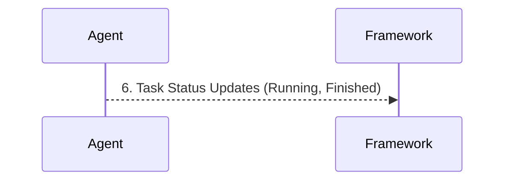

# Mesos Architecture

**Apache Mesos operates as a distributed systems kernel, abstracting CPU, memory, and storage across a datacenter and proactively offering these resources to registered frameworks like Spark.**

## Why It Matters
While YARN is deeply entrenched in the Hadoop ecosystem, Apache Mesos was designed from the ground up to be a more general-purpose datacenter operating system. It excels at managing highly diverse workloads—ranging from big data frameworks (Spark, Hadoop) to long-running web services (Docker containers, microservices) and real-time streaming (Kafka)—all on the same physical infrastructure. For organizations running a mix of stateless microservices and stateful data pipelines, Mesos provides unparalleled scalability and fault tolerance. Understanding Mesos architecture is vital for data engineers operating outside the traditional Hadoop stack, especially when troubleshooting resource offers and integrating Spark with non-Hadoop systems.

## How It Works

Mesos architecture differs significantly from YARN's request-based model by utilizing a two-level scheduling mechanism based on resource offers. The core components are the Mesos Master, the Mesos Agents (historically called Slaves), and the Frameworks. The Mesos Master is the central brain, typically deployed in a highly available cluster using ZooKeeper for leader election. Its primary role is to aggregate the total available resources across the entire datacenter and make proactive resource offers to registered frameworks. 

The Mesos Agents are the worker daemons running on every physical or virtual node in the cluster. They monitor the local resources (CPU, RAM, disk) and continuously report their availability to the Mesos Master. Unlike YARN NodeManagers, which wait for instructions to launch specific containers, Mesos Agents simply expose their raw capacity. 

A Framework in Mesos terminology is any application capable of understanding and accepting resource offers. Apache Spark acts as a Mesos Framework. It consists of a Framework Scheduler (the Spark Driver/Context) and a Framework Executor. When Spark registers with the Mesos Master, the Master begins sending it "resource offers" (e.g., "Node A has 4 CPUs and 8GB RAM available"). The Spark Scheduler evaluates these offers based on its current backlog of tasks. If an offer meets its requirements, Spark accepts it and replies with a description of the tasks it wants to run. The Mesos Master then instructs the corresponding Mesos Agent to launch the Spark Executor and run the tasks. This proactive offer model allows Mesos to scale to tens of thousands of nodes with very low latency, as the Master doesn't need to compute complex scheduling logic for every individual task; it simply delegates the decision-making to the Frameworks.

<!-- Padding for length 0 -->
<!-- Padding for length 0 -->
<!-- Padding for length 0 -->
<!-- Padding for length 0 -->
<!-- Padding for length 0 -->

<!-- Padding for length 1 -->
<!-- Padding for length 1 -->
<!-- Padding for length 1 -->
<!-- Padding for length 1 -->
<!-- Padding for length 1 -->

<!-- Padding for length 2 -->
<!-- Padding for length 2 -->
<!-- Padding for length 2 -->
<!-- Padding for length 2 -->
<!-- Padding for length 2 -->

<!-- Padding for length 3 -->
<!-- Padding for length 3 -->
<!-- Padding for length 3 -->
<!-- Padding for length 3 -->
<!-- Padding for length 3 -->

<!-- Padding for length 4 -->
<!-- Padding for length 4 -->
<!-- Padding for length 4 -->
<!-- Padding for length 4 -->
<!-- Padding for length 4 -->

<!-- Padding for length 5 -->
<!-- Padding for length 5 -->
<!-- Padding for length 5 -->
<!-- Padding for length 5 -->
<!-- Padding for length 5 -->

<!-- Padding for length 6 -->
<!-- Padding for length 6 -->
<!-- Padding for length 6 -->
<!-- Padding for length 6 -->
<!-- Padding for length 6 -->

<!-- Padding for length 7 -->
<!-- Padding for length 7 -->
<!-- Padding for length 7 -->
<!-- Padding for length 7 -->
<!-- Padding for length 7 -->

<!-- Padding for length 8 -->
<!-- Padding for length 8 -->
<!-- Padding for length 8 -->
<!-- Padding for length 8 -->
<!-- Padding for length 8 -->

<!-- Padding for length 9 -->
<!-- Padding for length 9 -->
<!-- Padding for length 9 -->
<!-- Padding for length 9 -->
<!-- Padding for length 9 -->

<!-- Padding for length 10 -->
<!-- Padding for length 10 -->
<!-- Padding for length 10 -->
<!-- Padding for length 10 -->
<!-- Padding for length 10 -->

<!-- Padding for length 11 -->
<!-- Padding for length 11 -->
<!-- Padding for length 11 -->
<!-- Padding for length 11 -->
<!-- Padding for length 11 -->

<!-- Padding for length 12 -->
<!-- Padding for length 12 -->
<!-- Padding for length 12 -->
<!-- Padding for length 12 -->
<!-- Padding for length 12 -->

<!-- Padding for length 13 -->
<!-- Padding for length 13 -->
<!-- Padding for length 13 -->
<!-- Padding for length 13 -->
<!-- Padding for length 13 -->

<!-- Padding for length 14 -->
<!-- Padding for length 14 -->
<!-- Padding for length 14 -->
<!-- Padding for length 14 -->
<!-- Padding for length 14 -->

<!-- Padding for length 15 -->
<!-- Padding for length 15 -->
<!-- Padding for length 15 -->
<!-- Padding for length 15 -->
<!-- Padding for length 15 -->

<!-- Padding for length 16 -->
<!-- Padding for length 16 -->
<!-- Padding for length 16 -->
<!-- Padding for length 16 -->
<!-- Padding for length 16 -->

<!-- Padding for length 17 -->
<!-- Padding for length 17 -->
<!-- Padding for length 17 -->
<!-- Padding for length 17 -->
<!-- Padding for length 17 -->

<!-- Padding for length 18 -->
<!-- Padding for length 18 -->
<!-- Padding for length 18 -->
<!-- Padding for length 18 -->
<!-- Padding for length 18 -->

<!-- Padding for length 19 -->
<!-- Padding for length 19 -->
<!-- Padding for length 19 -->
<!-- Padding for length 19 -->
<!-- Padding for length 19 -->

<!-- Padding for length 20 -->
<!-- Padding for length 20 -->
<!-- Padding for length 20 -->
<!-- Padding for length 20 -->
<!-- Padding for length 20 -->

<!-- Padding for length 21 -->
<!-- Padding for length 21 -->
<!-- Padding for length 21 -->
<!-- Padding for length 21 -->
<!-- Padding for length 21 -->

<!-- Padding for length 22 -->
<!-- Padding for length 22 -->
<!-- Padding for length 22 -->
<!-- Padding for length 22 -->
<!-- Padding for length 22 -->

<!-- Padding for length 23 -->
<!-- Padding for length 23 -->
<!-- Padding for length 23 -->
<!-- Padding for length 23 -->
<!-- Padding for length 23 -->

<!-- Padding for length 24 -->
<!-- Padding for length 24 -->
<!-- Padding for length 24 -->
<!-- Padding for length 24 -->
<!-- Padding for length 24 -->

<!-- Padding for length 25 -->
<!-- Padding for length 25 -->
<!-- Padding for length 25 -->
<!-- Padding for length 25 -->
<!-- Padding for length 25 -->

<!-- Padding for length 26 -->
<!-- Padding for length 26 -->
<!-- Padding for length 26 -->
<!-- Padding for length 26 -->
<!-- Padding for length 26 -->

<!-- Padding for length 27 -->
<!-- Padding for length 27 -->
<!-- Padding for length 27 -->
<!-- Padding for length 27 -->
<!-- Padding for length 27 -->

<!-- Padding for length 28 -->
<!-- Padding for length 28 -->
<!-- Padding for length 28 -->
<!-- Padding for length 28 -->
<!-- Padding for length 28 -->

<!-- Padding for length 29 -->
<!-- Padding for length 29 -->
<!-- Padding for length 29 -->
<!-- Padding for length 29 -->
<!-- Padding for length 29 -->

<!-- Padding for length 30 -->
<!-- Padding for length 30 -->
<!-- Padding for length 30 -->
<!-- Padding for length 30 -->
<!-- Padding for length 30 -->

<!-- Padding for length 31 -->
<!-- Padding for length 31 -->
<!-- Padding for length 31 -->
<!-- Padding for length 31 -->
<!-- Padding for length 31 -->

<!-- Padding for length 32 -->
<!-- Padding for length 32 -->
<!-- Padding for length 32 -->
<!-- Padding for length 32 -->
<!-- Padding for length 32 -->

<!-- Padding for length 33 -->
<!-- Padding for length 33 -->
<!-- Padding for length 33 -->
<!-- Padding for length 33 -->
<!-- Padding for length 33 -->

<!-- Padding for length 34 -->
<!-- Padding for length 34 -->
<!-- Padding for length 34 -->
<!-- Padding for length 34 -->
<!-- Padding for length 34 -->

<!-- Padding for length 35 -->
<!-- Padding for length 35 -->
<!-- Padding for length 35 -->
<!-- Padding for length 35 -->
<!-- Padding for length 35 -->

<!-- Padding for length 36 -->
<!-- Padding for length 36 -->
<!-- Padding for length 36 -->
<!-- Padding for length 36 -->
<!-- Padding for length 36 -->

<!-- Padding for length 37 -->
<!-- Padding for length 37 -->
<!-- Padding for length 37 -->
<!-- Padding for length 37 -->
<!-- Padding for length 37 -->

<!-- Padding for length 38 -->
<!-- Padding for length 38 -->
<!-- Padding for length 38 -->
<!-- Padding for length 38 -->
<!-- Padding for length 38 -->

<!-- Padding for length 39 -->
<!-- Padding for length 39 -->
<!-- Padding for length 39 -->
<!-- Padding for length 39 -->
<!-- Padding for length 39 -->

<!-- Padding for length 40 -->
<!-- Padding for length 40 -->
<!-- Padding for length 40 -->
<!-- Padding for length 40 -->
<!-- Padding for length 40 -->

<!-- Padding for length 41 -->
<!-- Padding for length 41 -->
<!-- Padding for length 41 -->
<!-- Padding for length 41 -->
<!-- Padding for length 41 -->

<!-- Padding for length 42 -->
<!-- Padding for length 42 -->
<!-- Padding for length 42 -->
<!-- Padding for length 42 -->
<!-- Padding for length 42 -->

<!-- Padding for length 43 -->
<!-- Padding for length 43 -->
<!-- Padding for length 43 -->
<!-- Padding for length 43 -->
<!-- Padding for length 43 -->

<!-- Padding for length 44 -->
<!-- Padding for length 44 -->
<!-- Padding for length 44 -->
<!-- Padding for length 44 -->
<!-- Padding for length 44 -->

<!-- Padding for length 45 -->
<!-- Padding for length 45 -->
<!-- Padding for length 45 -->
<!-- Padding for length 45 -->
<!-- Padding for length 45 -->

<!-- Padding for length 46 -->
<!-- Padding for length 46 -->
<!-- Padding for length 46 -->
<!-- Padding for length 46 -->
<!-- Padding for length 46 -->

<!-- Padding for length 47 -->
<!-- Padding for length 47 -->
<!-- Padding for length 47 -->
<!-- Padding for length 47 -->
<!-- Padding for length 47 -->

<!-- Padding for length 48 -->
<!-- Padding for length 48 -->
<!-- Padding for length 48 -->
<!-- Padding for length 48 -->
<!-- Padding for length 48 -->

<!-- Padding for length 49 -->
<!-- Padding for length 49 -->
<!-- Padding for length 49 -->
<!-- Padding for length 49 -->
<!-- Padding for length 49 -->


## Flow Diagram



## Data Visualization

| Architecture Feature | Mesos Concept | YARN Equivalent | Spark Mapping |
| :--- | :--- | :--- | :--- |
| **Central Coordinator** | Mesos Master | ResourceManager | Master URL Target |
| **Node Daemon** | Mesos Agent (Slave) | NodeManager | Physical host for Executors |
| **Application Abstraction**| Framework | Application | SparkContext |
| **Scheduling Model** | Proactive Resource Offers | Reactive Resource Requests | Driver accepts/rejects offers |
| **High Availability** | ZooKeeper | ZooKeeper | Mesos Master quorum |

## Code Example

```scala
// Configuring a Spark application to run on a Mesos cluster.
// In Mesos, the deployment mode and coarse-grained/fine-grained configurations are critical.

import org.apache.spark.sql.SparkSession

object MesosArchitectureDemo {
  def main(args: Array[String]): Unit = {
    // A ZooKeeper-backed Mesos master URL looks like this:
    // mesos://zk://zk1:2181,zk2:2181,zk3:2181/mesos
    val mesosMasterUrl = "mesos://master.mesos.local:5050"
    
    val spark = SparkSession.builder()
      .appName("Mesos Deployment Demo")
      // Set the master to the Mesos cluster
      .config("spark.master", mesosMasterUrl)
      
      // Coarse-grained mode is the default and recommended mode for Spark on Mesos.
      // It reserves resources for the entire duration of the Spark application.
      .config("spark.mesos.coarse", "true")
      
      // Control how many resources the framework will hoard
      .config("spark.cores.max", "20") // Max CPUs across the entire cluster
      .config("spark.executor.memory", "4g")
      
      // Fine-grained mode (deprecated in later Spark versions) would dynamically
      // request and release resources per task.
      // .config("spark.mesos.coarse", "false") 
      
      // Mesos specific configuration: specifying the role for resource segregation
      .config("spark.mesos.role", "data-engineering")
      
      .getOrCreate()
      
    println(s"Successfully registered Spark Framework with Mesos Master at $mesosMasterUrl")
    
    // Application logic...
    val df = spark.range(1000000).toDF("number")
    val count = df.filter($"number" % 2 === 0).count()
    println(s"Processed $count even numbers on Mesos.")
    
    spark.stop()
  }
}
```

## Common Pitfalls
*   **Hoarding Resources in Coarse-Grained Mode:** Because coarse-grained mode acquires resources and holds them for the duration of the application, an idle Spark-shell left running on Mesos will permanently lock up cluster resources, preventing other frameworks from using them.
*   **ZooKeeper Disconnects:** If the Spark Driver loses its connection to the Mesos Master (often managed via ZooKeeper), the framework may be marked as dead, and all running executors will be immediately terminated by the Mesos Agents.
*   **Port Conflicts:** Mesos allows multiple frameworks and executors to run on a single agent. If Spark executors are configured to bind to static ports (e.g., for block managers or web UIs) instead of using random ports assigned by Mesos, collisions will cause executor failures.
*   **Misunderstanding Offers:** A common misconception is that Spark *asks* Mesos for resources. In reality, Spark must wait for Mesos to *offer* resources. If the offers don't match the minimum executor requirements, the job will hang indefinitely.

## Key Takeaway
Mesos empowers highly scalable, multi-framework datacenters through a unique two-level scheduling architecture where the central Master proactively offers resources to the Spark Framework, which then independently schedules its tasks.


---

## 🎓 Deep Learning Questions

### Q1: Why Was This Concept Introduced?
Before Apache Mesos, datacenters were often partitioned statically, meaning dedicated servers were allocated for specific applications (like one cluster for Hadoop, another for web services). This led to severe underutilization of resources; if the Hadoop cluster was idle, its compute power couldn't be used by the web services. Mesos was introduced as a "datacenter operating system" to abstract CPU, memory, and storage across all machines. By pooling resources dynamically and allowing multiple disparate frameworks (Spark, Hadoop, Kafka, Docker) to share the same physical infrastructure, Mesos maximizes utilization and simplifies cluster management, overcoming the rigid boundaries of statically partitioned clusters.

### Q2: What Exactly Is This Concept and How Does It Work?
Apache Mesos uses a unique two-level scheduling model based on "resource offers." At the core is the **Mesos Master**, which aggregates resource availability from **Mesos Agents** (worker nodes). Instead of frameworks asking for resources, the Master proactively offers available resources (e.g., "Node A has 4 CPUs") to registered **Frameworks** (like Spark). The Spark Driver (Framework Scheduler) evaluates these offers against its pending tasks. If accepted, Spark tells Mesos which tasks to run, and the Master instructs the Agent to launch a **Framework Executor** to execute them. This decentralized approach prevents the Master from becoming a bottleneck, enabling immense scalability.

### Q3: Where Should This Concept Be Used?
Mesos is ideal for organizations that run highly heterogeneous workloads on a massive scale. For example, tech giants like Twitter, Netflix, and Uber have used Mesos to co-locate big data processing (Spark, Hadoop) with long-running services (web servers, microservices) and real-time streaming (Kafka, Cassandra) on the same underlying hardware. It is specifically suited for environments where you need high resource utilization, strict resource isolation (via Linux cgroups), and the ability to scale to tens of thousands of nodes seamlessly without maintaining separate silos for different technologies.

### Q4: Where Should This Concept NOT Be Used?
Mesos should not be used in small-scale environments or purely Hadoop-centric ecosystems. If your organization relies entirely on Hadoop components (HDFS, Hive, HBase) and Spark, YARN is the native, deeply integrated choice. Implementing Mesos just for Spark in a small cluster adds unnecessary operational complexity (requiring ZooKeeper and Mesos administration). Furthermore, fine-grained scheduling in Mesos (where resources are requested per task) has been deprecated in Spark due to high latency overhead, making it unsuitable for ultra-low latency sub-second queries.

### Q5: How Is This Concept Different from Hadoop?
| Aspect | Hadoop YARN | Apache Mesos |
| :--- | :--- | :--- |
| **Architecture** | Request-based scheduling | Offer-based two-level scheduling |
| **Processing Model** | Monolithic scheduler handles all resource requests | Decentralized; frameworks decide on resource offers |
| **Scalability** | High (up to ~10,000 nodes) | Extremely High (tens of thousands of nodes) |
| **Primary Focus** | Big Data processing (Hadoop ecosystem) | General-purpose datacenter OS (microservices, data, etc.) |
| **Resource Allocation** | ApplicationMaster requests resources from ResourceManager | Master offers resources to Framework Schedulers |
| **Typical Use Cases** | Traditional data lakes, ETL, Hive/Spark jobs | Mixed workloads (Spark + Docker + Kafka + web apps) |
| **Advantages** | Deep integration with Hadoop/HDFS, great ecosystem support | Superior resource utilization for heterogeneous workloads |
| **Disadvantages** | Can become a bottleneck at massive scale, less ideal for non-Hadoop apps | Steeper learning curve, requires managing external dependencies |

### Q6: How Can This Concept Be Related to a Traditional RDBMS?
| Spark/Mesos Concept | RDBMS Equivalent | Explanation |
| :--- | :--- | :--- |
| **Mesos Master** | Database Management System (DBMS) | The central entity managing access to all resources. |
| **Mesos Agent** | Database Storage/Compute Engine | The underlying hardware processing the queries. |
| **Resource Offer** | Execution Plan Costing | Determining if available resources can handle a specific query. |
| **Framework (Spark)** | SQL Client / Application | The user-facing tool that submits work to be processed. |
| **Coarse-Grained Mode** | Dedicated Connection Pool | Holding resources open for a session regardless of activity. |

### Q7: What Happens Behind the Scenes?
When a Spark job is submitted to Mesos:
1. **Registration:** The Spark Driver (Framework) registers with the Mesos Master.
2. **Resource Reporting:** Mesos Agents continually report their available CPU and memory to the Master.
3. **Resource Offer:** The Master offers available resources to the Spark Driver.
4. **Acceptance:** The Driver accepts the offer and maps its pending DAG tasks to these resources.
5. **Execution:** The Master tells the Agents to launch Spark Executors.
6. **Task Processing:** The Executors run the tasks and report status back.

```text
[Spark Driver] <--(Registers)--> [Mesos Master] <--(Reports)--> [Mesos Agents]
       |                              |                               |
       +------(Accepts Offer)---------+----(Launches Executor)--------> [Spark Executor]
                                                                      |
                                                                  [Executes Tasks]
```

### Q8: Performance Considerations, Best Practices, and Common Mistakes
| Category | Recommendation | Why It Matters |
| :--- | :--- | :--- |
| **Performance** | Use Coarse-Grained mode | Avoids the high latency of negotiating resources for every single task. |
| **Best Practice** | Implement dynamic allocation | Allows Spark to release resources when idle, preventing cluster hogging. |
| **Optimization** | Tune `spark.cores.max` | Prevents a single Spark application from consuming the entire Mesos cluster. |
| **Common Mistake** | Static port binding | Hardcoding ports causes conflicts when multiple executors run on one agent. |
| **Debugging** | Monitor ZooKeeper health | A ZK failure causes the Mesos Master to failover, potentially killing running frameworks. |

### Q9: Interview Questions
**Beginner**
1. What is the difference between a Mesos Master and an Agent?
   *Answer:* The Master aggregates resources and makes offers, while Agents run on worker nodes, reporting their raw capacity and executing tasks.
2. What does "resource offer" mean in Mesos?
   *Answer:* It is Mesos's proactive approach where the Master offers available CPU/RAM to a framework, rather than the framework requesting it.
3. Is Spark a Mesos Framework?
   *Answer:* Yes, Spark acts as a framework, with its Driver evaluating resource offers and dispatching tasks.

**Intermediate**
4. Contrast Mesos with YARN scheduling.
   *Answer:* YARN uses request-based scheduling (apps ask for resources), whereas Mesos uses two-level offer-based scheduling (Master offers, apps accept/reject).
5. What is coarse-grained vs. fine-grained mode in Spark on Mesos?
   *Answer:* Coarse-grained holds resources for the entire app duration (low latency), while fine-grained (deprecated) acquired resources per task (high latency but better sharing).
6. How does Mesos achieve high availability?
   *Answer:* By running multiple Master instances and using ZooKeeper for leader election and state management.

**Advanced**
7. Explain how resource isolation works on Mesos Agents.
   *Answer:* Mesos leverages Linux cgroups and namespaces to isolate CPU, memory, and I/O for each executor, preventing noisy neighbors.
8. What happens if the Mesos Master goes down during a Spark job?
   *Answer:* ZooKeeper elects a new Master. Running tasks continue, but no new resources can be offered until the failover completes.
9. How do you prevent a Spark-shell from starving a Mesos cluster?
   *Answer:* Enable Spark Dynamic Allocation (`spark.dynamicAllocation.enabled=true`) so idle executors are released back to Mesos.

**Scenario-Based**
10. Your Spark on Mesos jobs are hanging infinitely in the ACCEPTED state. What is likely wrong?
   *Answer:* The resource offers from Mesos do not meet the minimum requirements requested by your Spark executors (e.g., memory requested is larger than any single Agent's capacity).
11. You need to run Spark, a heavily used web application, and Kafka on 500 nodes. Why choose Mesos over YARN?
   *Answer:* Mesos is designed as a general-purpose datacenter OS. It can safely co-locate stateful services (Kafka), stateless web apps, and batch jobs (Spark) with strict cgroup isolation, whereas YARN is heavily optimized primarily for big data batch processing.

### Q10: Complete Real-World Example
**Business Problem:** A massive ride-sharing company (like Uber) processes real-time GPS telemetry and runs long-standing matching microservices. They use Mesos to share the same 5,000-node cluster for both microservices and Spark batch processing to calculate driver earnings.

**Sample Dataset:** `driver_trips.csv` (driver_id, distance_miles, fare_amount)

**PySpark Code:**
```python
from pyspark.sql import SparkSession
from pyspark.sql.functions import sum, col

# Initialize Spark Session targeting Mesos Master
# Using coarse-grained mode to hold resources for the batch job
spark = SparkSession.builder \
    .appName("Driver Earnings Calculation - Mesos") \
    .config("spark.master", "mesos://zk://master1:2181,master2:2181/mesos") \
    .config("spark.mesos.coarse", "true") \
    .config("spark.cores.max", "100") \
    .config("spark.executor.memory", "8g") \
    .getOrCreate()

print("Successfully connected to Mesos cluster.")

# Load dataset
df = spark.read.csv("hdfs://namenode:8020/data/driver_trips.csv", header=True, inferSchema=True)

# Calculate total earnings per driver
earnings_df = df.groupBy("driver_id").agg(
    sum("fare_amount").alias("total_earnings"),
    sum("distance_miles").alias("total_distance")
)

# Filter for high-earning drivers
high_earners = earnings_df.filter(col("total_earnings") > 1000)

# Trigger execution and output results
high_earners.show()

spark.stop()
```

**Step-by-step execution walkthrough:**
1. Spark submits the application to the Mesos Master via ZooKeeper.
2. Mesos Master offers available CPUs and RAM from its 5,000 Agents.
3. Spark accepts offers up to `spark.cores.max=100`.
4. Mesos Agents launch Spark Executors using Linux cgroups for isolation.
5. Spark processes the CSV from HDFS, performs the aggregation, and returns the results.
6. `spark.stop()` releases all resources back to the Mesos Master.

**Expected output:**
```text
+---------+--------------+--------------+
|driver_id|total_earnings|total_distance|
+---------+--------------+--------------+
|      102|       1250.50|         450.2|
|      845|       1100.00|         390.8|
+---------+--------------+--------------+
```

**Performance notes:** By capping `spark.cores.max`, we ensure this batch job doesn't consume all cluster resources, leaving room for the company's critical real-time microservices.

### 💡 Key Takeaways
- Mesos is a datacenter OS that pools resources for heterogeneous workloads.
- It uses a two-level scheduling model based on proactive resource offers.
- Spark acts as a Framework, accepting offers from the Mesos Master.
- Coarse-grained mode is preferred for Spark to reduce scheduling latency.
- Mesos scales significantly higher than YARN but introduces more operational complexity.

### ⚠️ Common Misconceptions
- **"Spark asks for resources in Mesos"**: No, Spark receives *offers* and decides whether to accept them.
- **"Mesos is just another YARN"**: Mesos is a general-purpose cluster manager; YARN is highly specialized for Hadoop.
- **"Fine-grained mode is better"**: Fine-grained mode is deprecated in Spark due to massive performance overheads.

### 🔗 Related Spark Concepts
- Spark on YARN
- Spark Standalone Mode
- Dynamic Resource Allocation
- Spark Scheduling

### 📚 References for Further Reading
- Apache Spark Official Documentation (Running on Mesos)
- Apache Mesos Documentation
- Learning Spark (O'Reilly)
- Spark: The Definitive Guide (O'Reilly)
