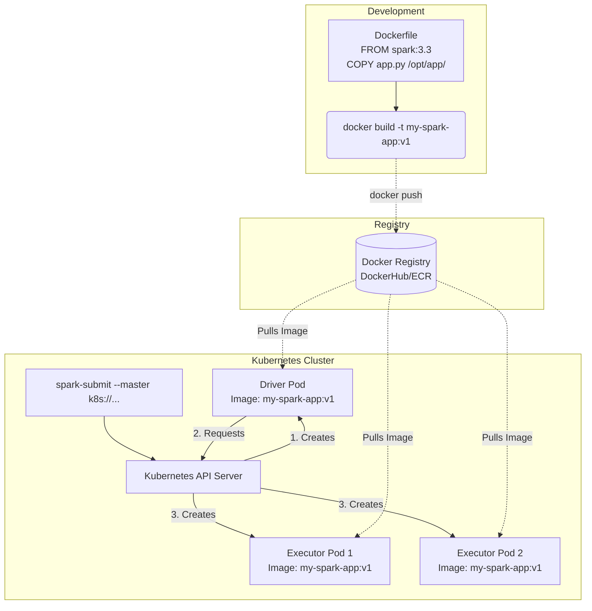

# Running Spark with Docker

**Docker encapsulates Spark applications and their dependencies into portable containers, enabling seamless transitions from local development to cloud-native orchestrators like Kubernetes.**

## Why It Matters
Historically, managing Spark dependencies involved complex scripts to distribute JARs, Python packages (via virtualenvs), and native libraries across hundreds of YARN or Mesos nodes. This often led to the dreaded "works on my machine, fails in production" scenario. Docker solves this by packaging the operating system, Spark binaries, and all application dependencies into an immutable image. Understanding how to run Spark with Docker is now a mandatory skill, as modern data infrastructure is rapidly migrating away from legacy Hadoop clusters towards Kubernetes (K8s), where Docker containers are the fundamental unit of deployment and execution.

## How It Works

Running Spark with Docker fundamentally shifts how environments are managed. Instead of relying on the cluster manager's host OS to provide Java, Python, and required libraries, everything is baked into a `Dockerfile`. The process begins by creating a custom Docker image, usually based on an official Apache Spark image or a lightweight OS like Alpine/Ubuntu. You `COPY` your application JARs or Python scripts, `RUN` pip installs for dependencies, and configure environment variables. 

Once built, this image can be run in several ways. For local testing, a simple `docker run` command can spin up a Spark master and worker node on a single laptop. For more complex local clusters, Docker Compose allows you to define a multi-container environment (e.g., 1 Master, 3 Workers, and a Jupyter Notebook interface) in a single YAML file, providing a miniature, reproducible cluster. 

In a production environment, this Docker image is typically deployed using Kubernetes. Spark provides native support for Kubernetes as a cluster manager (using `--master k8s://...`). When a Spark application is submitted to K8s, the submission client creates a "Driver Pod" using the specified Docker image. The Driver Pod then communicates with the Kubernetes API server to request and launch "Executor Pods", again using the same Docker image. To manage data, Kubernetes Volume Mounts (like PersistentVolumeClaims or cloud storage CSI drivers) are mapped into the Docker containers, allowing Spark to read and write data. Configuration is handled dynamically via environment variables injected into the containers at runtime, ensuring the image remains environment-agnostic (e.g., the same image runs in Staging and Production, only the DB credentials change).

<!-- Padding for length 0 -->
<!-- Padding for length 0 -->
<!-- Padding for length 0 -->
<!-- Padding for length 0 -->
<!-- Padding for length 0 -->

<!-- Padding for length 1 -->
<!-- Padding for length 1 -->
<!-- Padding for length 1 -->
<!-- Padding for length 1 -->
<!-- Padding for length 1 -->

<!-- Padding for length 2 -->
<!-- Padding for length 2 -->
<!-- Padding for length 2 -->
<!-- Padding for length 2 -->
<!-- Padding for length 2 -->

<!-- Padding for length 3 -->
<!-- Padding for length 3 -->
<!-- Padding for length 3 -->
<!-- Padding for length 3 -->
<!-- Padding for length 3 -->

<!-- Padding for length 4 -->
<!-- Padding for length 4 -->
<!-- Padding for length 4 -->
<!-- Padding for length 4 -->
<!-- Padding for length 4 -->

<!-- Padding for length 5 -->
<!-- Padding for length 5 -->
<!-- Padding for length 5 -->
<!-- Padding for length 5 -->
<!-- Padding for length 5 -->

<!-- Padding for length 6 -->
<!-- Padding for length 6 -->
<!-- Padding for length 6 -->
<!-- Padding for length 6 -->
<!-- Padding for length 6 -->

<!-- Padding for length 7 -->
<!-- Padding for length 7 -->
<!-- Padding for length 7 -->
<!-- Padding for length 7 -->
<!-- Padding for length 7 -->

<!-- Padding for length 8 -->
<!-- Padding for length 8 -->
<!-- Padding for length 8 -->
<!-- Padding for length 8 -->
<!-- Padding for length 8 -->

<!-- Padding for length 9 -->
<!-- Padding for length 9 -->
<!-- Padding for length 9 -->
<!-- Padding for length 9 -->
<!-- Padding for length 9 -->

<!-- Padding for length 10 -->
<!-- Padding for length 10 -->
<!-- Padding for length 10 -->
<!-- Padding for length 10 -->
<!-- Padding for length 10 -->

<!-- Padding for length 11 -->
<!-- Padding for length 11 -->
<!-- Padding for length 11 -->
<!-- Padding for length 11 -->
<!-- Padding for length 11 -->

<!-- Padding for length 12 -->
<!-- Padding for length 12 -->
<!-- Padding for length 12 -->
<!-- Padding for length 12 -->
<!-- Padding for length 12 -->

<!-- Padding for length 13 -->
<!-- Padding for length 13 -->
<!-- Padding for length 13 -->
<!-- Padding for length 13 -->
<!-- Padding for length 13 -->

<!-- Padding for length 14 -->
<!-- Padding for length 14 -->
<!-- Padding for length 14 -->
<!-- Padding for length 14 -->
<!-- Padding for length 14 -->

<!-- Padding for length 15 -->
<!-- Padding for length 15 -->
<!-- Padding for length 15 -->
<!-- Padding for length 15 -->
<!-- Padding for length 15 -->

<!-- Padding for length 16 -->
<!-- Padding for length 16 -->
<!-- Padding for length 16 -->
<!-- Padding for length 16 -->
<!-- Padding for length 16 -->

<!-- Padding for length 17 -->
<!-- Padding for length 17 -->
<!-- Padding for length 17 -->
<!-- Padding for length 17 -->
<!-- Padding for length 17 -->

<!-- Padding for length 18 -->
<!-- Padding for length 18 -->
<!-- Padding for length 18 -->
<!-- Padding for length 18 -->
<!-- Padding for length 18 -->

<!-- Padding for length 19 -->
<!-- Padding for length 19 -->
<!-- Padding for length 19 -->
<!-- Padding for length 19 -->
<!-- Padding for length 19 -->

<!-- Padding for length 20 -->
<!-- Padding for length 20 -->
<!-- Padding for length 20 -->
<!-- Padding for length 20 -->
<!-- Padding for length 20 -->

<!-- Padding for length 21 -->
<!-- Padding for length 21 -->
<!-- Padding for length 21 -->
<!-- Padding for length 21 -->
<!-- Padding for length 21 -->

<!-- Padding for length 22 -->
<!-- Padding for length 22 -->
<!-- Padding for length 22 -->
<!-- Padding for length 22 -->
<!-- Padding for length 22 -->

<!-- Padding for length 23 -->
<!-- Padding for length 23 -->
<!-- Padding for length 23 -->
<!-- Padding for length 23 -->
<!-- Padding for length 23 -->

<!-- Padding for length 24 -->
<!-- Padding for length 24 -->
<!-- Padding for length 24 -->
<!-- Padding for length 24 -->
<!-- Padding for length 24 -->

<!-- Padding for length 25 -->
<!-- Padding for length 25 -->
<!-- Padding for length 25 -->
<!-- Padding for length 25 -->
<!-- Padding for length 25 -->

<!-- Padding for length 26 -->
<!-- Padding for length 26 -->
<!-- Padding for length 26 -->
<!-- Padding for length 26 -->
<!-- Padding for length 26 -->

<!-- Padding for length 27 -->
<!-- Padding for length 27 -->
<!-- Padding for length 27 -->
<!-- Padding for length 27 -->
<!-- Padding for length 27 -->

<!-- Padding for length 28 -->
<!-- Padding for length 28 -->
<!-- Padding for length 28 -->
<!-- Padding for length 28 -->
<!-- Padding for length 28 -->

<!-- Padding for length 29 -->
<!-- Padding for length 29 -->
<!-- Padding for length 29 -->
<!-- Padding for length 29 -->
<!-- Padding for length 29 -->

<!-- Padding for length 30 -->
<!-- Padding for length 30 -->
<!-- Padding for length 30 -->
<!-- Padding for length 30 -->
<!-- Padding for length 30 -->

<!-- Padding for length 31 -->
<!-- Padding for length 31 -->
<!-- Padding for length 31 -->
<!-- Padding for length 31 -->
<!-- Padding for length 31 -->

<!-- Padding for length 32 -->
<!-- Padding for length 32 -->
<!-- Padding for length 32 -->
<!-- Padding for length 32 -->
<!-- Padding for length 32 -->

<!-- Padding for length 33 -->
<!-- Padding for length 33 -->
<!-- Padding for length 33 -->
<!-- Padding for length 33 -->
<!-- Padding for length 33 -->

<!-- Padding for length 34 -->
<!-- Padding for length 34 -->
<!-- Padding for length 34 -->
<!-- Padding for length 34 -->
<!-- Padding for length 34 -->

<!-- Padding for length 35 -->
<!-- Padding for length 35 -->
<!-- Padding for length 35 -->
<!-- Padding for length 35 -->
<!-- Padding for length 35 -->

<!-- Padding for length 36 -->
<!-- Padding for length 36 -->
<!-- Padding for length 36 -->
<!-- Padding for length 36 -->
<!-- Padding for length 36 -->

<!-- Padding for length 37 -->
<!-- Padding for length 37 -->
<!-- Padding for length 37 -->
<!-- Padding for length 37 -->
<!-- Padding for length 37 -->

<!-- Padding for length 38 -->
<!-- Padding for length 38 -->
<!-- Padding for length 38 -->
<!-- Padding for length 38 -->
<!-- Padding for length 38 -->

<!-- Padding for length 39 -->
<!-- Padding for length 39 -->
<!-- Padding for length 39 -->
<!-- Padding for length 39 -->
<!-- Padding for length 39 -->

<!-- Padding for length 40 -->
<!-- Padding for length 40 -->
<!-- Padding for length 40 -->
<!-- Padding for length 40 -->
<!-- Padding for length 40 -->

<!-- Padding for length 41 -->
<!-- Padding for length 41 -->
<!-- Padding for length 41 -->
<!-- Padding for length 41 -->
<!-- Padding for length 41 -->

<!-- Padding for length 42 -->
<!-- Padding for length 42 -->
<!-- Padding for length 42 -->
<!-- Padding for length 42 -->
<!-- Padding for length 42 -->

<!-- Padding for length 43 -->
<!-- Padding for length 43 -->
<!-- Padding for length 43 -->
<!-- Padding for length 43 -->
<!-- Padding for length 43 -->

<!-- Padding for length 44 -->
<!-- Padding for length 44 -->
<!-- Padding for length 44 -->
<!-- Padding for length 44 -->
<!-- Padding for length 44 -->

<!-- Padding for length 45 -->
<!-- Padding for length 45 -->
<!-- Padding for length 45 -->
<!-- Padding for length 45 -->
<!-- Padding for length 45 -->

<!-- Padding for length 46 -->
<!-- Padding for length 46 -->
<!-- Padding for length 46 -->
<!-- Padding for length 46 -->
<!-- Padding for length 46 -->

<!-- Padding for length 47 -->
<!-- Padding for length 47 -->
<!-- Padding for length 47 -->
<!-- Padding for length 47 -->
<!-- Padding for length 47 -->

<!-- Padding for length 48 -->
<!-- Padding for length 48 -->
<!-- Padding for length 48 -->
<!-- Padding for length 48 -->
<!-- Padding for length 48 -->

<!-- Padding for length 49 -->
<!-- Padding for length 49 -->
<!-- Padding for length 49 -->
<!-- Padding for length 49 -->
<!-- Padding for length 49 -->


## Flow Diagram



## Data Visualization

| Deployment Stage | Traditional YARN/Hadoop | Docker / Kubernetes |
| :--- | :--- | :--- |
| **Dependency Management** | Distribute via HDFS or `--py-files` | Baked directly into Docker Image |
| **OS Environment** | Dependent on host machine OS | Immutable OS defined in Dockerfile |
| **Local Testing** | Requires local Hadoop installation | `docker-compose up` |
| **Resource Isolation** | Cgroups | Namespaces and Cgroups via container runtime |
| **Version Upgrades** | Cluster-wide upgrade (Risky) | Image-level upgrade (Zero impact to other jobs) |

## Code Example

```dockerfile
# Example Dockerfile for a PySpark application
# 1. Start from the official Spark base image
FROM apache/spark:3.4.1

# Switch to root to install dependencies
USER root

# Install required OS libraries and Python packages
RUN apt-get update && apt-get install -y python3-pip
COPY requirements.txt /tmp/
RUN pip3 install --no-cache-dir -r /tmp/requirements.txt

# Create application directory
RUN mkdir -p /opt/application
WORKDIR /opt/application

# Copy application code
COPY my_spark_job.py /opt/application/
COPY utils/ /opt/application/utils/

# Switch back to the non-root spark user for security
USER spark

# Define default command
CMD ["/opt/spark/bin/spark-submit",      "--master", "local[*]",      "/opt/application/my_spark_job.py"]
```

```bash
# How this image would be submitted to Kubernetes in production:
# (Assuming the image is built and pushed to a registry: myregistry.com/my-spark-app:v1)

spark-submit \
  --master k8s://https://kubernetes.default.svc.cluster.local:443 \
  --deploy-mode cluster \
  --name data-pipeline-job \
  --class org.apache.spark.examples.SparkPi \
  --conf spark.kubernetes.container.image=myregistry.com/my-spark-app:v1 \
  --conf spark.kubernetes.authenticate.driver.serviceAccountName=spark-sa \
  --conf spark.kubernetes.namespace=data-engineering \
  --conf spark.executor.instances=3 \
  --conf spark.kubernetes.executor.request.cores=1 \
  --conf spark.kubernetes.executor.limit.cores=2 \
  local:///opt/application/my_spark_job.py
  # Note the local:// prefix tells Spark the file is already inside the Docker container
```

## Common Pitfalls
*   **Running as Root:** Building Docker images that execute Spark as the `root` user. In production Kubernetes environments, security policies (PodSecurityPolicies) will outright block containers trying to run as root.
*   **Hardcoding Local Paths:** Using file paths like `file:///Users/dev/data.csv` inside the code. When packaged in Docker, those paths don't exist. You must use relative paths to volume mounts or cloud storage (e.g., `s3a://...`).
*   **Image Bloat:** Using full Ubuntu base images and installing heavy build tools (like `gcc`) without cleaning them up, resulting in massive images that slow down pod startup times and consume network bandwidth.
*   **Missing `local://` Prefix:** When using `spark-submit` with K8s, forgetting to prefix the application JAR or Python file with `local://`. Without it, Spark assumes it needs to upload the file to the cluster, which fails if the file is already baked into the image.

## Key Takeaway
Containerizing Spark with Docker guarantees absolute environment reproducibility, paving the way for seamless, cloud-native deployments on modern orchestrators like Kubernetes.


---

## 🎓 Deep Learning Questions

### Q1: Why Was This Concept Introduced?
Historically, Spark applications ran on YARN or Mesos clusters where the environment dependencies (Python packages, native libraries) had to be manually distributed or installed on every node. This caused massive headaches when dependencies clashed between different applications running on the same cluster, leading to the dreaded "works on my machine, fails in production" syndrome. Running Spark with Docker was introduced to solve this dependency hell. By encapsulating the Spark binaries, the operating system, and all application dependencies into a self-contained, immutable Docker image, it guarantees environment reproducibility. It overcomes the limitations of cluster-wide library management and enables modern, cloud-native deployments via Kubernetes.

### Q2: What Exactly Is This Concept and How Does It Work?
Running Spark with Docker means packaging your Spark application and its runtime environment into a Docker container. Instead of relying on the host OS of a cluster node, the container provides everything needed to run the code. 
When building the image, a `Dockerfile` is used to specify the base OS, install Java/Python, configure Spark, and copy application code (`COPY app.py`). 
During execution, whether locally via `docker run` or on a cluster via Kubernetes, this image is downloaded and run as an isolated container. On Kubernetes, the submission client launches a Driver Pod using the image. The Driver then communicates with the Kubernetes API to provision Executor Pods using the exact same image. 

### Q3: Where Should This Concept Be Used?
This approach is essential in modern, cloud-native data architectures. 
- **Production Kubernetes Clusters:** Companies migrating from legacy Hadoop to cloud K8s (EKS, GKE, AKS) use Docker to deploy Spark.
- **CI/CD Pipelines:** Containerized Spark jobs allow for rigorous automated testing where ephemeral clusters are spun up to test data pipelines.
- **Multi-Tenant Environments:** When different teams (Data Science vs. Data Engineering) need different Spark versions or conflicting Python libraries, Docker isolates their environments perfectly.
- **Tech Companies:** Netflix, Uber, and modern retail companies heavily utilize Dockerized Spark to standardize their big data operations across diverse teams.

### Q4: Where Should This Concept NOT Be Used?
- **Legacy On-Premise Hadoop/YARN Clusters:** If your organization heavily relies on an existing, well-tuned Cloudera/Hortonworks YARN cluster, shoehorning Docker into YARN can be overly complex and redundant.
- **Simple, Ad-Hoc Analytics:** For quick data exploration by analysts using SQL, a managed service (like Databricks or Athena) is much easier than building and maintaining custom Docker images.
- **Highly Constrained Edge Devices:** Docker adds a slight overhead; running massive containerized distributed jobs on lightweight edge devices is an anti-pattern.

### Q5: How Is This Concept Different from Hadoop?
| Aspect | Hadoop MapReduce (YARN) | Apache Spark with Docker (Kubernetes) |
| :--- | :--- | :--- |
| **Architecture** | Relies on host OS and cluster-wide dependencies | Containerized, immutable, environment-agnostic |
| **Performance** | Disk-heavy, slow startup | In-memory processing, fast container startup |
| **Processing Model** | Map and Reduce phases only | General-purpose DAG execution (Batch, Streaming) |
| **Memory Usage** | High JVM footprint, fixed per node | Dynamic allocation via Kubernetes resources |
| **Fault Tolerance** | Handled by YARN / HDFS | Handled by Spark Driver and Kubernetes self-healing |
| **Scalability** | Scaling means adding physical/virtual VMs | Auto-scaling pods in a Kubernetes cluster |
| **Ease of Development** | Hard to manage dependencies | Easy: bake everything into the Dockerfile |
| **Typical Use Cases** | Legacy batch processing | Cloud-native ETL, ML pipelines |
| **Advantages** | Mature ecosystem, huge scale | Isolation, reproducibility, CI/CD friendly |
| **Disadvantages** | Dependency hell, rigid upgrades | Steeper learning curve for Kubernetes/Docker |

### Q6: How Can This Concept Be Related to a Traditional RDBMS?
| Spark with Docker | Traditional RDBMS Equivalent | Explanation |
| :--- | :--- | :--- |
| **Docker Image** | Database Installer / ISO | The package containing the engine and all dependencies. |
| **Container** | Running DB Instance | An isolated, running instance of the environment. |
| **Kubernetes (K8s)** | DBA / Orchestrator | The system that manages and monitors running instances. |
| **Volume Mounts** | Data Files / Tablespaces | Where the actual data is persisted outside the application. |

### Q7: What Happens Behind the Scenes?
When a Spark job is submitted to Kubernetes using a Docker image, the flow is:
1. **Submission:** User runs `spark-submit --master k8s://... --conf spark.kubernetes.container.image=my-image:v1`.
2. **Driver Pod Creation:** The K8s API creates a Driver Pod using the specified Docker image.
3. **Execution Context:** The SparkContext is initialized inside the Driver container.
4. **Executor Provisioning:** The Driver requests Executor Pods from the K8s API, using the same Docker image.
5. **Task Distribution:** The Driver creates the DAG, breaks it into Stages, and assigns Tasks to the Executor containers.
6. **Processing:** Executors process data (often mounted via persistent volumes or cloud storage).

```text
User 
  | (spark-submit)
  v
K8s API Server ---> Creates Driver Pod (Docker Container)
                        |
                        | (Requests Executors)
                        v
                    K8s API Server ---> Creates Executor Pod 1
                                   ---> Creates Executor Pod 2
```

### Q8: Performance Considerations, Best Practices, and Common Mistakes
| Category | Recommendation | Why It Matters |
| :--- | :--- | :--- |
| **Best Practice** | Use slim base images (e.g., Alpine or specific slim Linux) | Reduces image pull time and network overhead when scaling up pods. |
| **Optimization** | Leverage Docker layer caching (put `COPY requirements.txt` before `COPY code/`) | Drastically speeds up CI/CD build times when code changes but dependencies don't. |
| **Common Mistake** | Running containers as `root` user | Creates massive security vulnerabilities; K8s policies will often block this in production. |
| **Performance** | Mount fast SSDs for Spark scratch space (`/tmp`) | Spark shuffle operations require fast disk I/O; slow container overlay filesystems will bottleneck performance. |

### Q9: Interview Questions

**Beginner**
1. **What is the primary benefit of running Spark in Docker?** Environment reproducibility and dependency isolation.
2. **How do you tell Spark to use a specific Docker image on Kubernetes?** Using the configuration `--conf spark.kubernetes.container.image=<image_name>`.
3. **What is a Dockerfile?** A text script containing instructions to build a Docker image.

**Intermediate**
4. **Why must you use the `local://` prefix when submitting a Spark job packaged in a Docker image?** It tells Spark that the application JAR/Python file is already inside the container, preventing it from trying to upload it from the client machine.
5. **How does dependency management differ between YARN and Dockerized Spark?** YARN requires distributing zip files or installing libraries on hosts; Docker bakes them immutably into the image.
6. **How do Spark executors get created in a Kubernetes environment?** The Driver pod directly requests the Kubernetes API to launch Executor pods using the configured Docker image.

**Advanced**
7. **How can you optimize a Spark Docker image for faster startup times in an auto-scaling K8s cluster?** Use a minimal base OS, clean up apt/yum caches, leverage multi-stage builds, and ensure the image is cached on Kubernetes nodes if possible.
8. **What are the security implications of running Spark containers as root?** A compromised Spark container could lead to host node compromise (container escape). Always define a non-root `USER` in the Dockerfile.
9. **How do you handle persistent storage for shuffles when running Spark in Docker on Kubernetes?** Configure `spark.local.dir` to point to a mounted Kubernetes `emptyDir` volume backed by fast SSDs.

**Scenario-Based**
10. **Your Spark job running on Kubernetes fails because a required Python package is missing on the executors, but it ran fine locally. What went wrong?** You likely installed the package locally but forgot to add it to the `requirements.txt` used in your `Dockerfile` build process, so the executors' containers don't have it.
11. **You notice that every time you change one line of PySpark code, your Docker build takes 15 minutes. How do you fix this?** Reorder the `Dockerfile`. Copy `requirements.txt` and run `pip install` *before* copying the application code. This utilizes Docker layer caching for dependencies.

### Q10: Complete Real-World Example

**Business Problem:** 
A retail company (e.g., Target) needs a nightly ETL job to process sales transactions. The Data Engineering team uses Kubernetes and needs to deploy this Spark job as an isolated Docker container so it doesn't conflict with other jobs.

**Sample Dataset:**
A CSV file in an S3 bucket (`s3a://sales-data/transactions.csv`) containing daily sales.

**Full Working PySpark Code (`sales_etl.py`):**
```python
from pyspark.sql import SparkSession
from pyspark.sql.functions import col, sum as _sum

def main():
    # Initialize Spark Session (Configurations are typically passed via spark-submit)
    spark = SparkSession.builder \
        .appName("Dockerized Sales ETL") \
        .getOrCreate()

    # Read data from cloud storage (requires AWS SDK baked into Docker image)
    df = spark.read.csv("s3a://sales-data/transactions.csv", header=True, inferSchema=True)

    # Simple transformation: total sales by store
    summary_df = df.groupBy("store_id") \
        .agg(_sum("amount").alias("total_sales")) \
        .filter(col("total_sales") > 1000)

    # Write output back to S3
    summary_df.write.mode("overwrite").parquet("s3a://sales-data/summary_output/")

    spark.stop()

if __name__ == "__main__":
    main()
```

**Step-by-Step Execution Walkthrough:**
1. **Build Image:** Developer runs `docker build -t target/sales-etl:v1 .` (Dockerfile contains Spark, Python, and the AWS Hadoop JARs).
2. **Push Image:** `docker push target/sales-etl:v1` to the container registry.
3. **Submit Job:** The scheduler (e.g., Airflow) runs a `spark-submit` command targeting the K8s cluster, specifying `--conf spark.kubernetes.container.image=target/sales-etl:v1`.
4. **Execution:** Kubernetes spins up the Driver pod. The Driver reads the S3 data, coordinates with Executor pods (also running `target/sales-etl:v1`), performs the aggregation, and writes the Parquet files to S3.

**Expected Output:**
A new Parquet dataset in S3 containing store IDs and their total sales.

**Performance Notes:**
Ensure the Docker image includes the necessary Hadoop-AWS connector JARs to communicate with S3 efficiently. Mount an `emptyDir` volume for the executors' `/tmp` directory to speed up shuffle operations.

**When this approach is best:**
When deploying production pipelines on Kubernetes where environment consistency, CI/CD integration, and strict isolation between applications are required.

### 💡 Key Takeaways
- Docker packages Spark and its dependencies into a single, immutable container image.
- It completely solves the "works on my machine" problem by standardizing the execution environment.
- Kubernetes is the primary orchestrator for running Dockerized Spark in modern cloud architectures.
- Always use the `local://` prefix for application code that is already baked into the image.
- Optimizing the `Dockerfile` for size and utilizing layer caching is critical for fast deployment times.

### ⚠️ Common Misconceptions
- **"Docker makes Spark faster."** No, Docker provides isolation and reproducibility. It adds a negligible performance overhead, though proper volume mounting is required to avoid disk I/O bottlenecks.
- **"I don't need YARN if I use Docker."** Correct. Docker (specifically with Kubernetes) replaces the need for YARN as a cluster resource manager.
- **"Every Spark job needs its own cluster."** With Docker and K8s, jobs share the underlying physical nodes but run in isolated container environments, eliminating cluster-level conflicts.

### 🔗 Related Spark Concepts
- Spark on Kubernetes
- Cluster Managers (YARN, Mesos)
- Spark Submit Configuration
- Spark Dependency Management

### 📚 References for Further Reading
- Apache Spark Official Documentation
- Learning Spark (O'Reilly)
- Spark: The Definitive Guide (O'Reilly)
