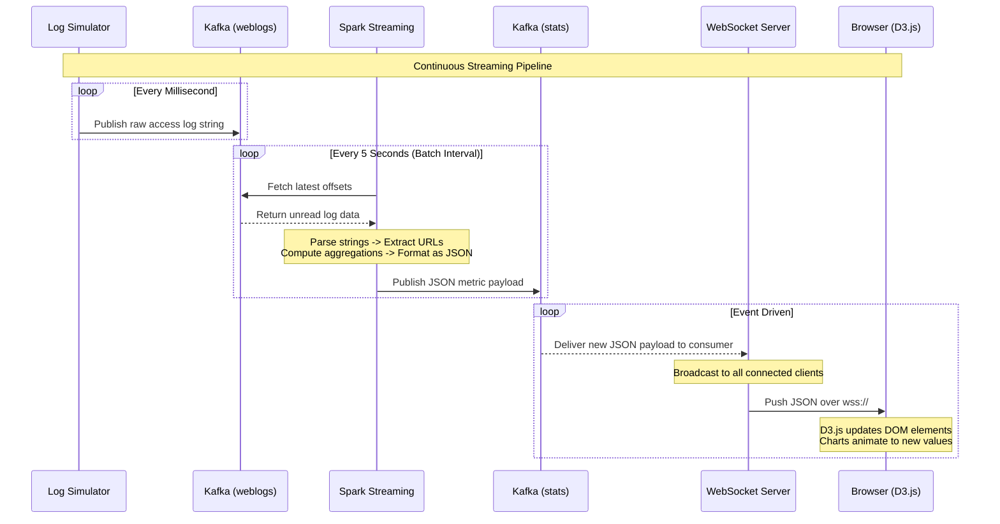

# Real-Time Dashboard Architecture

**The structural backbone connecting log generation, stream processing, and real-time visualization into a cohesive, low-latency system.**

## Why It Matters

Understanding the architecture of a real-time analytics system is crucial because writing the code is only half the battle; the other half is ensuring the components communicate reliably, scale independently, and fail gracefully. In an enterprise environment, a dashboard cannot afford to drop data when traffic spikes or freeze when a single node goes down. By dissecting the architecture into distinct modules—Log Simulator, Message Broker, Stream Processing Engine, WebSocket Server, and Frontend—we establish clear boundaries of responsibility. This modular design allows teams to swap out technologies (e.g., replacing a Node.js WebSocket server with a Go server) without rewriting the Spark processing logic. It represents the gold standard for how modern data engineering pipelines are built for production.

## How It Works

The architecture of our real-time dashboard is a classic example of the Lambda or Kappa architecture patterns, specifically focusing on the speed layer. The system is designed as a unidirectional data flow pipeline, where data originates at the edge, flows through a central nervous system, gets processed, and is ultimately pushed to the end-user's screen.

The journey begins with the **Log Simulator**. In a real-world scenario, this would be an array of Nginx or Apache web servers handling user traffic. For our case study, it is a standalone Java or Python application that randomly generates HTTP access logs. These logs mimic user behavior, including occasional bursts of traffic or error spikes. Instead of saving these logs to a local disk, the simulator acts as a Kafka Producer, serializing the raw strings and publishing them to a specific Kafka topic named `weblogs`. Kafka guarantees that these logs are durable and ordered within their partitions.

The core of the architecture is the **Spark Streaming Analyzer**. This application operates in a micro-batch paradigm. It utilizes Kafka's Direct Stream API to connect to the `weblogs` topic, meaning it queries Kafka directly for offsets and pulls data accordingly, ensuring exactly-once semantics and eliminating the need for a Write-Ahead Log (WAL) in Spark. Every 5 seconds, Spark pulls the latest logs, parses them via regex, and computes aggregations like requests per second and top URLs. Crucially, Spark does not store these aggregations in a database; instead, it acts as a Kafka Producer itself, pushing the summarized JSON payloads to a second Kafka topic named `stats`.

The final leg of the architecture bridges the gap between backend infrastructure and the user's browser. A **WebSocket Server** (often built in Node.js with the `ws` library or Java with Jetty) operates continuously, consuming the `stats` topic from Kafka. When it receives a new JSON payload, it does not wait for a browser to request it. Instead, it iterates through a list of all currently active WebSocket connections and pushes the payload directly to them. The **Dashboard Frontend**, a single-page HTML application, maintains a persistent TCP connection to the WebSocket server. As data arrives, the browser passes it to D3.js, which instantly animates the charts to reflect the new state, completing the real-time pipeline.

## Flow Diagram



## Data Visualization

Understanding the architectural handoffs is easier when viewing the state of the data as it crosses network boundaries.

| Component | Responsibility | Ingress Format | Egress Format | Transport Layer |
|---|---|---|---|---|
| **Log Simulator** | Generate fake traffic | N/A | Raw string (Log line) | TCP (Kafka Protocol) |
| **Kafka (weblogs)** | Buffer raw logs | Raw string | Raw string | TCP (Kafka Protocol) |
| **Spark Streaming** | Aggregate & compute | Raw string | JSON Document | TCP (Kafka Protocol) |
| **Kafka (stats)** | Buffer metrics | JSON Document | JSON Document | TCP (Kafka Protocol) |
| **WebSocket Server** | Broadcast to clients | JSON Document | JSON Document | WebSockets (TCP) |
| **Browser (D3.js)** | Render visualizations | JSON Document | Rendered SVG/DOM | Display Screen |

## Code Example

This code demonstrates the architectural boundaries, specifically how a Python Log Simulator might interact with Kafka to kick off the pipeline.

```python
# Log Simulator - Architecture Entry Point
import time
import random
from kafka import KafkaProducer
from datetime import datetime

# Initialize Kafka Producer targeting the 'weblogs' topic
producer = KafkaProducer(
    bootstrap_servers=['localhost:9092'],
    value_serializer=lambda x: x.encode('utf-8')
)

endpoints = ['/home', '/login', '/api/data', '/checkout']
status_codes = [200, 200, 200, 200, 301, 404, 500]

def generate_log_line():
    """Generates a fake Apache access log line."""
    ip = f"192.168.1.{random.randint(1, 255)}"
    timestamp = datetime.now().strftime('%d/%b/%Y:%H:%M:%S +0000')
    endpoint = random.choice(endpoints)
    status = random.choice(status_codes)
    bytes_sent = random.randint(500, 5000)
    
    return f'{ip} - - [{timestamp}] "GET {endpoint} HTTP/1.1" {status} {bytes_sent}'

if __name__ == "__main__":
    print("Starting Log Simulator. Pumping to Kafka 'weblogs' topic...")
    try:
        while True:
            log_line = generate_log_line()
            # The architecture requires we push to Kafka, handing off responsibility
            producer.send('weblogs', value=log_line)
            
            # Simulate variable traffic load
            time.sleep(random.uniform(0.01, 0.1)) 
    except KeyboardInterrupt:
        producer.close()
        print("Simulator stopped.")
```

## Common Pitfalls

* **Tight Coupling:** Attempting to have Spark push directly to the WebSockets or Browser bypassing the second Kafka topic. This breaks the architecture; if the WebSocket server is down, Spark will crash or block.
* **Ignoring Backpressure:** If the Log Simulator produces logs faster than Spark can process them (e.g., 100k events/sec vs 10k events/sec capacity), Spark's memory will blow up unless backpressure (`spark.streaming.backpressure.enabled`) is configured.
* **Single Point of Failure:** Running only one instance of the WebSocket server. If it crashes, the dashboard goes dark, even though Spark and Kafka are fine. WebSocket servers should be load-balanced.
* **Overloading the UI:** Architectures that attempt to send every raw log line to the browser. Browsers cannot render 10,000 DOM updates a second; the architecture *must* aggregate on the server side (Spark) first.
* **Port Conflicts:** Running Kafka, Zookeeper, Spark Driver, Node.js, and a Web Server all on `localhost` during development often leads to port collisions (e.g., multiple things fighting for port 8080).

## Key Takeaway

A robust real-time architecture decouples data ingestion, processing, and visualization using message brokers, ensuring that a bottleneck or failure in one component does not collapse the entire pipeline.


---

## 🎓 Deep Learning Questions

### Q1: Why Was This Concept Introduced?
Before the advent of unified real-time dashboard architectures, organizations relied on batch processing systems that took hours or even days to deliver analytical results. This approach was highly problematic for time-sensitive operations like fraud detection, network monitoring, and live user engagement tracking. Early attempts to solve this involved tightly coupled systems where web servers wrote directly to databases, which were then polled aggressively by dashboard UIs. This architecture was fragile; traffic spikes would crash the database, and polling introduced high latency and massive overhead. 

The Kafka-Spark Streaming-WebSocket architecture was introduced to overcome these limitations by decoupling ingestion, processing, and delivery. Kafka acts as a shock absorber, safely holding bursts of incoming data. Spark Streaming processes data incrementally in memory without touching slow disks. WebSockets replaced HTTP polling, allowing the server to push updates to the browser instantly. This paradigm shift finally enabled true sub-second latency analytics while remaining highly available, scalable, and resilient to failure.

### Q2: What Exactly Is This Concept and How Does It Work?
A Real-Time Dashboard Architecture is an end-to-end data pipeline designed to ingest, process, and visualize high-velocity streaming data continuously. It acts as the central nervous system for live data.

Here is how the execution flow works:
1. **Ingestion**: Edge devices (like web servers, mobile apps, or IoT sensors) act as publishers, sending raw, granular events into a message broker like Apache Kafka. Kafka buffers these messages into topics, guaranteeing ordering and fault tolerance.
2. **Stream Processing**: Apache Spark Streaming continuously consumes data from the Kafka topic in micro-batches (or continuously, using Structured Streaming). It parses the raw strings, extracts relevant fields, filters out noise, and computes aggregations (e.g., rolling counts, averages, windowed metrics) in distributed memory.
3. **Egress**: Instead of writing the aggregated results to a slow relational database, Spark publishes the summarized metric payloads (often in JSON format) back to a secondary Kafka topic (e.g., `dashboard-metrics`).
4. **Push Delivery**: A lightweight WebSocket server (built with Node.js or similar) subscribes to this secondary topic. Whenever a new JSON payload arrives, the server immediately broadcasts it over persistent TCP connections to all connected browser clients.
5. **Visualization**: The front-end application (using D3.js or React) receives the pushed JSON payload and updates the DOM or Canvas elements, animating the charts to reflect the real-time state without requiring a page refresh.

### Q3: Where Should This Concept Be Used?
This decoupled, stream-first architecture is heavily utilized in industries requiring immediate reaction to changing data. 

- **E-Commerce & Retail (Amazon):** Tracking live Black Friday sales volumes, cart abandonment rates, and real-time inventory depletion to dynamically adjust pricing.
- **Transportation (Uber/Lyft):** Displaying live surge pricing maps, driver locations, and real-time ride request densities to regional managers.
- **Streaming Media (Netflix):** Monitoring content delivery network (CDN) health, live concurrent viewers during major releases, and buffering rates to preemptively reroute traffic.
- **Finance & Banking:** Visualizing live transaction volumes and flagging anomalous spikes indicative of a coordinated fraud attack.
- **Infrastructure & DevOps:** Real-time health monitoring of microservices (CPU, memory, request latency) via tools like Grafana, alerting engineers before systems crash.

### Q4: Where Should This Concept NOT Be Used?
Despite its power, this architecture introduces significant operational complexity and should be avoided when simple solutions suffice.

- **Historical Reporting:** If the business only needs a daily, weekly, or monthly report (e.g., end-of-month financial reconciliation), building a real-time streaming pipeline is massive overkill. A nightly batch job running on static data in an S3 data lake is much cheaper and easier to maintain.
- **Perfect Accuracy Over Speed:** Micro-batch streaming with late-arriving data can sometimes yield approximate results depending on watermarking logic. If absolute 100% precision is required (like in regulatory tax reporting), batch processing on finalized datasets is preferred.
- **Low-Traffic Environments:** If your application generates only a few hundred events an hour, deploying a multi-node Kafka cluster and a Spark Streaming application introduces unnecessary infrastructure cost and maintenance burden. A simple CRUD app with a SQL database is sufficient.

### Q5: How Is This Concept Different from Hadoop?

| Aspect | Hadoop MapReduce Ecosystem | Spark Real-Time Architecture |
|---|---|---|
| **Architecture** | Batch-oriented (HDFS -> MapReduce -> HDFS). | Stream-oriented (Kafka -> Spark In-Memory -> WebSockets). |
| **Performance** | High latency (minutes to hours). | Low latency (sub-second to seconds). |
| **Processing Model** | Discrete batch processing. Reads from disk. | Continuous micro-batches or continuous processing. |
| **Memory Usage** | Writes intermediate steps heavily to disk. | Retains intermediate state in memory. |
| **Fault Tolerance** | Replicates blocks on HDFS disk. | Recovers state using RDD lineage and Kafka offsets. |
| **Scalability** | Scales well for massive, static datasets. | Scales well for high-throughput, continuous data streams. |
| **Typical Use Cases** | Nightly ETL, historical data mining, search indexing. | Live dashboards, fraud detection, immediate alerting. |
| **Advantages** | Simple to reason about, cheap storage, perfect accuracy. | Immediate insights, responsive to change, highly decoupled. |
| **Disadvantages** | Completely unusable for real-time live monitoring. | Complex to deploy, maintain, and tune (e.g., managing backpressure). |

### Q6: How Can This Concept Be Related to a Traditional RDBMS?

| RDBMS Concept | Real-Time Dashboard Architecture Equivalent | Explanation |
|---|---|---|
| **INSERT INTO (Table)** | Kafka Producer publishing to a Topic | Instead of writing rows to a static table, data is pushed as an event stream. |
| **Table** | Kafka Topic | A table holds rows at rest; a topic holds an immutable sequence of events in motion. |
| **Materialized View** | Spark Streaming Aggregation | Spark computes live aggregates (like a view), but pushes the result forward rather than storing it. |
| **SELECT * WHERE ...** | Spark `filter()` Transformation | Data is filtered dynamically in memory as it arrives. |
| **Trigger** | Kafka Consumer / WebSocket Server | Instead of a database trigger reacting to a row change, the WebSocket server reacts to a new message. |
| **Client Polling (SELECT query)** | WebSocket Push | Rather than the client asking "Is there new data?", the server says "Here is the new data!" |

### Q7: What Happens Behind the Scenes?
The execution flow from raw event to pixel on a screen involves multiple distributed components working in harmony.

1. **Ingress (Kafka Producer):** An application generates an event, serializes it, and sends it to a Kafka broker. The broker appends the message to a partition log and assigns it an offset.
2. **Spark Driver & Receiver/Direct Stream:** The Spark Driver tracks the latest Kafka offsets. It schedules a micro-batch job every *N* seconds to process the range of offsets received since the last batch.
3. **Task Execution (Spark Executors):** The Driver creates a DAG and assigns Tasks to Executors. The Executors read the specific Kafka partitions directly, pull the raw messages into memory, and execute the transformations (map, filter, reduceByKey).
4. **State Management:** If doing windowed aggregations, Spark maintains intermediate state in memory, backed by a checkpoint directory (e.g., on HDFS/S3) for fault recovery.
5. **Egress (Spark to Kafka):** The Executor tasks format the final aggregated results as JSON and act as Kafka Producers, writing the payloads to an output Kafka topic.
6. **Delivery (Node.js & WebSockets):** A Node.js process acts as a Kafka Consumer. It reads the new JSON payload from the output topic. It loops over its list of open WebSocket connections and writes the JSON payload to the underlying TCP sockets.
7. **Rendering:** The browser receives the WebSocket frame, triggers a JavaScript event listener, and hands the JSON to a visualization library like D3.js to update the SVG nodes.

```text
[Raw Event]
    │
    ▼
┌──────────────────┐
│  Kafka (weblogs) │ (Message Broker, Buffering)
└────────┬─────────┘
         │ (Pull via Direct Stream)
    ┌────┴────┐
    │  Spark  │ (Executors: Parse -> Filter -> Aggregate)
    └────┬────┘
         │ (Push computed metrics)
         ▼
┌──────────────────┐
│  Kafka (stats)   │ (Secondary Broker)
└────────┬─────────┘
         │ (Consume)
    ┌────┴────┐
    │ Node.js │ (WebSocket Server)
    └────┬────┘
         │ (Push via ws://)
         ▼
┌──────────────────┐
│ Browser (D3.js)  │ (Live Visualization)
└──────────────────┘
```

### Q8: Performance Considerations, Best Practices, and Common Mistakes

| Category | Recommendation | Why It Matters |
|---|---|---|
| **Performance** | Enable Spark Backpressure (`spark.streaming.backpressure.enabled=true`). | Prevents Spark from ingesting more data than it can process during sudden traffic spikes, avoiding OOM errors. |
| **Best Practice** | Keep UI payloads small. Pre-aggregate in Spark. | Browsers cannot handle thousands of updates per second. Sending pre-calculated metrics (e.g., "500 requests/sec") saves bandwidth and CPU. |
| **Best Practice** | Use Kafka Direct Stream over Receiver-based approaches. | Direct Stream provides Exactly-Once semantics and doesn't require Spark Write-Ahead Logs (WAL), improving performance. |
| **Mistake** | Querying a relational database from within a Spark `map` function per event. | Creates massive network overhead and will likely DDoS your own database. If joining data, broadcast the static data instead. |
| **Mistake** | Trying to visualize raw, un-windowed data streams. | Causes the UI to flicker wildly and provides no analytical value to the human eye. Always use windowed sliding averages. |

### Q9: Interview Questions

**Beginner:**
1. **Why do we use Kafka between the web servers and Spark?** 
   *Answer:* Kafka acts as a durable buffer. It decouples the systems so that if Spark goes down or slows down, the web servers can still quickly write logs without failing or blocking.
2. **Why use WebSockets instead of REST API polling?**
   *Answer:* Polling creates massive HTTP overhead and delays. WebSockets provide a persistent, bi-directional connection allowing the server to push data instantly with low latency.
3. **What is a Spark Streaming micro-batch?**
   *Answer:* Instead of processing data continuously event-by-event, Spark groups streaming data into small chunks (e.g., 5 seconds of data) and processes them as small, rapid batch jobs.

**Intermediate:**
4. **How do you handle a scenario where Spark processes data slower than it arrives?**
   *Answer:* Enable Spark's backpressure mechanism. It dynamically adjusts the ingestion rate based on the current processing speed, ensuring the system remains stable (though lag will increase in Kafka).
5. **Explain exactly-once semantics in the context of Kafka and Spark.**
   *Answer:* Using the Kafka Direct API, Spark manages Kafka offsets internally. When it checkpoints, it saves both the offsets and the state. If it fails, it restarts from the exact offset, ensuring no data is lost or processed twice.
6. **Why push metrics back to a second Kafka topic instead of directly to WebSockets?**
   *Answer:* Separation of concerns and scalability. You might want to run multiple WebSocket server instances for load balancing, or have another service (like an alert system) also consume the metrics. A second Kafka topic enables this pub/sub flexibility.

**Advanced:**
7. **If the WebSocket server crashes, how do the connected clients recover?**
   *Answer:* The client-side JavaScript must implement a reconnection strategy (e.g., exponential backoff) to attempt reconnecting to a load balancer. Once reconnected, the UI waits for the next pushed metric payload to update its state.
8. **How does data serialization format impact the pipeline?**
   *Answer:* JSON is easy to parse but verbose. For high-throughput internal topics (like `weblogs`), binary formats like Avro or Protobuf are vastly superior because they enforce schema and dramatically reduce network I/O and CPU serialization time. JSON is usually reserved for the final push to the web browser.
9. **How do you handle late-arriving data in this architecture?**
   *Answer:* Using Spark Structured Streaming, we use event-time processing and define "watermarks." A watermark tells Spark how long to wait for late data before finalizing the window aggregation and dropping older events.

**Scenario-Based:**
10. **The real-time dashboard is showing spikes that drop back to zero unexpectedly. Where do you look?**
    *Answer:* Check the Spark micro-batch interval and the windowing logic. If the dashboard updates every second, but Spark only pushes data every 5 seconds, the UI might be timing out or resetting. Ensure the UI's expectation matches the emission rate of the pipeline.
11. **Your architecture works perfectly in development but the UI freezes in production. What is the likely cause?**
    *Answer:* The UI is likely being overwhelmed by data volume. In development, logs were sparse. In production, you might be pushing hundreds of metrics per second. You must ensure Spark is aggressively aggregating data (e.g., down to 1 payload per second) before pushing it to the WebSocket server.

### Q10: Complete Real-World Example

**Business Problem:** 
A global streaming company, "StreamFlix," needs a real-time command center to monitor live video buffering rates across different regions. If the buffering rate exceeds 5% in a specific region, network engineers must be alerted instantly to reroute CDN traffic.

**Sample Dataset Description:**
Raw JSON logs arriving in a Kafka topic `video-events`.
```json
{"user_id": 9876, "region": "US-EAST", "event": "buffer", "timestamp": "2023-10-27T10:05:22Z"}
{"user_id": 1234, "region": "EU-WEST", "event": "play", "timestamp": "2023-10-27T10:05:23Z"}
```

**Full Working PySpark Code:**
```python
from pyspark.sql import SparkSession
from pyspark.sql.functions import col, from_json, window, count, when
from pyspark.sql.types import StructType, StructField, StringType, TimestampType

# 1. Initialize Spark Structured Streaming
spark = SparkSession.builder \
    .appName("StreamFlix_Buffering_Monitor") \
    .getOrCreate()

# 2. Define the schema for the incoming JSON
schema = StructType([
    StructField("user_id", StringType(), True),
    StructField("region", StringType(), True),
    StructField("event", StringType(), True),
    StructField("timestamp", TimestampType(), True)
])

# 3. Read stream directly from Kafka (Ingestion Layer)
raw_kafka_df = spark.readStream \
    .format("kafka") \
    .option("kafka.bootstrap.servers", "broker1:9092,broker2:9092") \
    .option("subscribe", "video-events") \
    .load()

# 4. Parse JSON and extract fields (Processing Layer)
parsed_df = raw_kafka_df.select(
    from_json(col("value").cast("string"), schema).alias("data")
).select("data.*")

# 5. Compute rolling aggregations (1-minute window, updating every 10 seconds)
# Calculate total events and total buffer events per region
agg_df = parsed_df \
    .withWatermark("timestamp", "1 minute") \
    .groupBy(
        window(col("timestamp"), "1 minute", "10 seconds"),
        col("region")
    ) \
    .agg(
        count("*").alias("total_events"),
        count(when(col("event") == "buffer", True)).alias("buffer_events")
    )

# Calculate buffering percentage
final_metrics_df = agg_df.withColumn(
    "buffer_percentage", 
    (col("buffer_events") / col("total_events")) * 100
)

# Format for the UI as JSON
json_output_df = final_metrics_df.selectExpr(
    "to_json(struct(*)) AS value"
)

# 6. Write stream back to Kafka for the WebSocket server (Egress Layer)
query = json_output_df.writeStream \
    .format("kafka") \
    .option("kafka.bootstrap.servers", "broker1:9092,broker2:9092") \
    .option("topic", "dashboard-metrics") \
    .option("checkpointLocation", "s3a://streamflix-checkpoints/buffering/") \
    .outputMode("update") \
    .start()

query.awaitTermination()
```

**Step-by-Step Execution Walkthrough:**
1. Clients stream video and send lightweight ping events (play, buffer, pause) to a Kafka ingest cluster.
2. Spark reads these continuous bytes, casting them to strings and applying the JSON schema.
3. Using `withWatermark`, Spark allows data to be up to 1 minute late before discarding it.
4. Spark groups the data by region and applies a sliding window. Every 10 seconds, it calculates the metrics for the last 60 seconds.
5. It computes the `buffer_percentage` by dividing buffer events by total events.
6. The resulting DataFrame is packed back into a single JSON column named `value`.
7. This JSON is published to the `dashboard-metrics` Kafka topic.
8. A separate Node.js server consumes this topic and broadcasts the JSON to the engineering dashboard via WebSockets, allowing the D3.js map to turn a region "red" if the percentage > 5%.

**Expected Output:**
In the secondary Kafka topic `dashboard-metrics`, messages like this will appear:
```json
{"window": {"start": "2023-10-27T10:04:00.000Z", "end": "2023-10-27T10:05:00.000Z"}, "region": "US-EAST", "total_events": 5000, "buffer_events": 300, "buffer_percentage": 6.0}
```

**Performance Notes:**
- Setting `spark.sql.shuffle.partitions` to a low number (e.g., 10-20) is critical here. The default of 200 will cause massive overhead for small streaming micro-batches.
- We output using `.outputMode("update")` so we only send regions whose metrics have actually changed, saving bandwidth to the UI.

**When This Approach is Best:**
This pattern is ideal for high-stakes operational monitoring where delays of even a few minutes can cost the company thousands of dollars in SLA breaches or customer churn.

### 💡 Key Takeaways
- Decoupling is mandatory: Never connect Spark directly to the UI; always use an intermediary message broker.
- Kafka handles the immense inbound scale, while Spark handles the heavy compute.
- WebSockets are the standard for pushing low-latency updates from backend servers to browser clients.
- Always aggregate server-side: Browsers crash if you send them millions of raw events.
- Structured Streaming with event-time windowing provides robust handling of late data and continuous updates.

### ⚠️ Common Misconceptions
- **"Spark pushes data to the browser."** Spark pushes to Kafka or a DB; a dedicated web tier (Node/Java/Python) handles the WebSocket connections to the browser.
- **"Real-time means processing every event individually."** In Spark (micro-batching), it means processing small chunks rapidly (e.g., every 1-5 seconds), which is functionally real-time for human dashboards.
- **"I don't need a UI backend."** You cannot securely or reliably connect a web browser directly to a Kafka broker in an enterprise environment; the WebSocket backend is essential.

### 🔗 Related Spark Concepts
- Structured Streaming
- Kafka Integration & Direct Stream API
- Sliding Windows and Event-Time Processing
- Output Modes (Append, Update, Complete)
- Watermarking

### 📚 References for Further Reading
- Apache Spark Official Documentation: Structured Streaming Programming Guide
- Learning Spark (O'Reilly) - Chapter 8: Structured Streaming
- Spark: The Definitive Guide (O'Reilly) - Part IV: Streaming
