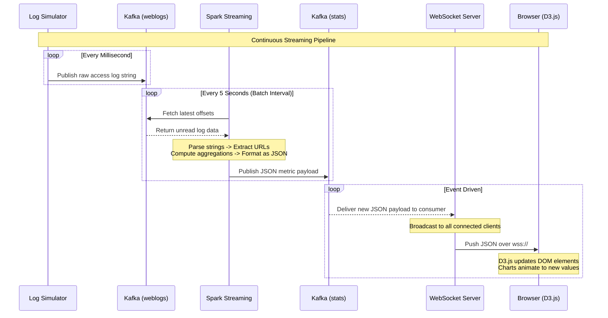

# Real-Time Dashboard Architecture

**The structural backbone connecting log generation, stream processing, and real-time visualization into a cohesive, low-latency system.**

## Why It Matters

Understanding the architecture of a real-time analytics system is crucial because writing the code is only half the battle; the other half is ensuring the components communicate reliably, scale independently, and fail gracefully. In an enterprise environment, a dashboard cannot afford to drop data when traffic spikes or freeze when a single node goes down. By dissecting the architecture into distinct modules—Log Simulator, Message Broker, Stream Processing Engine, WebSocket Server, and Frontend—we establish clear boundaries of responsibility. This modular design allows teams to swap out technologies (e.g., replacing a Node.js WebSocket server with a Go server) without rewriting the Spark processing logic. It represents the gold standard for how modern data engineering pipelines are built for production.

## How It Works

The architecture of our real-time dashboard is a classic example of the Lambda or Kappa architecture patterns, specifically focusing on the speed layer. The system is designed as a unidirectional data flow pipeline, where data originates at the edge, flows through a central nervous system, gets processed, and is ultimately pushed to the end-user's screen.

The journey begins with the **Log Simulator**. In a real-world scenario, this would be an array of Nginx or Apache web servers handling user traffic. For our case study, it is a standalone Java or Python application that randomly generates HTTP access logs. These logs mimic user behavior, including occasional bursts of traffic or error spikes. Instead of saving these logs to a local disk, the simulator acts as a Kafka Producer, serializing the raw strings and publishing them to a specific Kafka topic named `weblogs`. Kafka guarantees that these logs are durable and ordered within their partitions.

The core of the architecture is the **Spark Streaming Analyzer**. This application operates in a micro-batch paradigm. It utilizes Kafka's Direct Stream API to connect to the `weblogs` topic, meaning it queries Kafka directly for offsets and pulls data accordingly, ensuring exactly-once semantics and eliminating the need for a Write-Ahead Log (WAL) in Spark. Every 5 seconds, Spark pulls the latest logs, parses them via regex, and computes aggregations like requests per second and top URLs. Crucially, Spark does not store these aggregations in a database; instead, it acts as a Kafka Producer itself, pushing the summarized JSON payloads to a second Kafka topic named `stats`.

The final leg of the architecture bridges the gap between backend infrastructure and the user's browser. A **WebSocket Server** (often built in Node.js with the `ws` library or Java with Jetty) operates continuously, consuming the `stats` topic from Kafka. When it receives a new JSON payload, it does not wait for a browser to request it. Instead, it iterates through a list of all currently active WebSocket connections and pushes the payload directly to them. The **Dashboard Frontend**, a single-page HTML application, maintains a persistent TCP connection to the WebSocket server. As data arrives, the browser passes it to D3.js, which instantly animates the charts to reflect the new state, completing the real-time pipeline.

## Flow Diagram



## Data Visualization

Understanding the architectural handoffs is easier when viewing the state of the data as it crosses network boundaries.

| Component | Responsibility | Ingress Format | Egress Format | Transport Layer |
|---|---|---|---|---|
| **Log Simulator** | Generate fake traffic | N/A | Raw string (Log line) | TCP (Kafka Protocol) |
| **Kafka (weblogs)** | Buffer raw logs | Raw string | Raw string | TCP (Kafka Protocol) |
| **Spark Streaming** | Aggregate & compute | Raw string | JSON Document | TCP (Kafka Protocol) |
| **Kafka (stats)** | Buffer metrics | JSON Document | JSON Document | TCP (Kafka Protocol) |
| **WebSocket Server** | Broadcast to clients | JSON Document | JSON Document | WebSockets (TCP) |
| **Browser (D3.js)** | Render visualizations | JSON Document | Rendered SVG/DOM | Display Screen |

## Code Example

This code demonstrates the architectural boundaries, specifically how a Python Log Simulator might interact with Kafka to kick off the pipeline.

```python
# Log Simulator - Architecture Entry Point
import time
import random
from kafka import KafkaProducer
from datetime import datetime

# Initialize Kafka Producer targeting the 'weblogs' topic
producer = KafkaProducer(
    bootstrap_servers=['localhost:9092'],
    value_serializer=lambda x: x.encode('utf-8')
)

endpoints = ['/home', '/login', '/api/data', '/checkout']
status_codes = [200, 200, 200, 200, 301, 404, 500]

def generate_log_line():
    """Generates a fake Apache access log line."""
    ip = f"192.168.1.{random.randint(1, 255)}"
    timestamp = datetime.now().strftime('%d/%b/%Y:%H:%M:%S +0000')
    endpoint = random.choice(endpoints)
    status = random.choice(status_codes)
    bytes_sent = random.randint(500, 5000)
    
    return f'{ip} - - [{timestamp}] "GET {endpoint} HTTP/1.1" {status} {bytes_sent}'

if __name__ == "__main__":
    print("Starting Log Simulator. Pumping to Kafka 'weblogs' topic...")
    try:
        while True:
            log_line = generate_log_line()
            # The architecture requires we push to Kafka, handing off responsibility
            producer.send('weblogs', value=log_line)
            
            # Simulate variable traffic load
            time.sleep(random.uniform(0.01, 0.1)) 
    except KeyboardInterrupt:
        producer.close()
        print("Simulator stopped.")
```

## Common Pitfalls

* **Tight Coupling:** Attempting to have Spark push directly to the WebSockets or Browser bypassing the second Kafka topic. This breaks the architecture; if the WebSocket server is down, Spark will crash or block.
* **Ignoring Backpressure:** If the Log Simulator produces logs faster than Spark can process them (e.g., 100k events/sec vs 10k events/sec capacity), Spark's memory will blow up unless backpressure (`spark.streaming.backpressure.enabled`) is configured.
* **Single Point of Failure:** Running only one instance of the WebSocket server. If it crashes, the dashboard goes dark, even though Spark and Kafka are fine. WebSocket servers should be load-balanced.
* **Overloading the UI:** Architectures that attempt to send every raw log line to the browser. Browsers cannot render 10,000 DOM updates a second; the architecture *must* aggregate on the server side (Spark) first.
* **Port Conflicts:** Running Kafka, Zookeeper, Spark Driver, Node.js, and a Web Server all on `localhost` during development often leads to port collisions (e.g., multiple things fighting for port 8080).

## Key Takeaway

A robust real-time architecture decouples data ingestion, processing, and visualization using message brokers, ensuring that a bottleneck or failure in one component does not collapse the entire pipeline.
